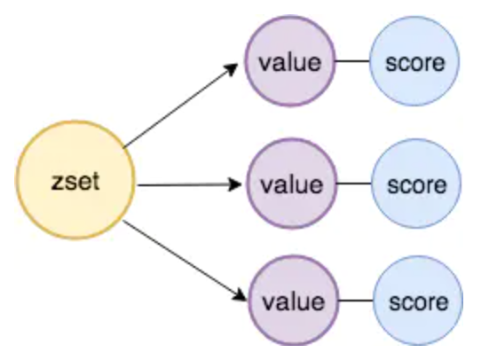
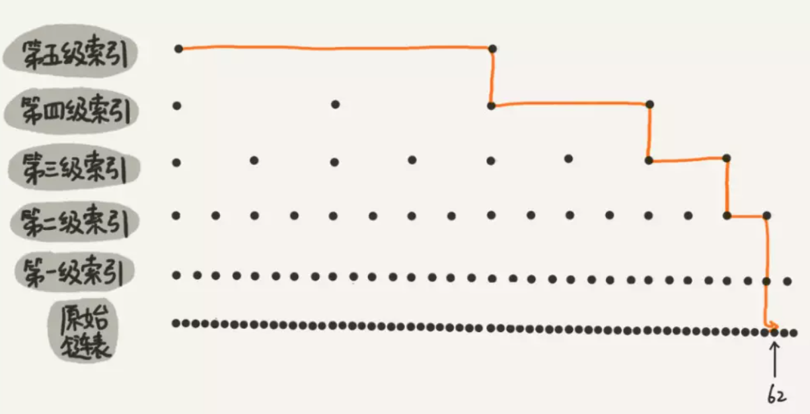
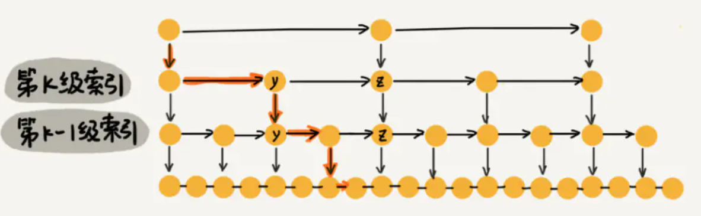
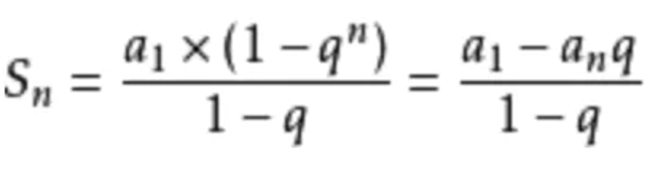
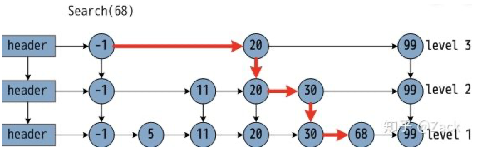
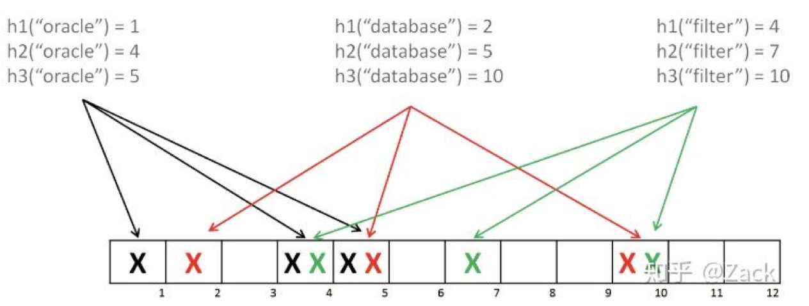
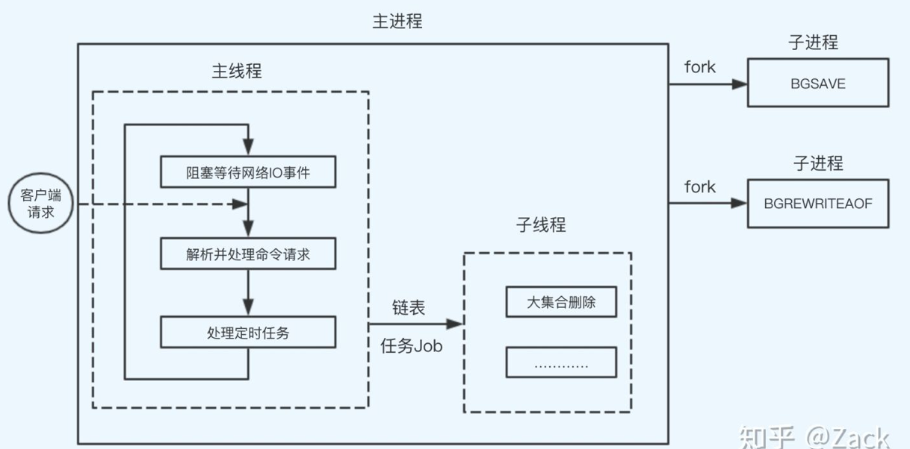
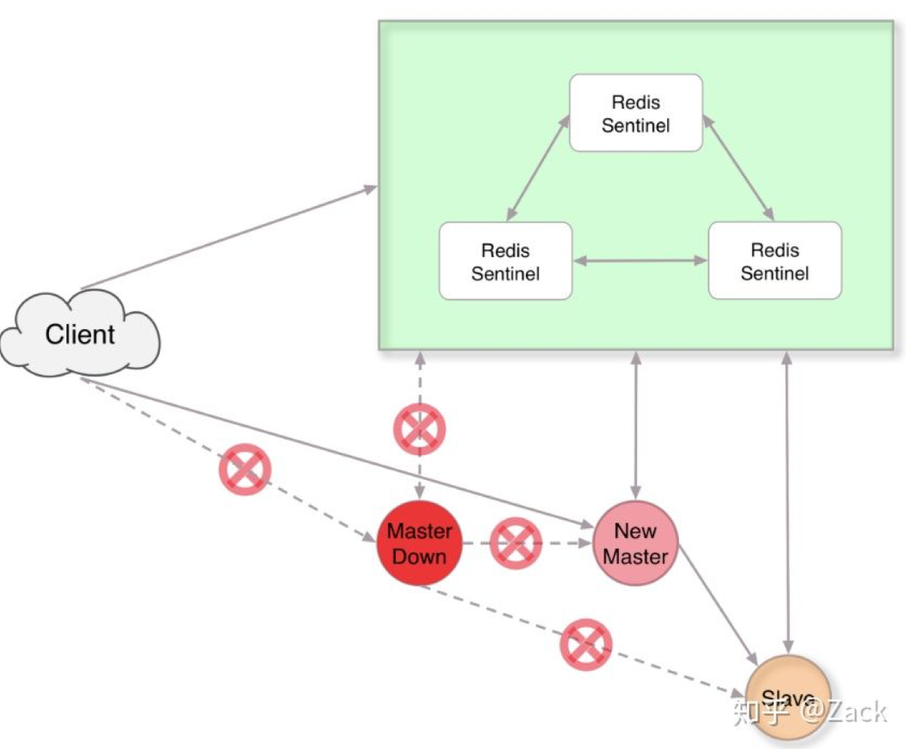

## 概述


### 什么是Redis

Redis(Remote Dictionary Server) 是一个使用 C 语言编写的，开源的（BSD许可）高性能非关系型（NoSQL）的键值对数据库。

Redis 可以存储键和五种不同类型的值之间的映射。键的类型只能为字符串，值支持五种数据类型：字符串、列表、集合、散列表、有序集合。

与传统数据库不同的是 Redis 的数据是存在内存中的，所以读写速度非常快，因此 redis 被广泛应用于缓存方向，每秒可以处理超过 10万次读写操作，是已知性能最快的Key-Value DB。另外，Redis 也经常用来做分布式锁。除此之外，Redis 支持事务 、持久化、LUA脚本、LRU驱动事件、多种集群方案。

### Redis有哪些优缺点

优点

- 读写性能优异， Redis能读的速度是110000次/s，写的速度是81000次/s。
- 支持数据持久化，支持AOF和RDB两种持久化方式。
- 支持事务，Redis的所有操作都是原子性的，同时Redis还支持对几个操作合并后的原子性执行。
- 数据结构丰富，除了支持string类型的value外还支持hash、set、zset、list等数据结构。
- 支持主从复制，主机会自动将数据同步到从机，可以进行读写分离。

缺点

- 数据库容量受到物理内存的限制，不能用作海量数据的高性能读写，因此Redis适合的场景主要局限在较小数据量的高性能操作和运算上。
- Redis 不具备自动容错和恢复功能，主机从机的宕机都会导致前端部分读写请求失败，需要等待机器重启或者手动切换前端的IP才能恢复。
- 主机宕机，宕机前有部分数据未能及时同步到从机，切换IP后还会引入数据不一致的问题，降低了系统的可用性。
- Redis 较难支持在线扩容，在集群容量达到上限时在线扩容会变得很复杂。为避免这一问题，运维人员在系统上线时必须确保有足够的空间，这对资源造成了很大的浪费。

### Redis的适用点


**Redis常做的事情**

1. **缓存，**在提升服务器性能方面非常有效；
2. **排行榜，**如果使用传统的关系型数据库来做，非常的麻烦，而利用Redis的SortSet数据结构能够非常方便解决；
3. **计算器/限速器，**利用Redis中原子性的自增操作，我们可以统计类似用户点赞数、用户访问数等，这类操作如果用MySQL，频繁的读写会带来相当大的压力；限速器比较典型的使用场景是限制某个用户访问某个API的频率，常用的有抢购时，防止用户疯狂点击带来不必要的压力；
4. **简单消息队列，**除了Redis自身的发布/订阅模式，我们也可以利用List来实现一个队列机制，比如：到货通知、邮件发送之类的需求。
5. **好友关系，**利用集合的一些命令，比如求交集、并集、差集等。可以方便得到一些共同好友、共同爱好之类的功能；
6. **Session共享，**

**Redis不适用的事**

当数据量太大、数据访问频率非常低的业务都不适合使用Redis，数据太大会增加成本，访问频率太低，保存在内存中纯属浪费资源。


### 为什么要用 Redis /为什么要用缓存

主要从“高性能”和“高并发”这两点来看待这个问题。

**高性能：**

假如用户第一次访问数据库中的某些数据。这个过程会比较慢，因为是从硬盘上读取的。将该用户访问的数据存在数缓存中，这样下一次再访问这些数据的时候就可以直接从缓存中获取了。操作缓存就是直接操作内存，所以速度相当快。如果数据库中的对应数据改变的之后，同步改变缓存中相应的数据即可！


**高并发：**

直接操作缓存能够承受的请求是远远大于直接访问数据库的，所以我们可以考虑把数据库中的部分数据转移到缓存中去，这样用户的一部分请求会直接到缓存这里而不用经过数据库。


### 为什么要用 Redis 而不用 map/guava 做缓存?

缓存分为本地缓存和分布式缓存。以 Java 为例，使用自带的 map 或者 guava 实现的是本地缓存，最主要的特点是轻量以及快速，生命周期随着 jvm 的销毁而结束，并且在多实例的情况下，每个实例都需要各自保存一份缓存，缓存不具有一致性。

使用 redis 或 memcached 之类的称为分布式缓存，在多实例的情况下，各实例共用一份缓存数据，缓存具有一致性。缺点是需要保持 redis 或 memcached服务的高可用，整个程序架构上较为复杂。

### Redis为什么这么快

1、完全基于内存，绝大部分请求是纯粹的内存操作，非常快速。数据存在内存中，类似于 HashMap，HashMap 的优势就是查找和操作的时间复杂度都是O(1)；

2、数据结构简单，对数据操作也简单，Redis 中的数据结构是专门进行设计的；

3、采用单线程，避免了不必要的上下文切换和竞争条件，也不存在多进程或者多线程导致的切换而消耗 CPU，不用去考虑各种锁的问题，不存在加锁释放锁操作，没有因为可能出现死锁而导致的性能消耗；

4、使用 I/O 多路复用模型，非阻塞 IO；

5、使用底层模型不同，它们之间底层实现方式以及与客户端之间通信的应用协议不一样，Redis 直接自己构建了 VM 机制 ，因为一般的系统调用系统函数的话，会浪费一定的时间去移动和请求；

## 数据类型

### Redis有哪些数据类型

Redis主要有5种数据类型，包括String，List，Set，Zset，Hash，满足大部分的使用要求

| 数据类型 | 可以存储的值           | 操作                                                         | 应用场景                                                     |
| -------- | ---------------------- | ------------------------------------------------------------ | ------------------------------------------------------------ |
| STRING   | 字符串、整数或者浮点数 | 对整个字符串或者字符串的其中一部分执行操作 对整数和浮点数执行自增或者自减操作 | 做简单的键值对缓存                                           |
| LIST     | 列表                   | 从两端压入或者弹出元素 对单个或者多个元素进行修剪， 只保留一个范围内的元素 | 存储一些列表型的数据结构，类似粉丝列表、文章的评论列表之类的数据 |
| SET      | 无序集合               | 添加、获取、移除单个元素 检查一个元素是否存在于集合中 计算交集、并集、差集 从集合里面随机获取元素 | 交集、并集、差集的操作，比如交集，可以把两个人的粉丝列表整一个交集 |
| HASH     | 包含键值对的无序散列表 | 添加、获取、移除单个键值对 获取所有键值对 检查某个键是否存在 | 结构化的数据，比如一个对象                                   |
| ZSET     | 有序集合               | 添加、获取、删除元素 根据分值范围或者成员来获取元素 计算一个键的排名 | 去重但可以排序，如获取排名前几名的用户                       |

### Redis的应用场景

**总结一**

计数器

可以对 String 进行自增自减运算，从而实现计数器功能。Redis 这种内存型数据库的读写性能非常高，很适合存储频繁读写的计数量。

缓存

将热点数据放到内存中，设置内存的最大使用量以及淘汰策略来保证缓存的命中率。

会话缓存

可以使用 Redis 来统一存储多台应用服务器的会话信息。当应用服务器不再存储用户的会话信息，也就不再具有状态，一个用户可以请求任意一个应用服务器，从而更容易实现高可用性以及可伸缩性。

全页缓存（FPC）

除基本的会话token之外，Redis还提供很简便的FPC平台。以Magento为例，Magento提供一个插件来使用Redis作为全页缓存后端。此外，对WordPress的用户来说，Pantheon有一个非常好的插件 wp-redis，这个插件能帮助你以最快速度加载你曾浏览过的页面。

查找表

例如 DNS 记录就很适合使用 Redis 进行存储。查找表和缓存类似，也是利用了 Redis 快速的查找特性。但是查找表的内容不能失效，而缓存的内容可以失效，因为缓存不作为可靠的数据来源。

消息队列(发布/订阅功能)

List 是一个双向链表，可以通过 lpush 和 rpop 写入和读取消息。不过最好使用 Kafka、RabbitMQ 等消息中件。

分布式锁实现

在分布式场景下，无法使用单机环境下的锁来对多个节点上的进程进行同步。可以使用 Redis 自带的 SETNX 命令实现分布式锁，除此之外，还可以使用官方提供的 RedLock 分布式锁实现。

其它

Set 可以实现交集、并集等操作，从而实现共同好友等功能。ZSet 可以实现有序性操作，从而实现排行榜等能。

**总结二**

Redis相比其他缓存，有一个非常大的优势，就是支持多种数据类型。

数据类型说明

​	string字符串，最简单的k-v存储

​	hash格式，value为field和value，适合ID-Detail这样的场景。

​	list简单的list，顺序列表，支持首位或者末尾插入数据

​	set无序list，查找速度快，适合交集、并集、差集处理

​	sorted set有序的set

其实，通过上面的数据类型的特性，基本就能想到合适的应用场景了。

string——适合k-v存储，类似于memcached的存储结构，短信验证码，配置信息等，就用这种类型来存储。

hash——一般key为ID或者唯一标示，value对应的就是详情了。如商品详情，个人信息详情，新闻详情等。

list——因为list是有序的，比较适合存储一些有序且数据相对固定的数据。如省市区表、字典表等。因为list是有序的，适合根据写入的时间来排序，如：最新的***，消息队列等。

set——可以简单的理解为ID-List的模式，如微博中一个人有哪些好友，set最牛的地方在于，可以对两个set提供交集、并集、差集操作。例如：查找两个人共同的好友等。

Sorted Set——是set的增强版本，增加了一个score参数，自动会根据score的值进行排序。比较适合类似于top 10等不根据插入的时间来排序的数据。

如上所述，虽然Redis不像关系数据库那么复杂的数据结构，但是，也能适合很多场景，比一般的缓存数据结构要多。了解每种数据结构适合的业务场景，不仅有利于提升开发效率，也能有效利用Redis的性能。


## 常用命令

参考资料

- http://redisdoc.com/
- http://redis.io/commands

### 连接操作

- ping：测试连接是否存活如果正常会返回 pong
- echo：打印
- select：切换到指定的数据库，数据库索引号 index 用数字值指定，以 0 作为起始索引值
- quit：关闭连接（connection）
- auth：简单密码认证

### 服务端

- time：返回当前服务器时间
- client list: 返回所有连接到服务器的客户端信息和统计数据 参见 http://redisdoc.com/server/client_list.html
- client kill ip:port：关闭地址为 ip:port 的客户端
- save：将数据同步保存到磁盘
- bgsave：将数据异步保存到磁盘
- lastsave：返回上次成功将数据保存到磁盘的Unix时戳
- shundown：将数据同步保存到磁盘，然后关闭服务
- info：提供服务器的信息和统计
- config resetstat：重置 info 命令中的某些统计数据
- config get：获取配置文件信息
- config set：动态地调整 Redis 服务器的配置(configuration)而无须重启，可以修改的配置参数可以使用命令 CONFIG GET * 来列出
- config rewrite：Redis 服务器时所指定的 redis.conf 文件进行改写
- monitor：实时转储收到的请求
- slaveof：改变复制策略设置

### 发布订阅

进程间的一种消息通信模式：发送者(pub)发送消息，订阅者(sub)接收消息。 

​	**publish channel message**			将消息发送到指定的频道

​	**subscribe channel** [channel...]		订阅给定的一个或多个频道的信息

​	**pubsub subcommand** [argument] 	查看订阅与发布系统状态

​	**pubsub channels**：列出当前的活跃频道 例如 PUBSUB CHANNELS news.i*

​	**pubsub numsub**：返回给定频道的订阅者数量 例如 PUBSUB NUMSUB news.it news.internet news.sport news.music

​	**pubsub numpat**：返回客户端订阅的所有模式的数量总和

​	**unsubscribe** [channel [...]]			退订给定的频道

​	**psubscribe** pattern [pattern...]  		订阅一个或多个符合给定模式的频道

​	**punsubscribe** [pattern [...]]		退订所有给定模式的频道


服务器状态在**pubsub_channels**字典保存了所有频道的订阅关系：

​	subscribe命令负责将客户端和被订阅的频道关联到这个字典里面，

​	unsubscribe命令则负责解除他们之间的关系

服务器状态在pubsub_patterns链表保存了所有模式的订阅关系：

​	psubscribe命令负责将客户端和被订阅的模式关联到这个链表里面，

​	punsubscribe命令则负责解除他们之间的关系

​	publish命令通过访问pubsub_channels字典和pubsub_patterns链表来向所有的订阅者发送消息

​	pubsub 通过读取pubsub_channels字典和pubsub_patterns链表来实现的

**管道（Pipelining）**

echo -e "set k1 a\nget k1" | nc localhost 6379

(printf "PING\r\nPING\r\nPING\r\n"; sleep 1) | nc localhost 6379

一次请求/响应服务器能实现处理新的请求即使旧的请求还未被响应。这样就可以将*多个命令*发送到服务器，而不用等待回复，最后在一个步骤中读取该答复。

### KEY 

- exists(key)：确认一个 key 是否存在
- del(key)：删除一个 key
- type(key)：返回值的类型
- keys(pattern)：返回满足给定 pattern 的所有 key
- randomkey：随机返回 key 空间的一个
- keyrename(oldname, newname)：重命名 key
- dbsize：返回当前数据库中 key 的数目
- expire：设定一个 key 的活动时间（s）
- ttl：获得一个 key 的活动时间
- move(key, dbindex)：移动当前数据库中的 key 到 dbindex 数据库
- flushdb：删除当前选择数据库中的所有 key
- flushall：删除所有数据库中的所有 key

### String 

- set(key, value)：给数据库中名称为 key 的 string 赋予值 value
- get(key)：返回数据库中名称为 key 的 string 的 value
- getset(key, value)：给名称为 key 的 string 赋予上一次的 value
- mget(key1, key2,…, key N)：返回库中多个 string 的 value
- setnx(key, value)：添加 string，名称为 key，值为 value
- setex(key, time, value)：向库中添加 string，设定过期时间 time
- mset(key N, value N)：批量设置多个 string 的值
- msetnx(key N, value N)：如果所有名称为 key i 的 string 都不存在
- incr(key)：名称为 key 的 string 增 1 操作
- incrby(key, integer)：名称为 key 的 string 增加 integer
- decr(key)：名称为 key 的 string 减 1 操作
- decrby(key, integer)：名称为 key 的 string 减少 integer
- append(key, value)：名称为 key 的 string 的值附加 value
- substr(key, start, end)：返回名称为 key 的 string 的 value 的子串

### List

- rpush(key, value)：在名称为 key 的 list 尾添加一个值为 value 的元素
- lpush(key, value)：在名称为 key 的 list 头添加一个值为 value 的元素
- llen(key)：返回名称为 key 的 list 的长度
- lrange(key, start, end)：返回名称为 key 的 list 中 start 至 end 之间的元素
- ltrim(key, start, end)：截取名称为 key 的 list
- lindex(key, index)：返回名称为 key 的 list 中 index 位置的元素
- lset(key, index, value)：给名称为 key 的 list 中 index 位置的元素赋值
- lrem(key, count, value)：删除 count 个 key 的 list 中值为 value 的元素
- lpop(key)：返回并删除名称为 key 的 list 中的首元素
- rpop(key)：返回并删除名称为 key 的 list 中的尾元素
- blpop(key1, key2,… key N, timeout)：lpop 命令的 block 版本。
- brpop(key1, key2,… key N, timeout)：rpop 的 block 版本。
- rpoplpush(srckey, dstkey)：返回并删除名称为 srckey 的 list 的尾元素，并将该元素添加到名称为 dstkey 的 list 的头部

### Set

- sadd(key, member)：向名称为 key 的 set 中添加元素 member
- srem(key, member) ：删除名称为 key 的 set 中的元素 member
- spop(key) ：随机返回并删除名称为 key 的 set 中一个元素
- smove(srckey, dstkey, member) ：移到集合元素
- scard(key) ：返回名称为 key 的 set 的基数
- sismember(key, member) ：member 是否是名称为 key 的 set 的元素
- sinter(key1, key2,…key N) ：求交集
- sinterstore(dstkey, (keys)) ：求交集并将交集保存到 dstkey 的集合
- sunion(key1, (keys)) ：求并集
- sunionstore(dstkey, (keys)) ：求并集并将并集保存到 dstkey 的集合
- sdiff(key1, (keys)) ：求差集
- sdiffstore(dstkey, (keys)) ：求差集并将差集保存到 dstkey 的集合
- smembers(key) ：返回名称为 key 的 set 的所有元素
- srandmember(key) ：随机返回名称为 key 的 set 的一个元素

### Hash 

- hset(key, field, value)：向名称为 key 的 hash 中添加元素 field
- hget(key, field)：返回名称为 key 的 hash 中 field 对应的 value
- hmget(key, (fields))：返回名称为 key 的 hash 中 field i 对应的 value
- hmset(key, (fields))：向名称为 key 的 hash 中添加元素 field
- hincrby(key, field, integer)：将名称为 key 的 hash 中 field 的 value 增加 integer
- hexists(key, field)：名称为 key 的 hash 中是否存在键为 field 的域
- hdel(key, field)：删除名称为 key 的 hash 中键为 field 的域
- hlen(key)：返回名称为 key 的 hash 中元素个数
- hkeys(key)：返回名称为 key 的 hash 中所有键
- hvals(key)：返回名称为 key 的 hash 中所有键对应的 value
- hgetall(key)：返回名称为 key 的 hash 中所有的键（field）及其对应的 value

### Redis Sentinel

- ping ：返回 pong
- sentinel masters ：列出所有被监视的主服务器，以及这些主服务器的当前状态。
- sentinel slaves：列出给定主服务器的所有从服务器，以及这些从服务器的当前状态。
- sentinel get-master-addr-by-name：返回给定名字的主服务器的 IP 地址和端口号。如果这个主服务器正在执行故障转移操作，或者针对这个主服务器的故障转移操作已经完成，那么这个命令返回新的主服务器的 IP 地址和端口号。
- sentinel reset：重置所有名字和给定模式 pattern 相匹配的主服务器。pattern 参数是一个 Glob 风格的模式 重置操作清楚主服务器目前的所有状态，包括正在执行中的故障转移，并移除目前已经发现和关联的，主服务器的所有从服务器和 Sentinel 。
- sentinel failover：当主服务器失效时，在不询问其他 Sentinel 意见的情况下，强制开始一次自动故障迁移（不过发起故障转移的 Sentinel 会向其他 Sentinel 发送一个新的配置，其他 Sentinel 会根据这个配置进行相应的更新）。

### **位操作**

1. GETBIT 获取一个键值的二进制位的指定位置的值(0/1)，用法：GETBIT key offset
2. SETBIT 设置一个键值的二进制位的指定位置的值(0/1)，用法：SETBIT key offset value
3. BITCOUNT 获取一个键值的一个范围内的二进制表示的1的个数，用法：BITCOUNT key [start end]
4. BITOP 该命令可以对多个字符串类型键进行位运算，并将结果存储到指定的键中，BITOP支持的运算包含：OR,AND,XOR,NOT，用法：BITOP OP desKey key1 key2
5. BITPOS 获取指定键的第一个位值为0或者1的位置，用法：BITPOS key 0/1 [start， end]


## 命令详解

#### DEL

最早可用版本1.0.0

删除指定的键值对，如果指定的key不存在，则忽略。DEL命令的时间复杂度是O(N)，对于除字符串外的其他数据类型，命令的时间复杂度为O(M)，M是值的元素的个数。所以，在生产环境尽量避免一次性删除过多复杂数据类型的操作。

```
127.0.0.1:6379> SET key1 "jackey"
OK
127.0.0.1:6379> SET key2 "zhe"
OK
127.0.0.1:6379> DEL key1 key2 key3
(integer) 2
```

#### DUMP

最早可用版本2.6.0

使用一种Redis的格式序列化指定键存储的值。可用使用RESTORE命令将这个值反序列化。

这种序列化格式有以下3个特点：

- 它包含有64位的校验和，用于错误检查，RESTORE命令在反序列化之前会先检查校验和
- 值的编码格式和RDB文件的编码格式相同
- RDB的版本会被序列化到值中，因此，不同版本的Redis可能会因为不兼容RDB版本而拒绝反序列化

序列化的值不包含过期时间的相关信息，可以使用PTTL命令获取当前值的存活时间。如果值不存在则会返回nil

```
127.0.0.1:6379> SET key1 "jackey"
OK
127.0.0.1:6379> DUMP key1
"\x00\x06jackey\b\x00\xec\x89'G'X\xfc:"
127.0.0.1:6379> DUMP not-exist-key
(nil)
```

DUMP时间复杂度分为两部分：访问key值的时间复杂度为O(1)，而序列化值的时间复杂度为O(N*M)，N是组成值的元素的数量，M是元素的平均大小。如果序列化比较短的字符串，则该命令的时间复杂度可以看做O(1)。

#### EXISTS

最早可用版本1.0.0

用于判断key是否存在。3.0.3版本以后支持多参数，即可以一次性判断多个key，返回值是存在的key的数量。对于判断单个key是否存在，会返回1或者0，因此，该命令是向后兼容的。

需要注意的是：如果参数中有重复的存在命令，则返回结果不会去重。

```
127.0.0.1:6379> SET key1 "jackey"
OK
127.0.0.1:6379> SET key2 "zhe"
OK
127.0.0.1:6379> EXISTS key1
(integer) 1
127.0.0.1:6379> EXISTS not-exist-key
(integer) 0
127.0.0.1:6379> EXISTS key1 key2 not-exist-key
(integer) 2
127.0.0.1:6379> EXISTS key1 key1 key1
(integer) 3
```

#### EXPIRE

最早可用版本1.0.0

为指定的key设置存活时间。存活时间会被DEL，SET，GETSET和所有的STORE命令删除或者覆盖。如果我们只修改key的值而不修改存活时间或者保存到一个新的key中，则原来的key的存活时间保持不变。如果使用RENAME对一个key重命名，那么原有key的存活时间会赋给新的key。

如果想要清除存活时间，使指定的key成为一个永久的key，则可以使用PERSIST命令，我们稍后会详细介绍这个命令。

如果使用EXPIRE/PEXPIRE为某个key设置的存活时间为非正数，或者使用EXPIREAT/PEXPIREAT设置了一个过去的时间，则这个key会直接被删除。

```
127.0.0.1:6379> EXPIRE key1 -1
(integer) 1
127.0.0.1:6379> EXISTS key1
(integer) 0
```

对一个已经有存活时间的key再次使用EXPIRE设置存活时间，则将key的存活时间更新，在许多应用中我们都会用到这一点。

注意：在Redis的2.1.3版本之前，如果修改一个带有存活时间的key的值，则会删除整个key。

关于时间精度，Redis2.4版本中，一个key过期的一秒内仍可以访问，而到了2.6版本，这一时间已经被精确到了1毫秒。因为从2.6版本开始，存活时间保存的是绝对时间（Unix的时间戳），而这就意味着，你的计算机的时间需要保证可靠，如果你将RDB文件放到另一台机器上加载，当这两台机器的时间差距较大时，你就会发现可能有些key被删除了或者有些key的存活时间被延长了。

下面我们在来讨论一下Redis究竟是如何使key过期的，Redis的过期策略有两种：一种是被动的，一种是主动的。

被动过期就是当客户端访问某个key，服务端会去检查这个key的存活时间，判断是否过期。当然，这种过期策略存在一定的问题，如果某个key一直都不访问，就不会被发现它过期了，那么它将永远“苟活”在内存中。所以Redis会定期随机的查看被设置过存活时间的key，看它们是否过期，如果过期了，就会及时清理掉。Redis每秒会做10次下面的操作：

1. 随机查看20个设置过存活时间的key（从设置存活时间的set中取）
2. 删除所有过期的key
3. 如果过期的key超过25%，那么会从第一步开始再执行一次

#### EXPIREAT

最早可用版本1.2.0

此命令和EXPIRE的作用相同，不同之处是它的参数需要传Unix时间戳（即从1970年1月1日起的毫秒数）。

```
127.0.0.1:6379> GET key2
"zhe"
127.0.0.1:6379> EXPIREAT key2 1537733374
(integer) 1
127.0.0.1:6379> TTL key2
(integer) 12960
```

#### KEYS

最早可用版本1.0.0

这个命令会返回匹配到的所有key，时间复杂度为O(N)。在官方文档中说，在入门级的笔记本电脑上，Redis扫描100万条key只需要40毫秒，但是我们仍然要避免在生产环境使用这个命令。特别是千万不要使用KEYS *这样的命令，因为你不知道生产环境存在多少key，这样的命令有可能使你的生产环境的Redis陷入很长一段时间的不可用状态。所以，请马上删除应用层代码中的KEYS命令或者抓紧时间更新自己的简历。

如果需要查找key，可以使用SCAN命令或者sets命令。

虽然我们非常不建议使用KEYS命令，但是它的匹配策略还是要介绍一下的：

？是单个字符的通配符，*是任意个数的通配符，[ae]会匹配到a或e，^e表示不匹配e，a-c表示匹配a或b或c，特殊符号使用\隔开。

```
127.0.0.1:6379> MSET key1hello jackey key2hello zhe age 3
OK
127.0.0.1:6379> KEYS key?hello
1) "key1hello"
2) "key2hello"
127.0.0.1:6379> KEYS k*
1) "key1hello"
2) "key2hello"
127.0.0.1:6379> KEYS *age*
1) "age"
127.0.0.1:6379> KEYS *
1) "age"
2) "key1hello"
3) "key2hello"
```

#### MIGRATE

最早可用版本2.6.0

这个命令用来将源实例的key以原子操作传输到目标实例，然后将源实例的key删除。相当于在源实例执行了DUMP+DEL操作，在目标实例执行了RESTORE操作。这一操作会阻塞进行传输的两个实例，在传输过程中，key总会存在于一个实例中，除非发生超时错误。在3.2版本以后，MIGRATE可以将多个key作为管线一次性传输。

在执行MIGRATE命令时，必须要设置一个超时时间，如果到了超时时间命令仍未执行完，则会抛出一个IOERR。但返回这个错误时，两个实例的状态可能有两种：要么两个实例都存在指定的key，要么只有源实例存在指定的key。总之，key是不会丢失的。

从3.0.6版本开始，MIGRATE支持一次传输多个key，为了保证不过载或者出现环形操作，MIGRATE需要使用KEYS参数，而原来指定的key的参数要被设置为空字符串。

```
MIGRATE 192.168.1.34 6379 "" 0 5000 KEYS key1 key2 key3
```

这里还有两个选填参数需要介绍：一个是COPY，加上这个参数的话，传输完成后不会删除源实例中的key。另一个是REPLACE，这个参数的作用是替换目标实例已存在的key。这两个参数在3.0版本以后才可以使用。

#### MOVE

最早可用版本1.0.0

不知道大家还记不记得前文中我们提到过的SELECT命令，SELECT用来切换数据库。使用MOVE命令就是将当前数据库的key移动到指定的数据库中，如果指定库中已经存在这个key或者当前库不存在这个key，那么这个命令什么也不做。

```
127.0.0.1:6379> KEYS *
1) "age"
2) "key1hello"
3) "key2hello"
127.0.0.1:6379> MOVE age 1
(integer) 1
127.0.0.1:6379> KEYS *
1) "key1hello"
2) "key2hello"
127.0.0.1:6379> SELECT 1
OK
127.0.0.1:6379[1]> KEYS *
1) "age"
```

#### OBJECT

最早可用版本2.2.3

OBJECT用来查看Redis对象内部的相关信息。这一命令在调试时经常被使用。下面我们来介绍OBJECT命令的具体用法：

- OBJECT REFCOUNT key：返回指定key的值的引用数量
- OBJECT ENCODING key：返回指定key的内部存储使用的编码格式
- OBJECT IDLETIME key：返回指定key的空闲时间（有多长时间没有被读写），目前最小精度为10秒，这一命令经常在Redis淘汰机制中使用（淘汰策略为LRU或noeviction）
- OBJECT FREQ key：返回指定key访问频率的对数，当淘汰策略为LFU时，这一命令会被用到
- OBJECT HELP：返回帮助信息

对象的编码格式也有很多种：

- Strings会被编码为raw或int
- Lists会被编码为ziplist或linkedlist
- Sets会被编码为intset或hashtable
- Hashs会被编码为ziplist或hashtable
- Sorted Sets会被编码为ziplist或skiplist

```
127.0.0.1:6379> OBJECT REFCOUNT key1hello
(integer) 1
127.0.0.1:6379> OBJECT IDLETIME key2hello
(integer) 3637
127.0.0.1:6379> OBJECT ENCODING age
"int"
```

#### PERSIST

最早可用版本2.2.0

删除指定key的过期时间，使之变成永久的key。

#### PEXPIRE

最早可用版本2.6.0

PEXPIRE的作用和EXPIRE一样，只不过参数中的时间单位是毫秒。

#### PEXPIREAT

最早可用版本2.6.0

作用和EXPIREAT相同，参数同样是毫秒。

#### PTTL

最早可用版本2.6.0

返回指定key的剩余存活时间的毫秒数。2.8以后的版本返回值有些变化，如果key不存在，则返回-2；如果key是永久的，则返回-1。

#### RANDOMKEY

最早可用版本1.0.0

此命令用于从当前数据库返回一个随机的key。

#### RENAME

最早可用版本1.0.0

重命名一个key。如果key不存在，则会返回错误。而如果新的key已经存在，则此命令会覆盖原来的key（它其实是执行了一个隐式的DEL命令，因此如果原来的key存储的对象很大的话， 删除操作延时会很高）。在3.2版本以前，如果源key和目标key相同的话，会报错。

#### RENAMENX

如果新的key不存在的话，重命名key，如果存在的话返回0，成功返回1。

#### RESTORE

最早可用版本2.6.0

用法：RESTORE key ttl serialized-value [REPLACE]

此命令是将一组数据反序列化，并存到key。如果ttl是0，则key是永久的。在Redis3.0版本以后，如果不使用REPLACE参数并且key已经存在，则会返回一个错误“Target key name is busy”。

#### SCAN

最早可用版本2.8.0

用法：SCAN cursor MATCH pattern COUNT count

其中cursor为游标，MATCH和COUNT为可选参数。

SCAN命令和SSCAN、HSCAN、ZSCAN命令都用于增量的迭代元素集，它每次返回小部分数据，不会像KEYS那样阻塞Redis。SCAN命令是基于游标的，每次调用后，都会返回一个游标，用于下一次迭代。当游标返回0时，表示迭代结束。

SCAN每次返回的数量并不固定，也有可能返回数据为空。另外，SCAN命令和KEYS命令一样支持匹配。

我们在Redis里存入10000个key用于测试。

结果如下：

```
127.0.0.1:6379> scan 0 match key24* count 1000
1) "1688"
2) 1) "key2411"
   2) "key2475"
   3) "key2494"
   4) "key2406"
   5) "key2478"
127.0.0.1:6379> scan 1688 match key24* count 1000
1) "2444"
2)  1) "key2458"
    2) "key249"
    3) "key2407"
    4) "key2434"
    5) "key241"
    6) "key2497"
    7) "key2435"
    8) "key2413"
    9) "key2421"
   10) "key248"
127.0.0.1:6379> scan 2444 match key24* count 1000
1) "818"
2)  1) "key2459"
    2) "key2462"
    3) "key2409"
    4) "key2454"
    5) "key2431"
    6) "key2423"
    7) "key2476"
    8) "key2428"
    9) "key2493"
   10) "key2420"
127.0.0.1:6379> scan 818 match key24* count 1000
1) "9190"
2)  1) "key2402"
    2) "key2415"
    3) "key2429"
    4) "key2424"
    5) "key2425"
    6) "key2400"
    7) "key2472"
    8) "key2479"
    9) "key2448"
   10) "key245"
   11) "key2487"
   12) "key2430"
   13) "key2405"
127.0.0.1:6379> scan 9190 match key24* count 1000
1) "12161"
2)  1) "key2488"
    2) "key2437"
    3) "key2404"
    4) "key2440"
    5) "key2461"
    6) "key2416"
    7) "key2436"
    8) "key2403"
    9) "key2460"
   10) "key2452"
   11) "key2449"
   12) "key2482"
127.0.0.1:6379> scan 12161 match key24* count 1000
1) "11993"
2)  1) "key2483"
    2) "key2491"
    3) "key242"
    4) "key2466"
    5) "key2446"
    6) "key2465"
    7) "key243"
    8) "key2438"
    9) "key2457"
   10) "key246"
   11) "key2422"
   12) "key2418"
127.0.0.1:6379> scan 11993 match key24* count 1000
1) "7853"
2) 1) "key2498"
   2) "key2451"
   3) "key2439"
   4) "key2495"
   5) "key2408"
   6) "key2410"
127.0.0.1:6379> scan 7853 match key24* count 1000
1) "5875"
2)  1) "key2486"
    2) "key2490"
    3) "key244"
    4) "key2401"
    5) "key2463"
    6) "key2481"
    7) "key2477"
    8) "key2468"
    9) "key2433"
   10) "key2489"
   11) "key2455"
   12) "key2426"
   13) "key24"
   14) "key2450"
   15) "key2414"
   16) "key2442"
   17) "key2473"
   18) "key2467"
   19) "key2469"
   20) "key2456"
127.0.0.1:6379> scan 5875 match key24* count 1000
1) "14311"
2)  1) "key2453"
    2) "key2492"
    3) "key2480"
    4) "key2427"
    5) "key2443"
    6) "key2417"
    7) "key2432"
    8) "key240"
    9) "key2445"
   10) "key2484"
   11) "key2444"
   12) "key247"
   13) "key2485"
127.0.0.1:6379> scan 14311 match key24* count 1000
1) "16383"
2)  1) "key2441"
    2) "key2474"
    3) "key2447"
    4) "key2471"
    5) "key2470"
    6) "key2464"
    7) "key2412"
    8) "key2419"
    9) "key2499"
   10) "key2496"
127.0.0.1:6379> scan 16383 match key24* count 1000
1) "0"
2) (empty list or set)
```

可以看到虽然我们设置的count为1000，但Redis每次返回的数值只有10个左右。

#### SORT

最早可用版本1.0.0

当有N个元素需要排序，并且要返回M个元素时，SORT命令的时间复杂度为O(N+M*log(M))

此命令用于返回或保存list，set和sorted set的键，默认将数字或者可排序的key进行排序，Redis会将其视为双精度浮点数。

如果想要对字符串按字典顺序排序，可以使用ALPHA参数。

如果想要按照外部字段进行排序，可以使用BY参数。

#### TOUCH

最早可用版本3.2.1

修改某一个或多个key的最后访问时间，如果key不存在，则忽略。

#### TTL

最早可用版本1.0.0

返回指定key的剩余存活时间，单位为秒。

在2.6版本及以前，如果key不存在或者是永久key，都会返回-1。从2.8版本开始，如果key不存在，则返回-2，如果key为永久key，则返回-1。

#### TYPE

最早可用版本1.0.0

返回key存储的值的类型。类型即为我们在[Redis基础数据结构](https://jackeyzhe.github.io/2018/09/17/Redis基础数据结构/)一文中描述的5中数据类型。

#### UNLINK

最早可用版本4.0.0

这个命令和DEL类似，会删除指定的key。所不同的是，此命令的时间复杂度为O(1)，它先将key从keyspace中删除，此时指定的key已经删除，但是内存没有释放。所以，这个命令会在另一个线程中做释放内存的操作。这一步的操作时间复杂度为O(N)。

#### WAIT

最早可用版本3.0.0

这个命令会阻塞客户端，直到前面所有的写操作都完成并且保存了指定数量的副本。该命令总会返回副本数量或者超时。


## 配置文件

**Units单位**

配置大小单位，1k 5GB 4M 只支持bytes，不支持bit。对大小写不敏感

**includes包含**

可以导入其他redis配置文件

**general  通用**

 	修改**daemonize yes** 启动守护进程(后台运行)，redis默认不是以守护进程的方式运行，以守护进程方式运行时，会把**pid默认写入/var/run/redis.pid**文件，可以**通过pidfile指定。** 

**默认端口为6379，**因为6379在手机按键上对应MERZ，意大利歌女的名字。

**loglevel notice	 redis一共有四个日志级别：debug、verbose、notice、warning  默认 notice 适合生产环境**

**logfile stdout	日志记录方式，默认为标准输出，如果Redis为守护进程运行，这里配置日志方式为标准输出，日志会发送到/dev/null**

**syslog-enabled**	是否把日志输出到syslog系统日志中

**syslog-ident**		指定系统里的日志标识

**syslog-facility**	指定syslog设备，可以是user或local0-local7

**databases 16**	  设置数据库数量，默认为0，可以使用select dbid 命令连接上指定数据库id

**NETWORK 网络**

**tcp-backlog 511  设置tcp的backlog，默认511**，一般不需要修改。backlog是一个连接队列，=未完成三次握手队列+已完成三次握手队列。在高并发环境需要一个高backlog值来避免慢客户端连接问题。Linux内核会将这个值减小到/proc/sys/net/core/somaxconn的值，需要确认增大somaxconn和tcp_max_syn_backlog两个值来达到想要的效果。

**bind 127.0.0.1**  	 **默认绑定的主机端口**

**timeout 300** 	**当客户端闲置多长时间后关闭连接。如果指定为0，表示关闭该功能**

**tcp-keepalive 60**	**指定TCP连接是否为长连接，维护redis集群心跳连接，如果设置为0，则不会进行Keepalive检测，建议设置成60，单位秒**

**snapshotting快照**

**save seconds changes**	**分别表示900秒（15分钟）内有1个更改，300秒（5分钟）内有10个更改以及60秒内有10000个更改**

​	**900	1**

​		**300	10**

​	**60		10000**

 	**手动备份：save**  **如果想禁用rdb持久化自动备份策略，只要不设置save指令或save "" 一个空字符串就行**

**stop-writes-on-bgsave-error** 	**如果后台保存出错，前台停止写入**

**rdbcompression**	**指定存储至本地数据库时是否压缩数据，默认yes，redis采用LZF压缩，如果为了节省CPU，可以关闭该选项，但会导致数据库文件变的巨大**

**rdbchecksum**   **在存储快照后，还可以让redis使用CRC64算法来进行数据校验，这样做会增大10%的性能消耗，如果希望获取最大性能，可以关闭此功能**

**dbfilename**		**指定本地数据库名词，默认dump.rdb**

**dir**				**指定本地数据库存放目录**

**replication复制**

**security 安全**

**requirepass foobared   设置redis连接密码，配置了密码科幻短在连接的时候需要提供密码 auth 密码，config set/get requirepass "密码"** 

**limits 限制**

**maxclients		 		设置同一时间最大客户端连接数,默认10000**

**maxmemory			指定redis最大内存限制，当达到最大内存，redis会先清楚已到期或即将到期的key，如果仍然到达最大内存，将无法再写入，读取正常。redis新vm机制会把key存放内存，value会存放swap区**

**maxmemory-policy** noeviction       默认永不过期，不进行移除

**(缓存清除策略)** 	    volatile-lru      只对设置了过期时间的键，使用LRU缓存淘汰算法移除key

allkeys-lru	使用LRU算法移除key

volatile-lfu	只对设置了过期时间的键，使用LFU缓存淘汰算法移除key

allkeys-lfu	使用LFU算法移除key

volatile-random	设置了过期时间的键，在过期集合中移除随机的key

allkeys-random     移除随机的key

volatile-ttl		移除ttl值最小的key，最近要过期的key

**maxmemory-samples  5**	redis默认会检查这么多个key并选择其中LRU的那个

**append only mode**

**appendonly no** 		**默认是关闭aof**

**appendfilename**   	**aof文件的名字**

**appendsync**    **always**      **同步持久化，每次发生数据变更会被立即记录到磁盘，性能较差但数据完整性比较好**

​    **everysec**  **默认，异步操作，每秒记录 如果一秒内宕机，有数据丢失**

​    **no**

**no-appendfsync-on-rewrite：****重写时是否可以运用Appendfsync，默认no即可**

**auto-aof-rewrite-min-size****：****设置重写的基准值**

**auto-aof-rewrite-percentage****：****设置重写的基准值**

### Redis 3.2 配置文件解析

```xml
# redis版本 3.2.100
 
# 如果想要使用到配置文件，Redis服务必须以配置文件的路径作为第一个参数启动。如：
./redis-server /path/to/redis.conf
 
# 单位说明:当需要指定内存大小时，可能会用到不同的单位，如1k、5GB、4M等，这里给出其单位含义：
# 指定单位是大小写不敏感。如1GB、1gB、1Gb是一样的。
# 1k => 1000 bytes
# 1kb => 1024 bytes
# 1m => 1000000 bytes
# 1mb => 1024*1024 bytes
# 1g => 1000000000 bytes
# 1gb => 1024*1024*1024 bytes
 
######################### 引用 #########################
 
# 不同redis server可以使用同一个模版配置作为主配置，并引用其它配置文
# 件用于本server的个性化设置include并不会被CONFIG REWRITE命令覆盖。
# 但是主配置文件的选项会被覆盖。想故意覆盖主配置的话就把include放文件前面，
# 否则最好放末尾
# include /path/to/local.conf
# include /path/to/other.conf
 
######################### 网络 #########################
 
# 不指定bind的话redis将会监听所有网络接口。这个配置是肯定需要指定的。
# Examples:
# bind 192.168.1.100 10.0.0.1
# bind 127.0.0.1 ::1
# 下面这个配置是只允许本地客户端访问。
bind 127.0.0.1
 
# 是否开启保护模式。默认开启，如果没有设置bind项的ip和redis密码的话，服务将只允许本地访问。
protected-mode yes
 
# 端口设置，默认为 6379
# 如果port设置为0 redis将不会监听tcp socket
port 6379
 
# 在高并发环境下需要一个高backlog值来避免慢客户端连接问题。注意Linux内核默默将这个值减小到/proc/sys/net/core/somaxconn的值，所以需要确认增大somaxconn和tcp_max_syn_backlog 两个值来达到需要的效果。
tcp-backlog 511
 
# 指定用来监听Unix套套接字的路径。没有默认值，没有指定的情况下Redis不会监听Unix socket
# unixsocket /tmp/redis.sock
# unixsocketperm 700
 
# 客户端空闲多少秒后关闭连接（0为不关闭）
timeout 0
 
# tcp-keepalive设置。如果非零，
# 则设置SO_KEEPALIVE选项来向空闲连接的客户端发送ACK，用途如下：
# 1）能够检测无响应的对端
# 2）让该连接中间的网络设备知道这个连接还存活
# 在Linux上，这个指定的值(单位秒)就是发送ACK的时间间隔。
# 注意：要关闭这个连接需要两倍的这个时间值。
# 在其他内核上这个时间间隔由内核配置决定
tcp-keepalive 0
 
######################### 通用 #########################
 
# 是否将Redis作为守护进程运行。如果需要的话配置成'yes'
# 注意配置成守护进程后Redis会将进程号写入文件/var/run/redis.pid
daemonize no
 
# 是否通过upstart或systemd管理守护进程。默认no没有服务监控，其它选项有upstart, systemd, auto
supervised no
 
# pid文件在redis启动时创建，退出时删除。最佳实践为配置该项。
pidfile /var/run/redis_6379.pid
 
 
# 配置日志级别。选项有debug, verbose, notice, warning
loglevel notice
 
# 日志名称。空字符串表示标准输出。注意如果redis配置为后台进程，标准输出中信息会发送到/dev/null
logfile ""
 
# 是否启动系统日志记录。
# syslog-enabled no
 
# 指定系统日志身份。
# syslog-ident redis
 
# 指定syslog设备。必须是user或LOCAL0 ~ LOCAL7之一。
# syslog-facility local0
 
# 设置数据库个数。默认数据库是 DB 0
# 可以通过SELECT where dbid is a number between 0 and 'databases'-1为每个连接使用不同的数据库。
databases 16
 
######################### 备份  #########################
# 持久化设置:
# 下面的例子将会进行把数据写入磁盘的操作:
#  900秒（15分钟）之后，且至少1次变更
#  300秒（5分钟）之后，且至少10次变更
#  60秒之后，且至少10000次变更
# 不写磁盘的话就把所有 "save" 设置注释掉就行了。
# 通过添加一条带空字符串参数的save指令也能移除之前所有配置的save指令，如: save ""
save 900 1
save 300 10
save 60 10000
 
# 默认情况下如果上面配置的RDB模式开启且最后一次的保存失败，redis 将停止接受写操作，
# 让用户知道问题的发生。如果后台保存进程重新启动工作了，redis 也将自动的允许写操作。
# 如果有其它监控方式也可关闭。
stop-writes-on-bgsave-error yes
 
# 是否在备份.rdb文件时是否用LZF压缩字符串，默认设置为yes。如果想节约cpu资源可以把它设置为no。
rdbcompression yes
 
# 因为版本5的RDB有一个CRC64算法的校验和放在了文件的末尾。这将使文件格式更加可靠,
# 但在生产和加载RDB文件时，这有一个性能消耗(大约10%)，可以关掉它来获取最好的性能。
# 生成的关闭校验的RDB文件有一个0的校验和，它将告诉加载代码跳过检查
rdbchecksum yes
 
# rdb文件名称
dbfilename dump.rdb
 
# 备份文件目录，文件名就是上面的 "dbfilename" 的值。累加文件也放这里。
# 注意你这里指定的必须是目录，不是文件名。
dir ./
 
######################### 主从同步 #########################
 
# 主从同步配置。
# 1) redis主从同步是异步的，但是可以配置在没有指定slave连接的情况下使master停止写入数据。
# 2) 连接中断一定时间内，slave可以执行部分数据重新同步。
# 3) 同步是自动的，slave可以自动重连且同步数据。
# slaveof <masterip> <masterport>
 
# master连接密码
# masterauth <master-password>
 
# 当一个slave失去和master的连接，或者同步正在进行中，slave的行为有两种可能：
# 1) 如果 slave-serve-stale-data 设置为 "yes" (默认值)，slave会继续响应客户端请求，可能是正常数据，也可能是还没获得值的空数据。
# 2) 如果 slave-serve-stale-data 设置为 "no"，slave会回复"正在从master同步（SYNC with master in progress）"来处理各种请求，除了 INFO 和 SLAVEOF 命令。
slave-serve-stale-data yes
 
# 你可以配置salve实例是否接受写操作。可写的slave实例可能对存储临时数据比较有用(因为写入salve# 的数据在同master同步之后将很容被删除)，但是如果客户端由于配置错误在写入时也可能产生一些问题。
# 从Redis2.6默认所有的slave为只读
# 注意:只读的slave不是为了暴露给互联网上不可信的客户端而设计的。它只是一个防止实例误用的保护层。
# 一个只读的slave支持所有的管理命令比如config,debug等。为了限制你可以用'rename-command'来隐藏所有的管理和危险命令来增强只读slave的安全性。
slave-read-only yes
 
# 同步策略: 磁盘或socket，默认磁盘方式
repl-diskless-sync no
 
# 如果非磁盘同步方式开启，可以配置同步延迟时间，以等待master产生子进程通过socket传输RDB数据给slave。
# 默认值为5秒，设置为0秒则每次传输无延迟。
repl-diskless-sync-delay 5
 
# slave根据指定的时间间隔向master发送ping请求。默认10秒。
# repl-ping-slave-period 10
 
# 同步的超时时间
# 1）slave在与master SYNC期间有大量数据传输，造成超时
# 2）在slave角度，master超时，包括数据、ping等
# 3）在master角度，slave超时，当master发送REPLCONF ACK pings# 确保这个值大于指定的repl-ping-slave-period，否则在主从间流量不高时每次都会检测到超时
# repl-timeout 60
 
# 是否在slave套接字发送SYNC之后禁用 TCP_NODELAY
# 如果选择yes，Redis将使用更少的TCP包和带宽来向slaves发送数据。但是这将使数据传输到slave上有延迟，Linux内核的默认配置会达到40毫秒。
# 如果选择no，数据传输到salve的延迟将会减少但要使用更多的带宽。
# 默认我们会为低延迟做优化，但高流量情况或主从之间的跳数过多时，可以设置为“yes”。
repl-disable-tcp-nodelay no
 
# 设置数据备份的backlog大小。backlog是一个slave在一段时间内断开连接时记录salve数据的缓冲，所以一个slave在重新连接时，不必要全量的同步，而是一个增量同步就足够了，将在断开连接的这段# 时间内把slave丢失的部分数据传送给它。
# 同步的backlog越大，slave能够进行增量同步并且允许断开连接的时间就越长。
# backlog只分配一次并且至少需要一个slave连接。
# repl-backlog-size 1mb
 
# 当master在一段时间内不再与任何slave连接，backlog将会释放。以下选项配置了从最后一个
# slave断开开始计时多少秒后，backlog缓冲将会释放。
# 0表示永不释放backlog
# repl-backlog-ttl 3600
 
# slave的优先级是一个整数展示在Redis的Info输出中。如果master不再正常工作了，sentinel将用它来选择一个slave提升为master。
# 优先级数字小的salve会优先考虑提升为master，所以例如有三个slave优先级分别为10，100，25，sentinel将挑选优先级最小数字为10的slave。
# 0作为一个特殊的优先级，标识这个slave不能作为master，所以一个优先级为0的slave永远不会被# sentinel挑选提升为master。
# 默认优先级为100
slave-priority 100
 
# 如果master少于N个延时小于等于M秒的已连接slave，就可以停止接收写操作。
# N个slave需要是“oneline”状态。
# 延时是以秒为单位，并且必须小于等于指定值，是从最后一个从slave接收到的ping（通常每秒发送）开始计数。
# 该选项不保证N个slave正确同步写操作，但是限制数据丢失的窗口期。
# 例如至少需要3个延时小于等于10秒的slave用下面的指令：
# min-slaves-to-write 3
# min-slaves-max-lag 10
 
# 两者之一设置为0将禁用这个功能。
# 默认 min-slaves-to-write 值是0（该功能禁用）并且 min-slaves-max-lag 值是10。
 
######################### 安全 #########################
 
# 要求客户端在处理任何命令时都要验证身份和密码。
# requirepass foobared
 
# 命令重命名
# 在共享环境下，可以为危险命令改变名字。比如，你可以为 CONFIG 改个其他不太容易猜到的名字，这样内部的工具仍然可以使用。
# 例如：
# rename-command CONFIG b840fc02d524045429941cc15f59e41cb7be6c52
# 也可以通过改名为空字符串来完全禁用一个命令
# rename-command CONFIG ""
# 请注意：改变命令名字被记录到AOF文件或被传送到从服务器可能产生问题。
 
######################### 限制 #########################
 
# 设置最多同时连接的客户端数量。默认这个限制是10000个客户端，然而如果Redis服务器不能配置
# 处理文件的限制数来满足指定的值，那么最大的客户端连接数就被设置成当前文件限制数减32（因为Redis服务器保留了一些文件描述符作为内部使用）
# 一旦达到这个限制，Redis会关闭所有新连接并发送错误'max number of clients reached'
# maxclients 10000
 
# 不要使用比设置的上限更多的内存。一旦内存使用达到上限，Redis会根据选定的回收策略（参见：maxmemmory-policy）删除key。
# 如果因为删除策略Redis无法删除key，或者策略设置为 "noeviction"，Redis会回复需要更多内存的错误信息给命令。例如，SET,LPUSH等等，但是会继续响应像Get这样的只读命令。
# 在使用Redis作为LRU缓存，或者为实例设置了硬性内存限制的时候（使用 "noeviction" 策略）的时候，这个选项通常事很有用的。
# 警告：当有多个slave连上达到内存上限时，master为同步slave的输出缓冲区所需内存不计算在使用内存中。这样当移除key时，就不会因网络问题 / 重新同步事件触发移除key的循环，反过来slaves的输出缓冲区充满了key被移除的DEL命令，这将触发删除更多的key，直到这个数据库完全被清空为止。
# 总之，如果你需要附加多个slave，建议你设置一个稍小maxmemory限制，这样系统就会有空闲的内存作为slave的输出缓存区(但是如果最大内存策略设置为"noeviction"的话就没必要了)
# maxmemory <bytes>
 
# 最大内存策略：如果达到内存限制了，Redis如何选择删除key。
# volatile-lru -> 根据LRU算法删除设置过期时间的key
# allkeys-lru -> 根据LRU算法删除任何key
# volatile-random -> 随机移除设置过过期时间的key
# allkeys-random -> 随机移除任何key
# volatile-ttl -> 移除即将过期的key(minor TTL)
# noeviction -> 不移除任何key，只返回一个写错误
# 注意：对所有策略来说，如果Redis找不到合适的可以删除的key都会在写操作时返回一个错误。# 目前为止涉及的命令：set setnx setex append incr decr rpush lpush rpushx lpushx linsert lset rpoplpush sadd sinter sinterstore sunion sunionstore sdiff sdiffstore zadd zincrby zunionstore zinterstore hset hsetnx hmset hincrby incrby decrby getset mset msetnx exec sort
# 默认策略:
# maxmemory-policy noeviction
 
# LRU和最小TTL算法的实现都不是很精确，但是很接近（为了省内存），所以你可以用样本量做检测。 例如：默认Redis会检查3个key然后取最旧的那个，你可以通过下面的配置指令来设置样本的个数。
# 默认值为5，数字越大结果越精确但是会消耗更多CPU。
# maxmemory-samples 5
 
######################### APPEND ONLY MODE #########################
 
# 默认情况下，Redis是异步的把数据导出到磁盘上。这种模式在很多应用里已经足够好，但Redis进程出问题或断电时可能造成一段时间的写操作丢失(这取决于配置的save指令)。
# AOF是一种提供了更可靠的替代持久化模式，例如使用默认的数据写入文件策略（参见后面的配置）。
# 在遇到像服务器断电或单写情况下Redis自身进程出问题但操作系统仍正常运行等突发事件时，Redis能只丢失1秒的写操作。
# AOF和RDB持久化能同时启动并且不会有问题。
# 如果AOF开启，那么在启动时Redis将加载AOF文件，它更能保证数据的可靠性。
appendonly no
 
# AOF文件名（默认："appendonly.aof"）
appendfilename "appendonly.aof"
 
# fsync() 系统调用告诉操作系统把数据写到磁盘上，而不是等更多的数据进入输出缓冲区。
# 有些操作系统会真的把数据马上刷到磁盘上；有些则会尽快去尝试这么做。
# Redis支持三种不同的模式：
# no：不要立刻刷，只有在操作系统需要刷的时候再刷。比较快。
# always：每次写操作都立刻写入到aof文件。慢，但是最安全。
# everysec：每秒写一次。折中方案。
# 默认的 "everysec" 通常来说能在速度和数据安全性之间取得比较好的平衡。
# appendfsync always
appendfsync everysec
# appendfsync no
 
# 如果AOF的同步策略设置成 "always" 或者 "everysec"，并且后台的存储进程（后台存储或写入AOF 日志）会产生很多磁盘I/O开销。某些Linux的配置下会使Redis因为 fsync()系统调用而阻塞很久。
# 注意，目前对这个情况还没有完美修正，甚至不同线程的 fsync() 会阻塞我们同步的write(2)调用。
# 为了缓解这个问题，可以用下面这个选项。它可以在 BGSAVE 或 BGREWRITEAOF 处理时阻止fsync()。
# 这就意味着如果有子进程在进行保存操作，那么Redis就处于"不可同步"的状态。
# 这实际上是说，在最差的情况下可能会丢掉30秒钟的日志数据。（默认Linux设定）
# 如果把这个设置成"yes"带来了延迟问题，就保持"no"，这是保存持久数据的最安全的方式。
no-appendfsync-on-rewrite no
 
# 自动重写AOF文件。如果AOF日志文件增大到指定百分比，Redis能够通过 BGREWRITEAOF 自动重写AOF日志文件。# 工作原理：Redis记住上次重写时AOF文件的大小（如果重启后还没有写操作，就直接用启动时的AOF大小）
# 这个基准大小和当前大小做比较。如果当前大小超过指定比例，就会触发重写操作。你还需要指定被重写日志的最小尺寸，这样避免了达到指定百分比但尺寸仍然很小的情况还要重写。
# 指定百分比为0会禁用AOF自动重写特性。
auto-aof-rewrite-percentage 100
auto-aof-rewrite-min-size 64mb
 
# 如果设置为yes，如果一个因异常被截断的AOF文件被redis启动时加载进内存，redis将会发送日志通知用户。如果设置为no，erdis将会拒绝启动。此时需要用"redis-check-aof"工具修复文件。
aof-load-truncated yes
######################### LUA脚本  #########################
 
# Lua 脚本的最大执行时间，毫秒为单位
lua-time-limit 5000
 
######################### 集群 #########################
 
# 只有开启了以下选项，redis才能成为集群服务的一部分
# cluster-enabled yes
 
# 配置redis自动生成的集群配置文件名。确保同一系统中运行的各redis实例该配置文件不要重名。
# cluster-config-file nodes-6379.conf
 
# 集群节点超时毫秒数。超时的节点将被视为不可用状态。
# cluster-node-timeout 15000
 
# 如果数据太旧，集群中的不可用master的slave节点会避免成为备用master。如果slave和master失联时间超过:(node-timeout * slave-validity-factor) + repl-ping-slave-period则不会被提升为master。
# 如node-timeout为30秒，slave-validity-factor为10, 默认default repl-ping-slave-period为10秒,失联时间超过310秒slave就不会成为master。
# 较大的slave-validity-factor值可能允许包含过旧数据的slave成为master，同时较小的值可能会阻止集群选举出新master。
#为了达到最大限度的高可用性，可以设置为0，即slave不管和master失联多久都可以提升为master
# cluster-slave-validity-factor 10
 
# 只有在之前master有其它指定数量的工作状态下的slave节点时，slave节点才能提升为master。默认为1（即该集群至少有3个节点，1 master＋2 slaves，master宕机，仍有另外1个slave的情况下其中1个slave可以提升）
# 测试环境可设置为0，生成环境中至少设置为1
# cluster-migration-barrier 1
 
# 默认情况下如果redis集群如果检测到至少有1个hash slot不可用，集群将停止查询数据。
# 如果所有slot恢复则集群自动恢复。
# 如果需要集群部分可用情况下仍可提供查询服务，设置为no。
# cluster-require-full-coverage yes
 
######################### 慢查询日志 #########################
 
# 慢查询日志，记录超过多少微秒的查询命令。查询的执行时间不包括客户端的IO执行和网络通信时间，只是查询命令执行时间。
# 1000000等于1秒，设置为0则记录所有命令
slowlog-log-slower-than 10000
 
# 记录大小，可通过SLOWLOG RESET命令重置
slowlog-max-len 128
 
 
######################### 旧监控系统 #########################
# redis延时监控系统在运行时会采样一些操作，以便收集可能导致延时的数据根源。
# 通过 LATENCY命令 可以打印一些图样和获取一些报告，方便监控
# 这个系统仅仅记录那个执行时间大于或等于预定时间（毫秒）的操作,
# 这个预定时间是通过latency-monitor-threshold配置来指定的，
# 当设置为0时，这个监控系统处于停止状态
latency-monitor-threshold 0
 
######################### 事件通知 #########################
# K 	键空间通知，所有通知以 __keyspace@<db>__ 为前缀
# E 	键事件通知，所有通知以 __keyevent@<db>__ 为前缀
# g 	DEL 、 EXPIRE 、 RENAME 等类型无关的通用命令的通知
# $ 	字符串命令的通知
# l 	列表命令的通知
# s 	集合命令的通知
# h 	哈希命令的通知
# z 	有序集合命令的通知
# x 	过期事件：每当有过期键被删除时发送
# e 	驱逐(evict)事件：每当有键因为 maxmemory 政策而被删除时发送
# A 	参数 g$lshzxe 的别名
#  Example: to enable list and generic events, from the point of view of the
#           event name, use:
#
#  notify-keyspace-events Elg
#
#  Example 2: to get the stream of the expired keys subscribing to channel
#             name __keyevent@0__:expired use:
#
#  notify-keyspace-events Ex
# Redis能通知 Pub/Sub 客户端关于键空间发生的事件，默认关闭
notify-keyspace-events ""
 
############################### 高级配置 ###############################
 
# 当hash只有少量的entry时，并且最大的entry所占空间没有超过指定的限制时，会用一种节省内存的
# 数据结构来编码。可以通过下面的指令来设定限制
hash-max-ziplist-entries 512
hash-max-ziplist-value 64
 
 
# 当取正值的时候，表示按照数据项个数来限定每个quicklist节点上的ziplist长度。比如，当这个参数配置
# 成5的时候，表示每个quicklist节点的ziplist最多包含5个数据项。
# 当取负值的时候，表示按照占用字节数来限定每个quicklist节点上的ziplist长度。这时，它只能取-1到-5
# 这五个值，每个值含义如下：
#    -5: 每个quicklist节点上的ziplist大小不能超过64 Kb。（注：1kb => 1024 bytes）
#    -4: 每个quicklist节点上的ziplist大小不能超过32 Kb。
#    -3: 每个quicklist节点上的ziplist大小不能超过16 Kb。
#    -2: 每个quicklist节点上的ziplist大小不能超过8 Kb。（-2是Redis给出的默认值）
#    -1: 每个quicklist节点上的ziplist大小不能超过4 Kb。
list-max-ziplist-size -2
 
# 这个参数表示一个quicklist两端不被压缩的节点个数。
# 注：这里的节点个数是指quicklist双向链表的节点个数，而不是指ziplist里面的数据项个数。
# 实际上，一个quicklist节点上的ziplist，如果被压缩，就是整体被压缩的。
# 参数list-compress-depth的取值含义如下：
#    0: 是个特殊值，表示都不压缩。这是Redis的默认值。
#    1: 表示quicklist两端各有1个节点不压缩，中间的节点压缩。
#    2: 表示quicklist两端各有2个节点不压缩，中间的节点压缩。
#    3: 表示quicklist两端各有3个节点不压缩，中间的节点压缩。
#    依此类推…
# 由于0是个特殊值，很容易看出quicklist的头节点和尾节点总是不被压缩的，以便于在表的两端进行快速存取。
list-compress-depth 0
 
 
# set有一种特殊编码的情况：当set数据全是十进制64位有符号整型数字构成的字符串时。
# 下面这个配置项就是用来设置set使用这种编码来节省内存的最大长度。
set-max-intset-entries 512
 
# 与hash和list相似，有序集合也可以用一种特别的编码方式来节省大量空间。
# 这种编码只适合长度和元素都小于下面限制的有序集合
zset-max-ziplist-entries 128
zset-max-ziplist-value 64
 
# HyperLogLog稀疏结构表示字节的限制。该限制包括
# 16个字节的头。当HyperLogLog使用稀疏结构表示
# 这些限制，它会被转换成密度表示。
# 值大于16000是完全没用的，因为在该点
# 密集的表示是更多的内存效率。
# 建议值是3000左右，以便具有的内存好处, 减少内存的消耗
hll-sparse-max-bytes 3000
 
# 启用哈希刷新，每100个CPU毫秒会拿出1个毫秒来刷新Redis的主哈希表（顶级键值映射表）
activerehashing yes
 
# 客户端的输出缓冲区的限制，可用于强制断开那些因为某种原因从服务器读取数据的速度不够快的客户端
client-output-buffer-limit normal 0 0 0
client-output-buffer-limit slave 256mb 64mb 60
client-output-buffer-limit pubsub 32mb 8mb 60
 
# 默认情况下，“hz”的被设定为10。提高该值将在Redis空闲时使用更多的CPU时，但同时当有多个key
# 同时到期会使Redis的反应更灵敏，以及超时可以更精确地处理
hz 10
 
# 当一个子进程重写AOF文件时，如果启用下面的选项，则文件每生成32M数据会被同步
aof-rewrite-incremental-fsync yes
 
Redis 5.0.0 配置文件解析 
# redis版本 5.0.0
 
# 如果想要使用到配置文件，Redis服务必须以配置文件的路径作为第一个参数启动。如：
./redis-server /path/to/redis.conf
 
# 单位说明:当需要指定内存大小时，可能会用到不同的单位，如1k、5GB、4M等，这里给出其单位含义：
# 指定单位是大小写不敏感。如1GB、1gB、1Gb是一样的。
# 1k => 1000 bytes
# 1kb => 1024 bytes
# 1m => 1000000 bytes
# 1mb => 1024*1024 bytes
# 1g => 1000000000 bytes
# 1gb => 1024*1024*1024 bytes
 
######################### 引用 #########################
 
# 不同redis server可以使用同一个模版配置作为主配置，并引用其它配置文
# 件用于本server的个性化设置include并不会被CONFIG REWRITE命令覆盖。
# 但是主配置文件的选项会被覆盖。想故意覆盖主配置的话就把include放文件前面，
# 否则最好放末尾
# include /path/to/local.conf
# include /path/to/other.conf
 
######################### 模块 ######################### 
# 启动时加载模块。如果服务器无法加载模块,则会中止。可以使用多个loadmodule指令。
# loadmodule /path/to/my_module.so
# loadmodule /path/to/other_module.so
 
######################### 网络 #########################
 
# 不指定bind的话redis将会监听所有网络接口。这个配置是肯定需要指定的。
# Examples:
# bind 192.168.1.100 10.0.0.1
# bind 127.0.0.1 ::1
# 下面这个配置是只允许本地客户端访问。
bind 127.0.0.1
 
# 是否开启保护模式。默认开启，如果没有设置bind项的ip和redis密码的话，服务将只允许本地访问。
protected-mode yes
 
# 端口设置，默认为 6379
# 如果port设置为0 redis将不会监听tcp socket
port 6379
 
# 在高并发环境下需要一个高backlog值来避免慢客户端连接问题。注意Linux内核默默将这个值减小到/proc/sys/net/core/somaxconn的值，所以需要确认增大somaxconn和tcp_max_syn_backlog 两个值来达到需要的效果。
tcp-backlog 511
 
# 指定用来监听Unix套套接字的路径。没有默认值，没有指定的情况下Redis不会监听Unix socket
# unixsocket /tmp/redis.sock
# unixsocketperm 700
 
# 客户端空闲多少秒后关闭连接（0为不关闭）
timeout 0
 
# tcp-keepalive设置。如果非零，
# 则设置SO_KEEPALIVE选项来向空闲连接的客户端发送ACK，用途如下：
# 1）能够检测无响应的对端
# 2）让该连接中间的网络设备知道这个连接还存活
# 在Linux上，这个指定的值(单位秒)就是发送ACK的时间间隔。
# 注意：要关闭这个连接需要两倍的这个时间值。
# 在其他内核上这个时间间隔由内核配置决定
tcp-keepalive 300
 
######################### 通用 #########################
 
# 是否将Redis作为守护进程运行。如果需要的话配置成'yes'
# 注意配置成守护进程后Redis会将进程号写入文件/var/run/redis.pid
daemonize no
 
# 是否通过upstart或systemd管理守护进程。默认no没有服务监控，其它选项有upstart, systemd, auto
supervised no
 
# pid文件在redis启动时创建，退出时删除。最佳实践为配置该项。
pidfile /var/run/redis_6379.pid
 
 
# 配置日志级别。选项有debug, verbose, notice, warning
loglevel notice
 
# 日志名称。空字符串表示标准输出。注意如果redis配置为后台进程，标准输出中信息会发送到/dev/null
logfile ""
 
# 是否启动系统日志记录。
# syslog-enabled no
 
# 指定系统日志身份。
# syslog-ident redis
 
# 指定syslog设备。必须是user或LOCAL0 ~ LOCAL7之一。
# syslog-facility local0
 
# 设置数据库个数。默认数据库是 DB 0
# 可以通过SELECT where dbid is a number between 0 and 'databases'-1为每个连接使用不同的数据库。
databases 16
 
# redis启动时是否显示Logo
always-show-logo yes
######################### 备份  #########################
# 持久化设置:
# 下面的例子将会进行把数据写入磁盘的操作:
#  900秒（15分钟）之后，且至少1次变更
#  300秒（5分钟）之后，且至少10次变更
#  60秒之后，且至少10000次变更
# 不写磁盘的话就把所有 "save" 设置注释掉就行了。
# 通过添加一条带空字符串参数的save指令也能移除之前所有配置的save指令，如: save ""
save 900 1
save 300 10
save 60 10000
 
# 默认情况下如果上面配置的RDB模式开启且最后一次的保存失败，redis 将停止接受写操作，
# 让用户知道问题的发生。如果后台保存进程重新启动工作了，redis 也将自动的允许写操作。
# 如果有其它监控方式也可关闭。
stop-writes-on-bgsave-error yes
 
# 是否在备份.rdb文件时是否用LZF压缩字符串，默认设置为yes。如果想节约cpu资源可以把它设置为no。
rdbcompression yes
 
# 因为版本5的RDB有一个CRC64算法的校验和放在了文件的末尾。这将使文件格式更加可靠,
# 但在生产和加载RDB文件时，这有一个性能消耗(大约10%)，可以关掉它来获取最好的性能。
# 生成的关闭校验的RDB文件有一个0的校验和，它将告诉加载代码跳过检查
rdbchecksum yes
 
# rdb文件名称
dbfilename dump.rdb
 
# 备份文件目录，文件名就是上面的 "dbfilename" 的值。累加文件也放这里。
# 注意你这里指定的必须是目录，不是文件名。
dir ./
 
######################### 主从同步 #########################
 
# 主从同步配置。
# 1) redis主从同步是异步的，但是可以配置在没有指定slave连接的情况下使master停止写入数据。
# 2) 连接中断一定时间内，slave可以执行部分数据重新同步。
# 3) 同步是自动的，slave可以自动重连且同步数据。
# replicaof <masterip> <masterport>
 
# master连接密码
# masterauth <master-password>
 
# 当一个slave失去和master的连接，或者同步正在进行中，slave的行为有两种可能：
# 1) 如果 replica-serve-stale-data 设置为 "yes" (默认值)，slave会继续响应客户端请求，可能是正常数据，也可能是还没获得值的空数据。
# 2) 如果 replica-serve-stale-data 设置为 "no"，slave会回复"正在从master同步（SYNC with master in progress）"来处理各种请求，除了 INFO 和 SLAVEOF 命令。
replica-serve-stale-data yes
 
# 你可以配置salve实例是否接受写操作。可写的slave实例可能对存储临时数据比较有用(因为写入salve# 的数据在同master同步之后将很容被删除)，但是如果客户端由于配置错误在写入时也可能产生一些问题。
# 从Redis2.6默认所有的slave为只读
# 注意:只读的slave不是为了暴露给互联网上不可信的客户端而设计的。它只是一个防止实例误用的保护层。
# 一个只读的slave支持所有的管理命令比如config,debug等。为了限制你可以用'rename-command'来隐藏所有的管理和危险命令来增强只读slave的安全性。
replica-read-only yes
 
# 同步策略: 磁盘或socket，默认磁盘方式
repl-diskless-sync no
 
# 如果非磁盘同步方式开启，可以配置同步延迟时间，以等待master产生子进程通过socket传输RDB数据给slave。
# 默认值为5秒，设置为0秒则每次传输无延迟。
repl-diskless-sync-delay 5
 
# slave根据指定的时间间隔向master发送ping请求。默认10秒。
# repl-ping-replica-period 10
 
# 同步的超时时间
# 1）slave在与master SYNC期间有大量数据传输，造成超时
# 2）在slave角度，master超时，包括数据、ping等
# 3）在master角度，slave超时，当master发送REPLCONF ACK pings# 确保这个值大于指定的repl-ping-slave-period，否则在主从间流量不高时每次都会检测到超时
# repl-timeout 60
 
# 是否在slave套接字发送SYNC之后禁用 TCP_NODELAY
# 如果选择yes，Redis将使用更少的TCP包和带宽来向slaves发送数据。但是这将使数据传输到slave上有延迟，Linux内核的默认配置会达到40毫秒。
# 如果选择no，数据传输到salve的延迟将会减少但要使用更多的带宽。
# 默认我们会为低延迟做优化，但高流量情况或主从之间的跳数过多时，可以设置为“yes”。
repl-disable-tcp-nodelay no
 
# 设置数据备份的backlog大小。backlog是一个slave在一段时间内断开连接时记录salve数据的缓冲，所以一个slave在重新连接时，不必要全量的同步，而是一个增量同步就足够了，将在断开连接的这段# 时间内把slave丢失的部分数据传送给它。
# 同步的backlog越大，slave能够进行增量同步并且允许断开连接的时间就越长。
# backlog只分配一次并且至少需要一个slave连接。
# repl-backlog-size 1mb
 
# 当master在一段时间内不再与任何slave连接，backlog将会释放。以下选项配置了从最后一个
# slave断开开始计时多少秒后，backlog缓冲将会释放。
# 0表示永不释放backlog
# repl-backlog-ttl 3600
 
# slave的优先级是一个整数展示在Redis的Info输出中。如果master不再正常工作了，sentinel将用它来选择一个slave提升为master。
# 优先级数字小的salve会优先考虑提升为master，所以例如有三个slave优先级分别为10，100，25，sentinel将挑选优先级最小数字为10的slave。
# 0作为一个特殊的优先级，标识这个slave不能作为master，所以一个优先级为0的slave永远不会被# sentinel挑选提升为master。
# 默认优先级为100
slave-priority 100
 
# 如果master少于N个延时小于等于M秒的已连接slave，就可以停止接收写操作。
# N个slave需要是“oneline”状态。
# 延时是以秒为单位，并且必须小于等于指定值，是从最后一个从slave接收到的ping（通常每秒发送）开始计数。
# 该选项不保证N个slave正确同步写操作，但是限制数据丢失的窗口期。
# 例如至少需要3个延时小于等于10秒的slave用下面的指令：
# min-replicas-to-write 3
# min-replicas-max-lag 10
 
# 两者之一设置为0将禁用这个功能。
# 默认 min-replicas-to-write 值是0（该功能禁用）并且 min-replicas-max-lag 值是10。
 
# A Redis master is able to list the address and port of the attached
# replicas in different ways. For example the "INFO replication" section
# offers this information, which is used, among other tools, by
# Redis Sentinel in order to discover replica instances.
# Another place where this info is available is in the output of the
# "ROLE" command of a master.
#
# The listed IP and address normally reported by a replica is obtained
# in the following way:
#
#   IP: The address is auto detected by checking the peer address
#   of the socket used by the replica to connect with the master.
#
#   Port: The port is communicated by the replica during the replication
#   handshake, and is normally the port that the replica is using to
#   listen for connections.
#
# However when port forwarding or Network Address Translation (NAT) is
# used, the replica may be actually reachable via different IP and port
# pairs. The following two options can be used by a replica in order to
# report to its master a specific set of IP and port, so that both INFO
# and ROLE will report those values.
#
# There is no need to use both the options if you need to override just
# the port or the IP address.
#
# replica-announce-ip 5.5.5.5
# replica-announce-port 1234
 
######################### 安全 #########################
 
# 要求客户端在处理任何命令时都要验证身份和密码。
# requirepass foobared
 
# 命令重命名
# 在共享环境下，可以为危险命令改变名字。比如，你可以为 CONFIG 改个其他不太容易猜到的名字，这样内部的工具仍然可以使用。
# 例如：
# rename-command CONFIG b840fc02d524045429941cc15f59e41cb7be6c52
# 也可以通过改名为空字符串来完全禁用一个命令
# rename-command CONFIG ""
# 请注意：改变命令名字被记录到AOF文件或被传送到从服务器可能产生问题。
 
######################### 限制 #########################
 
# 设置最多同时连接的客户端数量。默认这个限制是10000个客户端，然而如果Redis服务器不能配置
# 处理文件的限制数来满足指定的值，那么最大的客户端连接数就被设置成当前文件限制数减32（因为Redis服务器保留了一些文件描述符作为内部使用）
# 一旦达到这个限制，Redis会关闭所有新连接并发送错误'max number of clients reached'
# maxclients 10000
 
# 不要使用比设置的上限更多的内存。一旦内存使用达到上限，Redis会根据选定的回收策略（参见：maxmemmory-policy）删除key。
# 如果因为删除策略Redis无法删除key，或者策略设置为 "noeviction"，Redis会回复需要更多内存的错误信息给命令。例如，SET,LPUSH等等，但是会继续响应像Get这样的只读命令。
# 在使用Redis作为LRU缓存，或者为实例设置了硬性内存限制的时候（使用 "noeviction" 策略）的时候，这个选项通常事很有用的。
# 警告：当有多个slave连上达到内存上限时，master为同步slave的输出缓冲区所需内存不计算在使用内存中。这样当移除key时，就不会因网络问题 / 重新同步事件触发移除key的循环，反过来slaves的输出缓冲区充满了key被移除的DEL命令，这将触发删除更多的key，直到这个数据库完全被清空为止。
# 总之，如果你需要附加多个slave，建议你设置一个稍小maxmemory限制，这样系统就会有空闲的内存作为slave的输出缓存区(但是如果最大内存策略设置为"noeviction"的话就没必要了)
# maxmemory <bytes>
 
# 最大内存策略：如果达到内存限制了，Redis如何选择删除key。
# volatile-lru -> 根据LRU算法删除设置过期时间的key
# allkeys-lru -> 根据LRU算法删除任何key
# volatile-random -> 随机移除设置过过期时间的key
# allkeys-random -> 随机移除任何key
# volatile-ttl -> 移除即将过期的key(minor TTL)
# noeviction -> 不移除任何key，只返回一个写错误
# 注意：对所有策略来说，如果Redis找不到合适的可以删除的key都会在写操作时返回一个错误。# 目前为止涉及的命令：set setnx setex append incr decr rpush lpush rpushx lpushx linsert lset rpoplpush sadd sinter sinterstore sunion sunionstore sdiff sdiffstore zadd zincrby zunionstore zinterstore hset hsetnx hmset hincrby incrby decrby getset mset msetnx exec sort
# 默认策略:
# maxmemory-policy noeviction
 
# LRU和最小TTL算法的实现都不是很精确，但是很接近（为了省内存），所以你可以用样本量做检测。 例如：默认Redis会检查3个key然后取最旧的那个，你可以通过下面的配置指令来设置样本的个数。
# 默认值为5，数字越大结果越精确但是会消耗更多CPU。
# maxmemory-samples 5
 
# Starting from Redis 5, by default a replica will ignore its maxmemory setting
# (unless it is promoted to master after a failover or manually). It means
# that the eviction of keys will be just handled by the master, sending the
# DEL commands to the replica as keys evict in the master side.
#
# This behavior ensures that masters and replicas stay consistent, and is usually
# what you want, however if your replica is writable, or you want the replica to have
# a different memory setting, and you are sure all the writes performed to the
# replica are idempotent, then you may change this default (but be sure to understand
# what you are doing).
#
# Note that since the replica by default does not evict, it may end using more
# memory than the one set via maxmemory (there are certain buffers that may
# be larger on the replica, or data structures may sometimes take more memory and so
# forth). So make sure you monitor your replicas and make sure they have enough
# memory to never hit a real out-of-memory condition before the master hits
# the configured maxmemory setting.
#
# replica-ignore-maxmemory yes
 
######################### APPEND ONLY MODE #########################
# Redis has two primitives to delete keys. One is called DEL and is a blocking
# deletion of the object. It means that the server stops processing new commands
# in order to reclaim all the memory associated with an object in a synchronous
# way. If the key deleted is associated with a small object, the time needed
# in order to execute the DEL command is very small and comparable to most other
# O(1) or O(log_N) commands in Redis. However if the key is associated with an
# aggregated value containing millions of elements, the server can block for
# a long time (even seconds) in order to complete the operation.
#
# For the above reasons Redis also offers non blocking deletion primitives
# such as UNLINK (non blocking DEL) and the ASYNC option of FLUSHALL and
# FLUSHDB commands, in order to reclaim memory in background. Those commands
# are executed in constant time. Another thread will incrementally free the
# object in the background as fast as possible.
#
# DEL, UNLINK and ASYNC option of FLUSHALL and FLUSHDB are user-controlled.
# It's up to the design of the application to understand when it is a good
# idea to use one or the other. However the Redis server sometimes has to
# delete keys or flush the whole database as a side effect of other operations.
# Specifically Redis deletes objects independently of a user call in the
# following scenarios:
#
# 1) On eviction, because of the maxmemory and maxmemory policy configurations,
#    in order to make room for new data, without going over the specified
#    memory limit.
# 2) Because of expire: when a key with an associated time to live (see the
#    EXPIRE command) must be deleted from memory.
# 3) Because of a side effect of a command that stores data on a key that may
#    already exist. For example the RENAME command may delete the old key
#    content when it is replaced with another one. Similarly SUNIONSTORE
#    or SORT with STORE option may delete existing keys. The SET command
#    itself removes any old content of the specified key in order to replace
#    it with the specified string.
# 4) During replication, when a replica performs a full resynchronization with
#    its master, the content of the whole database is removed in order to
#    load the RDB file just transferred.
#
# In all the above cases the default is to delete objects in a blocking way,
# like if DEL was called. However you can configure each case specifically
# in order to instead release memory in a non-blocking way like if UNLINK
# was called, using the following configuration directives:
 
lazyfree-lazy-eviction no
lazyfree-lazy-expire no
lazyfree-lazy-server-del no
replica-lazy-flush no
 
 
# 默认情况下，Redis是异步的把数据导出到磁盘上。这种模式在很多应用里已经足够好，但Redis进程出问题或断电时可能造成一段时间的写操作丢失(这取决于配置的save指令)。
# AOF是一种提供了更可靠的替代持久化模式，例如使用默认的数据写入文件策略（参见后面的配置）。
# 在遇到像服务器断电或单写情况下Redis自身进程出问题但操作系统仍正常运行等突发事件时，Redis能只丢失1秒的写操作。
# AOF和RDB持久化能同时启动并且不会有问题。
# 如果AOF开启，那么在启动时Redis将加载AOF文件，它更能保证数据的可靠性。
appendonly no
 
# AOF文件名（默认："appendonly.aof"）
appendfilename "appendonly.aof"
 
# fsync() 系统调用告诉操作系统把数据写到磁盘上，而不是等更多的数据进入输出缓冲区。
# 有些操作系统会真的把数据马上刷到磁盘上；有些则会尽快去尝试这么做。
# Redis支持三种不同的模式：
# no：不要立刻刷，只有在操作系统需要刷的时候再刷。比较快。
# always：每次写操作都立刻写入到aof文件。慢，但是最安全。
# everysec：每秒写一次。折中方案。
# 默认的 "everysec" 通常来说能在速度和数据安全性之间取得比较好的平衡。
# appendfsync always
appendfsync everysec
# appendfsync no
 
# 如果AOF的同步策略设置成 "always" 或者 "everysec"，并且后台的存储进程（后台存储或写入AOF 日志）会产生很多磁盘I/O开销。某些Linux的配置下会使Redis因为 fsync()系统调用而阻塞很久。
# 注意，目前对这个情况还没有完美修正，甚至不同线程的 fsync() 会阻塞我们同步的write(2)调用。
# 为了缓解这个问题，可以用下面这个选项。它可以在 BGSAVE 或 BGREWRITEAOF 处理时阻止fsync()。
# 这就意味着如果有子进程在进行保存操作，那么Redis就处于"不可同步"的状态。
# 这实际上是说，在最差的情况下可能会丢掉30秒钟的日志数据。（默认Linux设定）
# 如果把这个设置成"yes"带来了延迟问题，就保持"no"，这是保存持久数据的最安全的方式。
no-appendfsync-on-rewrite no
 
# 自动重写AOF文件。如果AOF日志文件增大到指定百分比，Redis能够通过 BGREWRITEAOF 自动重写AOF日志文件。# 工作原理：Redis记住上次重写时AOF文件的大小（如果重启后还没有写操作，就直接用启动时的AOF大小）
# 这个基准大小和当前大小做比较。如果当前大小超过指定比例，就会触发重写操作。你还需要指定被重写日志的最小尺寸，这样避免了达到指定百分比但尺寸仍然很小的情况还要重写。
# 指定百分比为0会禁用AOF自动重写特性。
auto-aof-rewrite-percentage 100
auto-aof-rewrite-min-size 64mb
 
# 如果设置为yes，如果一个因异常被截断的AOF文件被redis启动时加载进内存，redis将会发送日志通知用户。如果设置为no，erdis将会拒绝启动。此时需要用"redis-check-aof"工具修复文件。
aof-load-truncated yes
 
# [RDB file][AOF tail]
# 加载时Redis识别出AOF文件以“REDIS”开头字符串，
# 并加载带此前缀的RDB文件，然后继续加载AOF
＃ 尾巴。
aof-use-rdb-preamble yes
######################### LUA脚本 #########################
 
# Lua 脚本的最大执行时间，毫秒为单位
lua-time-limit 5000
 
######################### 集群 #########################
 
# 只有开启了以下选项，redis才能成为集群服务的一部分
# cluster-enabled yes
 
# 配置redis自动生成的集群配置文件名。确保同一系统中运行的各redis实例该配置文件不要重名。
# cluster-config-file nodes-6379.conf
 
# 集群节点超时毫秒数。超时的节点将被视为不可用状态。
# cluster-node-timeout 15000
 
# 如果数据太旧，集群中的不可用master的slave节点会避免成为备用master。如果slave和master失联时间超过:(node-timeout * slave-validity-factor) + repl-ping-slave-period则不会被提升为master。
# 如node-timeout为30秒，slave-validity-factor为10, 默认default repl-ping-slave-period为10秒,失联时间超过310秒slave就不会成为master。
# 较大的slave-validity-factor值可能允许包含过旧数据的slave成为master，同时较小的值可能会阻止集群选举出新master。
#为了达到最大限度的高可用性，可以设置为0，即slave不管和master失联多久都可以提升为master
# cluster-replica-validity-factor 10
 
# 只有在之前master有其它指定数量的工作状态下的slave节点时，slave节点才能提升为master。默认为1（即该集群至少有3个节点，1 master＋2 slaves，master宕机，仍有另外1个slave的情况下其中1个slave可以提升）
# 测试环境可设置为0，生成环境中至少设置为1
# cluster-migration-barrier 1
 
# 默认情况下如果redis集群如果检测到至少有1个hash slot不可用，集群将停止查询数据。
# 如果所有slot恢复则集群自动恢复。
# 如果需要集群部分可用情况下仍可提供查询服务，设置为no。
# cluster-require-full-coverage yes
 
# 选项设置为yes时，会阻止replicas尝试对其master在主故障期间进行故障转移
# 然而，master仍然可以执行手动故障转移,如果强制这样做的话。
# cluster-replica-no-failover no
 
########################## CLUSTER DOCKER/NAT support  ########################
 
# In certain deployments, Redis Cluster nodes address discovery fails, because
# addresses are NAT-ted or because ports are forwarded (the typical case is
# Docker and other containers).
#
# In order to make Redis Cluster working in such environments, a static
# configuration where each node knows its public address is needed. The
# following two options are used for this scope, and are:
#
# * cluster-announce-ip
# * cluster-announce-port
# * cluster-announce-bus-port
#
# Each instruct the node about its address, client port, and cluster message
# bus port. The information is then published in the header of the bus packets
# so that other nodes will be able to correctly map the address of the node
# publishing the information.
#
# If the above options are not used, the normal Redis Cluster auto-detection
# will be used instead.
#
# Note that when remapped, the bus port may not be at the fixed offset of
# clients port + 10000, so you can specify any port and bus-port depending
# on how they get remapped. If the bus-port is not set, a fixed offset of
# 10000 will be used as usually.
#
# Example:
#
# cluster-announce-ip 10.1.1.5
# cluster-announce-port 6379
# cluster-announce-bus-port 6380
 
######################### 慢查询日志 #########################
 
# 慢查询日志，记录超过多少微秒的查询命令。查询的执行时间不包括客户端的IO执行和网络通信时间，只是查询命令执行时间。
# 1000000等于1秒，设置为0则记录所有命令
slowlog-log-slower-than 10000
 
# 记录大小，可通过SLOWLOG RESET命令重置
slowlog-max-len 128
 
 
 
######################### LATENCY MONITOR #########################
# redis延时监控系统在运行时会采样一些操作，以便收集可能导致延时的数据根源。
# 通过 LATENCY命令 可以打印一些图样和获取一些报告，方便监控
# 这个系统仅仅记录那个执行时间大于或等于预定时间（毫秒）的操作,
# 这个预定时间是通过latency-monitor-threshold配置来指定的，
# 当设置为0时，这个监控系统处于停止状态
latency-monitor-threshold 0
 
 
######################### 事件通知 #########################
# K 	键空间通知，所有通知以 __keyspace@<db>__ 为前缀
# E 	键事件通知，所有通知以 __keyevent@<db>__ 为前缀
# g 	DEL 、 EXPIRE 、 RENAME 等类型无关的通用命令的通知
# $ 	字符串命令的通知
# l 	列表命令的通知
# s 	集合命令的通知
# h 	哈希命令的通知
# z 	有序集合命令的通知
# x 	过期事件：每当有过期键被删除时发送
# e 	驱逐(evict)事件：每当有键因为 maxmemory 政策而被删除时发送
# A 	参数 g$lshzxe 的别名
#  Example: to enable list and generic events, from the point of view of the
#           event name, use:
#
#  notify-keyspace-events Elg
#
#  Example 2: to get the stream of the expired keys subscribing to channel
#             name __keyevent@0__:expired use:
#
#  notify-keyspace-events Ex
# Redis能通知 Pub/Sub 客户端关于键空间发生的事件，默认关闭
notify-keyspace-events ""
 
############################### ADVANCED CONFIG ###############################
 
# 当hash只有少量的entry时，并且最大的entry所占空间没有超过指定的限制时，会用一种节省内存的
# 数据结构来编码。可以通过下面的指令来设定限制
hash-max-ziplist-entries 512
hash-max-ziplist-value 64
 
 
# 当取正值的时候，表示按照数据项个数来限定每个quicklist节点上的ziplist长度。比如，当这个参数配置
# 成5的时候，表示每个quicklist节点的ziplist最多包含5个数据项。
# 当取负值的时候，表示按照占用字节数来限定每个quicklist节点上的ziplist长度。这时，它只能取-1到-5
# 这五个值，每个值含义如下：
#    -5: 每个quicklist节点上的ziplist大小不能超过64 Kb。（注：1kb => 1024 bytes）
#    -4: 每个quicklist节点上的ziplist大小不能超过32 Kb。
#    -3: 每个quicklist节点上的ziplist大小不能超过16 Kb。
#    -2: 每个quicklist节点上的ziplist大小不能超过8 Kb。（-2是Redis给出的默认值）
#    -1: 每个quicklist节点上的ziplist大小不能超过4 Kb。
list-max-ziplist-size -2
 
# 这个参数表示一个quicklist两端不被压缩的节点个数。
# 注：这里的节点个数是指quicklist双向链表的节点个数，而不是指ziplist里面的数据项个数。
# 实际上，一个quicklist节点上的ziplist，如果被压缩，就是整体被压缩的。
# 参数list-compress-depth的取值含义如下：
#    0: 是个特殊值，表示都不压缩。这是Redis的默认值。
#    1: 表示quicklist两端各有1个节点不压缩，中间的节点压缩。
#    2: 表示quicklist两端各有2个节点不压缩，中间的节点压缩。
#    3: 表示quicklist两端各有3个节点不压缩，中间的节点压缩。
#    依此类推…
# 由于0是个特殊值，很容易看出quicklist的头节点和尾节点总是不被压缩的，以便于在表的两端进行快速存取。
list-compress-depth 0
 
 
# set有一种特殊编码的情况：当set数据全是十进制64位有符号整型数字构成的字符串时。
# 下面这个配置项就是用来设置set使用这种编码来节省内存的最大长度。
set-max-intset-entries 512
 
# 与hash和list相似，有序集合也可以用一种特别的编码方式来节省大量空间。
# 这种编码只适合长度和元素都小于下面限制的有序集合
zset-max-ziplist-entries 128
zset-max-ziplist-value 64
 
# HyperLogLog稀疏结构表示字节的限制。该限制包括
# 16个字节的头。当HyperLogLog使用稀疏结构表示
# 这些限制，它会被转换成密度表示。
# 值大于16000是完全没用的，因为在该点
# 密集的表示是更多的内存效率。
# 建议值是3000左右，以便具有的内存好处, 减少内存的消耗
hll-sparse-max-bytes 3000
 
# Streams宏节点最大大小/项目。 流数据结构是基数编码内部多个项目的大节点树。 使用此配置
# 可以配置单个节点的字节数，以及切换到新节点之前可能包含的最大项目数
# 追加新的流条目。 如果以下任何设置设置为0，忽略限制，因此例如可以设置一个
# 大入口限制将max-bytes设置为0，将max-entries设置为所需的值
stream-node-max-bytes 4096
stream-node-max-entries 100
 
# 启用哈希刷新，每100个CPU毫秒会拿出1个毫秒来刷新Redis的主哈希表（顶级键值映射表）
activerehashing yes
 
# 客户端的输出缓冲区的限制，可用于强制断开那些因为某种原因从服务器读取数据的速度不够快的客户端
client-output-buffer-limit normal 0 0 0
client-output-buffer-limit slave 256mb 64mb 60
client-output-buffer-limit pubsub 32mb 8mb 60
 
# 客户端查询缓冲区累积新命令。 它们仅限于固定的默认情况下，
# 多数情况下为了避免协议不同步导致客户端查询缓冲区中未绑定的内存使用量的错误
# 但是，如果你有使用的话，你可以在这里配置它，比如我们有很多执行请求或类似的。
# client-query-buffer-limit 1gb
 
# 在Redis协议中，批量请求，即表示单个的元素strings，通常限制为512 MB。
# 但是，您可以z更改此限制
# proto-max-bulk-len 512mb
 
# 默认情况下，“hz”的被设定为10。提高该值将在Redis空闲时使用更多的CPU时，但同时当有多个key
# 同时到期会使Redis的反应更灵敏，以及超时可以更精确地处理
hz 10
 
# Normally it is useful to have an HZ value which is proportional to the
# number of clients connected. This is useful in order, for instance, to
# avoid too many clients are processed for each background task invocation
# in order to avoid latency spikes.
#
# Since the default HZ value by default is conservatively set to 10, Redis
# offers, and enables by default, the ability to use an adaptive HZ value
# which will temporary raise when there are many connected clients.
#
# When dynamic HZ is enabled, the actual configured HZ will be used as
# as a baseline, but multiples of the configured HZ value will be actually
# used as needed once more clients are connected. In this way an idle
# instance will use very little CPU time while a busy instance will be
# more responsive.
dynamic-hz yes
 
# 当一个子进程重写AOF文件时，如果启用下面的选项，则文件每生成32M数据会被同步
aof-rewrite-incremental-fsync yes
 
 
# 当redis保存RDB文件时，如果启用了以下选项，每生成32 MB数据，文件将被fsync-ed。 
# 这很有用，以便以递增方式将文件提交到磁盘并避免大延迟峰值。
rdb-save-incremental-fsync yes
 
# Redis LFU eviction (see maxmemory setting) can be tuned. However it is a good
# idea to start with the default settings and only change them after investigating
# how to improve the performances and how the keys LFU change over time, which
# is possible to inspect via the OBJECT FREQ command.
#
# There are two tunable parameters in the Redis LFU implementation: the
# counter logarithm factor and the counter decay time. It is important to
# understand what the two parameters mean before changing them.
#
# The LFU counter is just 8 bits per key, it's maximum value is 255, so Redis
# uses a probabilistic increment with logarithmic behavior. Given the value
# of the old counter, when a key is accessed, the counter is incremented in
# this way:
#
# 1. A random number R between 0 and 1 is extracted.
# 2. A probability P is calculated as 1/(old_value*lfu_log_factor+1).
# 3. The counter is incremented only if R < P.
#
# The default lfu-log-factor is 10. This is a table of how the frequency
# counter changes with a different number of accesses with different
# logarithmic factors:
#
# +--------+------------+------------+------------+------------+------------+
# | factor | 100 hits   | 1000 hits  | 100K hits  | 1M hits    | 10M hits   |
# +--------+------------+------------+------------+------------+------------+
# | 0      | 104        | 255        | 255        | 255        | 255        |
# +--------+------------+------------+------------+------------+------------+
# | 1      | 18         | 49         | 255        | 255        | 255        |
# +--------+------------+------------+------------+------------+------------+
# | 10     | 10         | 18         | 142        | 255        | 255        |
# +--------+------------+------------+------------+------------+------------+
# | 100    | 8          | 11         | 49         | 143        | 255        |
# +--------+------------+------------+------------+------------+------------+
#
# NOTE: The above table was obtained by running the following commands:
#
#   redis-benchmark -n 1000000 incr foo
#   redis-cli object freq foo
#
# NOTE 2: The counter initial value is 5 in order to give new objects a chance
# to accumulate hits.
#
# The counter decay time is the time, in minutes, that must elapse in order
# for the key counter to be divided by two (or decremented if it has a value
# less <= 10).
#
# The default value for the lfu-decay-time is 1. A Special value of 0 means to
# decay the counter every time it happens to be scanned.
#
# lfu-log-factor 10
# lfu-decay-time 1
 
########################### ACTIVE DEFRAGMENTATION #######################
 
# 启用主动碎片整理
# activedefrag yes
 
# 启动活动碎片整理的最小碎片浪费量
# active-defrag-ignore-bytes 100mb
 
# 启动碎片整理的最小碎片百分比
# active-defrag-threshold-lower 10
 
# 使用最大消耗时的最大碎片百分比
# active-defrag-threshold-upper 100
 
# 在CPU百分比中进行碎片整理的最小消耗
# active-defrag-cycle-min 5
 
# 磁盘碎片整理的最大消耗
# active-defrag-cycle-max 75
 
# 将从主字典扫描处理的最大set / hash / zset / list字段数
# active-defrag-max-scan-fields 1000

```


## 持久化

### 什么是Redis持久化？

持久化就是把内存的数据写到磁盘中去，防止服务宕机了内存数据丢失。

### Redis 的持久化机制是什么？各自的优缺点？

Redis 提供两种持久化机制 RDB（默认） 和 AOF 机制:

RDB：是Redis DataBase缩写快照

RDB是Redis默认的持久化方式。按照一定的时间将内存的数据以快照的形式保存到硬盘中，对应产生的数据文件为dump.rdb。通过配置文件中的save参数来定义快照的周期。


优点：

- 1、只有一个文件 dump.rdb，方便持久化。
- 2、容灾性好，一个文件可以保存到安全的磁盘。
- 3、性能最大化，fork 子进程来完成写操作，让主进程继续处理命令，所以是 IO 最大化。使用单独子进程来进行持久化，主进程不会进行任何 IO 操作，保证了 redis 的高性能
- 4.相对于数据集大时，比 AOF 的启动效率更高。

缺点：

- 1、数据安全性低。RDB 是间隔一段时间进行持久化，如果持久化之间 redis 发生故障，会发生数据丢失。所以这种方式更适合数据要求不严谨的时候)
- 2、AOF（Append-only file)持久化方式： 是指所有的命令行记录以 redis 命令请 求协议的格式完全持久化存储)保存为 aof 文件。

AOF：持久化

AOF持久化(即Append Only File持久化)，则是将Redis执行的每次写命令记录到单独的日志文件中，当重启Redis会重新将持久化的日志中文件恢复数据。

当两种方式同时开启时，数据恢复Redis会优先选择AOF恢复。


优点：

- 1、数据安全，aof 持久化可以配置 appendfsync 属性，有 always，每进行一次 命令操作就记录到 aof 文件中一次。
- 2、通过 append 模式写文件，即使中途服务器宕机，可以通过 redis-check-aof 工具解决数据一致性问题。
- 3、AOF 机制的 rewrite 模式。AOF 文件没被 rewrite 之前（文件过大时会对命令 进行合并重写），可以删除其中的某些命令（比如误操作的 flushall）)

缺点：

- 1、AOF 文件比 RDB 文件大，且恢复速度慢。
- 2、数据集大的时候，比 rdb 启动效率低。

优缺点是什么？

- AOF文件比RDB更新频率高，优先使用AOF还原数据。
- AOF比RDB更安全也更大
- RDB性能比AOF好
- 如果两个都配了优先加载AOF

### 如何选择合适的持久化方式

- 一般来说， 如果想达到足以媲美PostgreSQL的数据安全性，你应该同时使用两种持久化功能。在这种情况下，当 Redis 重启的时候会优先载入AOF文件来恢复原始的数据，因为在通常情况下AOF文件保存的数据集要比RDB文件保存的数据集要完整。
- 如果你非常关心你的数据， 但仍然可以承受数分钟以内的数据丢失，那么你可以只使用RDB持久化。
- 有很多用户都只使用AOF持久化，但并不推荐这种方式，因为定时生成RDB快照（snapshot）非常便于进行数据库备份， 并且 RDB 恢复数据集的速度也要比AOF恢复的速度要快，除此之外，使用RDB还可以避免AOF程序的bug。
- 如果你只希望你的数据在服务器运行的时候存在，你也可以不使用任何持久化方式。

### Redis持久化数据和缓存怎么做扩容？

- 如果Redis被当做缓存使用，使用一致性哈希实现动态扩容缩容。
- 如果Redis被当做一个持久化存储使用，必须使用固定的keys-to-nodes映射关系，节点的数量一旦确定不能变化。否则的话(即Redis节点需要动态变化的情况），必须使用可以在运行时进行数据再平衡的一套系统，而当前只有Redis集群可以做到这样。

## 过期键的删除策略

### Redis的过期键的删除策略

我们都知道，Redis是key-value数据库，我们可以设置Redis中缓存的key的过期时间。Redis的过期策略就是指当Redis中缓存的key过期了，Redis如何处理。

过期策略通常有以下三种：

- 定时过期：每个设置过期时间的key都需要创建一个定时器，到过期时间就会立即清除。该策略可以立即清除过期的数据，对内存很友好；但是会占用大量的CPU资源去处理过期的数据，从而影响缓存的响应时间和吞吐量。
- 惰性过期：只有当访问一个key时，才会判断该key是否已过期，过期则清除。该策略可以最大化地节省CPU资源，却对内存非常不友好。极端情况可能出现大量的过期key没有再次被访问，从而不会被清除，占用大量内存。
- 定期过期：每隔一定的时间，会扫描一定数量的数据库的expires字典中一定数量的key，并清除其中已过期的key。该策略是前两者的一个折中方案。通过调整定时扫描的时间间隔和每次扫描的限定耗时，可以在不同情况下使得CPU和内存资源达到最优的平衡效果。
  (expires字典会保存所有设置了过期时间的key的过期时间数据，其中，key是指向键空间中的某个键的指针，value是该键的毫秒精度的UNIX时间戳表示的过期时间。键空间是指该Redis集群中保存的所有键。)

Redis中同时使用了惰性过期和定期过期两种过期策略。

### Redis key的过期时间和永久有效分别怎么设置？

EXPIRE和PERSIST命令。

### 我们知道通过expire来设置key 的过期时间，那么对过期的数据怎么处理呢?

除了缓存服务器自带的缓存失效策略之外（Redis默认的有6种策略可供选择），我们还可以根据具体的业务需求进行自定义的缓存淘汰，常见的策略有两种：

1. 定时去清理过期的缓存；
2. 当有用户请求过来时，再判断这个请求所用到的缓存是否过期，过期的话就去底层系统得到新数据并更新缓存。

两者各有优劣，第一种的缺点是维护大量缓存的key是比较麻烦的，第二种的缺点就是每次用户请求过来都要判断缓存失效，逻辑相对比较复杂！具体用哪种方案，大家可以根据自己的应用场景来权衡。

## 内存相关

### MySQL里有2000w数据，redis中只存20w的数据，如何保证redis中的数据都是热点数据

redis内存数据集大小上升到一定大小的时候，就会施行数据淘汰策略。

### Redis的内存淘汰策略有哪些

Redis的内存淘汰策略是指在Redis的用于缓存的内存不足时，怎么处理需要新写入且需要申请额外空间的数据。

**全局的键空间选择性移除**

- noeviction：当内存不足以容纳新写入数据时，新写入操作会报错。
- allkeys-lru：当内存不足以容纳新写入数据时，在键空间中，移除最近最少使用的key。（这个是**最常用**的）
- allkeys-random：当内存不足以容纳新写入数据时，在键空间中，随机移除某个key。

**设置过期时间的键空间选择性移除**

- volatile-lru：当内存不足以容纳新写入数据时，在设置了过期时间的键空间中，移除最近最少使用的key。
- volatile-random：当内存不足以容纳新写入数据时，在设置了过期时间的键空间中，随机移除某个key。
- volatile-ttl：当内存不足以容纳新写入数据时，在设置了过期时间的键空间中，有更早过期时间的key优先移除。

**总结**

Redis的内存淘汰策略的选取并不会影响过期的key的处理。内存淘汰策略用于处理内存不足时的需要申请额外空间的数据；过期策略用于处理过期的缓存数据。

### Redis主要消耗什么物理资源？

内存。

### Redis的内存用完了会发生什么？

如果达到设置的上限，Redis的写命令会返回错误信息（但是读命令还可以正常返回。）或者你可以配置内存淘汰机制，当Redis达到内存上限时会冲刷掉旧的内容。

### Redis如何做内存优化？

可以好好利用Hash,list,sorted set,set等集合类型数据，因为通常情况下很多小的Key-Value可以用更紧凑的方式存放到一起。尽可能使用散列表（hashes），散列表（是说散列表里面存储的数少）使用的内存非常小，所以你应该尽可能的将你的数据模型抽象到一个散列表里面。比如你的web系统中有一个用户对象，不要为这个用户的名称，姓氏，邮箱，密码设置单独的key，而是应该把这个用户的所有信息存储到一张散列表里面

## 线程模型

### Redis线程模型

Redis基于Reactor模式开发了网络事件处理器，这个处理器被称为文件事件处理器（file event handler）。它的组成结构为4部分：多个套接字、IO多路复用程序、文件事件分派器、事件处理器。因为文件事件分派器队列的消费是单线程的，所以Redis才叫单线程模型。

- 文件事件处理器使用 I/O 多路复用（multiplexing）程序来同时监听多个套接字， 并根据套接字目前执行的任务来为套接字关联不同的事件处理器。
- 当被监听的套接字准备好执行连接应答（accept）、读取（read）、写入（write）、关闭（close）等操作时， 与操作相对应的文件事件就会产生， 这时文件事件处理器就会调用套接字之前关联好的事件处理器来处理这些事件。

虽然文件事件处理器以单线程方式运行， 但通过使用 I/O 多路复用程序来监听多个套接字， 文件事件处理器既实现了高性能的网络通信模型， 又可以很好地与 redis 服务器中其他同样以单线程方式运行的模块进行对接， 这保持了 Redis 内部单线程设计的简单性。

参考：https://www.cnblogs.com/barrywxx/p/8570821.html

## 事务

### 什么是事务？

事务是一个单独的隔离操作：事务中的所有命令都会序列化、按顺序地执行。事务在执行的过程中，不会被其他客户端发送来的命令请求所打断。

事务是一个原子操作：事务中的命令要么全部被执行，要么全部都不执行。

### Redis事务的概念

Redis 事务的本质是通过MULTI、EXEC、WATCH等一组命令的集合。事务支持一次执行多个命令，一个事务中所有命令都会被序列化。在事务执行过程，会按照顺序串行化执行队列中的命令，其他客户端提交的命令请求不会插入到事务执行命令序列中。

总结说：redis事务就是一次性、顺序性、排他性的执行一个队列中的一系列命令。

### Redis事务的三个阶段

1. 事务开始 MULTI
2. 命令入队
3. 事务执行 EXEC

事务执行过程中，如果服务端收到有EXEC、DISCARD、WATCH、MULTI之外的请求，将会把请求放入队列中排队

### Redis事务相关命令

Redis事务功能是通过MULTI、EXEC、DISCARD和WATCH 四个原语实现的

Redis会将一个事务中的所有命令序列化，然后按顺序执行。

1. **redis 不支持回滚**，“Redis 在事务失败时不进行回滚，而是继续执行余下的命令”， 所以 Redis 的内部可以保持简单且快速。
2. **如果在一个事务中的命令出现错误，那么所有的命令都不会执行**；
3. **如果在一个事务中出现运行错误，那么正确的命令会被执行**。

- WATCH 命令是一个乐观锁，可以为 Redis 事务提供 check-and-set （CAS）行为。 可以监控一个或多个键，一旦其中有一个键被修改（或删除），之后的事务就不会执行，监控一直持续到EXEC命令。
- MULTI命令用于开启一个事务，它总是返回OK。 MULTI执行之后，客户端可以继续向服务器发送任意多条命令，这些命令不会立即被执行，而是被放到一个队列中，当EXEC命令被调用时，所有队列中的命令才会被执行。
- EXEC：执行所有事务块内的命令。返回事务块内所有命令的返回值，按命令执行的先后顺序排列。 当操作被打断时，返回空值 nil 。
- 通过调用DISCARD，客户端可以清空事务队列，并放弃执行事务， 并且客户端会从事务状态中退出。
- UNWATCH命令可以取消watch对所有key的监控。

### 事务管理（ACID）概述

原子性（Atomicity）
原子性是指事务是一个不可分割的工作单位，事务中的操作要么都发生，要么都不发生。

一致性（Consistency）
事务前后数据的完整性必须保持一致。

隔离性（Isolation）
多个事务并发执行时，一个事务的执行不应影响其他事务的执行

持久性（Durability）
持久性是指一个事务一旦被提交，它对数据库中数据的改变就是永久性的，接下来即使数据库发生故障也不应该对其有任何影响

**Redis的事务总是具有ACID中的一致性和隔离性**，其他特性是不支持的。当服务器运行在*AOF*持久化模式下，并且appendfsync选项的值为always时，事务也具有耐久性。

### Redis事务支持隔离性吗

Redis 是单进程程序，并且它保证在执行事务时，不会对事务进行中断，事务可以运行直到执行完所有事务队列中的命令为止。因此，**Redis 的事务是总是带有隔离性的**。

### Redis事务保证原子性吗，支持回滚吗

Redis中，单条命令是原子性执行的，但**事务不保证原子性，且没有回滚**。事务中任意命令执行失败，其余的命令仍会被执行。

### Redis事务其他实现

- 基于Lua脚本，Redis可以保证脚本内的命令一次性、按顺序地执行，
  其同时也不提供事务运行错误的回滚，执行过程中如果部分命令运行错误，剩下的命令还是会继续运行完
- 基于中间标记变量，通过另外的标记变量来标识事务是否执行完成，读取数据时先读取该标记变量判断是否事务执行完成。但这样会需要额外写代码实现，比较繁琐

## 集群方案

### 哨兵模式


**哨兵的介绍**

sentinel，中文名是哨兵。哨兵是 redis 集群机构中非常重要的一个组件，主要有以下功能：

- 集群监控：负责监控 redis master 和 slave 进程是否正常工作。
- 消息通知：如果某个 redis 实例有故障，那么哨兵负责发送消息作为报警通知给管理员。
- 故障转移：如果 master node 挂掉了，会自动转移到 slave node 上。
- 配置中心：如果故障转移发生了，通知 client 客户端新的 master 地址。

**哨兵用于实现 redis 集群的高可用**，本身也是分布式的，作为一个哨兵集群去运行，互相协同工作。

- 故障转移时，判断一个 master node 是否宕机了，需要大部分的哨兵都同意才行，涉及到了分布式选举的问题。
- 即使部分哨兵节点挂掉了，哨兵集群还是能正常工作的，因为如果一个作为高可用机制重要组成部分的故障转移系统本身是单点的，那就很坑爹了。

**哨兵的核心知识**

- 哨兵至少需要 3 个实例，来保证自己的健壮性。
- 哨兵 + redis 主从的部署架构，是**不保证数据零丢失**的，只能保证 redis 集群的高可用性。
- 对于哨兵 + redis 主从这种复杂的部署架构，尽量在测试环境和生产环境，都进行充足的测试和演练。

### 官方Redis Cluster 方案(服务端路由查询)


redis 集群模式的工作原理能说一下么？在集群模式下，redis 的 key 是如何寻址的？分布式寻址都有哪些算法？了解一致性 hash 算法吗？

**简介**

Redis Cluster是一种服务端Sharding技术，3.0版本开始正式提供。Redis Cluster并没有使用一致性hash，而是采用slot(槽)的概念，一共分成16384个槽。将请求发送到任意节点，接收到请求的节点会将查询请求发送到正确的节点上执行

**方案说明**

1. 通过哈希的方式，将数据分片，每个节点均分存储一定哈希槽(哈希值)区间的数据，默认分配了16384 个槽位
2. 每份数据分片会存储在多个互为主从的多节点上
3. 数据写入先写主节点，再同步到从节点(支持配置为阻塞同步)
4. 同一分片多个节点间的数据不保持一致性
5. 读取数据时，当客户端操作的key没有分配在该节点上时，redis会返回转向指令，指向正确的节点
6. 扩容时需要把旧节点的数据迁移一部分到新节点

在 redis cluster 架构下，每个 redis 要放开两个端口号，比如一个是 6379，另外一个就是 加1w 的端口号，比如 16379。

16379 端口号是用来进行节点间通信的，也就是 cluster bus 的东西，cluster bus 的通信，用来进行故障检测、配置更新、故障转移授权。cluster bus 用了另外一种二进制的协议，`gossip` 协议，用于节点间进行高效的数据交换，占用更少的网络带宽和处理时间。

**节点间的内部通信机制**

基本通信原理

集群元数据的维护有两种方式：集中式、Gossip 协议。redis cluster 节点间采用 gossip 协议进行通信。

**分布式寻址算法**

- hash 算法（大量缓存重建）
- 一致性 hash 算法（自动缓存迁移）+ 虚拟节点（自动负载均衡）
- redis cluster 的 hash slot 算法

**优点**

- 无中心架构，支持动态扩容，对业务透明
- 具备Sentinel的监控和自动Failover(故障转移)能力
- 客户端不需要连接集群所有节点，连接集群中任何一个可用节点即可
- 高性能，客户端直连redis服务，免去了proxy代理的损耗

**缺点**

- 运维也很复杂，数据迁移需要人工干预
- 只能使用0号数据库
- 不支持批量操作(pipeline管道操作)
- 分布式逻辑和存储模块耦合等

### 基于客户端分配


**简介**

Redis Sharding是Redis Cluster出来之前，业界普遍使用的多Redis实例集群方法。其主要思想是采用哈希算法将Redis数据的key进行散列，通过hash函数，特定的key会映射到特定的Redis节点上。Java redis客户端驱动jedis，支持Redis Sharding功能，即ShardedJedis以及结合缓存池的ShardedJedisPool

**优点**

优势在于非常简单，服务端的Redis实例彼此独立，相互无关联，每个Redis实例像单服务器一样运行，非常容易线性扩展，系统的灵活性很强

**缺点**

- 由于sharding处理放到客户端，规模进一步扩大时给运维带来挑战。
- 客户端sharding不支持动态增删节点。服务端Redis实例群拓扑结构有变化时，每个客户端都需要更新调整。连接不能共享，当应用规模增大时，资源浪费制约优化

### 基于代理服务器分片


**简介**

客户端发送请求到一个代理组件，代理解析客户端的数据，并将请求转发至正确的节点，最后将结果回复给客户端

**特征**

- 透明接入，业务程序不用关心后端Redis实例，切换成本低
- Proxy 的逻辑和存储的逻辑是隔离的
- 代理层多了一次转发，性能有所损耗

**业界开源方案**

- Twtter开源的Twemproxy
- 豌豆荚开源的Codis

### Redis 主从架构

单机的 redis，能够承载的 QPS 大概就在上万到几万不等。对于缓存来说，一般都是用来支撑**读高并发**的。因此架构做成主从(master-slave)架构，一主多从，主负责写，并且将数据复制到其它的 slave 节点，从节点负责读。所有的**读请求全部走从节点**。这样也可以很轻松实现水平扩容，**支撑读高并发**。


redis replication -> 主从架构 -> 读写分离 -> 水平扩容支撑读高并发

**redis replication 的核心机制**

- redis 采用**异步方式**复制数据到 slave 节点，不过 redis2.8 开始，slave node 会周期性地确认自己每次复制的数据量；
- 一个 master node 是可以配置多个 slave node 的；
- slave node 也可以连接其他的 slave node；
- slave node 做复制的时候，不会 block master node 的正常工作；
- slave node 在做复制的时候，也不会 block 对自己的查询操作，它会用旧的数据集来提供服务；但是复制完成的时候，需要删除旧数据集，加载新数据集，这个时候就会暂停对外服务了；
- slave node 主要用来进行横向扩容，做读写分离，扩容的 slave node 可以提高读的吞吐量。

注意，如果采用了主从架构，那么建议必须**开启** master node 的持久化，不建议用 slave node 作为 master node 的数据热备，因为那样的话，如果你关掉 master 的持久化，可能在 master 宕机重启的时候数据是空的，然后可能一经过复制， slave node 的数据也丢了。

另外，master 的各种备份方案，也需要做。万一本地的所有文件丢失了，从备份中挑选一份 rdb 去恢复 master，这样才能**确保启动的时候，是有数据的**，即使采用了后续讲解的高可用机制，slave node 可以自动接管 master node，但也可能 sentinel 还没检测到 master failure，master node 就自动重启了，还是可能导致上面所有的 slave node 数据被清空。

**redis 主从复制的核心原理**

当启动一个 slave node 的时候，它会发送一个 `PSYNC` 命令给 master node。

如果这是 slave node 初次连接到 master node，那么会触发一次 `full resynchronization` 全量复制。此时 master 会启动一个后台线程，开始生成一份 `RDB` 快照文件，

同时还会将从客户端 client 新收到的所有写命令缓存在内存中。`RDB` 文件生成完毕后， master 会将这个 `RDB` 发送给 slave，slave 会先**写入本地磁盘，然后再从本地磁盘加载到内存**中，

接着 master 会将内存中缓存的写命令发送到 slave，slave 也会同步这些数据。

slave node 如果跟 master node 有网络故障，断开了连接，会自动重连，连接之后 master node 仅会复制给 slave 部分缺少的数据。


**过程原理**

1. 当从库和主库建立MS关系后，会向主数据库发送SYNC命令
2. 主库接收到SYNC命令后会开始在后台保存快照(RDB持久化过程)，并将期间接收到的写命令缓存起来
3. 当快照完成后，主Redis会将快照文件和所有缓存的写命令发送给从Redis
4. 从Redis接收到后，会载入快照文件并且执行收到的缓存的命令
5. 之后，主Redis每当接收到写命令时就会将命令发送从Redis，从而保证数据的一致

**缺点**

所有的slave节点数据的复制和同步都由master节点来处理，会照成master节点压力太大，使用主从从结构来解决

### Redis集群的主从复制模型是怎样的？

为了使在部分节点失败或者大部分节点无法通信的情况下集群仍然可用，所以集群使用了主从复制模型，每个节点都会有N-1个复制品

### 生产环境中的 redis 是怎么部署的？

redis cluster，10 台机器，5 台机器部署了 redis 主实例，另外 5 台机器部署了 redis 的从实例，每个主实例挂了一个从实例，5 个节点对外提供读写服务，每个节点的读写高峰qps可能可以达到每秒 5 万，5 台机器最多是 25 万读写请求/s。

机器是什么配置？32G 内存+ 8 核 CPU + 1T 磁盘，但是分配给 redis 进程的是10g内存，一般线上生产环境，redis 的内存尽量不要超过 10g，超过 10g 可能会有问题。

5 台机器对外提供读写，一共有 50g 内存。

因为每个主实例都挂了一个从实例，所以是高可用的，任何一个主实例宕机，都会自动故障迁移，redis 从实例会自动变成主实例继续提供读写服务。

你往内存里写的是什么数据？每条数据的大小是多少？商品数据，每条数据是 10kb。100 条数据是 1mb，10 万条数据是 1g。常驻内存的是 200 万条商品数据，占用内存是 20g，仅仅不到总内存的 50%。目前高峰期每秒就是 3500 左右的请求量。

其实大型的公司，会有基础架构的 team 负责缓存集群的运维。哨兵

### 说说Redis哈希槽的概念？

Redis集群没有使用一致性hash,而是引入了哈希槽的概念，Redis集群有16384个哈希槽，每个key通过CRC16校验后对16384取模来决定放置哪个槽，集群的每个节点负责一部分hash槽。

### Redis集群会有写操作丢失吗？为什么？

Redis并不能保证数据的强一致性，这意味这在实际中集群在特定的条件下可能会丢失写操作。

### Redis集群之间是如何复制的？

异步复制

### Redis集群最大节点个数是多少？

16384个

### Redis集群如何选择数据库？

Redis集群目前无法做数据库选择，默认在0数据库。

## 分区

### Redis是单线程的，如何提高多核CPU的利用率？

可以在同一个服务器部署多个Redis的实例，并把他们当作不同的服务器来使用，在某些时候，无论如何一个服务器是不够的， 所以，如果你想使用多个CPU，你可以考虑一下分片（shard）。

### 为什么要做Redis分区？

分区可以让Redis管理更大的内存，Redis将可以使用所有机器的内存。如果没有分区，你最多只能使用一台机器的内存。分区使Redis的计算能力通过简单地增加计算机得到成倍提升，Redis的网络带宽也会随着计算机和网卡的增加而成倍增长。

### 你知道有哪些Redis分区实现方案？

- 客户端分区就是在客户端就已经决定数据会被存储到哪个redis节点或者从哪个redis节点读取。大多数客户端已经实现了客户端分区。
- 代理分区 意味着客户端将请求发送给代理，然后代理决定去哪个节点写数据或者读数据。代理根据分区规则决定请求哪些Redis实例，然后根据Redis的响应结果返回给客户端。redis和memcached的一种代理实现就是Twemproxy
- 查询路由(Query routing) 的意思是客户端随机地请求任意一个redis实例，然后由Redis将请求转发给正确的Redis节点。Redis Cluster实现了一种混合形式的查询路由，但并不是直接将请求从一个redis节点转发到另一个redis节点，而是在客户端的帮助下直接redirected到正确的redis节点。

### Redis分区有什么缺点？

- 涉及多个key的操作通常不会被支持。例如你不能对两个集合求交集，因为他们可能被存储到不同的Redis实例（实际上这种情况也有办法，但是不能直接使用交集指令）。
- 同时操作多个key,则不能使用Redis事务.
- 分区使用的粒度是key，不能使用一个非常长的排序key存储一个数据集（The partitioning granularity is the key, so it is not possible to shard a dataset with a single huge key like a very big sorted set）
- 当使用分区的时候，数据处理会非常复杂，例如为了备份你必须从不同的Redis实例和主机同时收集RDB / AOF文件。
- 分区时动态扩容或缩容可能非常复杂。Redis集群在运行时增加或者删除Redis节点，能做到最大程度对用户透明地数据再平衡，但其他一些客户端分区或者代理分区方法则不支持这种特性。然而，有一种预分片的技术也可以较好的解决这个问题。

## 分布式问题

### Redis实现分布式锁

Redis为单进程单线程模式，采用队列模式将并发访问变成串行访问，且多客户端对Redis的连接并不存在竞争关系Redis中可以使用SETNX命令实现分布式锁。

当且仅当 key 不存在，将 key 的值设为 value。 若给定的 key 已经存在，则 SETNX 不做任何动作

SETNX 是『SET if Not eXists』(如果不存在，则 SET)的简写。

返回值：设置成功，返回 1 。设置失败，返回 0 。


使用SETNX完成同步锁的流程及事项如下：

使用SETNX命令获取锁，若返回0（key已存在，锁已存在）则获取失败，反之获取成功

为了防止获取锁后程序出现异常，导致其他线程/进程调用SETNX命令总是返回0而进入死锁状态，需要为该key设置一个“合理”的过期时间

释放锁，使用DEL命令将锁数据删除

### 如何解决 Redis 的并发竞争 Key 问题

所谓 Redis 的并发竞争 Key 的问题也就是多个系统同时对一个 key 进行操作，但是最后执行的顺序和我们期望的顺序不同，这样也就导致了结果的不同！

推荐一种方案：分布式锁（zookeeper 和 redis 都可以实现分布式锁）。（如果不存在 Redis 的并发竞争 Key 问题，不要使用分布式锁，这样会影响性能）

基于zookeeper临时有序节点可以实现的分布式锁。大致思想为：每个客户端对某个方法加锁时，在zookeeper上的与该方法对应的指定节点的目录下，生成一个唯一的瞬时有序节点。 判断是否获取锁的方式很简单，只需要判断有序节点中序号最小的一个。 当释放锁的时候，只需将这个瞬时节点删除即可。同时，其可以避免服务宕机导致的锁无法释放，而产生的死锁问题。完成业务流程后，删除对应的子节点释放锁。

在实践中，当然是从以可靠性为主。所以首推Zookeeper。

参考：https://www.jianshu.com/p/8bddd381de06

### 分布式Redis是前期做还是后期规模上来了再做好？为什么？

既然Redis是如此的轻量（单实例只使用1M内存），为防止以后的扩容，最好的办法就是一开始就启动较多实例。即便你只有一台服务器，你也可以一开始就让Redis以分布式的方式运行，使用分区，在同一台服务器上启动多个实例。

一开始就多设置几个Redis实例，例如32或者64个实例，对大多数用户来说这操作起来可能比较麻烦，但是从长久来看做这点牺牲是值得的。

这样的话，当你的数据不断增长，需要更多的Redis服务器时，你需要做的就是仅仅将Redis实例从一台服务迁移到另外一台服务器而已（而不用考虑重新分区的问题）。一旦你添加了另一台服务器，你需要将你一半的Redis实例从第一台机器迁移到第二台机器。

### 什么是 RedLock

Redis 官方站提出了一种权威的基于 Redis 实现分布式锁的方式名叫 *Redlock*，此种方式比原先的单节点的方法更安全。它可以保证以下特性：

1. 安全特性：互斥访问，即永远只有一个 client 能拿到锁
2. 避免死锁：最终 client 都可能拿到锁，不会出现死锁的情况，即使原本锁住某资源的 client crash 了或者出现了网络分区
3. 容错性：只要大部分 Redis 节点存活就可以正常提供服务

## 缓存异常

### 缓存雪崩

**缓存雪崩**是指缓存同一时间大面积的失效，所以，后面的请求都会落到数据库上，造成数据库短时间内承受大量请求而崩掉。

**解决方案**

1. 缓存数据的过期时间设置随机，防止同一时间大量数据过期现象发生。
2. 一般并发量不是特别多的时候，使用最多的解决方案是加锁排队。
3. 给每一个缓存数据增加相应的缓存标记，记录缓存的是否失效，如果缓存标记失效，则更新数据缓存。

### 缓存穿透

**缓存穿透**是指缓存和数据库中都没有的数据，导致所有的请求都落到数据库上，造成数据库短时间内承受大量请求而崩掉。

**解决方案**

1. 接口层增加校验，如用户鉴权校验，id做基础校验，id<=0的直接拦截；
2. 从缓存取不到的数据，在数据库中也没有取到，这时也可以将key-value对写为key-null，缓存有效时间可以设置短点，如30秒（设置太长会导致正常情况也没法使用）。这样可以防止攻击用户反复用同一个id暴力攻击
3. 采用布隆过滤器，将所有可能存在的数据哈希到一个足够大的 bitmap 中，一个一定不存在的数据会被这个 bitmap 拦截掉，从而避免了对底层存储系统的查询压力

**附加**

对于空间的利用到达了一种极致，那就是Bitmap和布隆过滤器(Bloom Filter)。
Bitmap： 典型的就是哈希表
缺点是，Bitmap对于每个元素只能记录1bit信息，如果还想完成额外的功能，恐怕只能靠牺牲更多的空间、时间来完成了。

布隆过滤器（推荐）

就是引入了k(k>1)k(k>1)个相互独立的哈希函数，保证在给定的空间、误判率下，完成元素判重的过程。
它的优点是空间效率和查询时间都远远超过一般的算法，缺点是有一定的误识别率和删除困难。
Bloom-Filter算法的核心思想就是利用多个不同的Hash函数来解决“冲突”。
Hash存在一个冲突（碰撞）的问题，用同一个Hash得到的两个URL的值有可能相同。为了减少冲突，我们可以多引入几个Hash，如果通过其中的一个Hash值我们得出某元素不在集合中，那么该元素肯定不在集合中。只有在所有的Hash函数告诉我们该元素在集合中时，才能确定该元素存在于集合中。这便是Bloom-Filter的基本思想。
Bloom-Filter一般用于在大数据量的集合中判定某元素是否存在。

### 缓存击穿

**缓存击穿**是指缓存中没有但数据库中有的数据（一般是缓存时间到期），这时由于并发用户特别多，同时读缓存没读到数据，又同时去数据库去取数据，引起数据库压力瞬间增大，造成过大压力。和缓存雪崩不同的是，缓存击穿指并发查同一条数据，缓存雪崩是不同数据都过期了，很多数据都查不到从而查数据库。

**解决方案**

1. 设置热点数据永远不过期。
2. 加互斥锁，互斥锁

### 缓存预热

**缓存预热**就是系统上线后，将相关的缓存数据直接加载到缓存系统。这样就可以避免在用户请求的时候，先查询数据库，然后再将数据缓存的问题！用户直接查询事先被预热的缓存数据！

**解决方案**

1. 直接写个缓存刷新页面，上线时手工操作一下；
2. 数据量不大，可以在项目启动的时候自动进行加载；
3. 定时刷新缓存；

### 缓存降级

当访问量剧增、服务出现问题（如响应时间慢或不响应）或非核心服务影响到核心流程的性能时，仍然需要保证服务还是可用的，即使是有损服务。系统可以根据一些关键数据进行自动降级，也可以配置开关实现人工降级。

**缓存降级**的最终目的是保证核心服务可用，即使是有损的。而且有些服务是无法降级的（如加入购物车、结算）。

在进行降级之前要对系统进行梳理，看看系统是不是可以丢卒保帅；从而梳理出哪些必须誓死保护，哪些可降级；比如可以参考日志级别设置预案：

1. 一般：比如有些服务偶尔因为网络抖动或者服务正在上线而超时，可以自动降级；
2. 警告：有些服务在一段时间内成功率有波动（如在95~100%之间），可以自动降级或人工降级，并发送告警；
3. 错误：比如可用率低于90%，或者数据库连接池被打爆了，或者访问量突然猛增到系统能承受的最大阀值，此时可以根据情况自动降级或者人工降级；
4. 严重错误：比如因为特殊原因数据错误了，此时需要紧急人工降级。

服务降级的目的，是为了防止Redis服务故障，导致数据库跟着一起发生雪崩问题。因此，对于不重要的缓存数据，可以采取服务降级策略，例如一个比较常见的做法就是，Redis出现问题，不去数据库查询，而是直接返回默认值给用户。

### 热点数据和冷数据

热点数据，缓存才有价值

对于冷数据而言，大部分数据可能还没有再次访问到就已经被挤出内存，不仅占用内存，而且价值不大。频繁修改的数据，看情况考虑使用缓存

对于热点数据，比如我们的某IM产品，生日祝福模块，当天的寿星列表，缓存以后可能读取数十万次。再举个例子，某导航产品，我们将导航信息，缓存以后可能读取数百万次。

数据更新前至少读取两次，缓存才有意义。这个是最基本的策略，如果缓存还没有起作用就失效了，那就没有太大价值了。

那存不存在，修改频率很高，但是又不得不考虑缓存的场景呢？有！比如，这个读取接口对数据库的压力很大，但是又是热点数据，这个时候就需要考虑通过缓存手段，减少数据库的压力，比如我们的某助手产品的，点赞数，收藏数，分享数等是非常典型的热点数据，但是又不断变化，此时就需要将数据同步保存到Redis缓存，减少数据库压力。

### 缓存热点key

缓存中的一个Key(比如一个促销商品)，在某个时间点过期的时候，恰好在这个时间点对这个Key有大量的并发请求过来，这些请求发现缓存过期一般都会从后端DB加载数据并回设到缓存，这个时候大并发的请求可能会瞬间把后端DB压垮。

**解决方案**

对缓存查询加锁，如果KEY不存在，就加锁，然后查DB入缓存，然后解锁；其他进程如果发现有锁就等待，然后等解锁后返回数据或者进入DB查询

## 常用工具

### Redis支持的Java客户端都有哪些？官方推荐用哪个？

Redisson、Jedis、lettuce等等，官方推荐使用Redisson。

### Redis和Redisson有什么关系？

Redisson是一个高级的分布式协调Redis客服端，能帮助用户在分布式环境中轻松实现一些Java的对象 (Bloom filter, BitSet, Set, SetMultimap, ScoredSortedSet, SortedSet, Map, ConcurrentMap, List, ListMultimap, Queue, BlockingQueue, Deque, BlockingDeque, Semaphore, Lock, ReadWriteLock, AtomicLong, CountDownLatch, Publish / Subscribe, HyperLogLog)。

### Jedis与Redisson对比有什么优缺点？

Jedis是Redis的Java实现的客户端，其API提供了比较全面的Redis命令的支持；

Redisson实现了分布式和可扩展的Java数据结构，和Jedis相比，功能较为简单，不支持字符串操作，不支持排序、事务、管道、分区等Redis特性。Redisson的宗旨是促进使用者对Redis的关注分离，从而让使用者能够将精力更集中地放在处理业务逻辑上。

## 其他问题

### Redis与Memcached的区别

两者都是非关系型内存键值数据库，现在公司一般都是用 Redis 来实现缓存，而且 Redis 自身也越来越强大了！Redis 与 Memcached 主要有以下不同：

|         对比参数 | Redis                                                        | Memcached                                                    |
| ---------------: | ------------------------------------------------------------ | ------------------------------------------------------------ |
|             类型 | 1. 支持内存 2. 非关系型数据库                                | 1. 支持内存 2. 键值对形式 3. 缓存形式                        |
| **数据存储类型** | 1. String 2. List 3. Set 4. Hash 5. Sort Set 【俗称ZSet】    | 1. 文本型 2. 二进制类型                                      |
| 查询【操作】类型 | 1. 批量操作 2. 事务支持 3. 每个类型不同的CRUD                | 1.常用的CRUD 2. 少量的其他命令                               |
|         附加功能 | 1. 发布/订阅模式 2. 主从分区 3. 序列化支持 4. 脚本支持【Lua脚本】 | 1. 多线程服务支持                                            |
|   **网络IO模型** | 1. 单线程的多路 IO 复用模型                                  | 1. 多线程，非阻塞IO模式                                      |
|           事件库 | 自封转简易事件库AeEvent                                      | 贵族血统的LibEvent事件库                                     |
|   **持久化支持** | 1. RDB 2. AOF                                                | 不支持                                                       |
|     **集群模式** | 原生支持 cluster 模式，可以实现主从复制，读写分离            | 没有原生的集群模式，需要依靠客户端来实现往集群中分片写入数据 |
|     内存管理机制 | 在 Redis 中，并不是所有数据都一直存储在内存中，可以将一些很久没用的 value 交换到磁盘 | Memcached 的数据则会一直在内存中，Memcached 将内存分割成特定长度的块来存储数据，以完全解决内存碎片的问题。但是这种方式会使得内存的利用率不高，例如块的大小为 128 bytes，只存储 100 bytes 的数据，那么剩下的 28 bytes 就浪费掉了。 |
|     **适用场景** | 复杂数据结构，有持久化，高可用需求，value存储内容较大        | 纯key-value，数据量非常大，并发量非常大的业务                |

(1) memcached所有的值均是简单的字符串，redis作为其替代者，支持更为丰富的数据类型

(2) redis的速度比memcached快很多

(3) redis可以持久化其数据

### 如何保证缓存与数据库双写时的数据一致性？

你只要用缓存，就可能会涉及到缓存与数据库双存储双写，你只要是双写，就一定会有数据一致性的问题，那么你如何解决一致性问题？

一般来说，就是如果你的系统不是严格要求缓存+数据库必须一致性的话，缓存可以稍微的跟数据库偶尔有不一致的情况，最好不要做这个方案，读请求和写请求串行化，串到一个内存队列里去，这样就可以保证一定不会出现不一致的情况

串行化之后，就会导致系统的吞吐量会大幅度的降低，用比正常情况下多几倍的机器去支撑线上的一个请求。

还有一种方式就是可能会暂时产生不一致的情况，但是发生的几率特别小，就是**先更新数据库，然后再删除缓存。**

| 问题场景                                       | 描述                                                         | 解决                                                         |
| ---------------------------------------------- | ------------------------------------------------------------ | ------------------------------------------------------------ |
| 先写缓存，再写数据库，缓存写成功，数据库写失败 | 缓存写成功，但写数据库失败或者响应延迟，则下次读取（并发读）缓存时，就出现脏读 | 这个写缓存的方式，本身就是错误的，需要改为先写数据库，把旧缓存置为失效；读取数据的时候，如果缓存不存在，则读取数据库再写缓存 |
| 先写数据库，再写缓存，数据库写成功，缓存写失败 | 写数据库成功，但写缓存失败，则下次读取（并发读）缓存时，则读不到数据 | 缓存使用时，假如读缓存失败，先读数据库，再回写缓存的方式实现 |
| 需要缓存异步刷新                               | 指数据库操作和写缓存不在一个操作步骤中，比如在分布式场景下，无法做到同时写缓存或需要异步刷新（补救措施）时候 | 确定哪些数据适合此类场景，根据经验值确定合理的数据不一致时间，用户数据刷新的时间间隔 |

### Redis常见性能问题和解决方案？

1. Master最好不要做任何持久化工作，包括内存快照和AOF日志文件，特别是不要启用内存快照做持久化。
2. 如果数据比较关键，某个Slave开启AOF备份数据，策略为每秒同步一次。
3. 为了主从复制的速度和连接的稳定性，Slave和Master最好在同一个局域网内。
4. 尽量避免在压力较大的主库上增加从库
5. Master调用BGREWRITEAOF重写AOF文件，AOF在重写的时候会占大量的CPU和内存资源，导致服务load过高，出现短暂服务暂停现象。
6. 为了Master的稳定性，主从复制不要用图状结构，用单向链表结构更稳定，即主从关系为：Master<–Slave1<–Slave2<–Slave3…，这样的结构也方便解决单点故障问题，实现Slave对Master的替换，也即，如果Master挂了，可以立马启用Slave1做Master，其他不变。

### Redis官方为什么不提供Windows版本？

因为目前Linux版本已经相当稳定，而且用户量很大，无需开发windows版本，反而会带来兼容性等问题。

### 一个字符串类型的值能存储最大容量是多少？

512M

### Redis如何做大量数据插入？

Redis2.6开始redis-cli支持一种新的被称之为pipe mode的新模式用于执行大量数据插入工作。

### 假如Redis里面有1亿个key，其中有10w个key是以某个固定的已知的前缀开头的，如果将它们全部找出来？

使用keys指令可以扫出指定模式的key列表。
对方接着追问：如果这个redis正在给线上的业务提供服务，那使用keys指令会有什么问题？
这个时候你要回答redis关键的一个特性：redis的单线程的。keys指令会导致线程阻塞一段时间，线上服务会停顿，直到指令执行完毕，服务才能恢复。这个时候可以使用scan指令，scan指令可以无阻塞的提取出指定模式的key列表，但是会有一定的重复概率，在客户端做一次去重就可以了，但是整体所花费的时间会比直接用keys指令长。

### 使用Redis做过异步队列吗，是如何实现的

使用list类型保存数据信息，rpush生产消息，lpop消费消息，当lpop没有消息时，可以sleep一段时间，然后再检查有没有信息，如果不想sleep的话，可以使用blpop, 在没有信息的时候，会一直阻塞，直到信息的到来。redis可以通过pub/sub主题订阅模式实现一个生产者，多个消费者，当然也存在一定的缺点，当消费者下线时，生产的消息会丢失。

### Redis如何实现延时队列

使用sortedset，使用时间戳做score, 消息内容作为key,调用zadd来生产消息，消费者使用zrangbyscore获取n秒之前的数据做轮询处理。

### Redis回收进程如何工作的？

1. 一个客户端运行了新的命令，添加了新的数据。
2. Redis检查内存使用情况，如果大于maxmemory的限制， 则根据设定好的策略进行回收。
3. 一个新的命令被执行，等等。
4. 所以我们不断地穿越内存限制的边界，通过不断达到边界然后不断地回收回到边界以下。

如果一个命令的结果导致大量内存被使用（例如很大的集合的交集保存到一个新的键），不用多久内存限制就会被这个内存使用量超越。

### Redis回收使用的是什么算法？

LRU算法


## 跳表

Redis的有序集合zset底层是依赖跳表实现的，当时没有展开讨论，内心认为还是需要一个专门的篇幅来介绍它。
  先想一想为什么有序集合需要用跳表实现？回忆一下有序集合的几个关键词：
 是SortedSet和HashMap的结合；value具有唯一性；多了一个score；支持范围查询，结构如下：




 下面我决定针对zset的功能分析对应的造就这种功能所需的底层结构。
**功能一**：zset支持快速插入和删除
**对应的解决思路**：针对快速插入和删除，有没有想到什么？首选肯定是链表，所以，底层基础得有一个value和score组成的node连接起来的链表。
**功能二**：zset有序且支持范围查询，且是的
**对应的解决思路**：有序这个条件，我们可以先让链表按照顺序排列，但查找来说，链表的查询时间复杂度为O(n)，并不高效，还要满足范围查找，如何解决这个问题？那么这时候就想到，能不能给链表做一个索引，提高它的查找效率的同时，让它也能支持范围查找，构建索引的话，是为了提高效率，如果只构建一层索引，数据量小的时候无所谓，但数据量大的时候呢？好像无法起到根本上提升效率的作用，所以应该给链表添加多级索引，简单示意图如下所示（引用自极客时间王争）：


  以上这种链表加多级索引的结构，就是跳表。


#### 跳表查询时间复杂度：

有n个结点的链表，假设每两个链表构建一个索引，那么：
 第一级索引个数为：n/2；
 第二级索引个数为：n/4；
 ···
 第h级索引个数为：n/2^h；
 现在假设最后一级索引的个数为2 ，则h +1 = logn，算上最底下的一层链表，那么这个跳表的高度H= logn。
 当我们要查找跳表里的一个数时，参考图如下：



在图里，我们想查找x，在第k级，遍历到y结点，发现x大于y，但x小于y后面的结点z，所以先顺着y往下到第k-1级，发现y，z之间有三个节点，所以我们在k-1级索引中，遍历3个节点找到x，以此类推，在每一层需要通过3个节点找目标数，那么总的时间复杂度就为O(3*logn)，因为3是常数，所以最后的时间复杂度为O(logn)。
 这一结构相当于让跳表实现了二分查找，只是建立这么多的索引是否会浪费空间呢？我们来看一下跳表的空间复杂度。

#### 跳表的空间复杂度：

还是回到刚刚的例子，我们可以发现，链表上的索引数目按第一层，第二层，···，倒数第二层，最后一层的顺序排列下来分别为：n/2，n/4，···，4，2，观察到了吗？就是一个等比数列，计算该跳表的空间复杂度，相当于给等比数列求和，高中数学都快忘完了，网上求得一个等比数列求和公式，放在这里：




顺着公式依次带入：a1=n/2，an= 2，q=1/2，求得Sn= n-2，所以空间复杂度为O(n)，与此同时，我们顺便考虑一下每三个节点抽取一个索引的情况，还是依据刚刚的思路，发现Sn= n-1/2，空间复杂度将近缩减了一半。
 总之，跳表就是空间换时间的那个思路，但如果链表中存储的对象很大时，其实索引占用的这些空间对整个来说是可以忽略不计的。

#### 跳表的高效插入和删除：

##### 插入

  之前就说了，之所以选用链表作为底层结构支持，也是为了高效地动态增删。单链表在知道删除的节点是谁时，时间复杂度为O(1)，因为跳表底层的单链表是有序的，为了维护这种有序性，在插入前需要遍历链表，找到该插入的位置，单链表遍历查找的时间复杂度是O(n)，同理可得，跳表的遍历也是需要遍历索引数，所以是O(logn)。

##### 删除

  删除的节点要分两种情况，如果该节点还在索引中，那删除时不仅要删除单链表中的节点，还要删除索引中的节点；另一种情况是删除的节点只在链表中，不在索引中，那只需要删除链表中的节点即可。但针对单链表来说，删除时都需要拿到前驱节点才可改变引用关系从而删除目标节点。

#### 跳表的动态更新：

跳表更新时有一个不能忽视的重要问题，如果在单链表的两个节点之间一直插入，会导致跳表退化成单链表，就像平衡二叉树和红黑树一样，跳表在这样的插入操作下，也是需要一些调整来维持高效的结构的：
  跳表通过“随机函数”来维护前面的“高效性”，具体的操作是：往跳表中插入数据a时，通过随机函数生成一个随机数h，a插入单链表的同时，在第1级到第h级中也同时插入索引a。随机函数不是乱选的，要能保证索引的大小及跳表的平衡性，防止它退化成单链表的窘境。跳表的实现有点复杂，所以在此不再赘述。

#### 跳表小结：

1. 查找、插入、删除数据效率OK。

2. 支持区间范围查找[100,356]。

3. 迭代输出有序数据。
     说到这里，让我想起来，我们之前在二叉树里讲过的红黑树，让我们在此对跳表和红黑树做一个对比：

4. 跳表和红黑树的查找、插入、删除性能跟跳表不相上下（时间复杂度一致），也可以迭代输出有序数据。

5. 红黑树无法支持区间查找。跳表花费O(logn)的时间复杂度，相当于在单链表中定位到一个起始节点，之后沿着链表往后顺序遍历即可。

6. 跳表代码更容易实现，可读性好不易出错。

7. 跳表更加灵活，可以通过改变索引构建策略，有效平衡执行效率和内存消耗。

8. 红黑树诞生的早，所以数据结构中类似map的结构都依赖红黑树；跳表没有现成能拿来用的，所以如果应用中需要用到跳表，需要自己实现。

   链接：https://www.jianshu.com/p/c706d050d2f8


## Bitmap

BitMap从字面的意思，很多人认为是位图，其实准确的来说，翻译成基于位的映射。

在所有具有性能优化的数据结构中，大家使用最多的就是hash表，是的，在具有定位查找上具有O(1)的常量时间，多么的简洁优美。但是数据量大了，内存就不够了。

当然也可以使用类似外排序来解决问题的，由于要走IO所以时间上又不行。

所谓的Bit-map就是用一个bit位来标记某个元素对应的Value， 而Key即是该元素。由于采用了Bit为单位来存储数据，因此在存储空间方面，可以大大节省。

其实如果你知道计数排序的话（算法导论中有一节讲过），你就会发现这个和计数排序很像。

### bitmap应用 

​    1）可进行数据的快速查找，判重，删除，一般来说数据范围是int的10倍以下。
​    2）去重数据而达到压缩数据

还可以用于爬虫系统中url去重、解决全组合问题。

### BitMap应用：排序示例 


假设我们要对0-7内的5个元素(4,7,2,5,3)排序（这里假设这些元素没有重复）。那么我们就可以采用Bit-map的方法来达到排序的目的。要表示8个数，我们就只需要8个Bit（1Bytes），首先我们开辟1Byte的空间，将这些空间的所有Bit位都置为0(如下图：)


然后遍历这5个元素，首先第一个元素是4，那么就把4对应的位置为1（可以这样操作 p+(i/8)|(0×01<<(i%8)) 当然了这里的操作涉及到Big-ending和Little-ending的情况，这里默认为Big-ending。不过计算机一般是小端存储的，如intel。小端的话就是将倒数第5位置1）,因为是从零开始的，所以要把第五位置为一（如下图）：


然后再处理第二个元素7，将第八位置为1,，接着再处理第三个元素，一直到最后处理完所有的元素，将相应的位置为1，这时候的内存的Bit位的状态如下：


然后我们现在遍历一遍Bit区域，将该位是一的位的编号输出（2，3，4，5，7），这样就达到了排序的目的。

### bitmap排序复杂度分析 

Bitmap排序需要的时间复杂度和空间复杂度依赖于数据中最大的数字。

bitmap排序的时间复杂度不是O(N)的，而是取决于待排序数组中的最大值MAX，在实际应用上关系也不大，比如我开10个线程去读byte数组，那么复杂度为:O(Max/10)。也就是要是读取的，可以用多线程的方式去读取。时间复杂度方面也是O(Max/n)，其中Max为byte[]数组的大小，n为线程大小。

空间复杂度应该就是O(Max/8)bytes吧

### BitMap算法流程

假设需要排序或者查找的最大数MAX=10000000（lz:这里MAX应该是最大的数而不是int数据的总数！），那么我们需要申请内存空间的大小为int a[1 + MAX/32]。

其中：a[0]在内存中占32为可以对应十进制数0-31，依次类推： 
bitmap表为： 
a[0]--------->0-31 
a[1]--------->32-63 
a[2]--------->64-95 
a[3]--------->96-127 
..........


我们要把一个整数N映射到Bit-Map中去，首先要确定把这个N Mapping到哪一个数组元素中去，即确定映射元素的index。我们用int类型的数组作为map的元素，这样我们就知道了一个元素能够表示的数字个数(这里是32)。于是N/32就可以知道我们需要映射的key了。所以余下来的那个N%32就是要映射到的位数。

**1.求十进制数对应在数组a中的下标：**
先由十进制数n转换为与32的余可转化为对应在数组a中的下标。

如十进制数0-31，都应该对应在a[0]中，比如n=24,那么 n/32=0，则24对应在数组a中的下标为0。又比如n=60,那么n/32=1，则60对应在数组a中的下标为1，同理可以计算0-N在数组a中的下标。

i = N>>K   % 结果就是N/(2^K)

Note: map的范围是[0, 原数组最大的数对应的2的整次方数-1]。

**2.求十进制数对应数组元素a[i]在0-31中的位m：**
十进制数0-31就对应0-31，而32-63则对应也是0-31，即给定一个数n可以通过模32求得对应0-31中的数。

m = n & ((1 << K) - 1)   %结果就是n%(2^K)

**3.利用移位0-31使得对应第m个bit位为1**

如a[i]的第m位置1：a[i] = a[i] | (1<<m)

如：将当前4对应的bit位置1的话，只需要1左移4位与B[0] | 即可。


Note: 1  p+(i/8)|(0×01<<(i%8))这样也可以？

2 同理将int型变量a的第k位清0，即a=a&~(1<<k)

[编程珠玑]

### BitMap算法评价 

优点：
  \1. 运算效率高，不进行比较和移位；
  \2. 占用内存少，比如最大的数MAX=10000000；只需占用内存为MAX/8=1250000Byte=1.25M。
缺点：
  \1. 所有的数据不能重复，即不可对重复的数据进行排序。（少量重复数据查找还是可以的，用2-bitmap）。

  \2. 当数据类似（1，1000，10万）只有3个数据的时候，用bitmap时间复杂度和空间复杂度相当大，只有当数据比较密集时才有优势。

### BitMap算法的拓展 

Bloom filter可以看做是对bit-map的扩展。更大数据量的有一定误差的用来判断映射是否重复的算法。[[Bloom Filter布隆过滤器](http://blog.csdn.net/pipisorry/article/details/64127666)]

[皮皮blog](http://blog.csdn.net/pipisorry)

### 问题及应用实例


**1 使用位图法判断整形数组是否存在重复**
判断集合中存在重复是常见编程任务之一，当集合中数据量比较大时我们通常希望少进行几次扫描，这时双重循环法就不可取了。
位图法比较适合于这种情况，它的做法是按照集合中最大元素max创建一个长度为max+1的新数组，然后再次扫描原数组，遇到几就给新数组的第几位置上1，如遇到 5就给新数组的第六个元素置1，这样下次再遇到5想置位时发现新数组的第六个元素已经是1了，这说明这次的数据肯定和以前的数据存在着重复。这种给新数组初始化时置零其后置一的做法类似于位图的处理方法故称位图法。它的运算次数最坏的情况为2N。如果已知数组的最大值即能事先给新数组定长的话效率还能提高一倍。

**2 在2.5亿个整数中找出不重复的整数，注，内存不足以容纳这2.5亿个整数**

解法一：将bit-map扩展一下，采用2-Bitmap（每个数分配2bit，00表示不存在，01表示出现一次，10表示多次，11无意义）进行，共需内存2^32 * 2 bit=1 GB内存，还可以接受。然后扫描这2.5亿个整数，查看Bitmap中相对应位，如果是00变01，01变10，10保持不变。所描完事后，查看bitmap，把对应位是01的整数输出即可。

[c++直接实现代码[大数据：查找不重复的整数 ](http://blog.csdn.net/leeboy_wang/article/details/8980682)]

或者我们不用2bit来进行表示，我们用两个bit-map即可模拟实现这个2bit-map，都是一样的道理。

解法二：也可采用与第1题类似的方法，进行划分小文件的方法。然后在小文件中找出不重复的整数，并排序。然后再进行归并，注意去除重复的元素。

解法三：（lz）类似解法2，只是划分时按照快排partition一样划分，直到划分到每个块都可以放入内存中。

[[c实现](http://blog.csdn.net/hguisu/article/details/7880288)]

**2.1 一个序列里除了一个元素，其他元素都会重复出现3次，设计一个时间复杂度与空间复杂度最低的算法，找出这个不重复的元素。**


**3 已知某个文件内包含一些电话号码，每个号码为8位数字，统计不同号码的个数。**

8位最多99 999 999，大概需要99m个bit，大概10几m字节的内存即可。 （可以理解为从0-99 999 999的数字，每个数字对应一个Bit位，所以只需要99M个Bit==1.2MBytes，这样，就用了小小的1.2M左右的内存表示了所有的8位数的电话）

lz觉得这个是应该用计数排序类似的算法吧，而不是bitmap?

**4 给40亿个不重复的unsigned int的整数，没排过序的，然后再给一个数，如何快速判断这个数是否在那40亿个数当中？**

 解析:bitmap算法就好办多了。申请512M的内存，一个bit位代表一个unsigned int值，读入40亿个数，设置相应的bit位；读入要查询的数，查看相应bit位是否为1，为1表示存在，为0表示不存在。

Note: unsigned int最大数为2^32 - 1，所以需要2^32 - 1个位，也就是(2^32 - 1) / 8 /10 ^ 9G = 0.5G内存。

  逆向思维优化：usinged int只有接近43亿（unsigned int最大值为232-1=4294967295,最大不超过43亿），所以可以用某种方式存没有出现过的3亿个数（使用数组{大小为3亿中最大的数/8 bytes}存储），如果出现在3亿个数里面，说明不在40亿里面。3亿个数存储空间一般小于40亿个。（xx存储4294967296需要512MB， 存储294967296只需要35.16MBxx）

5 给定一个数组a，求所有和为SUM的两个数。

如果数组都是整数（负数也可以，将所有数据加上最小的负数x，SUM += 2x就可以了）。如a = [1,2,3,4,7,8]，先求a的补数组[8,7,6,5,2,1]，开辟两个数组b1,b2（最大数组长度为SUM/8/2{因为两数满足和为SUM，一个数<SUM/2，另一个数也就知道了}，这样每个b数组最大内存为SUM/(8*2*1024*1024) = 128M）,使用bitmap算法和数组a分别设置b1b2对应的位为1，b1b2相与就可以得到和为SUM的两个数其中一个数了。


[皮皮blog](http://blog.csdn.net/pipisorry)

### Java实现BitMap

其实某些语言是对BitMap算法进行了封装的，比如java中对应BitMap的数据结构就有BitSet类。其使用方法相当简单，看看API就ok,还是给个例子吧：

```
import java.util.BitSet;
public class Test{
  public static void main(String[] args) {
    int [] array = new int [] {1,2,3,22,0,3};
    BitSet bitSet = new BitSet(6);
    //将数组内容组bitmap
    for(int i=0;i<array.length;i++)
    {
      bitSet.set(array[i], true);
    }
    System.out.println(bitSet.size());
    System.out.println(bitSet.get(3));
  }
}
```

对应的bit位如果有对应整数那么通过bitSet.get(x)会返回true，反之false。其中x为BitMap位置下标。

### Bitmap算法简介

Bitmap算法中文又叫做位图算法。那么什么是Bitmap算法呢？

位图算法中的位图是内存中连续的二进制位(bit)，用于对大量整形数据做去重和查询。

举个例子，给定一块长度是10bit的内存空间，想要依次插入整形数据4，2，1，3。我们需要怎么做呢？

1. 给定长度是10的bitmap，每一个bit位分别对应着从0到9的10个整型数。此时bitmap的所有位都是0。


2. 把整型数4存入bitmap，对应存储的位置就是下标为4的位置，将此bit置为1。


3. 把整型数2存入bitmap，对应存储的位置就是下标为2的位置，将此bit置为1。


4. 把整型数1存入bitmap，对应存储的位置就是下标为1的位置，将此bit置为1。


5. 把整型数3存入bitmap，对应存储的位置就是下标为3的位置，将此bit置为1。


要问此时bitmap里存储了哪些元素？显然是4、3、2、1，一目了然。

Bitmap不仅方便查询，还可以去除掉重复的整型数。

虽然HashSet和HashMap也同样能实现用户的去重和统计，但是如果使用HashSet和HashMap存储的话，每一个数据比如用户ID都要存成int，占4字节即32bit。而一个用户ID在Bitmap中只占一个bit，内存节省了32倍。

不仅如此，Bitmap在做交集和并集运算的时候也有极大的便利。我们来看看下面的例子：

1. 如何查找使用苹果手机的程序员用户？


2. 如何查找所有男性或者00后的用户？


这就是Bitmap算法的另一个优势：位运算的高性能。

那么Bitmap这种解决方案这么方便，它有什么缺点没？

缺点也是存在的，Bitmap不支持[非运算]。比如想要查找不使用苹果手机的用户，Bitmap就无能为力了。

现在也有一些开源的Bitmap的实现：

**Bitmap和BitSet的关系：****JDK中的BitSet集合是对Bitmap相对简单的实现。**

而谷歌开发的EWAHCompressedBitmap则是一种更为优化的实现。

EWAH的意思是Enhanced Word-Aligned Hybrid，在WAH基础上优化而来。

Bitmap的一个缺点无法进行[非运算]，为什么不能进行非运算呢？

在统计用户标签这样的特定场景下，Bitmap无法[直接]做非运算。为什么呢？看看下面的例子：

我们以下面的用户数据为例，用户基本信息如下。按照年龄标签，可以划分成90后、00后两个Bitmap：


用更加形象的表示，90后用户的Bitmap如下：


这时候可以直接求得**非**90后的用户吗？直接进行非运算？ 


显然，非90后用户实际上只有1个，而不是图中得到的8个结果，所以不能直接进行非运算。

那如果我们一定要求出不属于某个标签的用户数量，该怎么做呢？

这个时候就需要借助一个全量的Bitmap。

同样是刚才的例子，我们给定90后用户的Bitmap，再给定一个全量用户的Bitmap。最终要求出的是存在于全量用户，但又不存在于90后用户的部分。


如何求出呢？我们可以使用**异或**操作，即相同位为0，不同位为1。


Bitmap虽然使用方便，但是如果在一个很长的Bitmap里只存有一两个用户，就会很浪费空间。

针对这个问题，在谷歌所实现的EWAHCompressedBitmap中，对Bitmap存储空间做了一定的优化。

EWAH把Bitmap存储于long数组当中。long数组的每一个元素都可以当做是64位的二进制数，也是整个Bitmap的子集。谷歌把这些子集叫做[**Word**]。


当创建一个空的Bitmap时，初始只有4个Word，也即long数组的长度是4。随着数据的不断插入，Word数量会随之扩充。


初始情况由于还未插入任何数据，此时所有的Word值都是0。

EWAH有些Word存储实际数据，有些Word存储数据和数据之间的间隔个数，当节点之间跨度很大时，Bitmap不会傻傻把长度扩充到Bitmap的最高位那么多，他会由一个节点专门存储两个节点之间的跨度信息，以此达到节省空间的目的。在插入新的数据的时候，如果数据不存放在已有的Word当中，EWAH还会进行动态扩充或对存储跨度的节点进行分裂。

关于EWAH实现原理的更多信息，可以参考EWAH的算法论文：《Sorting improves word-aligned bitmap indexes》。

EWAHCompressedBitmap对应的maven依赖如下：

```java
<dependency>
  <groupId>com.googlecode.javaewah</groupId>
  <artifactId>JavaEWAH</artifactId>
  <version>1.1.0</version>
</dependency>
```

参考：[程序员小灰—《Bitmap算法 整合版》](https://mp.weixin.qq.com/s/xxauNrJY9HlVNvLrL5j2hg)


## Redis深度历险

应用

内容列表：ZSET，分布式锁，HyperLogLog，布隆过滤器

1.ZSET 有序列表 sorted set

- 形式

- - value 1 - score 1
  - value 2 - score 2
  - value 3 - score 3

- 数据结构

- - value -> score : HashMap
  - score -> value : SkipList

- 应用

- - 粉丝列表：value是粉丝的用户id，score是关注时间，根据关注时间排序
  - 学生成绩：value是学生的id，score是学生成绩，根据分数进行排名
  - 延时队列：value是字符串，score消息到期时间；

- SKIPLIST 跳表

- - 平均查找和插入 O(log n)
  - 新插入元素层数

- - - 采用随机策略
    - level1概率100%，level2概率50%，level3概率25%



2.分布式锁

- 使用场景

- - 多进程/线程间需要串行执行操作

- 原理

- - 使用redis键代表锁
  - set表示占用锁，del表示释放锁
  - setnx: set if not exists

- 方法1

- - setnx -> do -> del
  - 问题：do过程中出现异常，del未被执行，锁不会被释放

\>setnx myLock true >do something critical >del myLock

- 方法2

- - setnx -> expire -> do -> del
  - 问题：setnx后进程挂掉，expire未被执行，锁不会被释放

\>setnx myLock true >expire myLock 5 >do something critical >del myLock

- 方法3

- - setnx & expire (version 2.8) -> do -> del
  - 问题1：do太久会导致锁被释放，多个进程进入临界区代码
  - 问题2：del可能被其他进程执行

\>set myLock true ex 5 nx >do something critical >del myLock

- 方法4

- - 生成随机数val -> setnx & expire -> do -> del (验证key的val随机数是否一致)
  - delifequals需要使用lua脚本，保证原子性
  - 可以解决上面问题2，没有解决问题1

- 结论

- - 方法3使用简单，如果执行时间不是太长，用方法3就好；可以加报警。
  - 集群的问题：主的锁未同步到备之间，主挂了，会导致锁未被释放。
  - 锁冲突解决方法：

- - - 直接抛异常，通知用户稍后再试
    - sleep一会重试
    - 请求转移至消息队列

3.HyperLogLog

- 应用：统计页面user view，需要除重
- 千万级别时set集合会浪费空间
- 记录低位连续零位的最大长度maxbit，可以估算出随机数的数量。
- 空间12KB，误差小于1%。
- 

4.布隆过滤器bloom filter

- 应用：当查询某个row，可以先通过内存布隆过滤器滤掉大量不存在的row，再去查磁盘
- 其他：爬虫系统对url去重；垃圾邮件；
- 特征：当它说某个值存在时，这个值可能不存在；当它说不存在时肯定不存在；

- - 上图中，如果命中了1/4/5，那么oracle大概率存在；因为这些可能是被其他key设置；
  - 上图中，如果没命中1，那么oracle肯定不存在；

- 原理：

- - h1, h2, h3为多个hash函数
  - 当错误率为0.1%时，一个元素大约需要15bit
  - 当不使用时，一个字符串可能就有几十个字节；set本身还有4或8字节的指针
  - 所以布隆过滤器的空间优势还是非常明显的
  - 

redis主进程模型；费时操作在子进程中进行。

原理

1.数据结构

- 总：为加速内存操作和空间使用做了很多优化
- string:

- - sds(simple dynamic string)
  - 带长度
  - 内存预分配，加快扩容与缩容

- list

- - 存储string列表
  - 元素少时用ziplist，连续内存，无prev/next指针，但插入删除O(N)
  - 元素多时用linkedList

- map

- - murmurhash
  - 元素少时用ziplist
  - 元素多时用hashtable
  - 扩容/缩容rehash：读先访问源表，写访问目标表

- set

- - intset
  - map的特殊形式

- sorted set

- - 元素少时用ziplist
  - 元素多时用skiplist+hashtable

2.单线程模型

- 为何快，benchmark的set可达10w/s

- - 单线程模型（main thread，还有辅助thread），避免多线程上下文切换的问题
  - 纯内存操作（almost）
  - 非阻塞IO

- - - 阻塞IO：read(n) 表示有n个字节数据才返回
    - 非阻塞IO：

- - - - NIO: Non-blocking IO
      - 读写方法不会阻塞，能读多少读多少
      - 读方法和写方法都会通过返回值告知程序实际读写了多少字节
      - 没有通知机制，通过os提供的事件轮询api来解决，epoll

- - 管道

- - - mget，pipeline，合并多个网络来回

- - 定时任务

- - - 大型hash表的渐进式迁移，过期key的主动淘汰，bgsave，bgaofrewrite

3.持久化

- RDB snapshot

- - 全量模式
  - 快照，内存数据的二进制序列化，存储紧凑
  - fork子进程进行持久化；使用cow（copy on write）
  - save 900 1
  - save 300 10
  - save 60 10000
  - 满足上面任一触发bgsave，比如60秒内有至少10000key改变
  - 性能更好

- AOF

- - 增量模式
  - append only file
  - 连续增量备份，内存数据修改的指令记录文本
  - appendfsync everysec [默认]
  - appendfsync always
  - appendfsync no
  - 独立thread进行

- 比较

- - rdb文件大，aof慢
  - redis重启，先加载rdb内容，再增量重放aof日志。



集群

0.集群组建方式

- sharding: 客户端自己实现，扩缩容需要改代码(client->redis)
- proxy: 扩展性强，proxy增加耗时(client->proxy->redis)
- cluster: gossip协议，排查问题复杂(client->redis cluster)

1.Redis Sentinel (实现备份)

- master -> slave

- - 正常：aof增量
  - 新节点：先rdb，再aof
  - sentinel

- - - 使用raft
    - 可以看成是一个zookeeper的集群
    - 负责持续监控主从节点的健康
    - 当主节点挂，自动选择最优从节点为新主节点
    - 客户端连接，先连接sentinel，查询主节点地址，在进行数据交换

2.Twemproxy (实现扩容)

- client -> {twemproxy} -> redis
- 优点：当业务增长时，无需修改client端代码，实现扩容。
- 缺点：

- - 性能比直接连接损失大概20%
  - 扩容时需要修改配置文件，停服务重启。

- 高可用：{twemproxy} 为多个twemproxy实例，以实现高可用，client需要感知多个twemproxy；
- node-ejection：打开时，请求可能到其他server；不打开，请求到同一个server，此时可使用slave+sentinel实现高可用。
- hash：可配置不同的hash算法。

3.Codis (实现扩容)

- 提升twemproxy扩容时的体验，实现平滑扩容，架构更复杂
- client -> codis -> redis
- key -> crc32 -> mod 1024 计算槽位 -> 对应redis实例 （1024个槽位）
- 集群配置中心使用zookeeper来实现

4.Redis Cluster (实现扩容)

- 没有Sentinel，没有proxy
- master节点对外提供读写服务，slave只提供读；每个都保存了集群的配置信息
- gossip协议
- 生产环境使用较少，出问题不好排查
- 作者思想来源于cpu的多核

拓展

1.stream: 小kafka

2.redlock

- 解决master挂，锁未同步至slave的问题
- 加锁时，向过半节点发送set指令，过半set成功即成功
- 释放锁时，向所有节点发送del指令
- 使用场景：redis集群；
- 需要考虑出错重试，时钟漂移等问题，复杂

3.过期策略

- 定期扫描

- - 每10s一次
  - 贪心策略

- - - 过期字典中随机选20个key
    - 删除
    - 如果过期key比例超过1/4，则重复
    - 保证不能超过25ms

- 惰性策略

- - 访问时检查是否过期，过期了则删除

- 大量key同时过期卡顿

- - 将过期时间随机化

- 从节点

- - 不进行定期扫描
  - 主节点在key过期时，在aof文件中增加一条del

- 持久化

- - 使用volatile-xxx过期策略
  - 只会淘汰设置了过期时间的key


## Redis面试题15

#### 0.redis是什么？

redis是nosql(也是个巨大的map) 单线程，但是可处理1秒10w的并发（数据都在内存中）

使用java对redis进行操作类似jdbc接口标准对mysql，有各类实现他的实现类，我们常用的是druid

其中对redis，我们通常用Jedis(也为我们提供了连接池JedisPool)

在redis中,key就是byte[](string)

redis的数据结构(value):

String,list,set,**orderset**,hash

每种数据结构对应不同的命令语句~

#### **1.redis怎么使用？**

先安装好redis，然后运行，在pom文件中引入依赖，在要使用redis缓存的类的mapper.xml文件配置redis的全限定名。引入redis的redis.properties文件（如果要更改配置就可以使用）

**2.应用场景:**

String :

1存储json类型对象,2计数器,3优酷视频点赞等

list(双向链表)

1可以使用redis的list模拟队列,堆,栈

2朋友圈点赞(一条朋友圈内容语句,若干点赞语句)

规定:朋友圈内容的格式:

1,内容: user:x:post:x content来存储;

2,点赞: post:x:good list来存储;(把相应头像取出来显示)

hash(hashmap)

1保存对象

2分组

#### **3.为什么redis是单线程的都那么快？**

1.数据存于内存

2.用了多路复用I/O

3.单线程

#### **5.redis也可以进行发布订阅消息吗？**

可以，（然后可以引出哨兵模式（后面会讲）怎么互相监督的，就是因为每隔2秒哨兵节点会发布对某节点的判断和自身的信息到某频道，每个哨兵订阅该频道获取其他哨兵节点和主从节点的信息，以达到哨兵间互相监控和对主从节点的监控）和很多专业的消息队列系统（例如Kafka、RocketMQ）相比，Redis的发布订阅略显粗糙，例如无法实现消息堆积和回溯。但胜在足够简单。


#### **6.redis能否将数据持久化，如何实现？**

能，将内存中的数据异步写入硬盘中，两种方式：RDB（默认）和AOF

RDB持久化原理：通过bgsave命令触发，然后父进程执行fork操作创建子进程，子进程创建RDB文件，根据父进程内存生成临时快照文件，完成后对原有文件进行原子替换（定时一次性将所有数据进行快照生成一份副本存储在硬盘中）

优点：是一个紧凑压缩的二进制文件，Redis加载RDB恢复数据远远快于AOF的方式。

缺点：由于每次生成RDB开销较大，非实时持久化，

AOF持久化原理：开启后，Redis每执行一个修改数据的命令，都会把这个命令添加到AOF文件中。

优点：实时持久化。

缺点：所以AOF文件体积逐渐变大，需要定期执行重写操作来降低文件体积，加载慢

#### **7.主从复制模式下，主挂了怎么办？redis提供了哨兵模式（高可用）**

何谓哨兵模式？就是通过哨兵节点进行自主监控主从节点以及其他哨兵节点，发现主节点故障时自主进行故障转移。


#### **8.哨兵模式实现原理？（2.8版本或更高才有）**

**1.三个定时监控任务：**

1.1 每隔10s，每个S节点（哨兵节点）会向主节点和从节点发送info命令获取最新的拓扑结构

1.2 每隔2s，每个S节点会向某频道上发送该S节点对于主节点的判断以及当前Sl节点的信息，

同时每个Sentinel节点也会订阅该频道，来了解其他S节点以及它们对主节点的判断（做客观下线依据）

1.3 每隔1s，每个S节点会向主节点、从节点、其余S节点发送一条ping命令做一次心跳检测(心跳检测机制)，来确认这些节点当前是否可达

**2.主客观下线：**

2.1主观下线：根据第三个定时任务对没有有效回复的节点做主观下线处理

2.2客观下线：若主观下线的是主节点，会咨询其他S节点对该主节点的判断，超过半数，对该主节点做客观下线

**3.选举出某一哨兵节点作为领导者，来进行故障转移**。选举方式：raft算法。每个S节点有一票同意权，哪个S节点做出主观下线的时候，就会询问其他S节点是否同意其为领导者。获得半数选票的则成为领导者。基本谁先做出客观下线，谁成为领导者。

**4.故障转移（选举新主节点流程）：**

.


#### **9.redis集群（**采用虚拟槽方式**，高可用）原理（和哨兵模式原理类似，3.0版本或以上才有）？**

**1.**Redis集群内节点通过ping/pong消息实现节点通信，消息不但可以传播节点槽信息，还可以传播其他状态如：主从状态、节点故障等。因此故障发现也是通过消息传播机制实现的，主要环节包括：主观下线（pfail）和客观下线（fail）

**2.主客观下线：**

2.1主观下线：集群中每个节点都会定期向其他节点发送ping消息，接收节点回复pong消息作为响应。如果通信一直失败，则发送节点会把接收节点标记为主观下线（pfail）状态。

2.2客观下线：超过半数，对该主节点做客观下线

**3.主节点选举出某一主节点作为领导者，来进行故障转移**。

**4.故障转移（选举从节点作为新主节点）**

#### **10.缓存更新策略（即如何让缓存和mysql保持一致性）？**


**10.1 key过期清除（超时剔除）策略**

惰性过期（类比懒加载，这是懒过期）：只有当访问一个key时，才会判断该key是否已过期，过期则清除。该策略可以最大化地节省CPU资源，却对内存非常不友好。极端情况可能出现大量的过期key没有再次被访问，从而不会被清除，占用大量内存。

定期过期：每隔一定的时间，会扫描一定数量的数据库的expires字典中一定数量的key，并清除其中已过期的key。该策略是前两者的一个折中方案。通过调整定时扫描的时间间隔和每次扫描的限定耗时，可以在不同情况下使得CPU和内存资源达到最优的平衡效果。

(expires字典会保存所有设置了过期时间的key的过期时间数据，其中，key是指向键空间中的某个键的指针，value是该键的毫秒精度的UNIX时间戳表示的过期时间。键空间是指该Redis集群中保存的所有键。)

问：比如这么个场景，我设计了很多key，过期时间是5分钟，当前内存占用率是50%。但是5分钟到了，内存占用率还是很高，请问为什么？

Redis中同时使用了惰性过期和定期过期两种过期策略，即使过期时间到了，但是有部分并没有真正删除，等待惰性删除。

为什么有定期还要有惰性呢？其实很简单，比如10万个key就要过期了，Redis默认是100ms检查一波。如果他检查出10万个即将要清除，那他接下来的时间基本都是在干这些清空内存的事了，那肯定影响性能，所以他只会部分删除，剩下的等惰性

**10.2 Redis的内存淘汰策略**

Redis的内存淘汰策略是指在Redis的用于缓存的内存不足时，怎么处理需要新写入且需要申请额外空间的数据。

noeviction：当内存不足以容纳新写入数据时，新写入操作会报错。

allkeys-lru：当内存不足以容纳新写入数据时，在键空间中，移除最近最少使用的key。

allkeys-random：当内存不足以容纳新写入数据时，在键空间中，随机移除某个key。

volatile-lru：当内存不足以容纳新写入数据时，在设置了过期时间的键空间中，移除最近最少使用的key。

volatile-random：当内存不足以容纳新写入数据时，在设置了过期时间的键空间中，随机移除某个key。

volatile-ttl：当内存不足以容纳新写入数据时，在设置了过期时间的键空间中，有更早过期时间的key优先移除。

#### **11.缓存粒度控制？**


#### **12.如何防止缓存穿透？**

（缓存穿透指的是查询一个根本不存在的数据，缓存层不命中，又去查存储层，又不命中。但如果有大量这种查询不存在的数据的请求过来，会对存储层有较大压力，若是恶意攻击，后果就）


**12.1：缓存空值存在的问题：**


**12.2：布隆过滤器：**


布隆过滤器存在的问题：相对来说布隆过滤器搞起来代码还是比较复杂的，现阶段我们暂时还不需要，后面实在需要再考虑去做，什么阶段做什么样的事情，不是说这个系统一下子就能做的各种完美。

#### **13.无底洞优化？**

造成原因：redis分布式越来越多，导致性能反而下降，因为键值分布到更多的 节点上，所以无论是Memcache还是Redis的分布式，批量操作通常需要从不 同节点上获取，相比于单机批量操作只涉及一次网络操作，分布式批量操作 会涉及多次网络时间。 即分布式过犹不及。


#### **14.雪崩优化**

如果缓存层由于某些原因不能提供服务，于是所有的请求都会达到存储层，存储层的调用量会暴增，造成存储层也会级联宕机的情况。


#### **15.热点key优化**

当前key是一个热点key（例如一个热门的娱乐新闻），并发量非常大。


## Redis问题

### redis 简介

简单来说 redis 就是一个数据库，不过与传统数据库不同的是 redis 的数据是存在内存中的，所以读写速度非常快，因此 redis 被广泛应用于缓存方向。另外，redis 也经常用来做分布式锁。redis 提供了多种数据类型来支持不同的业务场景。除此之外，redis 支持事务 、持久化、LUA脚本、LRU驱动事件、多种集群方案。

### 为什么要用 redis/为什么要用缓存

主要从“高性能”和“高并发”这两点来看待这个问题。

**高性能：**

假如用户第一次访问数据库中的某些数据。这个过程会比较慢，因为是从硬盘上读取的。将该用户访问的数据存在缓存中，这样下一次再访问这些数据的时候就可以直接从缓存中获取了。操作缓存就是直接操作内存，所以速度相当快。如果数据库中的对应数据改变的之后，同步改变缓存中相应的数据即可！


**高并发：**

直接操作缓存能够承受的请求是远远大于直接访问数据库的，所以我们可以考虑把数据库中的部分数据转移到缓存中去，这样用户的一部分请求会直接到缓存这里而不用经过数据库。


### 为什么要用 redis 而不用 map/guava 做缓存?

> 下面的内容来自 segmentfault 一位网友的提问，地址：https://segmentfault.com/q/1010000009106416

缓存分为本地缓存和分布式缓存。以 Java 为例，使用自带的 map 或者 guava 实现的是本地缓存，最主要的特点是轻量以及快速，生命周期随着 jvm 的销毁而结束，并且在多实例的情况下，每个实例都需要各自保存一份缓存，缓存不具有一致性。

使用 redis 或 memcached 之类的称为分布式缓存，在多实例的情况下，各实例共用一份缓存数据，缓存具有一致性。缺点是需要保持 redis 或 memcached服务的高可用，整个程序架构上较为复杂。

### redis 的线程模型

> 参考地址:https://www.javazhiyin.com/22943.html

redis 内部使用文件事件处理器 `file event handler`，这个文件事件处理器是单线程的，所以 redis 才叫做单线程的模型。它采用 IO 多路复用机制同时监听多个 socket，根据 socket 上的事件来选择对应的事件处理器进行处理。

文件事件处理器的结构包含 4 个部分：

- 多个 socket
- IO 多路复用程序
- 文件事件分派器
- 事件处理器（连接应答处理器、命令请求处理器、命令回复处理器）

多个 socket 可能会并发产生不同的操作，每个操作对应不同的文件事件，但是 IO 多路复用程序会监听多个 socket，会将 socket 产生的事件放入队列中排队，事件分派器每次从队列中取出一个事件，把该事件交给对应的事件处理器进行处理。

### redis 和 memcached 的区别

对于 redis 和 memcached 我总结了下面四点。现在公司一般都是用 redis 来实现缓存，而且 redis 自身也越来越强大了！

1. **redis支持更丰富的数据类型（支持更复杂的应用场景）**：Redis不仅仅支持简单的k/v类型的数据，同时还提供list，set，zset，hash等数据结构的存储。memcache支持简单的数据类型，String。
2. **Redis支持数据的持久化，可以将内存中的数据保持在磁盘中，重启的时候可以再次加载进行使用,而Memecache把数据全部存在内存之中。**
3. **集群模式**：memcached没有原生的集群模式，需要依靠客户端来实现往集群中分片写入数据；但是 redis 目前是原生支持 cluster 模式的.
4. **Memcached是多线程，非阻塞IO复用的网络模型；Redis使用单线程的多路 IO 复用模型。**

> 来自网络上的一张图，这里分享给大家！


### 为什么高并发下有时单线程的redis比多线程的memcached效率要高？

区别：
1.mc可缓存图片和视频。rd支持除k/v更多的数据结构;
2.rd可以使用虚拟内存，rd可持久化和aof灾难恢复，rd通过主从支持数据备份;
3.rd可以做消息队列。
原因：mc多线程模型引入了缓存一致性和锁，加锁带来了性能损耗。

### redis 常见数据结构以及使用场景分析

#### 1.String

> **常用命令:** set,get,decr,incr,mget 等。

String数据结构是简单的key-value类型，value其实不仅可以是String，也可以是数字。
常规key-value缓存应用；
常规计数：微博数，粉丝数等。

#### 2.Hash

> **常用命令：** hget,hset,hgetall 等。

hash 是一个 string 类型的 field 和 value 的映射表，hash 特别适合用于存储对象，后续操作的时候，你可以直接仅仅修改这个对象中的某个字段的值。 比如我们可以 hash 数据结构来存储用户信息，商品信息等等。比如下面我就用 hash 类型存放了我本人的一些信息：

```
key=JavaUser293847
value={
  “id”: 1,
  “name”: “SnailClimb”,
  “age”: 22,
  “location”: “Wuhan, Hubei”
}

12345678
```

#### 3.List

> **常用命令:** lpush,rpush,lpop,rpop,lrange等

list 就是链表，Redis list 的应用场景非常多，也是Redis最重要的数据结构之一，比如微博的关注列表，粉丝列表，消息列表等功能都可以用Redis的 list 结构来实现。

Redis list 的实现为一个双向链表，即可以支持反向查找和遍历，更方便操作，不过带来了部分额外的内存开销。

另外可以通过 lrange 命令，就是从某个元素开始读取多少个元素，可以基于 list 实现分页查询，这个很棒的一个功能，基于 redis 实现简单的高性能分页，可以做类似微博那种下拉不断分页的东西（一页一页的往下走），性能高。

#### 4.Set

> **常用命令：**
> sadd,spop,smembers,sunion 等

set 对外提供的功能与list类似是一个列表的功能，特殊之处在于 set 是可以自动排重的。

当你需要存储一个列表数据，又不希望出现重复数据时，set是一个很好的选择，并且set提供了判断某个成员是否在一个set集合内的重要接口，这个也是list所不能提供的。可以基于 set 轻易实现交集、并集、差集的操作。

比如：在微博应用中，可以将一个用户所有的关注人存在一个集合中，将其所有粉丝存在一个集合。Redis可以非常方便的实现如共同关注、共同粉丝、共同喜好等功能。这个过程也就是求交集的过程，具体命令如下：

```
sinterstore key1 key2 key3     将交集存在key1内
1
```

#### 5.Sorted Set

> **常用命令：** zadd,zrange,zrem,zcard等

和set相比，sorted set增加了一个权重参数score，使得集合中的元素能够按score进行有序排列。

**举例：** 在直播系统中，实时排行信息包含直播间在线用户列表，各种礼物排行榜，弹幕消息（可以理解为按消息维度的消息排行榜）等信息，适合使用 Redis 中的 Sorted Set 结构进行存储。

### redis 设置过期时间

Redis中有个设置时间过期的功能，即对存储在 redis 数据库中的值可以设置一个过期时间。作为一个缓存数据库，这是非常实用的。如我们一般项目中的 token 或者一些登录信息，尤其是短信验证码都是有时间限制的，按照传统的数据库处理方式，一般都是自己判断过期，这样无疑会严重影响项目性能。

我们 set key 的时候，都可以给一个 expire time，就是过期时间，通过过期时间我们可以指定这个 key 可以存活的时间。

如果假设你设置了一批 key 只能存活1个小时，那么接下来1小时后，redis是怎么对这批key进行删除的？

**定期删除+惰性删除。**

通过名字大概就能猜出这两个删除方式的意思了。

- **定期删除**：redis默认是每隔 100ms 就**随机抽取**一些设置了过期时间的key，检查其是否过期，如果过期就删除。注意这里是随机抽取的。为什么要随机呢？你想一想假如 redis 存了几十万个 key ，每隔100ms就遍历所有的设置过期时间的 key 的话，就会给 CPU 带来很大的负载！
- **惰性删除** ：定期删除可能会导致很多过期 key 到了时间并没有被删除掉。所以就有了惰性删除。假如你的过期 key，靠定期删除没有被删除掉，还停留在内存里，除非你的系统去查一下那个 key，才会被redis给删除掉。这就是所谓的惰性删除，也是够懒的哈！

但是仅仅通过设置过期时间还是有问题的。我们想一下：如果定期删除漏掉了很多过期 key，然后你也没及时去查，也就没走惰性删除，此时会怎么样？如果大量过期key堆积在内存里，导致redis内存块耗尽了。怎么解决这个问题呢？ **redis 内存淘汰机制。**

### redis 内存淘汰机制(MySQL里有2000w数据，Redis中只存20w的数据，如何保证Redis中的数据都是热点数据?)

redis 配置文件 redis.conf 中有相关注释，我这里就不贴了，大家可以自行查阅或者通过这个网址查看： http://download.redis.io/redis-stable/redis.conf

**redis 提供 6种数据淘汰策略：**

1. **volatile-lru**：从已设置过期时间的数据集（server.db[i].expires）中挑选最近最少使用的数据淘汰
2. **volatile-ttl**：从已设置过期时间的数据集（server.db[i].expires）中挑选将要过期的数据淘汰
3. **volatile-random**：从已设置过期时间的数据集（server.db[i].expires）中任意选择数据淘汰
4. **allkeys-lru**：当内存不足以容纳新写入数据时，在键空间中，移除最近最少使用的key（这个是最常用的）
5. **allkeys-random**：从数据集（server.db[i].dict）中任意选择数据淘汰
6. **no-eviction**：禁止驱逐数据，也就是说当内存不足以容纳新写入数据时，新写入操作会报错。这个应该没人使用吧！

4.0版本后增加以下两种：

1. **volatile-lfu**：从已设置过期时间的数据集(server.db[i].expires)中挑选最不经常使用的数据淘汰
2. **allkeys-lfu**：当内存不足以容纳新写入数据时，在键空间中，移除最不经常使用的key

**备注： 关于 redis 设置过期时间以及内存淘汰机制，我这里只是简单的总结一下，后面会专门写一篇文章来总结！**

### redis 持久化机制(怎么保证 redis 挂掉之后再重启数据可以进行恢复)

很多时候我们需要持久化数据也就是将内存中的数据写入到硬盘里面，大部分原因是为了之后重用数据（比如重启机器、机器故障之后恢复数据），或者是为了防止系统故障而将数据备份到一个远程位置。

Redis不同于Memcached的很重一点就是，Redis支持持久化，而且支持两种不同的持久化操作。**Redis的一种持久化方式叫快照（snapshotting，RDB），另一种方式是只追加文件（append-only file,AOF）**。这两种方法各有千秋，下面我会详细这两种持久化方法是什么，怎么用，如何选择适合自己的持久化方法。

**快照（snapshotting）持久化（RDB）**

Redis可以通过创建快照来获得存储在内存里面的数据在某个时间点上的副本。Redis创建快照之后，可以对快照进行备份，可以将快照复制到其他服务器从而创建具有相同数据的服务器副本（Redis主从结构，主要用来提高Redis性能），还可以将快照留在原地以便重启服务器的时候使用。

快照持久化是Redis默认采用的持久化方式，在redis.conf配置文件中默认有此下配置：

```conf
save 900 1           #在900秒(15分钟)之后，如果至少有1个key发生变化，Redis就会自动触发BGSAVE命令创建快照。

save 300 10          #在300秒(5分钟)之后，如果至少有10个key发生变化，Redis就会自动触发BGSAVE命令创建快照。

save 60 10000        #在60秒(1分钟)之后，如果至少有10000个key发生变化，Redis就会自动触发BGSAVE命令创建快照。
123456
```

**AOF（append-only file）持久化**

与快照持久化相比，AOF持久化 的实时性更好，因此已成为主流的持久化方案。默认情况下Redis没有开启AOF（append only file）方式的持久化，可以通过appendonly参数开启：

```conf
appendonly yes
1
```

开启AOF持久化后每执行一条会更改Redis中的数据的命令，Redis就会将该命令写入硬盘中的AOF文件。AOF文件的保存位置和RDB文件的位置相同，都是通过dir参数设置的，默认的文件名是appendonly.aof。

在Redis的配置文件中存在三种不同的 AOF 持久化方式，它们分别是：

```conf
appendfsync always    #每次有数据修改发生时都会写入AOF文件,这样会严重降低Redis的速度
appendfsync everysec  #每秒钟同步一次，显示地将多个写命令同步到硬盘
appendfsync no        #让操作系统决定何时进行同步
123
```

为了兼顾数据和写入性能，用户可以考虑 appendfsync everysec选项 ，让Redis每秒同步一次AOF文件，Redis性能几乎没受到任何影响。而且这样即使出现系统崩溃，用户最多只会丢失一秒之内产生的数据。当硬盘忙于执行写入操作的时候，Redis还会优雅的放慢自己的速度以便适应硬盘的最大写入速度。

**Redis 4.0 对于持久化机制的优化**

Redis 4.0 开始支持 RDB 和 AOF 的混合持久化（默认关闭，可以通过配置项 `aof-use-rdb-preamble` 开启）。

如果把混合持久化打开，AOF 重写的时候就直接把 RDB 的内容写到 AOF 文件开头。这样做的好处是可以结合 RDB 和 AOF 的优点, 快速加载同时避免丢失过多的数据。当然缺点也是有的， AOF 里面的 RDB 部分是压缩格式不再是 AOF 格式，可读性较差。

**补充内容：AOF 重写**

AOF重写可以产生一个新的AOF文件，这个新的AOF文件和原有的AOF文件所保存的数据库状态一样，但体积更小。

AOF重写是一个有歧义的名字，该功能是通过读取数据库中的键值对来实现的，程序无须对现有AOF文件进行任何读入、分析或者写入操作。

在执行 BGREWRITEAOF 命令时，Redis 服务器会维护一个 AOF 重写缓冲区，该缓冲区会在子进程创建新AOF文件期间，记录服务器执行的所有写命令。当子进程完成创建新AOF文件的工作之后，服务器会将重写缓冲区中的所有内容追加到新AOF文件的末尾，使得新旧两个AOF文件所保存的数据库状态一致。最后，服务器用新的AOF文件替换旧的AOF文件，以此来完成AOF文件重写操作

**更多内容可以查看我的这篇文章：**

- [Redis持久化](https://blog.csdn.net/qq_34337272/article/details/Redis持久化.md)

### redis 事务

Redis 通过 MULTI、EXEC、WATCH 等命令来实现事务(transaction)功能。事务提供了一种将多个命令请求打包，然后一次性、按顺序地执行多个命令的机制，并且在事务执行期间，服务器不会中断事务而改去执行其他客户端的命令请求，它会将事务中的所有命令都执行完毕，然后才去处理其他客户端的命令请求。

在传统的关系式数据库中，常常用 ACID 性质来检验事务功能的可靠性和安全性。在 Redis 中，事务总是具有原子性（Atomicity）、一致性（Consistency）和隔离性（Isolation），并且当 Redis 运行在某种特定的持久化模式下时，事务也具有持久性（Durability）。

补充内容：

> 1. redis同一个事务中如果有一条命令执行失败，其后的命令仍然会被执行，没有回滚。（来自[issue:关于Redis事务不是原子性问题](https://github.com/Snailclimb/JavaGuide/issues/452) ）

### 缓存雪崩和缓存穿透问题解决方案

**缓存雪崩**

简介：缓存同一时间大面积的失效，所以，后面的请求都会落到数据库上，造成数据库短时间内承受大量请求而崩掉。

解决办法（中华石杉老师在他的视频中提到过，视频地址在最后一个问题中有提到）：

- 事前：尽量保证整个 redis 集群的高可用性，发现机器宕机尽快补上。选择合适的内存淘汰策略。
- 事中：本地ehcache缓存 + hystrix限流&降级，避免MySQL崩掉
- 事后：利用 redis 持久化机制保存的数据尽快恢复缓存


**缓存穿透**

简介：一般是黑客故意去请求缓存中不存在的数据，导致所有的请求都落到数据库上，造成数据库短时间内承受大量请求而崩掉。

解决办法： 有很多种方法可以有效地解决缓存穿透问题，最常见的则是采用布隆过滤器，将所有可能存在的数据哈希到一个足够大的bitmap中，一个一定不存在的数据会被 这个bitmap拦截掉，从而避免了对底层存储系统的查询压力。另外也有一个更为简单粗暴的方法（我们采用的就是这种），如果一个查询返回的数据为空（不管是数 据不存在，还是系统故障），我们仍然把这个空结果进行缓存，但它的过期时间会很短，最长不超过五分钟。

参考：

- https://blog.csdn.net/zeb_perfect/article/details/54135506

### 如何解决 Redis 的并发竞争 Key 问题

所谓 Redis 的并发竞争 Key 的问题也就是多个系统同时对一个 key 进行操作，但是最后执行的顺序和我们期望的顺序不同，这样也就导致了结果的不同！

推荐一种方案：分布式锁（zookeeper 和 redis 都可以实现分布式锁）。（如果不存在 Redis 的并发竞争 Key 问题，不要使用分布式锁，这样会影响性能）

基于zookeeper临时有序节点可以实现的分布式锁。大致思想为：每个客户端对某个方法加锁时，在zookeeper上的与该方法对应的指定节点的目录下，生成一个唯一的瞬时有序节点。 判断是否获取锁的方式很简单，只需要判断有序节点中序号最小的一个。 当释放锁的时候，只需将这个瞬时节点删除即可。同时，其可以避免服务宕机导致的锁无法释放，而产生的死锁问题。完成业务流程后，删除对应的子节点释放锁。

在实践中，当然是从以可靠性为主。所以首推Zookeeper。

参考：

- https://www.jianshu.com/p/8bddd381de06

### 如何保证缓存与数据库双写时的数据一致性?

你只要用缓存，就可能会涉及到缓存与数据库双存储双写，你只要是双写，就一定会有数据一致性的问题，那么你如何解决一致性问题？

一般来说，就是如果你的系统不是严格要求缓存+数据库必须一致性的话，缓存可以稍微的跟数据库偶尔有不一致的情况，最好不要做这个方案，读请求和写请求串行化，串到一个内存队列里去，这样就可以保证一定不会出现不一致的情况

串行化之后，就会导致系统的吞吐量会大幅度的降低，用比正常情况下多几倍的机器去支撑线上的一个请求。

### redis主从复制如何实现的？redis的集群模式如何实现？redis的key是如何寻址的？

主从复制实现：主节点将自己内存中的数据做一份快照，将快照发给从节点，从节点将数据恢复到内存中。之后再每次增加新数据的时候，主节点以类似于mysql的二进制日志方式将语句发送给从节点，从节点拿到主节点发送过来的语句进行重放。
分片方式：
	-客户端分片
	-基于代理的分片
●Twemproxy
●codis
	-路由查询分片
●Redis-cluster（本身提供了自动将数据分散到RedisCluster不同节点的能力，整个数据集合的某个数据子集存储在哪个节点对于用户来说是透明的）

redis-cluster分片原理：Cluster中有一个16384长度的槽(虚拟槽)，编号分别为0-16383。每个Master节点都会负责一部分的槽，当有某个key被映射到某个Master负责的槽，那么这个Master负责为这个key提供服务，至于哪个Master节点负责哪个槽，可以由用户指定，也可以在初始化的时候自动生成，只有Master才拥有槽的所有权。Master节点维护着一个16384/8字节的位序列，Master节点用bit来标识对于某个槽自己是否拥有。比如对于编号为1的槽，Master只要判断序列的第二位（索引从0开始）是不是为1即可。这种结构很容易添加或者删除节点。比如如果我想新添加个节点D,我需要从节点A、B、C中得部分槽到D上。

### 使用redis如何设计分布式锁？说一下实现思路？使用zk可以吗？如何实现？这两种有什么区别？

redis:
1.线程Asetnx(上锁的对象,超时时的时间戳t1)，如果返回true，获得锁。
2.线程B用get获取t1,与当前时间戳比较,判断是是否超时,没超时false,若超时执行第3步;
3.计算新的超时时间t2,使用getset命令返回t3(该值可能其他线程已经修改过),如果
t1==t3，获得锁，如果t1!=t3说明锁被其他线程获取了。
4.获取锁后，处理完业务逻辑，再去判断锁是否超时，如果没超时删除锁，如果已超时，
不用处理（防止删除其他线程的锁）。
zk:
1.客户端对某个方法加锁时，在zk上的与该方法对应的指定节点的目录下，生成一个唯一
的瞬时有序节点node1;
2.客户端获取该路径下所有已经创建的子节点，如果发现自己创建的node1的序号是最小
的，就认为这个客户端获得了锁。
3.如果发现node1不是最小的，则监听比自己创建节点序号小的最大的节点，进入等待。
4.获取锁后，处理完逻辑，删除自己创建的node1即可。
区别:zk性能差一些，开销大，实现简单。

### 知道redis的持久化吗？底层如何实现的？有什么优点缺点？

RDB(RedisDataBase:在不同的时间点将redis的数据生成的快照同步到磁盘等介质上):内存到硬盘的快照，定期更新。缺点：耗时，耗性能(fork+io操作)，易丢失数据。

AOF(AppendOnlyFile：将redis所执行过的所有指令都记录下来，在下次redis重启时，只需要执行指令就可以了):写日志。缺点：体积大，恢复速度慢。
bgsave做镜像全量持久化，aof做增量持久化。因为bgsave会消耗比较长的时间，不够实时，在停机的时候会导致大量的数据丢失，需要aof来配合，在redis实例重启时，优先使用aof来恢复内存的状态，如果没有aof日志，就会使用rdb文件来恢复。Redis会定期做aof重写，压缩aof文件日志大小。Redis4.0之后有了混合持久化的功能，将bgsave的全量和aof的增量做了融合处理，这样既保证了恢复的效率又兼顾了数据的安全性。bgsave的原理，fork和cow,fork是指redis通过创建子进程来进行bgsave操作，cow指的是copyonwrite，子进程创建后，父子进程共享数据段，父进程继续提供读写服务，写脏的页面数据会逐渐和子进程分离开来。

### redis过期策略都有哪些？LRU算法知道吗？写一下java代码实现？

过期策略:
	定时过期(一key一定时器)，惰性过期：只有使用key时才判断key是否已过期，过期则清除。定期过期：前两者折中。

```
LRU:newLinkedHashMap<K,V>(capacity,DEFAULT_LOAD_FACTORY,true);
```

//第三个参数置为true，代表linkedlist按访问顺序排序，可作为LRU缓存；设为false代表按插入顺序排序，可作为FIFO缓存
LRU算法实现：1.通过双向链表来实现，新数据插入到链表头部；2.每当缓存命中（即缓存数据被访问），则将数据移到链表头部；3.当链表满的时候，将链表尾部的数据丢弃。LinkedHashMap：HashMap和双向链表合二为一即是LinkedHashMap。HashMap是无序的，LinkedHashMap通过维护一个额外的双向链表保证了迭代顺序。该迭代顺序可以是插入顺序（默认），也可以是访问顺序。

### 缓存穿透、缓存击穿、缓存雪崩解决方案？

缓存穿透：指查询一个一定不存在的数据，如果从存储层查不到数据则不写入缓存，这将导致这个不存在的数据每次请求都要到DB去查询，可能导致DB挂掉。
解决方案：1.查询返回的数据为空，仍把这个空结果进行缓存，但过期时间会比较短；2.布隆过滤器：将所有可能存在的数据哈希到一个足够大的bitmap中，一个一定不存在的数据会被这个bitmap拦截掉，从而避免了对DB的查询。

缓存击穿：对于设置了过期时间的key，缓存在某个时间点过期的时候，恰好这时间点对这个Key有大量的并发请求过来，这些请求发现缓存过期一般都会从后端DB加载数据并回设到缓存，这个时候大并发的请求可能会瞬间把DB压垮。

解决方案：1.使用互斥锁：当缓存失效时，不立即去loaddb，先使用如Redis的setnx去设置一个互斥锁，当操作成功返回时再进行loaddb的操作并回设缓存，否则重试get缓存的方法。2.永远不过期：物理不过期，但逻辑过期（后台异步线程去刷新）。

缓存雪崩：设置缓存时采用了相同的过期时间，导致缓存在某一时刻同时失效，请求全部转发到DB，DB瞬时压力过重雪崩。与缓存击穿的区别：雪崩是很多key，击穿是某一个key缓存。

解决方案：将缓存失效时间分散开，比如可以在原有的失效时间基础上增加一个随机值，比如1-5分钟随机，这样每一个缓存的过期时间的重复率就会降低，就很难引发集体失效的事件。

### 在选择缓存时，什么时候选择redis，什么时候选择memcached

选择redis的情况：
1、复杂数据结构，value的数据是哈希，列表，集合，有序集合等这种情况下，会选择redis,因为memcache无法满足这些数据结构，最典型的的使用场景是，用户订单列表，用户消息，帖子评论等。
2、需要进行数据的持久化功能，但是注意，不要把redis当成数据库使用，如果redis挂了，内存能够快速恢复热数据，不会将压力瞬间压在数据库上，没有cache预热的过程。对于只读和数据一致性要求不高的场景可以采用持久化存储
3、高可用，redis支持集群，可以实现主动复制，读写分离，而对于memcache如果想要实现高可用，需要进行二次开发。
4、存储的内容比较大，memcache存储的value最大为1M。

选择memcache的场景：
1、纯KV,数据量非常大的业务，使用memcache更合适，原因是，

a)memcache的内存分配采用的是预分配内存池的管理方式，能够省去内存分配的时间，redis是临时申请空间，可能导致碎片化。

b)虚拟内存使用，memcache将所有的数据存储在物理内存里，redis有自己的vm机制，理论上能够存储比物理内存更多的数据，当数据超量时，引发swap,把冷数据刷新到磁盘上，从这点上，数据量大时，memcache更快
c)网络模型，memcache使用非阻塞的IO复用模型，redis也是使用非阻塞的IO复用模型，但是redis还提供了一些非KV存储之外的排序，聚合功能，复杂的CPU计算，会阻塞整个IO调度，从这点上由于redis提供的功能较多，memcache更快些
d)线程模型，memcache使用多线程，主线程监听，worker子线程接受请求，执行读写，这个过程可能存在锁冲突。redis使用的单线程，虽然无锁冲突，但是难以利用多核的特性提升吞吐量。

### 缓存与数据库不一致怎么办

假设采用的主存分离，读写分离的数据库，如果一个线程A先删除缓存数据，然后将数据写入到主库当中，这个时候，主库和从库同步没有完成，线程B从缓存当中读取数据失败，从从库当中读取到旧数据，然后更新至缓存，这个时候，缓存当中的就是旧的数据。发生上述不一致的原因在于，主从库数据不一致问题，加入了缓存之后，主从不一致的时间被拉长了

处理思路：在从库有数据更新之后，将缓存当中的数据也同时进行更新，即当从库发生了数据更新之后，向缓存发出删除，淘汰这段时间写入的旧数据。


### 主从数据库不一致如何解决

场景描述，对于主从库，读写分离，如果主从库更新同步有时差，就会导致主从库数据的不一致
1、忽略这个数据不一致，在数据一致性要求不高的业务下，未必需要时时一致性
2、强制读主库，使用一个高可用的主库，数据库读写都在主库，添加一个缓存，提升数据读取的性能。
3、选择性读主库，添加一个缓存，用来记录必须读主库的数据，将哪个库，哪个表，哪个主键，作为缓存的key,设置缓存失效的时间为主从库同步的时间，如果缓存当中有这个数据，直接读取主库，如果缓存当中没有这个主键，就到对应的从库中读取。

### Redis常见的性能问题和解决方案

1、master最好不要做持久化工作，如RDB内存快照和AOF日志文件
2、如果数据比较重要，某个slave开启AOF备份，策略设置成每秒同步一次
3、为了主从复制的速度和连接的稳定性，master和Slave最好在一个局域网内
4、尽量避免在压力大得主库上增加从库
5、主从复制不要采用网状结构，尽量是线性结构，Master<--Slave1<----Slave2....

### Redis的数据淘汰策略有哪些

voltile-lru从已经设置过期时间的数据集中挑选最近最少使用的数据淘汰
voltile-ttl从已经设置过期时间的数据库集当中挑选将要过期的数据
voltile-random从已经设置过期时间的数据集任意选择淘汰数据
allkeys-lru从数据集中挑选最近最少使用的数据淘汰
allkeys-random从数据集中任意选择淘汰的数据
no-eviction禁止驱逐数据

### Redis当中有哪些数据结构

字符串String、字典Hash、列表List、集合Set、有序集合SortedSet。如果是高级用户，那么还会有，如果你是Redis中高级用户，还需要加上下面几种数据结构HyperLogLog、Geo、Pub/Sub。

### Redis如何实现延时队列

使用sortedset，使用时间戳做score,消息内容作为key,调用zadd来生产消息，消费者使用zrangbyscore获取n秒之前的数据做轮询处理。

### Redis 集群方案什么情况下会导致整个集群不可用？

有 A，B，C 三个节点的集群,在没有复制模型的情况下,如果节点 B 失败了，那么整个集群就会以为缺

少 5501-11000 这个范围的槽而不可用。

## Redis知识点

### Redis 持久化机制

Redis是一个支持持久化的内存数据库，通过持久化机制把内存中的数据同步到硬盘文件来保证数据持久化。当Redis重启后通过把硬盘文件重新加载到内存，就能达到恢复数据的目的。
实现：单独创建fork()一个子进程，将当前父进程的数据库数据复制到子进程的内存中，然后由子进程写入到临时文件中，持久化的过程结束了，再用这个临时文件替换上次的快照文件，然后子进程退出，内存释放。

**RDB**是Redis默认的持久化方式。按照一定的时间周期策略把内存的数据以快照的形式保存到硬盘的二进制文件。即Snapshot快照存储，对应产生的数据文件为dump.rdb，通过配置文件中的save参数来定义快照的周期。（ 快照可以是其所表示的数据的一个副本，也可以是数据的一个复制品。）
**AOF**：Redis会将每一个收到的写命令都通过Write函数追加到文件最后，类似于MySQL的binlog。当Redis重启是会通过重新执行文件中保存的写命令来在内存中重建整个数据库的内容。
当两种方式同时开启时，数据恢复Redis会优先选择AOF恢复。

### 缓存雪崩、缓存穿透、缓存预热、缓存更新、缓存降级等问题

**缓存雪崩**我们可以简单的理解为：由于原有缓存失效，新缓存未到期间
(例如：我们设置缓存时采用了相同的过期时间，在同一时刻出现大面积的缓存过期)，所有原本应该访问缓存的请求都去查询数据库了，而对数据库CPU和内存造成巨大压力，严重的会造成数据库宕机。从而形成一系列连锁反应，造成整个系统崩溃。
**解决办法**：
大多数系统设计者考虑用加锁（ 最多的解决方案）或者队列的方式保证来保证不会有大量的线程对数据库一次性进行读写，从而避免失效时大量的并发请求落到底层存储系统上。还有一个简单方案就时讲缓存失效时间分散开。

二、**缓存穿透**
缓存穿透是指用户查询数据，在数据库没有，自然在缓存中也不会有。这样就导致用户查询的时候，在缓存中找不到，每次都要去数据库再查询一遍，然后返回空（相当于进行了两次无用的查询）。这样请求就绕过缓存直接查数据库，这也是经常提的缓存命中率问题。
**解决办法;**
最常见的则是采用**布隆过滤器**，将所有可能存在的数据哈希到一个足够大的bitmap中，一个一定不存在的数据会被这个bitmap拦截掉，从而避免了对底层存储系统的查询压力。
另外也有一个更为**简单粗暴的方法**，如果一个查询返回的数据为空（不管是数据不存在，还是系统故障），我们仍然把这个空结果进行缓存，但它的过期时间会很短，最长不超过五分钟。通过这个直接设置的默认值存放到缓存，这样第二次到缓冲中获取就有值了，而不会继续访问数据库，这种办法最简单粗暴。
5TB的硬盘上放满了数据，请写一个算法将这些数据进行排重。如果这些数据是一些32bit大小的数据该如何解决？如果是64bit的呢？

对于空间的利用到达了一种极致，那就是Bitmap和布隆过滤器(Bloom Filter)。
Bitmap： 典型的就是哈希表
缺点是，Bitmap对于每个元素只能记录1bit信息，如果还想完成额外的功能，恐怕只能靠牺牲更多的空间、时间来完成了。

**布隆过滤器（推荐）**
就是引入了k(k>1)k(k>1)个相互独立的哈希函数，保证在给定的空间、误判率下，完成元素判重的过程。
它的优点是空间效率和查询时间都远远超过一般的算法，缺点是有一定的误识别率和删除困难。
Bloom-Filter算法的**核心思想**就是利用多个不同的Hash函数来解决“冲突”。
Hash存在一个冲突（碰撞）的问题，用同一个Hash得到的两个URL的值有可能相同。为了减少冲突，我们可以多引入几个Hash，如果通过其中的一个Hash值我们得出某元素不在集合中，那么该元素肯定不在集合中。只有在所有的Hash函数告诉我们该元素在集合中时，才能确定该元素存在于集合中。这便是Bloom-Filter的基本思想。
Bloom-Filter一般用于在大数据量的集合中判定某元素是否存在。
**受提醒补充：缓存穿透与缓存击穿的区别**
**缓存击穿**：指一个key非常热点，大并发集中对这个key进行访问，当这个key在失效的瞬间，仍然持续的大并发访问就穿破缓存，转而直接请求数据库。
解决方案;在访问key之前，采用SETNX（set if not exists）来设置另一个短期key来锁住当前key的访问，访问结束再删除该短期key。

三、**缓存预热**
缓存预热这个应该是一个比较常见的概念，相信很多小伙伴都应该可以很容易的理解，缓存预热就是系统上线后，将相关的缓存数据直接加载到缓存系统。这样就可以避免在用户请求的时候，先查询数据库，然后再将数据缓存的问题！用户直接查询事先被预热的缓存数据！
解决思路：
1、直接写个缓存刷新页面，上线时手工操作下；
2、数据量不大，可以在项目启动的时候自动进行加载；
3、定时刷新缓存；

四、**缓存更新**
除了缓存服务器自带的缓存失效策略之外（Redis默认的有6中策略可供选择），我们还可以根据具体的业务需求进行自定义的缓存淘汰，常见的策略有两种：
（1）定时去清理过期的缓存；
（2）当有用户请求过来时，再判断这个请求所用到的缓存是否过期，过期的话就去底层系统得到新数据并更新缓存。
两者各有优劣，第一种的缺点是维护大量缓存的key是比较麻烦的，第二种的缺点就是每次用户请求过来都要判断缓存失效，逻辑相对比较复杂！具体用哪种方案，大家可以根据自己的应用场景来权衡。
五、**缓存降级**
当访问量剧增、服务出现问题（如响应时间慢或不响应）或非核心服务影响到核心流程的性能时，仍然需要保证服务还是可用的，即使是有损服务。系统可以根据一些关键数据进行自动降级，也可以配置开关实现人工降级。
降级的最终目的是保证核心服务可用，即使是有损的。而且有些服务是无法降级的（如加入购物车、结算）。
以参考日志级别设置预案：
（1）一般：比如有些服务偶尔因为网络抖动或者服务正在上线而超时，可以自动降级；
（2）警告：有些服务在一段时间内成功率有波动（如在95~100%之间），可以自动降级或人工降级，并发送告警；
（3）错误：比如可用率低于90%，或者数据库连接池被打爆了，或者访问量突然猛增到系统能承受的最大阀值，此时可以根据情况自动降级或者人工降级；
（4）严重错误：比如因为特殊原因数据错误了，此时需要紧急人工降级。

服务降级的目的，是为了防止Redis服务故障，导致数据库跟着一起发生雪崩问题。因此，对于不重要的缓存数据，可以采取服务降级策略，例如一个比较常见的做法就是，Redis出现问题，不去数据库查询，而是直接返回默认值给用户。

### 热点数据和冷数据是什么

热点数据，缓存才有价值
对于冷数据而言，大部分数据可能还没有再次访问到就已经被挤出内存，不仅占用内存，而且价值不大。频繁修改的数据，看情况考虑使用缓存
对于上面两个例子，寿星列表、导航信息都存在一个特点，就是信息修改频率不高，读取通常非常高的场景。
对于热点数据，比如我们的某IM产品，生日祝福模块，当天的寿星列表，缓存以后可能读取数十万次。再举个例子，某导航产品，我们将导航信息，缓存以后可能读取数百万次。
**数据更新前至少读取两次，**缓存才有意义。这个是最基本的策略，如果缓存还没有起作用就失效了，那就没有太大价值了。
那存不存在，修改频率很高，但是又不得不考虑缓存的场景呢？有！比如，这个读取接口对数据库的压力很大，但是又是热点数据，这个时候就需要考虑通过缓存手段，减少数据库的压力，比如我们的某助手产品的，点赞数，收藏数，分享数等是非常典型的热点数据，但是又不断变化，此时就需要将数据同步保存到Redis缓存，减少数据库压力。

### Memcache与Redis的区别都有哪些？

1)、存储方式 Memecache把数据全部存在内存之中，断电后会挂掉，数据不能超过内存大小。 Redis有部份存在硬盘上，redis可以持久化其数据
2)、数据支持类型 memcached所有的值均是简单的字符串，redis作为其替代者，支持更为丰富的数据类型 ，提供list，set，zset，hash等数据结构的存储
3)、使用底层模型不同 它们之间底层实现方式 以及与客户端之间通信的应用协议不一样。 Redis直接自己构建了VM 机制 ，因为一般的系统调用系统函数的话，会浪费一定的时间去移动和请求。
4). value 值大小不同：Redis 最大可以达到 512M；memcache 只有 1mb。
5）redis的速度比memcached快很多
6）Redis支持数据的备份，即master-slave模式的数据备份。

### 单线程的redis为什么这么快

(一)纯内存操作
(二)单线程操作，避免了频繁的上下文切换
(三)采用了非阻塞I/O多路复用机制

### redis的数据类型，以及每种数据类型的使用场景

回答：一共五种
(一)String
这个其实没啥好说的，最常规的set/get操作，value可以是String也可以是数字。一般做一些复杂的计数功能的缓存。
(二)hash
这里value存放的是结构化的对象，比较方便的就是操作其中的某个字段。博主在做单点登录的时候，就是用这种数据结构存储用户信息，以cookieId作为key，设置30分钟为缓存过期时间，能很好的模拟出类似session的效果。
(三)list
使用List的数据结构，可以做简单的消息队列的功能。另外还有一个就是，可以利用lrange命令，做基于redis的分页功能，性能极佳，用户体验好。本人还用一个场景，很合适—取行情信息。就也是个生产者和消费者的场景。LIST可以很好的完成排队，先进先出的原则。
(四)set
因为set堆放的是一堆不重复值的集合。所以可以做全局去重的功能。为什么不用JVM自带的Set进行去重？因为我们的系统一般都是集群部署，使用JVM自带的Set，比较麻烦，难道为了一个做一个全局去重，再起一个公共服务，太麻烦了。
另外，就是利用交集、并集、差集等操作，可以计算共同喜好，全部的喜好，自己独有的喜好等功能。
(五)sorted set
sorted set多了一个权重参数score,集合中的元素能够按score进行排列。可以做排行榜应用，取TOP N操作。

### Redis 内部结构

- dict 本质上是为了解决算法中的查找问题（Searching）是一个用于维护key和value映射关系的数据结构，与很多语言中的Map或dictionary类似。 本质上是为了解决算法中的查找问题（Searching）
- sds sds就等同于char * 它可以存储任意二进制数据，不能像C语言字符串那样以字符’\0’来标识字符串的结 束，因此它必然有个长度字段。
- skiplist （跳跃表） 跳表是一种实现起来很简单，单层多指针的链表，它查找效率很高，堪比优化过的二叉平衡树，且比平衡树的实现，
- quicklist
- ziplist 压缩表 ziplist是一个编码后的列表，是由一系列特殊编码的连续内存块组成的顺序型数据结构，

### redis的过期策略以及内存淘汰机制

redis采用的是**定期删除+惰性删除策略**。
为什么不用定时删除策略?
定时删除,用一个定时器来负责监视key,过期则自动删除。虽然内存及时释放，但是十分消耗CPU资源。在大并发请求下，CPU要将时间应用在处理请求，而不是删除key,因此没有采用这一策略.
**定期删除+惰性删除是如何工作的呢?**
定期删除，redis默认每个100ms检查，是否有过期的key,有过期key则删除。需要说明的是，redis不是每个100ms将所有的key检查一次，而是随机抽取进行检查(如果每隔100ms,全部key进行检查，redis岂不是卡死)。因此，如果只采用定期删除策略，会导致很多key到时间没有删除。
于是，惰性删除派上用场。也就是说在你获取某个key的时候，redis会检查一下，这个key如果设置了过期时间那么是否过期了？如果过期了此时就会删除。
采用定期删除+惰性删除就没其他问题了么?
不是的，如果定期删除没删除key。然后你也没即时去请求key，也就是说惰性删除也没生效。这样，redis的内存会越来越高。那么就应该采用内存淘汰机制。
在redis.conf中有一行配置

```
maxmemory-policy volatile-lru
1
```

该配置就是配内存淘汰策略的(什么，你没配过？好好反省一下自己)
**volatile-lru**：从已设置过期时间的数据集（server.db[i].expires）中挑选最近最少使用的数据淘汰
**volatile-ttl**：从已设置过期时间的数据集（server.db[i].expires）中挑选将要过期的数据淘汰
**volatile-random**：从已设置过期时间的数据集（server.db[i].expires）中任意选择数据淘汰
**allkeys-lru**：从数据集（server.db[i].dict）中挑选最近最少使用的数据淘汰
**allkeys-random**：从数据集（server.db[i].dict）中任意选择数据淘汰
**no-enviction**（驱逐）：禁止驱逐数据，新写入操作会报错
ps：如果没有设置 expire 的key, 不满足先决条件(prerequisites); 那么 volatile-lru, volatile-random 和 volatile-ttl 策略的行为, 和 noeviction(不删除) 基本上一致。

### Redis 为什么是单线程的

官方FAQ表示，因为Redis是基于内存的操作，CPU不是Redis的瓶颈，Redis的瓶颈最有可能是机器内存的大小或者网络带宽。既然单线程容易实现，而且CPU不会成为瓶颈，那就顺理成章地采用单线程的方案了（毕竟采用多线程会有很多麻烦！）Redis利用队列技术将并发访问变为串行访问
1）绝大部分请求是纯粹的内存操作（非常快速）2）采用单线程,避免了不必要的上下文切换和竞争条件
3）非阻塞IO优点：
1.速度快，因为数据存在内存中，类似于HashMap，HashMap的优势就是查找和操作的时间复杂度都是O(1)
\2. 支持丰富数据类型，支持string，list，set，sorted set，hash
3.支持事务，操作都是原子性，所谓的原子性就是对数据的更改要么全部执行，要么全部不执行
\4. 丰富的特性：可用于缓存，消息，按key设置过期时间，过期后将会自动删除如何解决redis的并发竞争key问题

同时有多个子系统去set一个key。这个时候要注意什么呢？ 不推荐使用redis的事务机制。因为我们的生产环境，基本都是redis集群环境，做了数据分片操作。你一个事务中有涉及到多个key操作的时候，这多个key不一定都存储在同一个redis-server上。因此，redis的事务机制，十分鸡肋。
(1)如果对这个key操作，不要求顺序： 准备一个分布式锁，大家去抢锁，抢到锁就做set操作即可
(2)如果对这个key操作，要求顺序： 分布式锁+时间戳。 假设这会系统B先抢到锁，将key1设置为{valueB 3:05}。接下来系统A抢到锁，发现自己的valueA的时间戳早于缓存中的时间戳，那就不做set操作了。以此类推。
(3) 利用队列，将set方法变成串行访问也可以redis遇到高并发，如果保证读写key的一致性
对redis的操作都是具有原子性的,是线程安全的操作,你不用考虑并发问题,redis内部已经帮你处理好并发的问题了。

### Redis 集群方案应该怎么做？都有哪些方案？

1.twemproxy，大概概念是，它类似于一个代理方式， 使用时在本需要连接 redis 的地方改为连接 twemproxy， 它会以一个代理的身份接收请求并使用一致性 hash 算法，将请求转接到具体 redis，将结果再返回 twemproxy。
缺点： twemproxy 自身单端口实例的压力，使用一致性 hash 后，对 redis 节点数量改变时候的计算值的改变，数据无法自动移动到新的节点。

2.codis，目前用的最多的集群方案，基本和 twemproxy 一致的效果，但它支持在 节点数量改变情况下，旧节点数据可恢复到新 hash 节点

3.redis cluster3.0 自带的集群，特点在于他的分布式算法不是一致性 hash，而是 hash 槽的概念，以及自身支持节点设置从节点。具体看官方文档介绍。

### 有没有尝试进行多机redis 的部署？如何保证数据一致的？

主从复制，读写分离
一类是主数据库（master）一类是从数据库（slave），主数据库可以进行读写操作，当发生写操作的时候自动将数据同步到从数据库，而从数据库一般是只读的，并接收主数据库同步过来的数据，一个主数据库可以有多个从数据库，而一个从数据库只能有一个主数据库。

### 对于大量的请求怎么样处理

redis是一个单线程程序，也就说同一时刻它只能处理一个客户端请求；
redis是通过IO多路复用（select，epoll, kqueue，依据不同的平台，采取不同的实现）来处理多个客户端请求的

### Redis 常见性能问题和解决方案？

(1) Master 最好不要做任何持久化工作，如 RDB 内存快照和 AOF 日志文件
(2) 如果数据比较重要，某个 Slave 开启 AOF 备份数据，策略设置为每秒同步一次
(3) 为了主从复制的速度和连接的稳定性， Master 和 Slave 最好在同一个局域网内
(4) 尽量避免在压力很大的主库上增加从库
(5) 主从复制不要用图状结构，用单向链表结构更为稳定，即： Master <- Slave1 <- Slave2 <-
Slave3…

### 讲解下Redis线程模型

文件事件处理器包括分别是**套接字、 I/O 多路复用程序、 文件事件分派器（dispatcher）、 以及事件处理器**。使用 I/O 多路复用程序来同时监听多个套接字， 并根据套接字目前执行的任务来为套接字关联不同的事件处理器。当被监听的套接字准备好执行连接应答（accept）、读取（read）、写入（write）、关闭（close）等操作时， 与操作相对应的文件事件就会产生， 这时文件事件处理器就会调用套接字之前关联好的事件处理器来处理这些事件。
I/O 多路复用程序负责监听多个套接字， 并向文件事件分派器传送那些产生了事件的套接字。
**工作原理：**
1)I/O 多路复用程序负责监听多个套接字， 并向文件事件分派器传送那些产生了事件的套接字。
尽管多个文件事件可能会并发地出现， 但 I/O 多路复用程序总是会将所有产生事件的套接字都入队到一个队列里面， 然后通过这个队列， 以有序（sequentially）、同步（synchronously）、每次一个套接字的方式向文件事件分派器传送套接字： 当上一个套接字产生的事件被处理完毕之后（该套接字为事件所关联的事件处理器执行完毕）， I/O 多路复用程序才会继续向文件事件分派器传送下一个套接字。如果一个套接字又可读又可写的话， 那么服务器将先读套接字， 后写套接字.


### 为什么Redis的操作是原子性的，怎么保证原子性的？

对于Redis而言，命令的原子性指的是：一个操作的不可以再分，操作要么执行，要么不执行。
Redis的操作之所以是原子性的，是因为Redis是单线程的。
Redis本身提供的所有API都是原子操作，Redis中的事务其实是要保证批量操作的原子性。
多个命令在并发中也是原子性的吗？
不一定， 将get和set改成单命令操作，incr 。使用Redis的事务，或者使用Redis+Lua==的方式实现.

### Redis事务

Redis事务功能是通过MULTI、EXEC、DISCARD和WATCH 四个原语实现的
Redis会将一个事务中的所有命令序列化，然后按顺序执行。
1.redis 不支持回滚“Redis 在事务失败时不进行回滚，而是继续执行余下的命令”， 所以 Redis 的内部可以保持简单且快速。
2.如果在一个事务中的命令出现错误，那么所有的命令都不会执行；
3.如果在一个事务中出现运行错误，那么正确的命令会被执行。

1）MULTI命令用于开启一个事务，它总是返回OK。 MULTI执行之后，客户端可以继续向服务器发送任意多条命令，这些命令不会立即被执行，而是被放到一个队列中，当EXEC命令被调用时，所有队列中的命令才会被执行。
2）EXEC：执行所有事务块内的命令。返回事务块内所有命令的返回值，按命令执行的先后顺序排列。 当操作被打断时，返回空值 nil 。
3）通过调用DISCARD，客户端可以清空事务队列，并放弃执行事务， 并且客户端会从事务状态中退出。
4）WATCH 命令可以为 Redis 事务提供 check-and-set （CAS）行为。 可以监控一个或多个键，一旦其中有一个键被修改（或删除），之后的事务就不会执行，监控一直持续到EXEC命令。

### Redis实现分布式锁

Redis为单进程单线程模式，采用队列模式将并发访问变成串行访问，且多客户端对Redis的连接并不存在竞争关系Redis中可以使用SETNX命令实现分布式锁。
将 key 的值设为 value ，当且仅当 key 不存在。 若给定的 key 已经存在，则 SETNX 不做任何动作

解锁：使用 del key 命令就能释放锁
解决死锁：
1）通过Redis中expire()给锁设定最大持有时间，如果超过，则Redis来帮我们释放锁。
2） 使用 setnx key “当前系统时间+锁持有的时间”和getset key “当前系统时间+锁持有的时间”组合的命令就可以实现。


### Redis 有哪些适合的场景？

（1）会话缓存（Session Cache）

最常用的一种使用 Redis 的情景是会话缓存（sessioncache），用 Redis 缓存会话比其他存储（如

Memcached）的优势在于：Redis 提供持久化。当维护一个不是严格要求一致性的缓存时，如果用户

的购物车信息全部丢失，大部分人都会不高兴的，现在，他们还会这样吗？

幸运的是，随着 Redis 这些年的改进，很容易找到怎么恰当的使用 Redis 来缓存会话的文档。甚至广为

人知的商业平台 Magento 也提供 Redis 的插件。

（2）全页缓存（FPC）

除基本的会话 token 之外，Redis 还提供很简便的 FPC 平台。回到一致性问题，即使重启了 Redis

实例，因为有磁盘的持久化，用户也不会看到页面加载速度的下降，这是一个极大改进，类似 PHP

本地 FPC。

再次以 Magento 为例，Magento 提供一个插件来使用 Redis 作为全页缓存后端。

此外，对 WordPress 的用户来说，Pantheon 有一个非常好的插件 wp-redis，这个插件能帮助你以最快

速度加载你曾浏览过的页面。

（3）队列

Reids 在内存存储引擎领域的一大优点是提供 list 和 set 操作，这使得 Redis 能作为一个很好的消息队

列平台来使用。Redis 作为队列使用的操作，就类似于本地程序语言（如 Python）对 list 的 push/pop

操作。

如果你快速的在 Google 中搜索“Redis queues”，你马上就能找到大量的开源项目，这些项目的目的

就是利用 Redis 创建非常好的后端工具，以满足各种队列需求。例如，Celery 有一个后台就是使用

Redis 作为 broker，你可以从这里去查看。

（4）排行榜/计数器

Redis 在内存中对数字进行递增或递减的操作实现的非常好。集合（Set）和有序集合（SortedSet）也

使得我们在执行这些操作的时候变的非常简单，Redis 只是正好提供了这两种数据结构。

所以，我们要从排序集合中获取到排名最靠前的 10 个用户–我们称之为“user_scores”，我们只需要

像下面一样执行即可：

当然，这是假定你是根据你用户的分数做递增的排序。如果你想返回用户及用户的分数，你需要这样执

行：

ZRANGE user_scores 0 10 WITHSCORES

Agora Games 就是一个很好的例子，用 Ruby 实现的，它的排行榜就是使用 Redis 来存储数据的，你可

以在这里看到。

（5）发布/订阅

最后（但肯定不是最不重要的）是 Redis 的发布/订阅功能。发布/订阅的使用场景确实非常多。我已看

见人们在社交网络连接中使用，还可作为基于发布/订阅的脚本触发器，甚至用 Redis 的发布/订阅功能

来建立聊天系统！

### Redis 中的管道有什么用？

一次请求/响应服务器能实现处理新的请求即使旧的请求还未被响应，这样就可以将多个命令发送到服务

器，而不用等待回复，最后在一个步骤中读取该答复。

这就是管道（pipelining），是一种几十年来广泛使用的技术。例如许多 POP3 协议已经实现支持这个

功能，大大加快了从服务器下载新邮件的过程。

### Redis key 的过期时间和永久有效分别怎么设置？

EXPIRE 和 PERSIST 命令

### Redis 如何做内存优化？

尽可能使用散列表（hashes），散列表（是说散列表里面存储的数少）使用的内存非常小，所以你应该

尽可能的将你的数据模型抽象到一个散列表里面。

比如你的 web 系统中有一个用户对象，不要为这个用户的名称，姓氏，邮箱，密码设置单独的 key,而

是应该把这个用户的所有信息存储到一张散列表里面。


### Redis 回收进程如何工作的？

一个客户端运行了新的命令，添加了新的数据。

Redi 检查内存使用情况，如果大于 maxmemory 的限制, 则根据设定好的策略进行回收。

一个新的命令被执行，等等。

所以我们不断地穿越内存限制的边界，通过不断达到边界然后不断地回收回到边界以下。

如果一个命令的结果导致大量内存被使用（例如很大的集合的交集保存到一个新的键），不用多久内存限

制就会被这个内存使用量超越。


