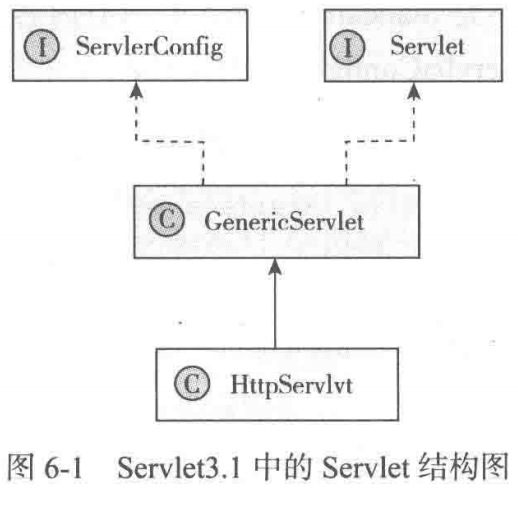
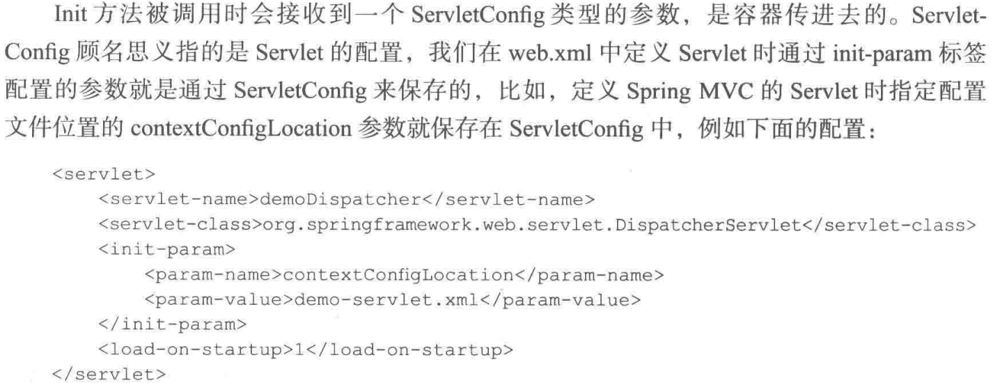
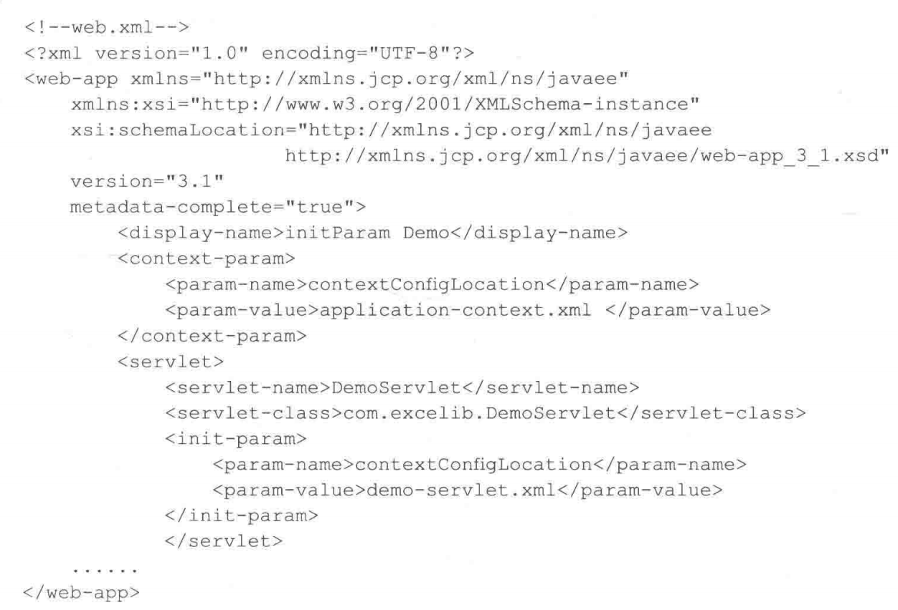

Servlet是Servlet+Applet缩写，表示服务器应用。Servlet就是一套规范，按照这套规范写的代码可以直接在Java的服务器上面运行。

Servlet3.1中Servlet的结构：HttpServlet——》GenericServlet ——》 {ServletConfig, Sevrlet}



#1. Servlet接口

Servlet3.1的接口规范

```java
public interface Servlet {
  	## init方法在容器启动时被容器调用(load-on-startup设置为负数或者不设置时会在Servlet第一次用到时才被调用)，只会调用一次，容器传进入一个ServletConfig类型的参数(如配置文件等)
    void init(ServletConfig var1) throws ServletException;
    ## 获取ServletConfig
  	ServletConfig getServletConfig();
    ## 具体处理一个请求
    void service(ServletRequest var1, ServletResponse var2) throws ServletException, IOException;
  	## 获取Servlet相关的信息，自己实现，默认返回空字符串
    String getServletInfo();
    ## Servlet销毁时释放资源，只会调用一次
    void destroy();
}
```



Tomcat中Servlet的init方法在StandardWrapper的init方法中调用的，ServletConfig传入的事StandardWrapper(封装着Servlet)自身的门面类StandardWrapperFacade。Servlet是通过xml文件配置的，解析xml时把配置参数设置进入，StandardWrapper就包含配置项了。并不是StandardWrapper的所有内容都是Config相关的，所以用了门面Facede类。

```java
public interface ServletConfig {    
  String getServletName();    
  ServletContext getServletContext();    
  String getInitParameter(String var1);    
  Enumeration<String> getInitParameterNames(); 
}
```

getServletName获取 Servet的名字，就是web.xml定义的servlet-name；

getInitParameter获取 init-param配置的参数

getInitParameterNames获取 配置的所有init-param的名字集合

getServletContext返回ServletContext代表这个应用本身，ServletContext就是Tomcat中Context的门面类ApplicationContextFacade（参考StandardContext的getServletContext方法）。ServletContext代表应用本身，ServletContext设置的参数就可以被当前应用的所有Servlet共享了。项目中参数一般保存在session或者Application中，而ApplicationContext实现了ServletContext，很多时候就是保存在ServletContext中

ServletConfig是Servlet级别的，而ServletContext是Context(Application)级别的。

ServletContext接口中的getContext(String uripath)可以根据路径获取同个站点下别的应用的ServletContext。

ServletConfig和ServletContext最常见使用是传递初始化参数。以Spring的contextConfigLocation参数为例



通过<context-param>配置的contextConfigLocation配置到ServletContext中，

<servlet>下的init-param配置的contextConfigLocation配置到了ServletConfig中

```java
getServletConfig().getServletContext().getInitParameter("contextConfigLocation");
getServletConfig().getInitParameter("contextConfigLocation");
```

GenericServlet定义了getInitParameter方法，返回getServletConfig().getInitParameter()的返回值

ServletContext保存Applicaton级别的属性，可以使用setAttribute完成

```java
getServletContext().setAttribute("contextConfigLocation","new path");
```

# 2 GenericServlet

GenericServlet 通用是Servlet的默认实现，主要做了三件事

1. 实现了ServletConfig接口，可以直接调用ServletConfig里面的方法

2. 提供无参的init方法

3. 提供了log方法

   ```java
   public abstract class GenericServlet implements Servlet, ServletConfig, Serializable {
       private transient ServletConfig config;
       public GenericServlet() {}
       public void destroy() {}
       public String getInitParameter(String name) {
           return this.getServletConfig().getInitParameter(name);
       }
       public ServletContext getServletContext() {
           return this.getServletConfig().getServletContext();
       }
       public void init(ServletConfig config) throws ServletException {
           this.config = config;
           this.init();
       }
       public void init() throws ServletException {}
       public void log(String msg) {
           this.getServletContext().log(this.getServletName() + ": " + msg);
       }
       public void log(String message, Throwable t) {
           this.getServletContext().log(this.getServletName() + ": " + message, t);
       }
   ```

GenericServlet实现了Servlet的init(ServletConfig config)方法，将config设置给内部变量config，然后调用无参init()，这个方法是个模版方法，在子类中可以覆盖它来完成自己的初始化工作

这种做法有三个作用：

1. 将参数config设置给内部config，可以在ServletConfig的接口方法中直接调用config的相应方法来执行
2. 我们在写Servlet时可以只处理自己的初始化逻辑，不需要管config
3. 在重写init方法时不需要调用super.init(config)了。如果自己的Servlet中重写了带参数的init方法，一定要调用super.init(config)，否则这里的config属性接收不到值，ServletConfig接口方法也不能执行了。

GenericServlet提供了两个log方法，一个记录日志，一个记录异常。一般有自己的日志处理方式这个不常用。GenericServlet是与具体协议无关的。

# 3 HttpServlet

HttpServlet用HTTP协议实现的Servlet的基类，写Servlet时继承它就可以。DispatcherServlet就是继承的HttpServlet。Http主要重写了service方法，将ServletRequest和ServletResponse转换为HttpServletRequest和HttpServletResponse，然后根据Http请求的类型将请求路由到不同的处理方法。

具体处理方法是doXXX如doGet、doPost、doPut和doDelete方法都是模版方法，如果子类没有实现将抛出异常。

doGet方法对是否过期做了检查，没有过期则直接返回304状态码使用缓存；doHead调用了doGet的请求，然后返回空body的Response；

doOptions和doTrace正常不需要使用，主要用来做调试工作，doOptions返回所有支持的处理类型的集合，正常可以仅用，doTrace用来远程诊断服务器的，会将接受的header原封不动地返回，存在安全漏洞，最好禁用。HttpServlet为这两个方法做了默认实现。

```java
public abstract class HttpServlet extends GenericServlet {
    public void service(ServletRequest req, ServletResponse res) throws ServletException, IOException {
        HttpServletRequest request;
        HttpServletResponse response;
        try {
            request = (HttpServletRequest)req;
            response = (HttpServletResponse)res;
        } catch (ClassCastException var6) {
            throw new ServletException(lStrings.getString("http.non_http"));
        }

        this.service(request, response);
    }
     protected void service(HttpServletRequest req, HttpServletResponse resp) throws ServletException, IOException {
        String method = req.getMethod();
        long lastModified;
        if (method.equals("GET")) {
            lastModified = this.getLastModified(req);
            if (lastModified == -1L) {
                this.doGet(req, resp);
            } else {
                long ifModifiedSince;
                try {
                    ifModifiedSince = req.getDateHeader("If-Modified-Since");
                } catch (IllegalArgumentException var9) {
                    ifModifiedSince = -1L;
                }

                if (ifModifiedSince < lastModified / 1000L * 1000L) {
                    this.maybeSetLastModified(resp, lastModified);
                    this.doGet(req, resp);
                } else {
                    resp.setStatus(304);
                }
            }
        } else if (method.equals("HEAD")) {
            lastModified = this.getLastModified(req);
            this.maybeSetLastModified(resp, lastModified);
            this.doHead(req, resp);
        } else if (method.equals("POST")) {
            this.doPost(req, resp);
        } else if (method.equals("PUT")) {
            this.doPut(req, resp);
        } else if (method.equals("DELETE")) {
            this.doDelete(req, resp);
        } else if (method.equals("OPTIONS")) {
            this.doOptions(req, resp);
        } else if (method.equals("TRACE")) {
            this.doTrace(req, resp);
        } else {
            String errMsg = lStrings.getString("http.method_not_implemented");
            Object[] errArgs = new Object[]{method};
            errMsg = MessageFormat.format(errMsg, errArgs);
            resp.sendError(501, errMsg);
        }

    }
  }
```

HttpServlet主要将不同的请求方式路由到不同的处理方法。

SpringMVC中又将所有请求合并到了同一的一个方法进行处理。