**Spring** 框架两⼤核⼼机制（**IoC**、**AOP**）

​	IoC（控制反转）/ DI（依赖注⼊）

​	AOP（⾯向切⾯编程）

Spring 是⼀个企业级开发框架，是软件设计层⾯的框架，优势在于可以将应⽤程序进⾏分层，开发者可以⾃主选择组件。

MVC：Struts2、Spring MVC

ORMapping：Hibernate、MyBatis、Spring Data


## Spring概述

### 1. 什么是spring
​	Spring 是 个 java 企 业 级 应 用 的 开 源 开 发 框 架 。目 标 是 简 化 Java企 业 级 应 用 开 发 ， 并 通 过 POJO 为 基 础 的 编 程 模 型 促 进良 好 的 编 程 习 惯 。
### 2. 使用Spring 框架的好处
* 轻 量 ：Spring 是 轻 量 级 的 
* 控 制 反 转 ：Spring 通 过 控 制 反 转 实 现 了 松 散 耦 合 ， 对 象们 给 出 它 们 的 依 赖 ， 而 不 是 创 建 或 查 找 依 赖 的 对 象 们 。
* 面 向 切 面 的 编 程(AOP)：Spring 支 持 面 向 切 面 的 编 程 ，并 且 把 应 用 业 务 逻 辑 和 系 统 服 务 分 开 
* 容 器 ：Spring 包 含 并 管 理 应 用 中 对 象 的 生 命 周 期 和 配置 。
* MVC 框 架：Spring 的 WEB框架是个精心设计的框架是 Web 框 架 的 一 个 很 好 的 替 代 品 。
* 事务管理 ：Spring 提供一个持续的事 务管理接口 ，可以扩展到上至本地事务下至全局事务 JTA
* 异 常 处 理 ：Spring 提 供 方 便 的 API 把 具 体 技 术 相 关 的 异常 （ 比 如 由 JDBC，Hibernate or JDO 抛 出 的 ） 转 化 为一 致 的 unchecked 异 常 。
### 3. Spring 由 哪 些 模 块 组 成
* Core module
* Bean module
* Context module
* Expression Language module
* JDBC module
* ORM module
* OXM module
* Java Messaging Service(JMS) module
* Transaction module
* Web module
* Web-Servlet module
* Web-Struts module
* Web-Portlet module

### 4 .核心容器 应用上下文
  这 是 基 本 的 Spring 模 块 ， 提 供 spring 框 架 的 基 础 功能 ，BeanFactory 是 任 何 以 spring 为 基 础 的 应 用 的 核心 。Spring 框 架 建 立 在 此 模 块 之 上 ， 它 使 Spring 成 为 一 个 容 器 。

### 5. BeanFactory
​	Bean 工 厂 是 工 厂 模 式 的 一 个 实 现 ， 提 供 了 控 制 反 转 功能 ， 用 来 把 应 用 的 配 置 和 依 赖 从 正 真 的 应 用 代 码 中 分离 。最 常 用 的 BeanFactory 实 现 是 XmlBeanFactory 类 。

### 6. Spring 框架中的 IoC

​	Spring 中的 org.springframework.beans 包和org.springframework.context 包构成了 Spring 框架 IoC 容器的基础。

​	BeanFactory 接口提供了一个先进的配置机制，使得任何类型的对象的配置成为可能。ApplicationContex 接口对BeanFactory（是一个子接口）进行了扩展，在 BeanFactory的基础上添加了其他功能，比如与 Spring 的 AOP 更容易集成，也提供了处理 message resource 的机制（用于国际化）、事件传播以及应用层的特别配置，比如针对 Web 应用的 WebApplicationContext。 

​	org.springframework.beans.factory.BeanFactory 是Spring IoC 容器的具体实现，用来包装和管理前面提到的各种bean。BeanFactory 接口是 Spring IoC 容器的核心接口。

### 7.BeanFactory 和 ApplicationContext区别

​	开发中基本使 用 A p p l i c a t i o n C o n t e x t , w e b项 目 使 用 W e b A p p l i c a t i o n C o n t e x t ， 很 少 用 到B e a n F a c t o r y

**BeanFactory**：基础类型的Ioc容器，采用懒加载（lazy-load），对象只有在用的时候才初始化和依赖注入。所以启动容器比较快。

​	BeanFactory 可以理解为含有 bean 集合的工厂类。

​	BeanFactory 包含了种 bean 的定义，以便在接收到客户端请求时将对应的 bean 实例化。

​	BeanFactory 还能在实例化对象的时生成协作类之间的关系。

​	BeanFactory 还包含了 bean 生命周期的控制，调用客户端的初始化方法（initialization methods）和销毁方法（destruction methods）

**ApplicationContext**：较高级类型的IOC容器，基于BeanFactory，在启动容器的时候就会初始化并注入依赖。并且还提供其他高级特性。

​	application context 如同 bean factory 一样具有 bean 定义、bean 关联关系的设置，根据请求分发 bean 的功能。但 application context 在此基础上还提供了其他的功能。

1. 提供了支持国际化的文本消息

2. 统一的资源文件读取方式

3. 已在监听器中注册的 bean 的事件 以下是三种较常见的ApplicationContext 实现方式：

1、ClassPathXmlApplicationContext：从 classpath 的XML 配置文件中读取上下文，并生成上下文定义。应用程序上下文从程序环境变量中取得。

```java
ApplicationContext context = newClassPathXmlApplicationContext(“bean.xml”);
```

2、FileSystemXmlApplicationContext ：由文件系统中的XML 配置文件读取上下文。

```java
ApplicationContext context = newFileSystemXmlApplicationContext(“bean.xml”);
```

3、XmlWebApplicationContext：由 Web 应用的 XML 文件读取上下文。

### 8. Spring的注解配置 

​	Spring 在 2.5 版本以后开始支持用注解的方式来配置依赖注入。可以用注解的方式来替代 XML 方式的 bean 描述，可以将 bean 描述转移到组件类的内部，只需要在相关类上、方法上或者字段声明上使用注解即可。注解注入将会被容器在XML 注入之前被处理，所以后者会覆盖掉前者对于同一个属性的处理结果。

```xml
//开启注解扫描	
<context:annotation-config/>	
```

标签配置完成以后，就可以用注解的方式在 Spring 中向属性、方法和构造方法中自动装配变量。

1. @Required：该注解应用于设值方法。表明某个参数是必要的

2. @Autowired：该注解应用于有值设值方法、非设值方法、构造方法和变量。自动装配bean

3. @Qualifier：该注解和@Autowired 注解搭配使用，用于消除特定 bean 自动装配的歧义。指定具体的name

4. JSR-250 Annotations：Spring 支持基于 JSR-250 注解的以下注解，@Resource、@PostConstruct 和

@PreDestroy。

### 9. Spring Bean 的生命周期

1. 在配置<bean>元素，通过init-method指定Bean的初始化方法，通过destroy-method指定Bean销毁方法
   <beanid="lifecyclebean"class="cn.itcast.spring.d_lifecycle.lifecyclebean"init-method="setup"destroy-
   method="teardown">

   需要注意的问题：

   ```java
   destroy-method 只对 scope="singleton" 有效
   //销毁方法，必须关闭
   //ApplicationContext对象(手动调用)，才会被调用
   ClassPathXmlApplicationContext applicationContext=new ClassPathXmlApplicationContext("applicationContext.xml");
   applicationContext.close();
   ```

   

2. Bean的完整生命周期（十一步骤）【了解内容，但是对于spring内部操作理解有一定帮助】
   ① instantiatebean对象实例化
   ② populateproperties封装属性
   ③ 如果Bean实现BeanNameAware执行setBeanName
   ④ 如果Bean实现BeanFactoryAware或者ApplicationContextAware设置工厂setBeanFactory或者上下文对象setApplicationContext
   ⑤ 如果存在类实现BeanPostProcessor（后处理Bean），执行postProcessBeforeInitialization，BeanPostProcessor接口提供钩子函数，用来动态扩展修改Bean。(程序自动调用后处理Bean)
   
   ```java
   public class MyBeanPostProcessor implements BeanPostProcessor{
   public Object postProcessAfterInitialization(Object bean,String beanName)
   throws BeansException{
     System.out.println("第八步：后处理Bean，after初始化。");
     //后处理Bean，在这里加上一个动态代理，就把这个Bean给修改了。
     return bean;//返回bean，表示没有修改，如果使用动态代理，返回代理对象，那么就修改了。
     }
     public Object postProcessBeforeInitialization(Object bean,String beanName)
     throws BeansException{
     System.out.println("第五步：后处理Bean的：before初始化！！");
     //后处理Bean，在这里加上一个动态代理，就把这个Bean给修改了。
     return bean;//返回bean本身，表示没有修改。
     }
   }
   ```
   
   注意：这个前处理Bean和后处理Bean会对所有的Bean进行拦截。
   ⑥如果Bean实现InitializingBean执行afterPropertiesSet
   ⑦调用指定初始化方法init
   ⑧如果存在类实现BeanPostProcessor（处理Bean），执行postProcessAfterInitialization
   ⑨执行业务处理
   ⑩如果Bean实现DisposableBean执行destroy
   ⑪调用指定销毁方法customerDestroy

(1)bean定义

​		在配置文件里面用<bean></bean>来进行定义。
(2)bean初始化
​		有两种方式初始化:
​			A.在配置文件中通过指定init-method属性来完成
​			B.实现org.springframwork.beans.factory.InitializingBean接口
(3)bean调用
​			有三种方式可以得到bean实例，并进行调用
(4)bean销毁
​	销毁有两种方式
​		A.使用配置文件指定的destroy-method属性
​		B.实现org.springframwork.bean.factory.DisposeableBean接口

​	Spring Bean 的生命周期在一个 bean 实例被初始化时，需要执行一系列的初始化操作以达到可用的状态。同样的，当一个 bean 不在被调用时需要进行相关的析构操作，并从 bean 容器中移除。

​	Spring bean factory 负责管理在 spring 容器中被创建的bean 的生命周期。Bean 的生命周期由两组回调（callback）方法组成。

1. 初始化之后调用的回调方法。
2. 销毁之前调用的回调方法。

Spring 框架提供了以下四种方式来管理 bean 的生命周期事件：

* InitializingBean 和 DisposableBean 回调接口
* 针对特殊行为的其他 Aware 接口
* Bean 配置文件中的 Custom init()方法和 customDestroy()方法
* @PostConstruct 和@PreDestroy 注解方式

使用 customInit()和customDestroy()方法管理 bean 生命周期的代码样例如下：

```xml
 <beans>
 <bean id="demoBean"class="com.howtodoinjava.task.DemoBean" init-method="customInit" destroy-method="customDestroy"></bean>
</beans>
```

Spring 生命周期 Spring Bean Life Cycle  https://howtodoinjava.com/spring-core/spring-bean-life-cycle/

### 10. Spring Bean 的自动装配

​	 Spring 可以通过向 Bean Factory 中注入的方式自动搞定 bean 之间的依赖关系。自动装配可以设置在每个 bean 上，也可以设定在特定的 bean 上。

```xml
<bean id="employeeDAO"class="com.howtodoinjava.EmployeeDAOImpl"autowire="byName" />
```

​	除了 bean 配置文件中提供的自动装配模式，还可以使用@Autowired 注解来自动装配指定的 bean。在使用@Autowired 注解之前需要在按照如下的配置方式在 Spring配置文件进行配置才可以使用。

```xml
<context:annotation-config />
```

​	也可以通过在配置文件中配置AutowiredAnnotationBeanPostProcessor 达到相同的效果。

```xml
<bean class="org.springframework.beans.factory.annotation.AutowiredAnnotationBeanPostProcessor"/>
```

```java
@Autowired
public EmployeeDAOImpl ( EmployeeManager manager ) { this.manager = manager;}
```

### 11. 自动装配模式的区别

​	在 Spring 框架中共有 5 种自动装配

1. no：这是 Spring 框架的默认设置，在该设置下自动装配是关闭的，开发者需要自行在 bean 定义中用标签明确的设置依赖关系。

2. byName：该选项可以根据 bean 名称设置依赖关系。当向一个 bean 中自动装配一个属性时，容器将根据 bean 的名称自动在在配置文件中查询一个匹配的 bean。如果找到的话，就装配这个属性，如果没找到的话就报错。

3. byType：该选项可以根据 bean 类型设置依赖关系。当向一个bean 中自动装配一个属性时，容器将根据 bean 的类型自动在在配置文件中查询一个匹配的 bean。如果找到的话，就装配这个属性，如果没找到的话就报错。

4. constructor：构造器的自动装配和 byType 模式类似，但是仅仅适用于与有构造器相同参数的 bean，如果在容器中没有找到与构造器参数类型一致的 bean，那么将会抛出异常。

5. autodetect：该模式自动探测使用构造器自动装配或者byType 自动装配。首先，首先会尝试找合适的带参数的构造器，如果找到的话就是用构造器自动装配，如果在 bean 内部没有找到相应的构造器或者是无参构造器，容器就会自动选择byTpe 的自动装配方式。

### 12. 构造方法注入和设值注入的区别

1. 在设值注入方法支持大部分的依赖注入，如果我们仅需要注入int、string 和 long 型的变量，我们不要用设值的方法注入。对于基本类型，如果我们没有注入的话，可以为基本类型设置默认值。在构造方法注入不支持大部分的依赖注入，因为在调用构造方法中必须传入正确的构造参数，否则的话为报错。

2. 设值注入不会重写构造方法的值。如果我们对同一个变量同时使用了构造方法注入又使用了设置方法注入的话，那么构造方法将不能覆盖由设值方法注入的值。很明显，因为构造方法尽在对象被创建时调用。

3. 在使用设值注入时有可能还不能保证某种依赖是否已经被注入，也就是说这时对象的依赖关系有可能是不完整的。而在另一种情况下，构造器注入则不允许生成依赖关系不完整的对象。

4. 在设值注入时如果对象 A 和对象 B 互相依赖，在创建对象 A 时 Spring 会抛出 ObjectCurrentlyInCreationException 异常，因为在 B 对象被创建之前 A 对象是不能被创建的，反之亦然。所以 Spring 用设值注入的方法解决了循环依赖的问题，因对象的设值方法是在对象被创建之前被调用的。

### 13.Spring 框架中的事件

​	Spring 的 ApplicationContext 提供了支持事件和代码中监听器的功能。 

​	可以创建 bean 用来监听在ApplicationContext 中发布的事件。ApplicationEvent 类和在 ApplicationContext 接口中处理的事件，如果一个 bean实现了 ApplicationListener 接口，当一个 ApplicationEvent被发布以后，bean 会自动被通知。

```java
public class AllApplicationEventListener implements ApplicationListener < ApplicationEvent> { 
@Override
public void onApplicationEvent(ApplicationEvent applicationEvent){
//process event
}}
```

​	Spring 提供了以下 5 中标准的事件：

1. 上下文更新事件（ContextRefreshedEvent）：该事件会在ApplicationContext 被初始化或者更新时发布。也可以在调用 ConfigurableApplicationContext 接口中的 refresh()方法时被触发。

2. 上下文开始事件（ContextStartedEvent）：当容器调用ConfigurableApplicationContext 的 Start()方法开始/重新开始容器时触发该事件。

3. 上下文停止事件（ContextStoppedEvent）：当容器调用ConfigurableApplicationContext 的 Stop()方法停止容器时触发该事件。

4. 上下文关闭事件（ContextClosedEvent）：当ApplicationContext 被关闭时触发该事件。容器被关闭时，其管理的所有单例 Bean 都被销毁。

5. 请求处理事件（RequestHandledEvent）：在 Web 应用中，当一个 http 请求（request）结束触发该事件。

还可以通过扩展ApplicationEvent 类来开发自定义的事件。还需要创建一个监听器监听这个事件。

```java
public class CustomApplicationEvent extends ApplicationEvent{
	public CustomApplicationEvent ( Object source, final String msg )  { 
 		super(source);
	  System.out.println("Created a Custom event");
 }
}
```

​	之后通过 applicationContext 接口的 publishEvent()方法来发布自定义事件。

```java
CustomApplicationEvent customEvent = new CustomApplicationEvent(applicationContext, "Testmessage");
   applicationContext.publishEvent(customEvent);
```

  ### 14. Spring 框架中的设计模式

​	Spring 框架中使用到了大量的设计模式，下面列举了比较有代表性的：

1. 代理模式—在 AOP 和 remoting 中被用的比较多。
2. 单例模式—在 spring 配置文件中定义的 bean 默认为单例模式。

3. 模板方法—用来解决代码重复的问题。比如. RestTemplate,JmsTemplate, JpaTemplate。 
4. 工厂模式—BeanFactory 用来创建对象的实例。

### 15. Spring 处理线程并发问题

​	Spring使用ThreadLocal解决线程安全问题

​	在一般情况下，只有无状态的Bean才可以在多线程环境下共享，在Spring中，绝大部分Bean都可以声明为singleton作用域。就是因为Spring对一些Bean(如RequestContextHolder、
TransactionSynchronizationManager、LocaleContextHolder等)中非线程安全状态采用ThreadLocal进行处理，让它们也成为线程安全的状态，因为有状态的Bean就可以在多线程中共享了。

​	ThreadLocal和线程同步机制都是为了解决多线程中相同变量的访问冲突问题。	

​	在同步机制中，通过对象的锁机制保证同一时间只有一个线程访问变量。这时该变量是多个线程共享的，使用同步机制要求程序慎密地分析什么时候对变量进行读写，什么时候需要锁定某个对象，什么时候释放对象锁等繁杂的问题，程序设计和编写难度相对较大。
​	而ThreadLocal则从另一个角度来解决多线程的并发访问。ThreadLocal会为每一个线程提供一个独立的变量副本，从而隔离了多个线程对数据的访问冲突。因为每一个线程都拥有自己的变量副本，从而也就没有必要对该变量进行同步了。

​	ThreadLocal提供了线程安全的共享对象，在编写多线程代码时，可以把不安全的变量封装进ThreadLocal。	   

​    由于ThreadLocal中可以持有任何类型的对象，低版本JDK所提供的get()返回的是Object对象，需要强制类型转换。但JDK5.0通过泛型很好的解决了这个问题，在一定程度地简化ThreadLocal的使用。
​	概括起来说，对于多线程资源共享的问题，同步机制采用了“以时间换空间”的方式，而ThreadLocal采用了“以空间换时间”的方式。前者仅提供一份变量，让不同的线程排队访问，而后者为每一个线程都提供了一份变量，因此可以同时访问而互不影响。

### 16. Spring 事务

​	事务就是对一系列的数据库操作（比如插入多条数据）进行统一的提交或回滚操作，如果插入成功，那么一起成功，如果中间有一条出现异常，那么回滚之前的所有操作。这样可以防止出现脏数据，防止数据
库数据出现问题。
​	开发中为了避免这种情况一般都会进行事务管理。Spring中也有自己的事务管理机制，一般是使用TransactionMananger进行管理，可以通过Spring的注入来完成此功能。spring提供了几个关于事务处理的类：

​		TransactionDefinition //事务属性定义
​		TranscationStatus //代表了当前的事务，可以提交，回滚。
​		PlatformTransactionManager //这个是spring提供的用于管理事务的基础接口，其下有一个实现的抽象类
AbstractPlatformTransactionManager,我们使用的事务管理类例如DataSourceTransactionManager等都是这个类的子类。

#### 事务传播行为

**PROPAGATION_REQUIRED** – 支持当前事务，如果当前没有事务，就新建一个事务。这是最常见的选择。
**PROPAGATION_SUPPORTS**–支持当前事务，如果当前没有事务，就以非事务方式执行。
**PROPAGATION_MANDATORY**–支持当前事务，如果当前没有事务，就抛出异常。
**PROPAGATION_REQUIRES_NEW**–新建事务，如果当前存在事务，把当前事务挂起。
**PROPAGATION_NOT_SUPPORTED**–以非事务方式执行操作，如果当前存在事务，就把当前事务挂起。
**PROPAGATION_NEVER**–以非事务方式执行，如果当前存在事务，则抛出异常。
**PROPAGATION_NESTED**–如果当前存在事务，则在嵌套事务内执行。如果当前没有事务，则进行与PROPAGATION_REQUIRED类似的操作。	


##Spring Bean

###**1. 定义 Spring Bean**

什么是 BeanDefinition？

• BeanDefinition 是 Spring Framework 中定义 Bean 的配置元信息接口，

包含：

• Bean 的类名

• Bean 行为配置元素，如作用域、自动绑定的模式，生命周期回调等

• 其他 Bean 引用，又可称作合作者（collaborators）或者依赖（dependencies）

• 配置设置，比如 Bean 属性（Properties）

###**2. BeanDefinition 元信息**

byclass   byname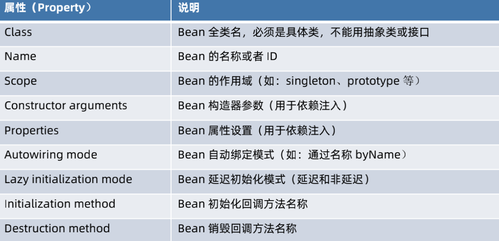

BeanDefinition 构建

• 通过 BeanDefinitionBuilder

• 通过 AbstractBeanDefinition 以及派生类

```java
 // 1.通过 BeanDefinitionBuilder 构建
        BeanDefinitionBuilder beanDefinitionBuilder = BeanDefinitionBuilder.genericBeanDefinition(User.class);
        // 通过属性设置
        beanDefinitionBuilder
                .addPropertyValue("id", 1)
                .addPropertyValue("name", "小马哥");
        // 获取 BeanDefinition 实例
        BeanDefinition beanDefinition = beanDefinitionBuilder.getBeanDefinition();
        // BeanDefinition 并非 Bean 终态，可以自定义修改

        // 2. 通过 AbstractBeanDefinition 以及派生类
        GenericBeanDefinition genericBeanDefinition = new GenericBeanDefinition();
        // 设置 Bean 类型
        genericBeanDefinition.setBeanClass(User.class);
        // 通过 MutablePropertyValues 批量操作属性
        MutablePropertyValues propertyValues = new MutablePropertyValues();
//        propertyValues.addPropertyValue("id", 1);
//        propertyValues.addPropertyValue("name", "小马哥");
        propertyValues
                .add("id", 1)
                .add("name", "小马哥");
        // 通过 set MutablePropertyValues 批量操作属性
        genericBeanDefinition.setPropertyValues(propertyValues);
```

###**3. 命名 Spring Bean**

Bean 的名称

每个 Bean 拥有一个或多个标识符（identifiers），这些标识符在 Bean 所在的容器必须是唯一的。通常，一个 Bean 仅有一个标识符，如果需要额外的，可考虑使用别名（Alias）来扩充。

在基于 XML 的配置元信息中，开发人员可用 id 或者 name 属性来规定 Bean 的 标识符。通常Bean 的 标识符由字母组成，允许出现特殊字符。如果要想引入 Bean 的别名的话，可在name 属性使用半角逗号（“,”）或分号（“;”) 来间隔。

Bean 的 id 或 name 属性并非必须制定，如果留空的话，容器会为 Bean 自动生成一个唯一的名称。Bean 的命名尽管没有限制，不过官方建议采用驼峰的方式，更符合 Java 的命名约定。

###**4. Spring Bean 的别名**

• Bean 别名（Alias）的价值

• 复用现有的 BeanDefinition

• 更具有场景化的命名方法，比如：

```java
<alias name="myApp-dataSource" alias="subsystemA-dataSource"/>
<alias name="myApp-dataSource" alias="subsystemB-dataSource"/>
```

###**5. 注册 Spring Bean**

• BeanDefinition 注册

​	• XML 配置元信息 

```
<bean name=”...” ... />
```

​	• Java 注解配置元信息

​		• **@Bean**

​		• **@Component**

​		• **@Import**

• Java API 配置元信息

​	• 命名方式：**BeanDefinitionRegistry#registerBeanDefinition(String,BeanDefinition)**

​	• 非命名方式：

**BeanDefinitionReaderUtils#registerWithGeneratedName(AbstractBeanDefinition,Be**

**anDefinitionRegistry)**

​	• 配置类方式：**AnnotatedBeanDefinitionReader#register(Class...)**

• 外部单例对象注册

​	• Java API 配置元信息

​		• **SingletonBeanRegistry#registerSingleton**

###**6. 实例化 Spring Bean**

• Bean 实例化（Instantiation）

​	• 常规方式

​		• 通过构造器（配置元信息：XML、Java 注解和 Java API ）

```xml
<beanid="bean1" class="cn.itcast.spring.b_instance.Bean1"> </bean>
```

​		• 通过静态工厂方法（配置元信息：XML 和 Java API ）

```xml
<beanid="bean2"class="cn.itcast.spring.b_instance.Bean2Factory"factory-method="getBean2"></bean>
```

​		• 通过 Bean 工厂方法（配置元信息：XML和 Java API ）

```xml
<beanid="bean3Factory" class="cn.itcast.spring.b_instance.Bean3Factory"></bean>
<beanid="bean3"factory-bean="bean3Factory"factory-method="getBean3"></bean>
```

​		• 通过 **FactoryBean**（配置元信息：XML、Java 注解和 Java API ）

• 特殊方式

​	• 通过 **ServiceLoaderFactoryBean**（配置元信息：XML、Java 注解和 Java API ）

​	• 通过 **AutowireCapableBeanFactory#createBean(java.lang.Class, int, boolean)**

​	• 通过 **BeanDefinitionRegistry#registerBeanDefinition(String,BeanDefinition)**

###**7. 初始化 Spring Bean**

• Bean 初始化（Initialization）

​	• @PostConstruct 标注方法

​		• 实现 InitializingBean 接口的 afterPropertiesSet() 方法

​		• 自定义初始化方法

​			• XML 配置：<bean init-method=”init” ... />

​			• Java 注解：@Bean(initMethod=”init”)

​			• Java API：AbstractBeanDefinition#setInitMethodName(String)

思考：假设以上三种方式均在同一 Bean 中定义，那么这些方法的执行顺序是怎样？

@postConstruct -> InitializingBean -> 自定义初始化方法@Bean(initMethod=”init”)

###**8. 延迟初始化 Spring Bean**

• Bean 延迟初始化（Lazy Initialization）

​	• XML 配置：<bean lazy-init=”true” ... />

​	• Java 注解：@Lazy(true)

思考：当某个 Bean 定义为延迟初始化，那么，Spring 容器返回的对象与非延迟的对象存在怎样的差异？

非延迟初始化在applicationContext.refresh()时不会初始化，在getBean的时候才会初始化

###**9. 销毁 Spring Bean**

• Bean 销毁（Destroy）

​	• @PreDestroy 标注方法

​		• 实现 DisposableBean 接口的 destroy() 方法

​		• 自定义销毁方法

​			• XML 配置：<bean destroy=”destroy” ... />

​			• Java 注解：@Bean(destroy=”destroy”)

​			• Java API：AbstractBeanDefinition#setDestroyMethodName(String)

思考：假设以上三种方式均在同一 Bean 中定义，那么这些方法的执行顺序是怎样？

@PreDestroy -> destroy -> 自定义销毁方法@Bean(destroy=”destroy”)

###**10. 垃圾回收 Spring Bean**

• Bean 垃圾回收（GC）

​		1. 关闭 Spring 容器（应用上下文）

​		2. 执行 GC

​		3. Spring Bean 覆盖的 finalize() 方法被回调

如何注册一个 Spring Bean

通过 xml<bean>,@Bean,@Compont,@Import 或者 BeanDefinition 和外部单体对象来注册

```java
// 创建 BeanFactory 容器
AnnotationConfigApplicationContext applicationContext = new AnnotationConfigApplicationContext();
// 创建一个外部 UserFactory 对象
UserFactory userFactory = new DefaultUserFactory();
SingletonBeanRegistry singletonBeanRegistry = applicationContext.getBeanFactory();
// 注册外部单例对象
singletonBeanRegistry.registerSingleton("userFactory", userFactory);
// 启动 Spring 应用上下文
applicationContext.refresh();

// 通过依赖查找的方式来获取 UserFactory
UserFactory userFactoryByLookup = applicationContext.getBean("userFactory", UserFactory.class);
System.out.println("userFactory  == userFactoryByLookup : " + (userFactory == userFactoryByLookup));

// 关闭 Spring 应用上下文
applicationContext.close();
```

什么是 Spring BeanDefinition？

答：回顾“定义 Spring Bean” 和 “BeanDefinition 元信息”

Spring 容器是怎样管理注册 Bean

答：IoC 配置元信息读取和解析、依赖查找和注入以及 Bean 生命周期等。	

## Spring Bean作用域

**singleton** 默认 Spring Bean 作用域，一个 BeanFactory 有且仅有一个实例

**prototype** 原型作用域，每次依赖查找和依赖注入生成新 Bean 对象

​	• Spring 容器没有办法管理 prototype Bean 的完整生命周期，也没有办法记录示例的存在。销毁回调方法将不会执行，可以利用 BeanPostProcessor 进行清扫工作。

**request** 将 Spring Bean 存储在 ServletRequest 上下文中,基于web的SpringApplicationContext

**session** 将 Spring Bean 存储在 HttpSession 中,基于web的SpringApplicationContext

**application** 将 Spring Bean 存储在 ServletContext 中,基于web的SpringApplicationContext

​	在`application`范围上，容器为每个Web应用程序运行时创建一个实例。它几乎类似于`singleton`范围，只有两个区别，即

1. `application`范围Bean为单身每个`ServletContext`，而`singleton`范围为每个`ApplicationContext`。请注意，单个应用程序可以有多个应用程序上下文。
2. `application`作用域bean作为`ServletContext`属性可见。

**globalsession** 在一个全局的HTTPSession中，一个bean定义对应一个实例。典型情况下，仅在使用portletcontext的时候有效。该作用域仅在基于web的SpringApplicationContext情形下有效。

> ​	application和globalsession是一个意思

全局作用域与 Servlet 中的 session 作用域效果相同。

https://howtodoinjava.com/spring-core/spring-bean-scopes/#websocket

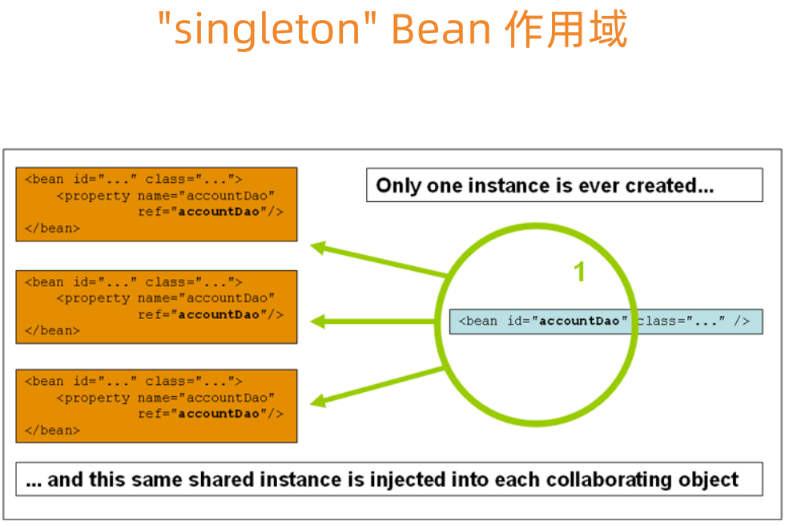

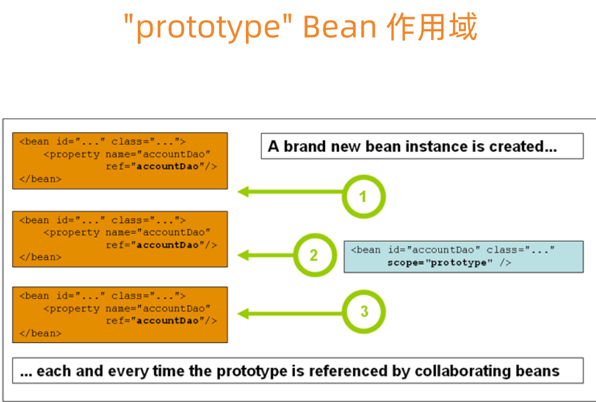

##Spring Bean生命周期

### 1. Spring Bean 元信息配置阶段

• BeanDefinition 配置

  • 面向资源
    • XML 配置
    • Properties 资源配置
  • 面向注解
  • 面向 API

###2. Spring Bean 元信息解析阶段

• 面向资源 BeanDefinition 解析
	• BeanDefinitionReader
	• XML 解析器 - BeanDefinitionParser	
• 面向注解 BeanDefinition 解析
	• AnnotatedBeanDefinitionReader

###3. Spring Bean 注册阶段

• BeanDefinition 注册接口
	• BeanDefinitionRegistry

###4. Spring BeanDefinition 合并阶段

• BeanDefinition 合并
	• 父子 BeanDefinition 合并
		• 当前 BeanFactory 查找
		• 层次性 BeanFactory 查找

###5. Spring Bean Class 加载阶段

  • ClassLoader 类加载
  • Java Security 安全控制
  • ConfigurableBeanFactory 临时 ClassLoader

###6. Spring Bean 实例化前阶段

• 非主流生命周期 - Bean 实例化前阶段	
	• InstantiationAwareBeanPostProcessor#postProcessBeforeInstantiation

###7. Spring Bean 实例化阶段

• 实例化方式
	• 传统实例化方式
		• 实例化策略 - InstantiationStrategy
	• 构造器依赖注入

###8. Spring Bean 实例化后阶段

• Bean 属性赋值（Populate）判断
	• InstantiationAwareBeanPostProcessor#postProcessAfterInstantiation

### 9. Spring Bean 属性赋值前阶段

• Bean 属性值元信息
	• PropertyValues
• Bean 属性赋值前回调
	• Spring 1.2 - 5.0：InstantiationAwareBeanPostProcessor#postProcessPropertyValues
	• Spring 5.1：InstantiationAwareBeanPostProcessor#postProcessProperties

### 10. Spring Bean Aware接口回调阶段

• Spring Aware 接口
  • BeanNameAware
  • BeanClassLoaderAware
  • BeanFactoryAware
  • EnvironmentAware
  • EmbeddedValueResolverAware
  • ResourceLoaderAware
  • ApplicationEventPublisherAware
  • MessageSourceAware
  • ApplicationContextAware

###11. Spring Bean 初始化前阶段

• 已完成
  • Bean 实例化
  • Bean 属性赋值
  • Bean Aware 接口回调
• 方法回调
	• BeanPostProcessor#postProcessBeforeInitialization

###12. Spring Bean 初始化阶段

• Bean 初始化（Initialization）
	• @PostConstruct 标注方法
	• 实现 InitializingBean 接口的 afterPropertiesSet() 方法
	• 自定义初始化方法

###13. Spring Bean 初始化后阶段

• 方法回调
	• BeanPostProcessor#postProcessAfterInitialization

###14. Spring Bean 初始化完成阶段

• 方法回调
	• Spring 4.1 +：SmartInitializingSingleton#afterSingletonsInstantiated

###15. Spring Bean 销毁前阶段

• 方法回调
	• DestructionAwareBeanPostProcessor#postProcessBeforeDestruction

###16. Spring Bean 销毁阶段

• Bean 销毁（Destroy）
	• @PreDestroy 标注方法
	• 实现 DisposableBean 接口的 destroy() 方法
	• 自定义销毁方法

###17. Spring Bean 垃圾收集

• Bean 垃圾回收（GC）
	• 关闭 Spring 容器（应用上下文）
	• 执行 GC
	• Spring Bean 覆盖的 finalize() 方法被回调

## Spring 配置元信息
###1. Spring 配置元信息

• Spring Bean 配置元信息 - BeanDefinition
• Spring Bean 属性元信息 - PropertyValues
• Spring 容器配置元信息
• Spring 外部化配置元信息 - PropertySource
• Spring Profile 元信息 - @Profile

###2. Spring Bean 配置元信息
• Bean 配置元信息 - BeanDefinition
  • GenericBeanDefinition：通用型 BeanDefinition
  • RootBeanDefinition：无 Parent 的 BeanDefinition 或者合并后 BeanDefinition
  • AnnotatedBeanDefinition：注解标注的 BeanDefinition
###3. Spring Bean 属性元信息
• Bean 属性元信息 - PropertyValues
  • 可修改实现 - MutablePropertyValues
  • 元素成员 - PropertyValue
• Bean 属性上下文存储 - AttributeAccessor
• Bean 元信息元素 - BeanMetadataElement
###4. Spring 容器配置元信息

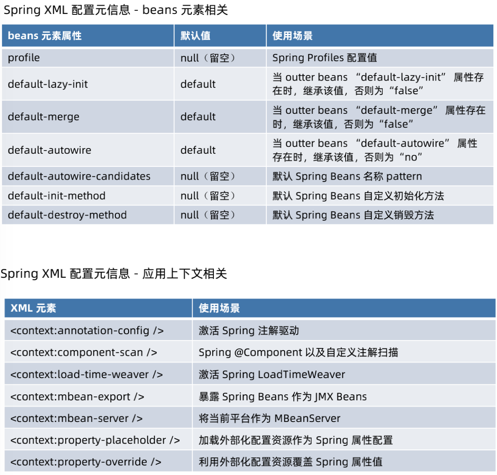

###5. 基于 XML 文件装载 Spring Bean 配置元信息

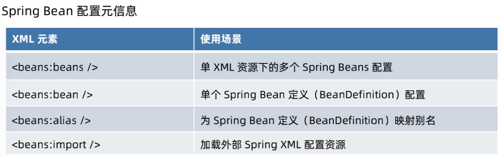

###6. 基于 Properties 文件装载 Spring Bean 配置元信息

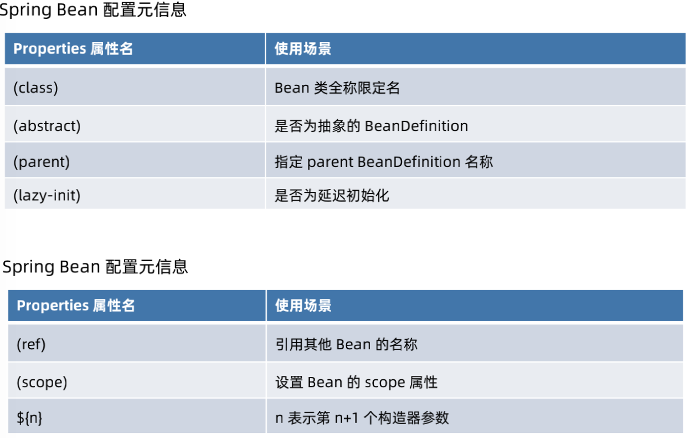

###7. 基于 Java 注解装载 Spring Bean 配置元信息

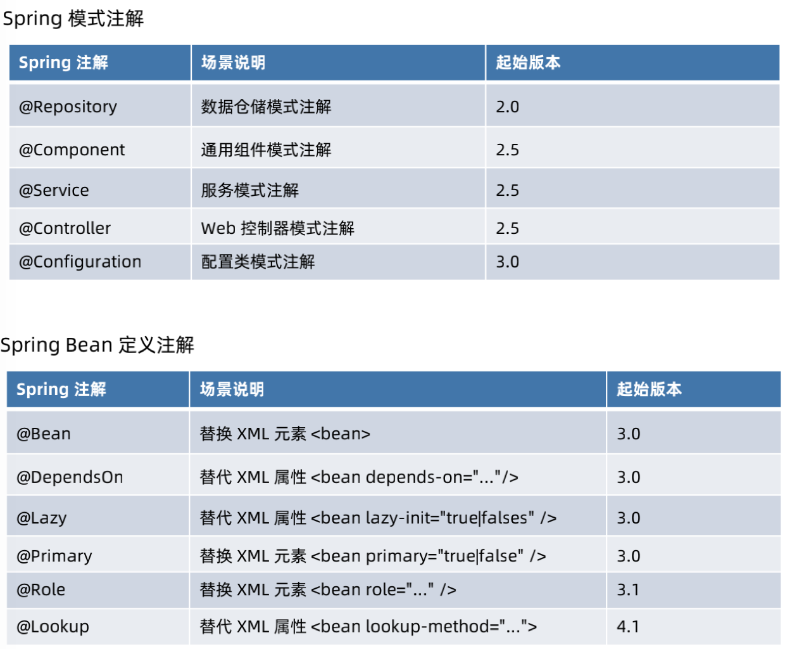

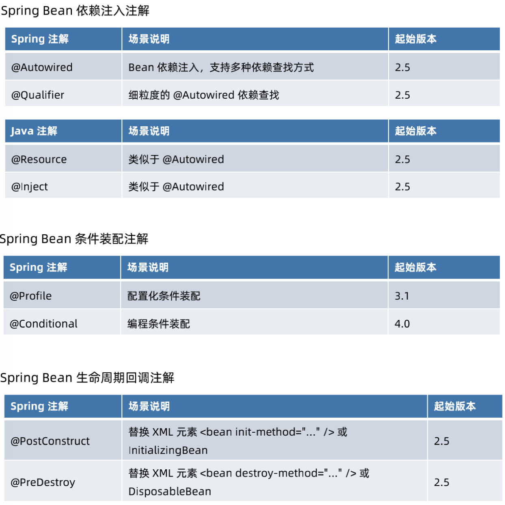

###8. Spring Bean 配置元信息底层实现

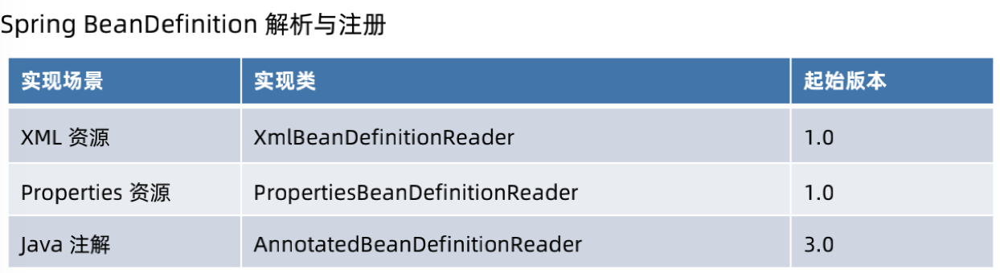

• Spring XML 资源 BeanDefinition 解析与注册
	• 核心 API - XmlBeanDefinitionReader
		• 资源 - Resource
		• 底层 - BeanDefinitionDocumentReader
			• XML 解析 - Java DOM Level 3 API
			• BeanDefinition 解析 - BeanDefinitionParserDelegate
		• BeanDefinition 注册 - BeanDefinitionRegistry
	• 核心 API - PropertiesBeanDefinitionReader
		• 资源
			• 字节流 - Resource
			• 字符流 - EncodedResouce
		• 底层
			• 存储 - java.util.Properties
			• BeanDefinition 解析 - API 内部实现
			• BeanDefinition 注册 - BeanDefinitionRegistry
	• 核心 API - AnnotatedBeanDefinitionReader
		• 资源
			• 类对象 - java.lang.Class
		• 底层
			• 条件评估 - ConditionEvaluator
			• Bean 范围解析 - ScopeMetadataResolver
			• BeanDefinition 解析 - 内部 API 实现
			• BeanDefinition 处理 -
AnnotationConfigUtils.processCommonDefinitionAnnotations
			• BeanDefinition 注册 - BeanDefinitionRegistry

###9. 基于 XML 文件装载 Spring IoC 容器配置元信息

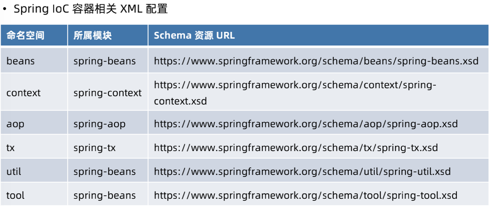

###10. 基于 Java 注解装载 Spring IoC 容器配置元信息

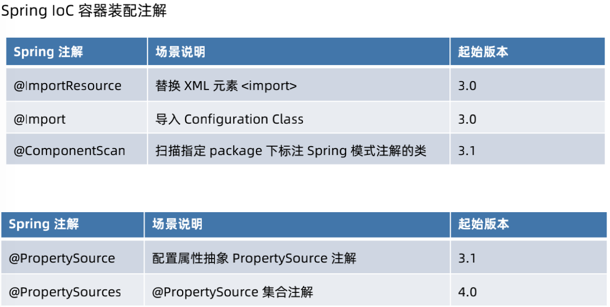

###11. 基于 Extensible XML authoring 扩展Spring XML元素
• Spring XML 扩展
  • 编写 XML Schema 文件：定义 XML 结构
  • 自定义 NamespaceHandler 实现：命名空间绑定
  • 自定义 BeanDefinitionParser 实现：XML 元素与 BeanDefinition 解析
  • 注册 XML 扩展：命名空间与 XML Schema 映射

###12. Extensible XML authoring 扩展原理
• 触发时机
  • AbstractApplicationContext#obtainFreshBeanFactory
    • AbstractRefreshableApplicationContext#refreshBeanFactory
      • AbstractXmlApplicationContext#loadBeanDefinitions
        • ...
          • XmlBeanDefinitionReader#doLoadBeanDefinitions
            • ...
              • BeanDefinitionParserDelegate#parseCustomElement
• 核心流程
	• BeanDefinitionParserDelegate#parseCustomElement(org.w3c.dom.Element, BeanDefinition)
		• 获取 namespace
		• 通过 namespace 解析 NamespaceHandler
		• 构造 ParserContext
		• 解析元素，获取 BeanDefinintion
###13. 基于 Properties 文件装载外部化配置
• 注解驱动
  • @org.springframework.context.annotation.PropertySource
  • @org.springframework.context.annotation.PropertySources
• API 编程
  • org.springframework.core.env.PropertySource	
  • org.springframework.core.env.PropertySources
###14. 基于 YAML 文件装载外部化配置
• API 编程
  • org.springframework.beans.factory.config.YamlProcessor
  • org.springframework.beans.factory.config.YamlMapFactoryBean
  • org.springframework.beans.factory.config.YamlPropertiesFactoryBean

##Spring IOC 控制反转

控制反转 Inversion of Control —— 是面向对象编程中的一种设计原则，可以用来减低计算机代码之间的耦合度。把创建对象的权利交给框架，它包括依赖注入（Dependency Injection，简称DI）和依赖查找（Dependency Lookup）。

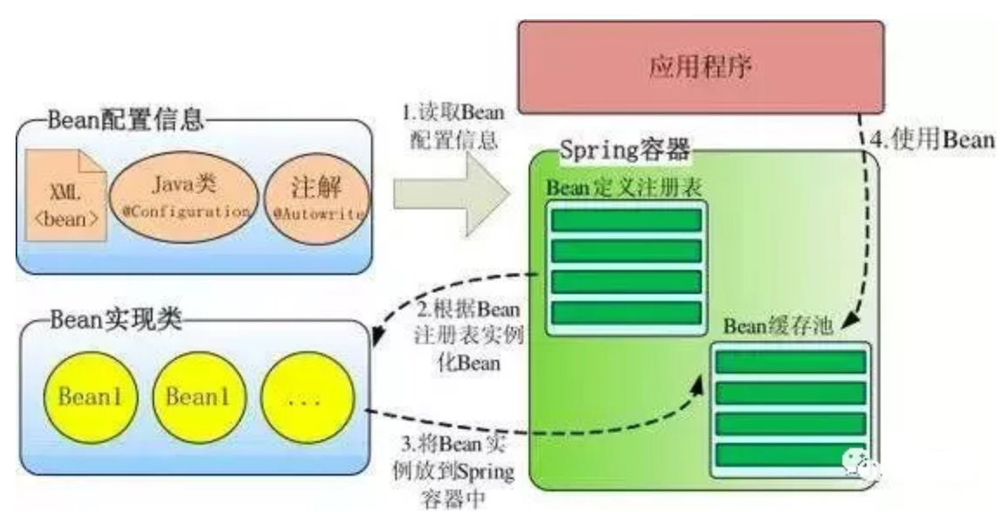

​	

 	结合ioc的定义，spring 则是把对象创建的权利交给容器，spring 容器就是控制中心

​	spring 通过配置文件（xml文件）描述bean的定义和bean与bean之间的依赖关系

​	通过资源加载器和xml解析器 加载并解析配置文件，为每一个xml中bean的定义，创建一个对应的BeanDefinition对象作为bean定义的原始数据

​	当需要对象时，spring容器根据之前加载的bean定义的元数据信息，利用反射创机制建具体实例对象

​	如果创建bean的过程中又依赖其它对象，spring容器则会优先创建被依赖的bean（依赖查找和依赖注入的体现）

​	spring 容器除了包含了ioc的基本功能外，还包含了bean的代理，bean的缓存和bean生命周期的管理

 spring 容器一般分为BeanFactory和ApplicationContext

​	通过控制反转，对象在被创建的时候，由一个调控系统内所有对象的外界实体FactoryBean，将其所依赖的对象的引用传递给它。也可以说，依赖被注入到对象中。

​	实现方式有 ：**依赖查找DL** Dependency Lookup	和	**依赖注入DI**(Dependency Injection) 更好 其他的如 服务定位模式、使用上下文化查找、模板法设计模式、使用策略设计模式

​	好处：解耦合，让模块专注于任务，便于AOP操作

创建对象

​	通过 IoC 创建对象，在配置⽂件中添加需要管理的对象，XML 格式的配置⽂件，⽂件名可以⾃定义。

​	@Bean

依赖查找：

```java
//加载配置⽂件
ApplicationContext applicationContext =new ClassPathXmlApplicationContext("spring.xml");
Student student = (Student) applicationContext.getBean("student");
System.out.println(student);
```

依赖注入（构造器注入、参数注入、设置注入、界面注入）

```
@Autowired
Student student；
```

## Spring IOC 容器

### Spring IoC 依赖查找

#### 单一类型依赖查找

• 单一类型依赖查找接口 - BeanFactory

​	• 根据 Bean 名称查找

​		• getBean(String)

​		• Spring 2.5 覆盖默认参数：getBean(String,Object...)

• 根据 Bean 类型查找

​	• Bean 实时查找

​		• Spring 3.0 getBean(Class)

​		• Spring 4.1 覆盖默认参数：getBean(Class,Object...)

​	• Spring 5.1 Bean 延迟查找

​		• getBeanProvider(Class)

​		• getBeanProvider(ResolvableType)

• 根据 Bean 名称 + 类型查找：getBean(String,Class)

#### 集合类型依赖查找

• 集合类型依赖查找接口 - ListableBeanFactory

​	• 根据 Bean 类型查找

​		• 获取同类型 Bean 名称列表

​			• getBeanNamesForType(Class)

​			• Spring 4.2 getBeanNamesForType(ResolvableType)

​		• 获取同类型 Bean 实例列表

​			• getBeansOfType(Class) 以及重载方法

​	• 通过注解类型查找

​		• Spring 3.0 获取标注类型 Bean 名称列表

​			• getBeanNamesForAnnotation(Class<? extends Annotation>)

​		• Spring 3.0 获取标注类型 Bean 实例列表

​			• getBeansWithAnnotation(Class<? extends Annotation>)

​		• Spring 3.0 获取指定名称 + 标注类型 Bean 实例

​			• findAnnotationOnBean(String,Class<? extends Annotation>)

#### 层次性依赖查找

• 层次性依赖查找接口 - HierarchicalBeanFactory

​	• 双亲 BeanFactory：getParentBeanFactory()

​	• 层次性查找

​		• 根据 Bean 名称查找

​			• 基于 containsLocalBean 方法实现

​		• 根据 Bean 类型查找实例列表

​			• 单一类型：BeanFactoryUtils#beanOfType

​			• 集合类型：BeanFactoryUtils#beansOfTypeIncludingAncestors

​	• 根据 Java 注解查找名称列表

​			• BeanFactoryUtils#beanNamesForTypeIncludingAncestors

#### 延迟依赖查找

• Bean 延迟依赖查找接口

​	• org.springframework.beans.factory.ObjectFactory

​	• org.springframework.beans.factory.ObjectProvider

​		• Spring 5 对 Java 8 特性扩展

​			• 函数式接口

​				• getIfAvailable(Supplier) 

​				• ifAvailable(Consumer)

​			• Stream 扩展 - stream()

#### 安全依赖查找

• 依赖查找安全性对比

**依赖查找类型 代表实现 是否安全**

单一类型查找 BeanFactory#getBean **否**

ObjectFactory#getObject **否**

ObjectProvider#getIfAvailable **是**

集合类型查找 ListableBeanFactory#getBeansOfType **是**

ObjectProvider#stream **是**

注意：层次性依赖查找的安全性取决于其扩展的单一或集合类型的 BeanFactory 接口

#### 内建可查找的依赖

##### AbstractApplicationContext 内建可查找的依赖

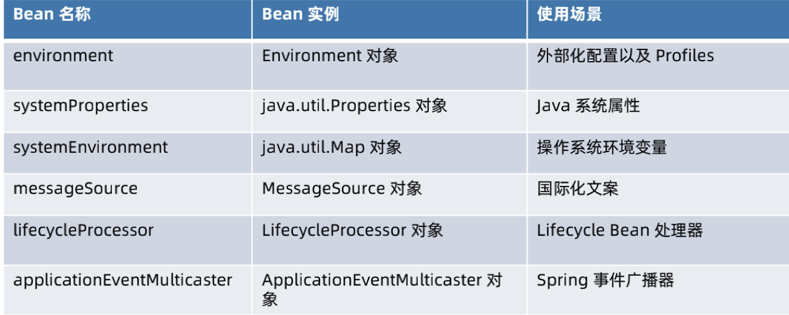

#####注解驱动 Spring 应用上下文内建可查找的依赖

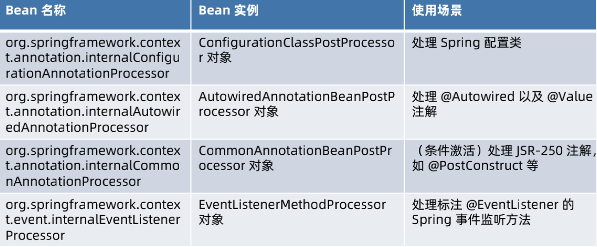

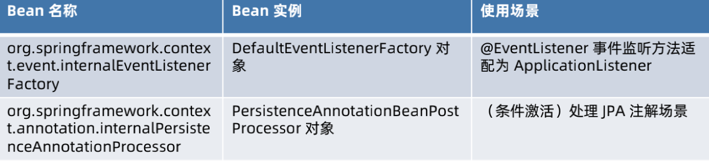

#### **依赖查找中的经典异常**

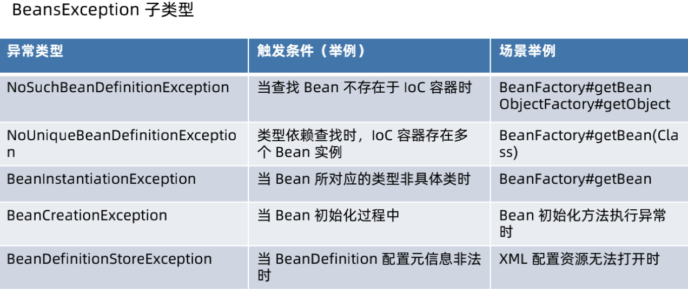

### Spring IoC 依赖注入

#### 1. 依赖注入的模式和类型
• 手动模式 - 配置或者编程的方式，提前安排注入规则
	• XML 资源配置元信息
	• Java 注解配置元信息
	• API 配置元信息
• 自动模式 - 实现方提供依赖自动关联的方式，按照內建的注入规则
	• Autowiring（自动绑定）

#### 2. 自动绑定（Autowiring）
Spring容器可以自动装配协作bean之间的关系。可以让Spring通过应用程序上下文检查
• 优点
•自动绑定可以显著减少指定属性或构造函数参数的需要。
•随着对象的发展，自动绑定可以更新配置。

#### 3. 自动绑定（Autowiring）模式

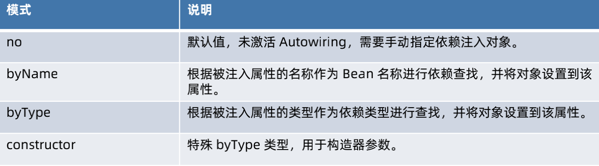

#### 4. 自动绑定（Autowiring）限制和不足
自动布线的局限性和缺点
	如果在项目中始终使用自动布线，则其效果最佳。如果通常不使用自动连线，开发人员可能会混淆使用它来连线一个或两个bean定义。
考虑自动布线的局限性和缺点：
	属性和构造函数arg设置中的显式依赖项始终覆盖自动连线。不能自动连接简单属性，如基元、字符串和类（以及此类简单属性的数组）。这种限制是故意的。
	自动布线不如显式布线精确。尽管如前表所述，Spring很小心地避免了在可能产生意外结果的歧义情况下进行猜测。Spring管理的对象之间的关系不再被显式地记录下来。
	对于可能从Spring容器生成文档的工具，连线信息可能不可用。
	容器中的多个bean定义可能与要自动连接的setter方法或构造函数参数指定的类型匹配。对于数组、集合或映射实例，这不一定是个问题。但是，对于期望单个值的依赖项，这种模糊性不是任意解决的。如果没有唯一的bean定义可用，则抛出异常。
在后一种情况下，您有几个选项：
	放弃自动布线，改为显式布线。
	如下一节所述，通过将bean定义的autowire候选属性设置为false来避免bean定义的自动连接。
	通过将其<bean/>元素的primary属性设置为true，将单个bean定义指定为主要候选者。
	如基于注释的容器配置中所述，使用基于注释的配置实现更细粒度的控件。
链接：https://docs.spring.io/spring/docs/5.2.2.RELEASE/spring-framework-reference/core.html#beans-autowired-exceptions
#### 5. Setter 方法依赖注入
• 实现方法
	• 手动模式
	  • XML 资源配置元信息
	  • Java 注解配置元信息
	  • API 配置元信息
	• 自动模式
	  • byName
	  • byType

#### 6. 构造器依赖注入
• 实现方法
	• 手动模式
   	 • XML 资源配置元信息
  	  • Java 注解配置元信息
 	   • API 配置元信息
	• 自动模式
		• constructor

#### 7. 字段注入
• 实现方法
	• 手动模式
  • Java 注解配置元信息
    • @Autowired
    • @Resource
    • @Inject（可选）
#### 8. 方法注入
• 实现方法
  • 手动模式
    • Java 注解配置元信息
      • @Autowired
      • @Resource
      • @Inject（可选）
      • @Bean
#### 9. 接口回调注入

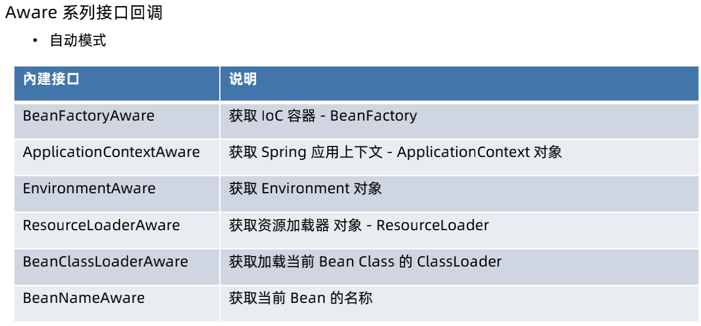

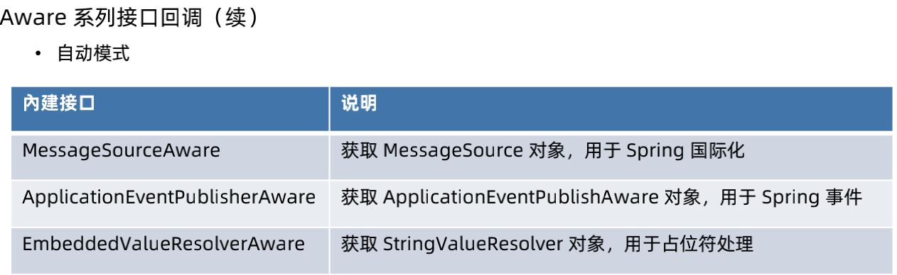

####10. 依赖注入类型选择
  • 注入选型
	  • 低依赖：构造器注入
	  • 多依赖：Setter 方法注入
	  • 便利性：字段注入@Autowired
	  • 声明类：方法注入

####11.基础类型注入
  • 基础类型
	  • 原生类型（Primitive）：boolean、byte、char、short、int、float、long、double
	  • 标量类型（Scalar）：Number、Character、Boolean、Enum、Locale、Charset、Currency、
  Properties、UUID
	  • 常规类型（General）：Object、String、TimeZone、Calendar、Optional 等
	  • Spring 类型：Resource、InputSource、Formatter 等

####12. 集合类型注入
  • 集合类型
	  • 数组类型（Array）：原生类型、标量类型、常规类型、Spring 类型
	  • 集合类型（Collection）
		  • Collection：List、Set（SortedSet、NavigableSet、EnumSet）
		  • Map：Properties

####13. 限定注入
  • 使用注解 @Qualifier 限定
  	• 通过 Bean 名称限定
	  • 通过分组限定

```
  @Autowired
  @Qualifier
  private Collection<User> qualifiedUsers
  @Bean
  @Qualifier // 进行逻辑分组
  public User user1() {
    return createUser(7L);
  }
  @Bean
  @Qualifier // 进行逻辑分组
  public User user2() {
    return createUser(8L);
  }
```

• 基于注解 @Qualifier 扩展限定
• 自定义注解 - 如 Spring Cloud @LoadBalanced
####14. 延迟依赖注入
• 使用 API ObjectFactory 延迟注入
	• 单一类型
	• 集合类型
• 使用 API ObjectProvider 延迟注入（推荐）
	• 单一类型
	• 集合类型

####15. 依赖处理过程
• 基础知识
	• 入口 - DefaultListableBeanFactory#resolveDependency
	• 依赖描述符 - DependencyDescriptor
	• 自定绑定候选对象处理器 - AutowireCandidateResolver

####16. @Autowired 注入原理
• @Autowired 注入规则
	• 非静态字段
	• 非静态方法
	• 构造器
• @Autowired 注入过程
	• 元信息解析
	• 依赖查找
	• 依赖注入（字段、方法）

####17. JSR-330 @Inject 注入原理
• @Inject 注入过程
	• 如果 JSR-330 存在于 ClassPath 中，复用 AutowiredAnnotationBeanPostProcessor 实现

####18. Java通用注解注入原理
• CommonAnnotationBeanPostProcessor
	• 注入注解
		• javax.xml.ws.WebServiceRef
		• javax.ejb.EJB
		• javax.annotation.Resource
• 生命周期注解
		• javax.annotation.PostConstruct
		• javax.annotation.PreDestroy

####19. 自定义依赖注入注解
• 基于 AutowiredAnnotationBeanPostProcessor 实现
• 自定义实现
	• 生命周期处理
		• InstantiationAwareBeanPostProcessor
		• MergedBeanDefinitionPostProcessor
	• 元数据
		• InjectedElement
		• InjectionMetadata

### Spring IoC 依赖来源

####依赖查找的来源

#####Spring BeanDefinition 作为依赖来源

​	• 元数据：BeanDefinition

​	• 注册：BeanDefinitionRegistry#registerBeanDefinition

​	• 类型：延迟和非延迟

​	• 顺序：Bean 生命周期顺序按照注册顺序

#####单例对象作为依赖来源

​	• 来源：外部普通 Java 对象（不一定是 POJO） 

​	• 注册：SingletonBeanRegistry#registerSingleton

• 限制

​	• 无生命周期管理

​	• 无法实现延迟初始化 Bean

#####非 Spring 容器管理对象作为依赖来源

• 注册：ConfigurableListableBeanFactory#registerResolvableDependency

• 限制

​	• 无生命周期管理

​	• 无法实现延迟初始化 Bean

​	• 无法通过依赖查找

#####外部化配置作为依赖来源

• 类型：非常规 Spring 对象依赖来源

• 限制

​	• 无生命周期管理

​	• 无法实现延迟初始化 Bean

​	• 无法通过依赖查找

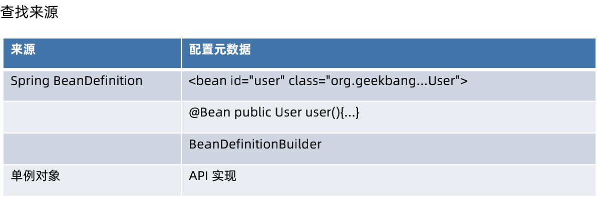

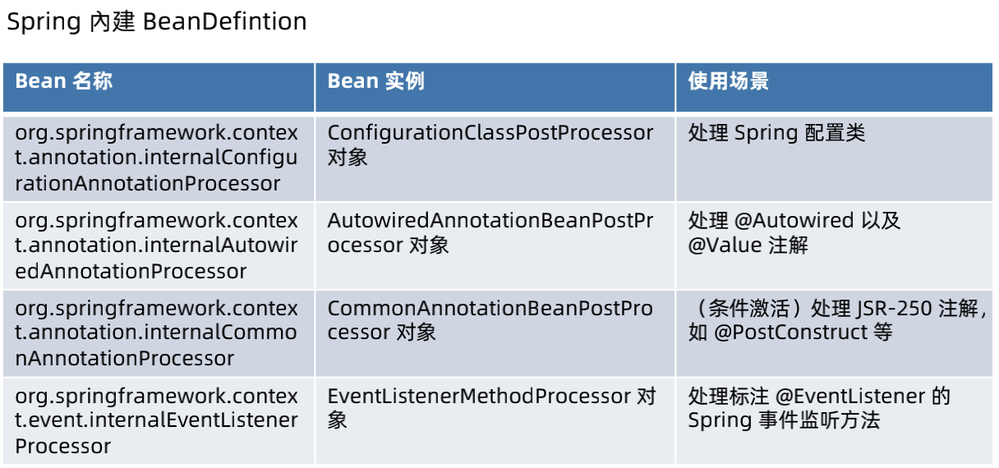

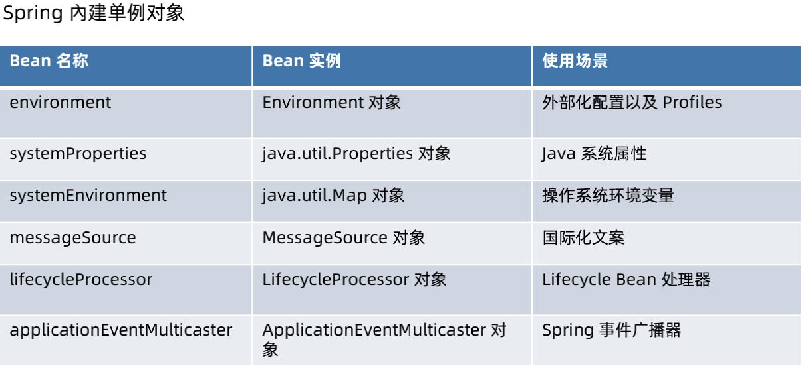

#### 依赖注入的来源

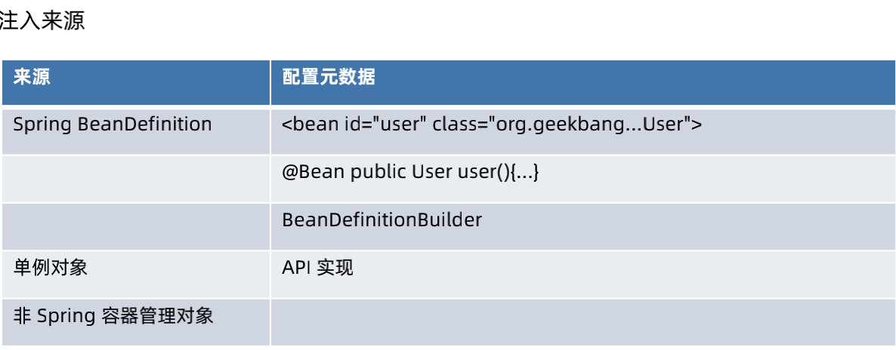

- 自定义 Bean		
- 容器內建 Bean 对象
-  容器內建依赖

### Spring IoC 配置元信息

 Bean 定义配置

​	• 基于 XML 文件

​	• 基于 Properties 文件

​	• 基于 Java 注解

​	• 基于 Java API（专题讨论）

IoC 容器配置

​	• 基于 XML 文件

​	• 基于 Java 注解

​	• 基于 Java API （专题讨论）

外部化属性配置

​	• 基于 Java 注解

### Spring IoC 容器

BeanFactory 和 ApplicationContext 谁才是 Spring IoC 容器？

​	**BeanFactory**：基础类型的Ioc容器，采用懒加载（lazy-load），对象只有在用的时候才初始化和依赖注入。所以启动容器比较快。

​	**ApplicationContext**：较高级类型的IOC容器，基于BeanFactory，在启动容器的时候就会初始化并注入依赖。并且还提供其他高级特性。

1. Spring 应用上下文

   ApplicationContext 除了 IoC 容器角色，还有提供：

   • 面向切面（AOP）

   • 配置元信息（Configuration Metadata）

   • 资源管理（Resources）

   • 事件（Events）

   • 国际化（i18n）

   • 注解（Annotations）

   • Environment 抽象（Environment Abstraction）

2. 使用 Spring IoC 容器

   BeanFactory 是 Spring 底层 IoC 容器

   ApplicationContext 是具备应用特性的 BeanFactory 超集

3. Spring IoC 容器生命周期

启动

运行

停止

### IOC 容器对Bean的生命周期

①. 通过构造器或工厂方法创建 Bean 实例

②. 为 Bean 的属性设置值和对其他 Bean 的引用

③ . 将 Bean 实 例 传 递 给 Bean 后 置 处 理 器 的 postProcessBeforeInitialization 方 法

④. 调用 Bean 的初始化方法(init-method)

⑤ . 将 Bean 实 例 传 递 给 Bean 后 置 处 理 器 的 postProcessAfterInitialization 方法

⑦. Bean 可以使用了

⑧. 当容器关闭时, 调用 Bean 的销毁方法(destroy-method)

## Spring IOC 底层原理

读取配置⽂件，解析 XML。

通过反射机制实例化配置⽂件中所配置所有的 bean。

```java
public class ClassPathXmlApplicationContext implements ApplicationContext {
private Map<String,Object> ioc = new HashMap<String, Object>();
public ClassPathXmlApplicationContext(String path){
try {
SAXReader reader = new SAXReader();
Document document = reader.read("./src/main/resources/"+path);
Element root = document.getRootElement();
Iterator<Element> iterator = root.elementIterator();
while(iterator.hasNext()){
Element element = iterator.next();
String id = element.attributeValue("id");
String className = element.attributeValue("class");
//通过反射机制创建对象
Class clazz = Class.forName(className);
//获取⽆参构造函数，创建⽬标对象
Constructor constructor = clazz.getConstructor();
Object object = constructor.newInstance();
//给⽬标对象赋值
Iterator<Element> beanIter = element.elementIterator();
while(beanIter.hasNext()){
Element property = beanIter.next();
String name = property.attributeValue("name");
String valueStr = property.attributeValue("value");
String ref = property.attributeValue("ref");
if(ref == null){
String methodName =
"set"+name.substring(0,1).toUpperCase()+name.substring(1);
Field field = clazz.getDeclaredField(name);
Method method =
clazz.getDeclaredMethod(methodName,field.getType());
//根据成员变量的数据类型将 value 进⾏转换
Object value = null;
if(field.getType().getName() == "long"){
value = Long.parseLong(valueStr);
 }
if(field.getType().getName() == "java.lang.String"){
value = valueStr;
 }
if(field.getType().getName() == "int"){
value = Integer.parseInt(valueStr);
 }
method.invoke(object,value);

ioc.put(id,object);
 }
 }
 } catch (DocumentException e) {
e.printStackTrace();
 } catch (ClassNotFoundException e){
e.printStackTrace();
 } catch (NoSuchMethodException e){
e.printStackTrace();
 } catch (InstantiationException e){
e.printStackTrace();
 } catch (IllegalAccessException e){
e.printStackTrace();
 } catch (InvocationTargetException e){
e.printStackTrace();
 } catch (NoSuchFieldException e){
e.printStackTrace();
 }
 }
public Object getBean(String id) {
return ioc.get(id);
 }
}
```

通过运⾏时类获取 **bean**

```java
ApplicationContext applicationContext = new
ClassPathXmlApplicationContext("spring.xml");
Student student = (Student) applicationContext.getBean(Student.class);
System.out.println(student);
```

这种⽅式存在⼀个问题，配置⽂件中⼀个数据类型的对象只能有⼀个实例，否则会抛出异常，因为没有唯⼀的 bean


## Spring AOP 面向切面编程

​	AOP为Aspect Oriented Programming的缩写，意为：面向切面编程，通过预编译方式和运行期动态代理实现程序功能的统一维护的一种技术。AOP是OOP的延续，是软件开发中的一个热点，也是Spring框架中的一个重要内容，是函数式编程的一种衍生范型。利用AOP可以对业务逻辑的各个部分进行隔离，从而使得业务逻辑各部分之间的耦合度降低，提高程序的可重用性，同时提高了开发的效率。

​	https://www.jianshu.com/p/38085bf69995

context:component-scan 将 com.southwind 包中的所有类进⾏扫描，如果该类同时添加了

@Component ，则将该类扫描到 IoC 容器中，即 IoC 管理它的对象。

aop:aspectj-autoproxy 让 Spring 框架结合切⾯类和⽬标类⾃动⽣成动态代理对象。

切⾯：横切关注点被模块化的抽象对象。 @Aspect 切面 包含前置、后置、环绕、返回、异常的通知

通知：切⾯对象完成的⼯作。

⽬标：被通知的对象，即被横切的对象。

代理：切⾯、通知、⽬标混合之后的对象。

连接点：通知要插⼊业务代码的具体位置。

切点：AOP 通过切点定位到连接点。	@Pointcut 切点 

​	

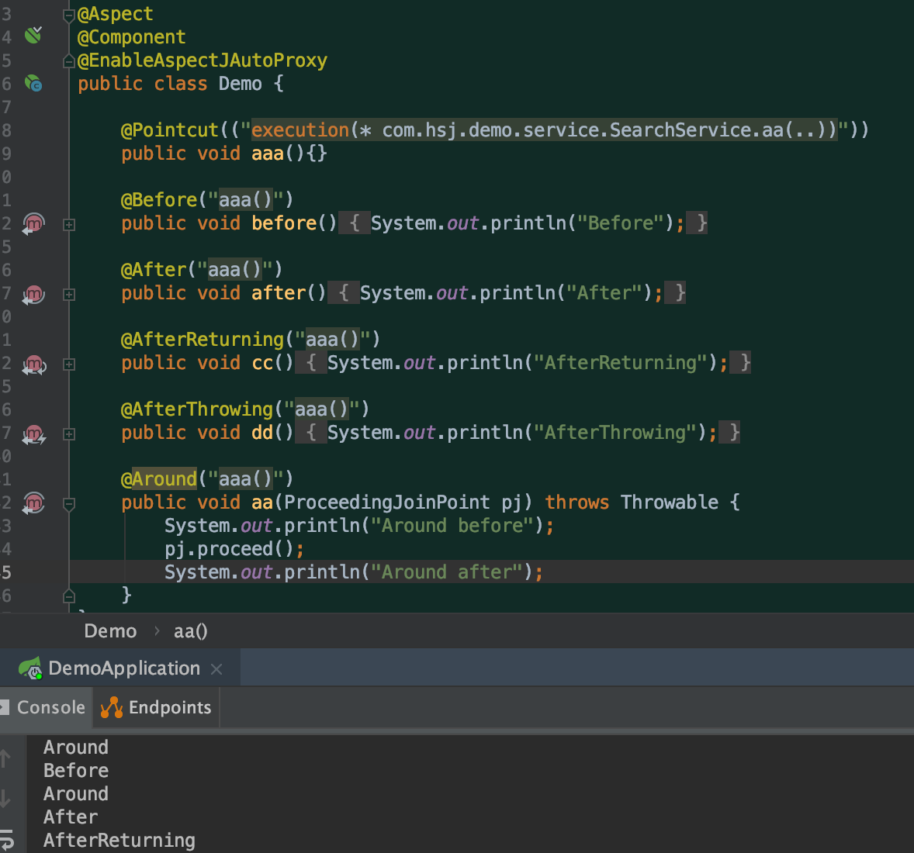


```
<dependency>
    <groupId>org.springframework</groupId>
    <artifactId>spring-aop</artifactId>
    <version>4.3.13.RELEASE</version>
</dependency>
<dependency>
    <groupId>org.aspectj</groupId>
    <artifactId>aspectjweaver</artifactId>
    <version>1.9.5</version>
</dependency>
```

**切面（Aspect）**：一个关注点的模块化，这个关注点可能会横切多个对象。事务管理是J2EE应用中一个关于横切关注点的很好的例子。在SpringAOP中，切面可以使用通用类（基于模式的风格）或者在普通类中以@Aspect注解
（@AspectJ风格）来实现。
**连接点（Joinpoint）**：在程序执行过程中某个特定的点，比如某方法调用的时候或者处理异常的时候。在SpringAOP中，一个连接点总是代表一个方法的执行。通过声明一个org.aspectj.lang.JoinPoint类型的参数可以使
通知（Advice）的主体部分获得连接点信息。
**通知（Advice）**：在切面的某个特定的连接点（Joinpoint）上执行的动作。通知有各种类型，其中包括“around”、“before”和“after”等通知。许多AOP框架，包括Spring，都是以
拦截器做通知模型，并维护一个以连接点为中心的拦截器链。
**切入点（Pointcut）**：匹配连接点（Joinpoint）的断言。通知和一个切入点表达式关联，并在满足这个切入点的连接点上运行（例如，当执行某个特定名称的方法时）。切入点表达式如何和连接点匹配是AOP的核心：Spring缺省使用AspectJ切入点语法。
**引入（Introduction）**：（也被称为内部类型声明（inter-typedeclaration））。声明额外的方法或者某个类型的字段。Spring允许引入新的接口（以及一个对应的实现）到任何被代理的对象。例如，你可以使用一个引入来使bean实现IsModified接口，以便简化缓存机制。
**目标对象（TargetObject）**：被一个或者多个切面（aspect）所通知（advise）的对象。也有人把它叫做被通知（advised）对象。既然SpringAOP是通过运行时代理实现的，这个对象永远是一个被代理（proxied）对象。
**AOP代理（AOPProxy）**：AOP框架创建的对象，用来实现切面契约（aspectcontract）（包括通知方法执行等功能）。在Spring中，AOP代理可以是JDK动态代理或者CGLIB代理。注意：Spring2.0最新引入的基于模式（schema-based）风格和@AspectJ注解风格的切面声明，对于使用这些风格的用户来说，代理的创建
是透明的。
**织入（Weaving）**：把切面（aspect）连接到其它的应用程序类型或者对象上，并创建一个被通知（advised）的对象。这些可以在编译时（例如使用AspectJ编译器），类加载时和运行时完成。Spring和其他纯JavaAOP框架一样，在运行时完成织入。

1. .AOP:中文名称：**面向切面编程**

2. 英文名称:(**Aspect Oriented Programming**)

3. 正常程序执行流程都是

   纵向执行

   流程

   1. 又叫面向切面编程,在原有纵向执行流程中添加横切面
   2. 不需要修改原有程序代码
      1. **高扩展性**
      2. **原有功能相当于释放了部分逻辑，让职责更加明确**
   3. ****

4. 面向切面编程是什么?

   1. 在程序原有纵向执行流程中,针对某一个或某一些方法添加**通知**,形成横切面过程就叫做面向切面编程.

5. 常用概念

   1. **原有功能**: 切点,**pointcut**
   2. **前置通知:** 在切点之前执行的功能.**beforeadvice**
   3. **后置通知**: 在切点之后执行的功能,**afteradvice**
   4. 如果切点执行过程中出现异常,会触发异常通知.throwsadvice
   5. 所有功能总称叫做切面.
   6. **织入**: 把切面嵌入到原有功能的过程叫做织入

6. spring 提供了 2 种 AOP 实现方式

   1. Schema-based
      1. 每个通知都需要实现接口或类
      2. 配置 spring 配置文件时在****配置
   2. AspectJ
      1. 每个通知不需要实现接口或类
      2. 配置 spring 配置文件是在<aop:config>的子标签****中配置

###  一、Schema-based 实现步骤

1、导入jar


2、新建通知类

- 新建前置通知

  - arg0: 切点方法对象 Method 对象

  - arg1: 切点方法参数

  - arg2:切点在哪个对象中

  - ```java
    public class MyBeforeAdvice implements MethodBeforeAdvice {
    
    @Override
    public void before(Method arg0, Object[] arg1, Object arg2)throws Throwable {
    
    System.out.println("我是前置通知");
    }
    }
    ```

     

- 新建后置通知

  - arg0: 切点方法返回值

  - arg1:切点方法对象

  - arg2:切点方法参数

  - arg3:切点方法所在类的对象

  - ```java
    public class MyAfterAdvice implements AfterReturningAdvice{
    	@Override
    	public void afterReturning(Object arg0, Method arg1, Object[] arg2,Object arg3) throws Throwable {
    		System.out.println("我是后置通知");
    	}
    }
    ```
    
    
  
- 配置 spring 配置文件

  - 引入 aop 命名空间.

  - 配置通知类的<bean>

  - 配置切面

  - \* 通配符,匹配任意方法名,任意类名,任意一级包名

    - eg: com.*.service.*(..)    com包下的任意包的service包的任意方法

  - 如果希望匹配任意方法参数 (..)

  - ```html
    <?xml version="1.0" encoding="UTF-8"?>
    <beans xmlns="http://www.springframework.org/schema/beans"
    	xmlns:aop="http://www.springframework.org/schema/aop"
        xmlns:xsi="http://www.w3.org/2001/XMLSchema-instance"
        xsi:schemaLocation="
        http://www.springframework.org/schema/beans 
        http://www.springframework.org/schema/beans/spring-beans.xsd
        http://www.springframework.org/schema/aop
        http://www.springframework.org/schema/aop/spring-aop.xsd">
    	<!-- 配置通知类对象，在切面引入 -->
    	<bean id="mybefore" class="com.tk.advice.MyBeforeAdvice"></bean>
    	<bean id="myafter" class="com.tk.advice.MyAfterAdvice"></bean>
    	<!-- 配置界面 -->
    	<aop:config>
    		<!-- 配置切点
    			如果切点有参数数
    			<aop:pointcut expression="execution(* com.tk.test.Demo.demo2(String,int) and args(name,age))" id="mypoint"/>
    		-->
    		<aop:pointcut expression="execution(* com.tk.test.Demo.demo2())" id="mypoint"/>
    		<!-- 通知 -->
    		<aop:advisor advice-ref="mybefore" pointcut-ref="mypoint"/>
    		<aop:advisor advice-ref="myafter" pointcut-ref="mypoint"/>
    	</aop:config>
    	<!-- 用于测试 -->
    	<bean id="demo" class="com.tk.test.Demo"></bean>
    </beans>
    ```
    
     

### 二、配置异常通知的步骤（AspectJ）

1. 只有当切点报异常才能触发异常通知

2. 在 spring 中有 AspectJ 方式提供了异常通知的办法.

   1. 如果希望通过 schema-base 实现需要按照特定的要求自己编写方法

3. 实现步骤:

   1. 新建类,在类写任意名称的方法

      1. ```java
         package com.tk.advice;
         public class MyThrowAdvice {
         	private void myException(Exception e){
         		System.out.println("程序出现问题"+e.getMessage());
         	}
         }
         ```
         
          
      
   2. 在 spring 配置文件中配置
   
      1. ****的 ref 属性表示:方法在哪个类中
   
      2. **** 表示什么通知
   
      3. **method**: 当触发这个通知时,调用哪个方法
   
      4. **throwing**: 异常对象名,必须和通知中方法参数名相同(可以不在通知中声明异常对象)
   
      5. ```html
         	<bean id="myException" class="com.tk.advice.MyThrowAdvice"></bean>
         <aop:config>
            		<aop:aspect ref="myException">
            			<aop:pointcut expression="execution(* com.tk.test.Demo.demo2())" id="mypoint"/>
            			<aop:after-throwing method="myException" pointcut-ref="mypoint" throwing="e"/>
            		</aop:aspect>
            	</aop:config>
         <!-- 用于测试 -->
            	<bean id="demo" class="com.tk.test.Demo"></bean>
         ```
      ```
       
        	
      
      ```

### 三、异常通知（schema-based）

1. 新建一个类实现

    throwsAdvice 

   接口

   1. 必须自己写方法,且必须叫 **afterThrowing**
   2. 有两种参数方式
      1. 必须是 1 个或 4 个
   3. 异常类型要与切点报的异常类型一致

```java
package com.tk.advice;
import java.lang.reflect.Method;
import org.springframework.aop.ThrowsAdvice;
public class MyThrowAdvice implements ThrowsAdvice{
	public void afterThrowing(Method me,Object[] args,Object target,Exception ex){
		System.out.println("四个参数的错误类"+ex.getMessage());
	}
	public void afterThrowing(Exception ex){
		System.out.println("一个参数的错误类"+ex.getMessage());
	}
}
```

 

```xml
<bean id="myException" class="com.tk.advice.MyThrowAdvice"></bean>
	<aop:config>
		<aop:pointcut expression="execution(* com.tk.test.Demo.demo2())" id="mypoint"/>
		<aop:advisor advice-ref="myException" pointcut-ref="mypoint"/>
	</aop:config>
	<!-- 用于测试 -->
	<bean id="demo" class="com.tk.test.Demo"></bean>
```


### 四、环绕通知（Schema-based 方式）

1、把前置通知和后置通知都写到一个通知中,组成了环绕通知

实现：新建一个类实现 **MethodInterceptor（方法拦截器）**

```java
package com.tk.advice;
import org.aopalliance.intercept.MethodInterceptor;
import org.aopalliance.intercept.MethodInvocation;
public class MyArround implements MethodInterceptor{
	@Override
	public Object invoke(MethodInvocation arg0) throws Throwable {
		System.out.println("环绕前置");
		Object result = arg0.proceed();  //放行，调用切点方法
		System.out.println("环绕后置");
		return result;
	}
}
```

 

```xml
<bean id="myArround" class="com.tk.advice.MyArround"></bean>
	<aop:config>
		<aop:pointcut expression="execution(* com.tk.test.Demo.demo2())" id="mypoint"/>
		<aop:advisor advice-ref="myArround" pointcut-ref="mypoint"/>
	</aop:config>
	<!-- 用于测试 -->
	<bean id="demo" class="com.tk.test.Demo"></bean>
```


### 五、AspectJ的实现

**1、新建类,不用实现，并且 类中方法名任意**

```java
package com.tk.advice;
import org.aspectj.lang.ProceedingJoinPoint;
public class MyAdvice {

	public void myBeforeArgs(String name,int age){
		System.out.println("I'm before"+name+"     "+age);
	}

	public void myBefore(){
		System.out.println("I'm before");
	}

	public void myAfter(){
		System.out.println("I'm After");
	}

	public void myAfterturning(){
		System.out.println("I'm AfterTurning");
	}

	public void myThrowing(){
		System.out.println("I'm Throwing");
	}

	public Object myArround(ProceedingJoinPoint p) throws Throwable{
		System.out.println("I'm Arround Before");
		Object obj = p.proceed();
		System.out.println("I'm Arround After");
		return obj;
	}
}
```

**2、配置spring配置文件**

1. **** 后置通知,是否出现异常都执行
2. **** 后置通知,只有当切点正确执行时
3. <aop:after/> 和 <aop:after-returing/> 和<aop:after-throwing/>**执行顺序和配置顺序有关**
4. execution() 括号不能扩上 args
5. 中间使用 and 不能使用&& 由 spring 把 and 解析成&&
6. args(名称) 名称自定义的.顺序和 demo2(参数,参数)对应
7. arg-names=” 名 称 ” 名 称 来 源 于expression=” ” 中 args(),名称必须一样
   1. args() 有几个参数,arg-names 里面必须有几个参数
   2. arg-names=”” 里面名称必须和通知方法参数名对应

```html
	<bean id="myAdvice" class="com.tk.advice.MyAdvice"></bean>


	


	<aop:config>


		<aop:aspect ref="myAdvice">


			<aop:pointcut expression="execution(* com.tk.test.Demo.demo2())" id="mypoint"/>


			<aop:pointcut expression="execution(* com.tk.test.Demo.demo2(String,int)) and args(name,age)" id="mypoint1"/>


			


			<aop:before method="myBeforeArgs" pointcut-ref="mypoint1" arg-names="name,age"/>


			


			<aop:before method="myBefore" pointcut-ref="mypoint"/>


			<aop:after method="myAfter" pointcut-ref="mypoint"/>


			<aop:after-returning method="myAfterturning" pointcut-ref="mypoint"/>


			<aop:around method="myArround" pointcut-ref="mypoint"/>


			<aop:after-throwing method="myThrowing" pointcut-ref="mypoint"/>


		</aop:aspect>


	</aop:config>


	


	<bean id="demo" class="com.tk.test.Demo"></bean>
```

 

### 六、使用注解配置AOP

1. spring 不会自动去寻找注解,必须告诉 spring 哪些包下的类中可能

   1. 导入xmlns:context

   2. ```html
      	<context:component-scan base-package="com.tk.test,com.tk.advice"></context:component-scan>
      ```

      

      ​	

      

      	<!-- proxy-target-class

      

      		true 使用cglib动态代理

      

      		false 使用jdl动态代理

      

      	 -->

      

      	<aop:aspectj-autoproxy proxy-target-class="true"></aop:aspectj-autoproxy>
      ```
   
       
      ```

2. @Component

   1. 相当于<bean/>
   2. 如果没有参数,把类名首字母变小写,相当于<beanid=””/>
   3. @Component(“自定义名称”)

3. 实现步骤

   1. 在 spring 配置文件中设置注解在哪些包中

      1. ```html
         	<context:component-scan base-package="com.tk.test,com.tk.advice"></context:component-scan>
         ```

          

   2. 在 Demo 类中添加@Componet

      1. 在方法上添加@Pointcut(“ ”) 定义切点

      2. ```java
         package com.tk.test;
         
         
         
          
         
         
         
         import org.aspectj.lang.annotation.Pointcut;
         
         
         
         import org.springframework.stereotype.Component;
         
         
         
          
         
         
         
         @Component
         
         
         
         public class Demo {
         
         
         
          
         
         
         
         	@Pointcut("execution(* com.tk.test.Demo.demo2())")
         
         
         
         	public void demo2(){
         
         
         
          
         
         
         
         		System.out.println("demo2");
         
         
         
         	}
         
         
         
         }
         ```

          

   3. 在通知类中配置

      1. @Component 类被 spring 管理

      2. @Aspect 相当于<aop:aspect/>表示通知方法在当前类中

      3. ```java
         package com.tk.advice;
         
         
         
          
         
         
         
         import org.aspectj.lang.ProceedingJoinPoint;
         
         
         
         import org.aspectj.lang.annotation.After;
         
         
         
         import org.aspectj.lang.annotation.AfterReturning;
         
         
         
         import org.aspectj.lang.annotation.AfterThrowing;
         
         
         
         import org.aspectj.lang.annotation.Around;
         
         
         
         import org.aspectj.lang.annotation.Aspect;
         
         
         
         import org.aspectj.lang.annotation.Before;
         
         
         
         import org.springframework.stereotype.Component;
         
         
         
          
         
         
         
         @Component
         
         
         
         @Aspect
         
         
         
         public class MyAdvice {
         
         
         
          
         
         
         
         	@Before("execution(* com.tk.test.Demo.demo2())")
         
         
         
         	public void myBefore(){
         
         
         
         		System.out.println("I'm before");
         
         
         
         	}
         
         
         
         	@After("execution(* com.tk.test.Demo.demo2())")
         
         
         
         	public void myAfter(){
         
         
         
         		System.out.println("I'm After");
         
         
         
         	}
         
         
         
         	@AfterReturning("execution(* com.tk.test.Demo.demo2())")
         
         
         
         	public void myAfterturning(){
         
         
         
         		System.out.println("I'm AfterTurning");
         
         
         
         	}
         
         
         
         	@AfterThrowing("execution(* com.tk.test.Demo.demo2())")
         
         
         
         	public void myThrowing(){
         
         
         
         		System.out.println("I'm Throwing");
         
         
         
         	}
         
         
         
         	
         
         
         
         	@Around("execution(* com.tk.test.Demo.demo2())")
         
         
         
         	public Object myArround(ProceedingJoinPoint p) throws Throwable{
         
         
         
         		System.out.println("I'm Arround Before");
         
         
         
         		Object obj = p.proceed();
         
         
         
         		System.out.println("I'm Arround After");
         
         
         
         		return obj;
         
         
         
         	}
         
         
         
         	
         
         
         
         }
         ```

          

### 七、代理设计设置

1. 设计模式:前人总结的一套解决特定问题的代码.
2. 代理设计模式优点:
   1. 保护真实对象
   2. 让真实对象职责更明确.
   3. 扩展
3. 代理设计模式
   1. 真实对象.(老总)
   2. 代理对象(秘书)
   3. 抽象对象<接口>(抽象功能),谈小目标

### **八. 静态代理设计模式**

1. 由代理对象代理所有真实对象的功能.
   1. 自己编写代理类
   2. 每个代理的功能需要单独编写
2. 静态代理设计模式的缺点:
   1. 当代理功能比较多时,代理类中方法需要写很多

真实对象

```java
package com.tk.proxy;


 


public class Laozong implements Gongneng {


	private String name;


 


	public Laozong(String name) {


		super();


		this.name = name;


	}


	


	public void tianXiaoMuBiao(){


		System.out.println("谈小目标");


	}


	


	public void eat(){


		System.out.println("吃饭");


	}


	


 


}
```

代理对象

```java
package com.tk.proxy;


 


public class Mishu implements Gongneng{


	private Laozong laozong = new Laozong("云云");


 


	@Override


	public void eat() {


		System.out.println("预约时间");


		laozong.eat();


		System.out.println("备注");


		


	}


 


	@Override


	public void tianXiaoMuBiao() {


		System.out.println("预约时间");


		laozong.tianXiaoMuBiao();


		System.out.println("备注");


		


	}


	


}
```

抽象方法

```java
package com.tk.proxy;


 


public interface Gongneng {


 


	void eat();


	void tianXiaoMuBiao();


}
```

检测

```java
	public static void main(String args[]) {


		Gongneng gn = new Mishu();


		gn.eat();


		gn.tianXiaoMuBiao();


	}
```

### 九、动态代理

1.  为了解决静态代理频繁编写代理功能缺点
2. 分类
   1. JDK 提供的
   2. cglib 动态代理

**1、JDK**

1. 和 cglib 动态代理对比
   1. 优点:jdk 自带,不需要额外导入 jar
   2. 缺点：
      1. 真实对象必须实现接口
      2. 利用反射机制.效率不高.

真实对象 和 抽象方法（功能）不变

代理对象

```java
package com.tk.proxy;


 


import java.lang.reflect.InvocationHandler;


import java.lang.reflect.Method;


 


public class Mishu implements InvocationHandler{


	private Laozong laozong = new Laozong("云云");


 


	@Override


	public Object invoke(Object proxy, Method method, Object[] args)


			throws Throwable {


		System.out.println("预约时间");


		Object invoke = method.invoke(laozong, args);


		System.out.println("备注");


		return invoke;


	}


}
```

测试方法

```java
	public static void main(String args[]) {


		


		System.out.println(Me.class.getClassLoader() == Laozong.class.getClassLoader());


		/*


		 * 参数一:反射时用的类加载器


		 * 参数二：Proxy需要实现什么借口


		 * 参数三：通过接口对象调用方法时，需要调用那个类的invoke


		 */


		Gongneng newProxyInstance = (Gongneng) Proxy.newProxyInstance(Me.class.getClassLoader(), new Class[]{Gongneng.class}, new Mishu());


		


		newProxyInstance.eat();


		newProxyInstance.tianXiaoMuBiao();


		


	}
```

**2、cjlib**

1. cglib 优点:

   1. 基于字节码,生成真实对象的子类.
      1. 运行效率高于 JDK 动态代理.
   2. 不需要实现接口

2. cglib 缺点:

   1. 非 JDK 功能,需要额外导入 jar

3. 使用 springaop 时,只要出现 Proxy 和真实对象转换异常

   1. 设置为 true 使用 cglib

   2. 设置为 false 使用 jdk(默认值)

   3. ```html
      <!-- proxy-target-class
      
      
      
      	true 使用cglib动态代理
      
      
      
      	false 使用jdl动态代理
      
      
      
       -->
      
      
      
      <aop:aspectj-autoproxy proxy-target-class="true"></aop:aspectj-autoproxy>
      ```

       

真实对象 和 抽象方法（功能）不变

代理对象

```java
package com.tk.proxy;


 


import java.lang.reflect.Method;


 


import org.springframework.cglib.proxy.MethodInterceptor;


import org.springframework.cglib.proxy.MethodProxy;


 


public class Mishu implements MethodInterceptor{


 


	@Override


	public Object intercept(Object arg0, Method arg1, Object[] arg2,


			MethodProxy arg3) throws Throwable {


		System.out.println("预约吃饭");


		//invoke()调用子类重写的方法


		Object invokeSuper = arg3.invokeSuper(arg0, arg2);


		System.out.println("记录");


		return invokeSuper;


	}


 


}
```

测试方法

```java
package com.tk.proxy;


 


import org.springframework.cglib.proxy.Enhancer;


 


public class Me {


	


	public static void main(String args[]) {


		Enhancer en = new Enhancer();


		en.setSuperclass(Laozong.class);


		en.setCallback(new Mishu());


		


		Laozong laozong = (Laozong) en.create();


		laozong.eat();


		laozong.tianXiaoMuBiao();


		


	}
```

## Spring MVC 处理流程

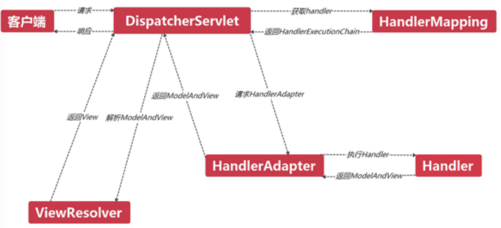

⑴ 用户发送请求至DispatcherServlet。

⑵ DispatcherServlet收到请求调用HandlerMapping查询具体的Handler。

⑶ HandlerMapping找到具体的处理器(具体配置的是哪个处理器的实现类)，生成处理器对象及处理器拦截器(HandlerExcutorChain包含了Handler以及拦截器集合)返回给DispatcherServlet。

⑷ DispatcherServlet接收到HandlerMapping返回的HandlerExcutorChain后，调用HandlerAdapter请求执行具体的Handler(Controller)。

⑸ HandlerAdapter经过适配调用具体的Handler(Controller即后端控制器)。

⑹ Controller执行完成返回ModelAndView(其中包含逻辑视图和数据)给HandlerAdaptor。

⑺ HandlerAdaptor再将ModelAndView返回给DispatcherServlet。

⑻ DispatcherServlet请求视图解析器ViewReslover解析ModelAndView。

⑼ ViewReslover解析后返回具体View(物理视图)到DispatcherServlet。

⑽ DispatcherServlet请求渲染视图(即将模型数据填充至视图中) 根据View进行渲染视图。

⑾ 将渲染后的视图返回给DispatcherServlet。

⑿ DispatcherServlet将响应结果返回给用户。


## Spring MVC 的核⼼组件

### DispatcherServlet

​	前置控制器，是整个流程控制的核⼼，控制其他组件的执⾏，进⾏统⼀调度，降低组件之间的耦合性，相当于总指挥。

### Handler

​	处理器，完成具体的业务逻辑，相当于 Servlet 或 Action。

### HandlerMapping

​	DispatcherServlet 接收到请求之后，通过 HandlerMapping 将不同的请求映射到不同的 Handler。

​	根据request找到相应的处理器Handler和Interceptors。

```java
public interface HandlerMapping {
    HandlerExecutionChain getHandler(HttpServletRequest var1) throws Exception;
```

​	HandlerMapping的顺序通过order属性定义，小的先使用，找到HandlerMapping后就返回

```java
protected HandlerExecutionChain getHandler(HttpServletRequest request) throws Exception {
  	//获取所有的handlerMapping
    Iterator var2 = this.handlerMappings.iterator();
    HandlerExecutionChain handler;
    do {
        if (!var2.hasNext()) {
            return null;
        }
        HandlerMapping hm = (HandlerMapping)var2.next();
        if (this.logger.isTraceEnabled()) {
            this.logger.trace("Testing handler map [" + hm + "] in DispatcherServlet with name '" + this.getServletName() + "'");
        }
      	//取到handler就退出
        handler = hm.getHandler(request);
    } while(handler == null);

    return handler;
}
```

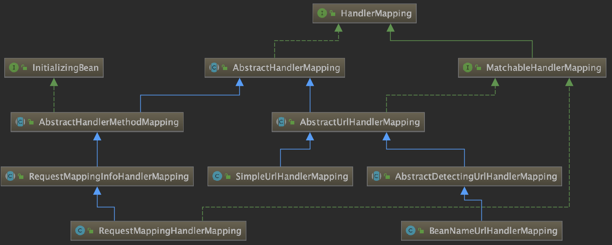

​	handlerMapping的整体结构在AbstractHandlerMapping中设置，就是根据request找到相应的处理器Handler和Interceptors，组合成HandlerExecutionChain类型并返回。找到Handler的过程通过模版方法getHandlerInternel留给子类实现，查找Interceptors是AbstractHandlerMapping自己完成的，具体方法是通过几个与Interceptor相关的Map完成的，在初始化过程中对那些Map进行初始化。

​	AbstractHandlerMapping子类分为两个系列：AbstractUrlHandlerMapping系列和AbstractHandlerMethodMapping系列，前者通过url匹配，后者匹配的内容比较多，如/hello/*/save直接匹配到Method，现在使用最多的一种方式。

### HandlerAdapter

​	处理器适配器，Handler 执⾏业务⽅法之前，需要进⾏⼀系列的操作，包括表单数据的验证、数据类型的转换、将表单数据封装到 JavaBean 等，这些操作都是由HandlerApater 来完成，开发者只需将注意⼒集中业务逻辑的处理上，DispatcherServlet 通过HandlerAdapter 执⾏不同的 Handler。

```java
public interface HandlerAdapter {
  	//判断是否可以使用某个Handler
    boolean supports(Object var1);
		// 使用handler做业务处理并返回ModelAndView
    ModelAndView handle(HttpServletRequest var1, HttpServletResponse var2, Object var3) throws Exception;
		// 获取资源的Last-Modified 资源最后一次修改的时间
    long getLastModified(HttpServletRequest var1, Object var2);
}
```

```java
public class SimpleControllerHandlerAdapter implements HandlerAdapter {
    public SimpleControllerHandlerAdapter() {
    }

    public boolean supports(Object handler) {
        return handler instanceof Controller;
    }
		// 直接使用Con t
    public ModelAndView handle(HttpServletRequest request, HttpServletResponse response, Object handler) throws Exception {
        return ((Controller)handler).handleRequest(request, response);
    }

    public long getLastModified(HttpServletRequest request, Object handler) {
        return handler instanceof LastModified ? ((LastModified)handler).getLastModified(request) : -1L;
    }
}
```

​	使用那个HandlerAdapter的过程在getHandlerAdapter方法中，遍历所有的Adapter，找到第一个处理Handler的Adapter返回。

```java
public class DispatcherServlet extends FrameworkServlet {
protected HandlerAdapter getHandlerAdapter(Object handler) throws ServletException {
    Iterator var2 = this.handlerAdapters.iterator();
    HandlerAdapter ha;
    do {
        ha = (HandlerAdapter)var2.next();
    } while(!ha.supports(handler));

    return ha;
}
```

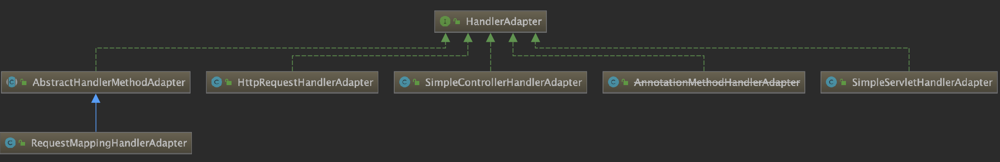

​	HandlerAdapter有四个实现类，除了RequestMappingHandlerAdapter其他的比较简单。

​	RequestMappingHandlerAdapter是整个Spring MVC组件中最复杂的，整个处理过程分为三步：

 1. 解析参数

    参数来源大题分为两类，一类从Model中来，一类中request中来，前者通过FlashMapManager和ModelFactory管理。具体解析过程不同类型的参数使用不同的HandlerMethodArgumentResolver进行解析，有的Resolver使用了WebDataBindFactory创建的WebDataBinder，可以通过@InitBinder向WebDataBinderFactory中注册WebDataBinder

 2. 执行请求

    用的HandlerMethod的子类ServletInvocableHandlerMethod（实际执行时InvocacbleHandlerMethod）

 3. 处理返回值

    使用HandlerMethodReturnValueHandler进行解析，不同类型返回值对应不同的HandlerMethodRetuenValueHandler

整个处理过程中ModelAndViewContainer起着参数传递的作用

### HandlerInterceptor

​	处理器拦截器，是⼀个接⼝，如果需要完成⼀些拦截处理，可以实现该接⼝。

### HandlerExecutionChain

​	处理器执⾏链，包括两部分内容：Handler 和HandlerInterceptor（系统会有⼀个默认的 HandlerInterceptor，如果需要额外设置拦截，可以添加拦截器）。

```java
public abstract class AbstractHandlerMapping extends WebApplicationObjectSupport implements HandlerMapping, Ordered {
public final HandlerExecutionChain getHandler(HttpServletRequest request) throws Exception {
    Object handler = this.getHandlerInternal(request);
    if (handler == null) {
        handler = this.getDefaultHandler();
    }
    if (handler == null) {
        return null;
    } else {
        if (handler instanceof String) {
            String handlerName = (String)handler;
            handler = this.getApplicationContext().getBean(handlerName);
        }
        HandlerExecutionChain executionChain = this.getHandlerExecutionChain(handler, request);
        if (CorsUtils.isCorsRequest(request)) {
            CorsConfiguration globalConfig = this.globalCorsConfigSource.getCorsConfiguration(request);
            CorsConfiguration handlerConfig = this.getCorsConfiguration(handler, request);
            CorsConfiguration config = globalConfig != null ? globalConfig.combine(handlerConfig) : handlerConfig;
            executionChain = this.getCorsHandlerExecutionChain(request, executionChain, config);
        }
        return executionChain;
    }
}
```

### HandlerExceptionResolver

​	根据异常设置ModelAndView，之后再交给render方法进行渲染。HandlerExceptionResolver只是用于解析对请求做处理的过程中产生的异常，而渲染环节产生的异常不归他管。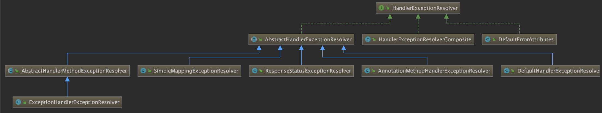

​	实现类中除了HandlerExceptionResolveComposite，每个类处理一种异常处理方式，具体工作主要是将异常行相关信息设置到Model中和给response设置相应属性两个方面。

​	mvc:annoation-driven 自动将ExceptionHandlerExceptionResolver、DefaultHandlerExceptionResolver和ResponseStatusExceptionResolver配置到SpringMVC中，SimpleMappingExceptionResolver使用需要自己配置，只需将异常类型和错误页面对应关系设置进去就可以，还可以通过设置父类将某种类型中注释的@ExceptionHandler方法处理异常，还可以使用@ControllerAdvice注释的类里有@ExceptionHandler注释的全局异常处理方法。

### ModelAndView

​	装载了模型数据和视图信息，作为 Handler 的处理结果，返回给DispatcherServlet。

### ViewResolver

​	用来将String类型的视图名和Locale解析为View类型的视图。视图解析器，DispatcheServlet 通过它将逻辑视图解析为物理视图，最终将渲染结果响应给客户端。

​	 需要找到渲染所用的模版和所用的技术(视图的类型)进行渲染，具体渲染过程交给不同的视图自己完成。原理是根据viewName从spring容器中查找Bean，类型为View，找不到返回null。

```java
context.getBean(viewName,View.class);
```

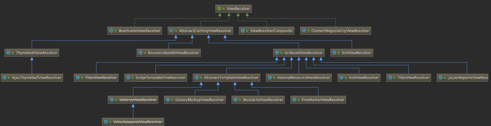

​	SpringMVC中ViewResolver的大部分实现类都继承自AbstractCachingViewResolver，它提供了对解析结果进行缓存的统一解决方案，它的子类中ResourceBundleViewResolver和XmlViewResolver分别通过properties和xml配置文件进行解析，UrlBasedViewResolver将viewName添加前后缀后作用url，它的子类只需要提供视图类型就可以。

​	BeanNameViewResolver通过在spring容器里使用viewName查找bean作为View

​	ContentNegotiatingViewReslover 使用内部封装的ViewResolver解析后再根据MediaType或后缀找出最优的视图

​	ViewResolverComposite直接遍历内部封装的ViewResolver进行解析。

解析视图核心工作就是查找模版文件和视图类型，至于处理器执行后view是String类型时候才进行查找，查找的主要参数只有viewName一个(Local只是辅助作用)。产生了三种解析思路：

 1. 使用viewName查找模版文件	—— UrlBasedViewResolver

 2. 使用viewName查找视图类型   —— BeanNameViewResolver

 3. 使用viewName同时查找模版文件和视图类型——ResourceBundleViewResolver和XmlViewResolver

    

### RequestToViewNameTranslator

​	ViewResolver是根据ViewName查找View，但有的Handler处理完后并没有设置View也没有设置viewName，这时就需要从request获取viewName了，这就是RequestToViewNameTranslator作用。

​	实现这个接口接可以根据request请求的路径去返回相应的viewName。只能在Spring MVC容器中配置一个。

```java
public interface RequestToViewNameTranslator {
    String getViewName(HttpServletRequest var1) throws Exception;
}
```

### LocaleResolver

​	解析视图需要两个参数：一个视图名，一个Locale。视图名是处理器返回或RequestToViewNameTranslator解析的默认视图名，Local是LoacleResolver从request解析出的。就是zh-cn之类，代表一个区域，可以对不同区域的用户显示不同的结果，这就是il8n国际化的基本原理。

​	两个方法分别表示：从request解析出Locale和将特定的Locale设置到某个request。

​	doService方法中，容器会将LoacleResolver设置到requet的attribute中

```java
public interface LocaleResolver {
    Locale resolveLocale(HttpServletRequest var1);
    void setLocale(HttpServletRequest var1, HttpServletResponse var2, Locale var3);
}
```

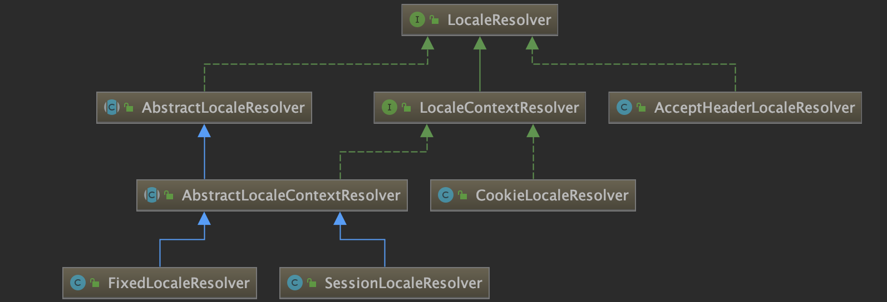

### ThemeResolver

​	解析主题用的。一套主题对应一个properties文件，名为theme.properties，在jsp中使用<spring:theme code="log.word">(先引入spring的标签库<%@ taglibprefix="spring" uri="www.springframework.org/tags"%>)，主题也可以进行国际化。


```java
public interface ThemeResolver {
    String resolveThemeName(HttpServletRequest var1);
    void setThemeName(HttpServletRequest var1, HttpServletResponse var2, String var3);
}
```

​	ThemeResolver从request解析出主题名；THemeSource根据主题名找到具体的主题；Theme是ThemeSource找出的具体的主题，通过它获取主题里的资源。

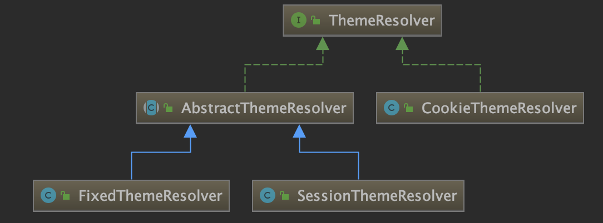

### MultipartResolver

​	MultipartResolver用于处理上传请求，将普通的request包装成MultipartHttpServletRequest，可以直接调用getFile方法获取到file，多个文件调用getFileMap得到FileName-File结构的Map。

```java
public interface MultipartResolver {
  	//根据是不是multipart/form-data类型判断
    boolean isMultipart(HttpServletRequest var1);
  	//将request包装成MultipartHttpServletRequest
    MultipartHttpServletRequest resolveMultipart(HttpServletRequest var1) throws MultipartException;
  	//清理上传过程的临时资源
    void cleanupMultipart(MultipartHttpServletRequest var1);
}
```

​	具体解析上传文件的过程使用Servlet的标准上传和Apache的commons-fileupload两种方式完成，对应的Request分别是StandardMultipartHttpServletRequest和DefaultMultipartHttpServletRequest类型。

### FlashMapManager

​	FlashMap主要用在redirect中传递参数，FlashMapManager用来管理FlashMap的

```java
public interface FlashMapManager {
  	//用于恢复参数，并将恢复过的和超时的参数从保存介质中删除
    FlashMap retrieveAndUpdate(HttpServletRequest var1, HttpServletResponse var2);
  	//将参数保存起来
    void saveOutputFlashMap(FlashMap var1, HttpServletRequest var2, HttpServletResponse var3);
}
```

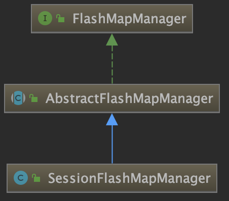

​	默认实现是SessionFlashMapManager，将参数保存到session中。

​	整个redirect的参数通过FlashMap传递的过程分三步：

		1. 在处理器中将需要传递的参数设置到outputFlashMap中(request.getAttribute(DispatcherServlet.OUTPUT_FLASH_MAP_ATTRIBUTE)拿到outputFlashMap 或 通过RedirectAttributes设置)。当处理器处理完请求，如果是redirect类型的返回值RequestMappingHandlerAdapter会将其设置到outputFlashMap中
  		2. 在RedirectView的renderMergedOutputModel方法中调用FlashMapManager的saveOutputFlashMap，将outputFlashMap中的参数设置到Session中。
                		3. 请求redirect后DispatcherServlet的doService会调用FlashMapManager的retrieveAndUpdate方法从Session中获取inputFlashMap并设置到Request的属性中备用。同时从Session中删除。

```java
FlashMap inputFlashMap = this.flashMapManager.retrieveAndUpdate(request, response);
if (inputFlashMap != null) {
    request.setAttribute(INPUT_FLASH_MAP_ATTRIBUTE, Collections.unmodifiableMap(inputFlashMap));
}
```

## Spring MVC 注解

### @RequestMapping 

​	注解将 URL 请求与业务⽅法进⾏映射，在Handler的类定义处以及⽅法定义处都可以添加@RequestMapping，在类定义处添加，相当于客户端多了⼀层访问路径。

### @Controller 

​	在类定义处添加，将该类交个 IoC 容器来管理（结合 springmvc.xml 的⾃动扫描配置使⽤），同时使其成为⼀个控制器，可以接收客户端请求。

​	@Controller 表示该控制器的每⼀个业务⽅法的返回值都会交给视图解析器进⾏解析，如果只需要将数据响应给客户端，⽽不需要进⾏视图解析，则需要在对应的业务⽅法定义处添加 @ResponseBody。

### @RestController 

​	表示该控制器会直接将业务⽅法的返回值响应给客户端，不进⾏视图解析。

### @RequestParam 

​	参数绑定，在形参列表中通过添加 @RequestParam 注解完成 HTTP 请求参数与业务⽅法形参的映射。

### @PathVariable("id")

​	完成请求参数与形参的映射 解析 RESTful ⻛格的 URL /rest/{name}/{id}

### @ResponseBody 

​	表示 Spring MVC 会直接将业务⽅法的返回值响应给客户端，如果不加@ResponseBody 注解，Spring MVC 会将业务⽅法的放回值传递给 DispatcherServlet，再由DisptacherServlet 调⽤ ViewResolver 对返回值进⾏解析，映射到⼀个 JSP 资源。

### @CookieValue(value = "JSESSIONID") 

​	CookieValue(value = "JSESSIONID") String sessionId	通过映射可以直接在业务⽅法中获取 Cookie 的值

## Spring MVC 数据绑定

数据绑定：在后端业务⽅法中直接获取客户端 HTTP 请求中的参数，将请求参数映射到业务⽅法的形参中，Spring MVC 中数据绑定的⼯作是由 HandlerAdapter 来完成的。

### 基本数据类型	

​	public String baseType(int id)

###包装类	

​	public String packageType(@RequestParam(value = "num",required =false,defaultValue = "0") Integer id)

​	包装类可以接收 null，当 HTTP 请求没有参数时，使⽤包装类定义形参的数据类型，程序不会抛出异常。

### 数组		

​	public String array(String[] name){

### List	

​	Spring MVC 不⽀持 List 类型的直接转换，需要对 List 集合进⾏包装

​	集合封装类 public String list(UserList userList) JSP users[0].id users[1].id

​	@Data public class UserList { private List<User> users; }

### Map 

​	⾃定义封装类 @Data public class UserMap {private Map<String,User> users; }

​	public String map(UserMap userMap) JSP users['a'].id users['b'].id

### JSON   

​	public User json(@RequestBody User user)

​	JSON 和 JavaBean 的转换需要借助于 fastjson

```xml
	<dependency> <groupId>com.alibaba</groupId> 
  <artifactId>fastjson</artifactId> <version>1.2.32</version></dependency>
```

```xml
<mvc:annotation-driven>
<!-- 消息转换器 -->
<mvc:message-converters register-defaults="true"> 
<bean class="org.springframework.http.converter.StringHttpMessageConverter"> 
<property name="supportedMediaTypes" value="text/html;charset=UTF-8"></property>
</bean>
<!-- 配置fastjson -->
<bean lass="com.alibaba.fastjson.support.spring.FastJsonHttpMessageConverter4">
</bean>
</mvc:message-converters>
</mvc:annotation-driven>
```
JSON 格式的数据绑定到业务⽅法的

​	客户端发⽣ JSON 格式的数据，直接通过 Spring MVC 绑定到业务⽅法的形参中。处理 Spring MVC ⽆法加载静态资源，在 web.xml 中添加配置即可。

```xml
<servlet-mapping> <servlet-name>default</servlet-name> <url-pattern>*.js</url-pattern></servlet-mapping>
```

```html
<script type="text/javascript"> $(function(){
	var user = {
	"id":1,
	"name":"张三"
	 };
	$.ajax({
	url:"/data/json",
	data:JSON.stringify(user),
	type:"POST",
	contentType:"application/json;charset=UTF-8",
	dataType:"JSON",
	success:function(data){
	alter(data.id+"---"+data.name);
	 }
	 })
	 });
</script>
```
###ResponseBody中文乱码

####处理 @ResponseBody 中⽂乱码，在 springmvc.xml 中配置消息转换器

```
<mvc:annotation-driven>
<!-- 消息转换器 -->
<mvc:message-converters register-defaults="true">
<bean class="org.springframework.http.converter.StringHttpMessageConverter"> 
<property name="supportedMediaTypes" value="text/html;charset=UTF-8"></property>
</bean>
</mvc:message-converters>
</mvc:annotation-driven>
```

####中⽂乱码问题，只需在 web.xml 添加 Spring MVC ⾃带的过滤器即可

```
 <filter>
 <filter-name>encodingFilter</filter-name>
 <filter-class>org.springframework.web.filter.CharacterEncodingFilter</filter-class>
 <init-param>
 	<param-name>encoding</param-name>
 	<param-value>UTF-8</param-value>
</init-param>
</filter>
<filter-mapping>
<filter-name>encodingFilter</filter-name>
<url-pattern>/*</url-pattern>
</filter-mapping>
```

## Spring MVC 模型数据解析

​	JSP 四⼤作⽤域对应的内置对象：pageContext、request、session、application。

​	模型数据的绑定是由 ViewResolver 来完成的，实际开发中，我们需要先添加模型数据，再交给ViewResolver 来绑定。

Spring MVC 提供了以下⼏种⽅式添加模型数据：

​	Map

​	Model

​	ModelAndView

​	@SessionAttribute

​	@ModelAttribute

将模式数据绑定到 request 对象。

### Map	

```
	${requestScope.user}
```

```
@RequestMapping("/map")

​	public String map(Map<String,User> map){

​	User user = new User();

​	user.setId(1L);

​	user.setName("张三");

​	map.put("user",user);

​	return "view"; }
```

### Model 

```
@RequestMapping("/model")

​	public String model(Model model){

​	User user = new User();

​	user.setId(1L);

​	user.setName("张三");

​	model.addAttribute("user",user);

​	return "view"; }
```

### ModelAndView

```
@RequestMapping("/modelAndView")

​	public ModelAndView modelAndView(){

​	User user = new User();

​	user.setId(1L);

​	user.setName("张三");

​	ModelAndView modelAndView = new ModelAndView();

​	modelAndView.addObject("user",user);

​	modelAndView.setViewName("view");

​	return modelAndView; }
```

### HttpServletRequest

```
	@RequestMapping("/request")

​	public String request(HttpServletRequest request){

​	User user = new User();

​	user.setId(1L);

​	user.setName("张三");

​	request.setAttribute("user",user);

​	return "view"; }
```

### @ModelAttribute	

​	定义⼀个⽅法，该⽅法专⻔⽤来返回要填充到模型数据中的对象。

```
@ModelAttribute
​	public User getUser(){
​	User user = new User();
​	user.setId(1L);
​	user.setName("张三");
​	return user; }
​	@ModelAttribute
​	public void getUser(Model model){
​	User user = new User();
​	user.setId(1L);
​	user.setName("张三");
​	model.addAttribute("user",user);
​	}
```

### session 

####1、原⽣的 Servlet API

```java
@RequestMapping("/session")
public String session(HttpServletRequest request){
HttpSession session = request.getSession();
User user = new User();
user.setId(1L);
user.setName("张三");
session.setAttribute("user",user);
return "view"; }
```

####2、@SessionAttribute

```java
@SessionAttributes(value = {"user","address"})
public class ViewHandler {}
@SessionAttributes(types = {User.class,Address.class})
public class ViewHandler {
}
```

​		对于 ViewHandler 中的所有业务⽅法，只要向 request 中添加了数据类型是 User 、Address 的对象时，Spring MVC 会⾃动将该数据添加到 session 中，保存 key 不变。

​		将模型数据绑定到 application 对象

```java
@RequestMapping("/application")
public String application(HttpServletRequest request){
ServletContext application = request.getServletContext();
User user = new User();
user.setId(1L);
user.setName("张三");
application.setAttribute("user",user)；
```


## Spring MVC 的转发和重定向

默认是以转发的形式响应 

```java
return "index" = return "forward:/index.jsp"
```

重定向	 

```java
	return "redirect:/index.jsp";
```

​		  RedirectAttributes.addFlashAttribute 方法会自动向 output flash map 中添加给定的参数，并将它传递给后续的请求。


## Spring MVC ⾃定义数据转换器

数据转换器是指将客户端 HTTP 请求中的参数转换为业务⽅法中定义的形参，⾃定义表示开发者可以⾃主设计转换的⽅式，HandlerApdter 已经提供了通⽤的转换，String 转 int，String 转 double，表单数据的封装等，但是在特殊的业务场景下，HandlerAdapter ⽆法进⾏转换，就需要开发者⾃定义转换器。

客户端输⼊ String 类型的数据 "2019-03-03"，⾃定义转换器将该数据转为 Date 类型的对象。

### 创建 DateConverter 转换器，实现 Conveter 接⼝

public class DateConverter implements Converter<String, Date> {

​	private String pattern;

​	public DateConverter(String pattern){

​		this.pattern = pattern;

​	 }

​	@Override

​	public Date convert(String s) {

​		SimpleDateFormat simpleDateFormat = new SimpleDateFormat(this.pattern);

​		Date date = null;

​		try {

​			date = simpleDateFormat.parse(s);

​		 } catch (ParseException e) {

​		e.printStackTrace();

​		 }

​		return date;

​		}

   }

springmvc.xml 配置转换器

​	<!-- 配置⾃定义转换器 -->

​	<bean id="conversionService"

​	class="org.springframework.context.support.ConversionServiceFactoryBean"> <property name="converters"> <list><bean class="com.southwind.converter.DateConverter"> <constructor-arg type="java.lang.String" value="yyyy-MM-dd">

​	</constructor-arg>

​	</bean>

​	</list>

​	</property>

​	</bean> 

​	<mvc:annotation-driven conversion-service="conversionService">

​		<!-- 消息转换器 -->

​		<mvc:message-converters register-defaults="true">

​		<bean class="org.springframework.http.converter.StringHttpMessageConverter"> 

​			<property name="supportedMediaTypes" value="text/html;charset=UTF-8"></property>

​		</bean>

​		<!-- 配置fastjson -->

​		<bean class="com.alibaba.fastjson.support.spring.FastJsonHttpMessageConverter4"></bean>

​		</mvc:message-converters>

​	</mvc:annotation-driven>

JSP

​	<form action="/converter/date" method="post">

​	请输⼊⽇期:<input type="text" name="date"/>(yyyy-MM-dd)<br/>

​	<input type="submit" value="提交"/>

​	</form>

Handler

​	@RequestMapping("/date")

​	public String date(Date date);

### String 转 Student

​	public class StudentConverter implements Converter<String, Student> {

​		@Override

​		public Student convert(String s) {

​		String[] args = s.split("-");

​		Student student = new Student();

​		student.setId(Long.parseLong(args[0]));

​		student.setName(args[1]);

​		student.setAge(Integer.parseInt(args[2]));

​		return student;

​		 }

​	}

springmvc.xml

​	<!-- 配置⾃定义转换器 -->

​	<bean id="conversionService"

​	class="org.springframework.context.support.ConversionServiceFactoryBean"> <property name="converters"> <list><bean class="com.southwind.converter.DateConverter"> <constructor-arg type="java.lang.String" value="yyyy-MM-dd">

​	</constructor-arg>

​	</bean> <bean class="com.southwind.converter.StudentConverter"></bean>

​	</list>

​	</property>

​	</bean> <mvc:annotation-driven conversion-service="conversionService">

​	<!-- 消息转换器 -->

​	<mvc:message-converters register-defaults="true"> <bean

​	class="org.springframework.http.converter.StringHttpMessageConverter"> <property name="supportedMediaTypes" value="text/html;charset=UTF-

​	8"></property>

​	</bean>

​	<!-- 配置fastjson -->

​	<bean

​	class="com.alibaba.fastjson.support.spring.FastJsonHttpMessageConverter4">

​	</bean>

​	</mvc:message-converters>

​	</mvc:annotation-driven>

JSP

​	<form action="/converter/student" method="post">

​	请输⼊学⽣信息：<input type="text" name="student"/>(id-name-age)<br/>

​	<input type="submit" value="提交"/>

​	</form>

Handler

​	@RequestMapping("/student")

​	public String student(Student student){

​	return student.toString();

​	}

##**Spring MVC REST**

REST：Representational State Transfer，资源表现层状态转换，是⽬前⽐较主流的⼀种互联⽹软件架构，它结构清晰、标准规范、易于理解、便于扩展。

​	**资源**（Resource）

⽹络上的⼀个实体，或者说⽹络中存在的⼀个具体信息，⼀段⽂本、⼀张图⽚、⼀⾸歌曲、⼀段视频等等，总之就是⼀个具体的存在。可以⽤⼀个 URI（统⼀资源定位符）指向它，每个资源都有对应的⼀个

特定的 URI，要获取该资源时，只需要访问对应的 URI 即可。

​	**表现层**（Representation）

资源具体呈现出来的形式，⽐如⽂本可以⽤ txt 格式表示，也可以⽤ HTML、XML、JSON等格式来表示。

​	**状态转换**（State Transfer）

客户端如果希望操作服务器中的某个资源，就需要通过某种⽅式让服务端发⽣状态转换，⽽这种转换是建⽴在表现层之上的，所有叫做"表现层状态转换"。

**特点**

​	URL 更加简洁。

​	有利于不同系统之间的资源共享，只需要遵守⼀定的规范，不需要进⾏其他配置即可实现资源共享。

### 如何使⽤

REST 具体操作就是 HTTP 协议中四个表示操作⽅式的动词分别对应 CRUD 基本操作。

GET ⽤来表示获取资源。	@GetMapping("/findAll") @GetMapping("/findById/{id}")

POST ⽤来表示新建资源。 @PostMapping("/save")

PUT ⽤来表示修改资源。    @PutMapping("/update")

DELETE ⽤来表示删除资源。 @DeleteMapping("/deleteById/{id}")


##**Spring MVC** ⽂件上传下载

### 单⽂件上传

​	底层是使⽤ Apache fifileupload 组件完成上传，Spring MVC 对这种⽅式进⾏了封装。

pom.xml

```xml
<dependency> 
<groupId>commons-io</groupId> 
<artifactId>commons-io</artifactId> 
<version>2.5</version>
</dependency> 
<dependency> 
<groupId>commons-fileupload</groupId> 
<artifactId>commons-fileupload</artifactId> 
<version>1.3.3</version>
</dependency>
```

JSP

```html
<form action="/file/upload" method="post" enctype="multipart/form-data"> 
<input type="file" name="img"/>
<input type="submit" value="上传"/>
</form> 

```

​	1、input 的 type 设置为 file。 

​	2、form 的 method 设置为 post（get 请求只能将⽂件名传给服务器）

​	3、from 的 enctype 设置为 multipart/form-data（如果不设置只能将⽂件名传给服务器）

Handler

```java
@PostMapping("/upload")
public String upload(MultipartFile img, HttpServletRequest request){
  if(img.getSize()>0){
    //获取保存上传⽂件的file路径
    String path = request.getServletContext().getRealPath("file");
    //获取上传的⽂件名
    String name = img.getOriginalFilename();
    File file = new File(path,name);
    try {
      img.transferTo(file);
      //保存上传之后的⽂件路径
      request.setAttribute("path","/file/"+name);
     } catch (IOException e) {
    e.printStackTrace();
     }
   }
	return "upload";
}
```

springmvc.xml

```xml
<!-- 配置上传组件 -->
<bean id="multipartResolver"
class="org.springframework.web.multipart.commons.CommonsMultipartResolver">
</bean>
```

web.xml 添加如下配置，否则客户端⽆法访问 png

```xml
<servlet-mapping> 
<servlet-name>default</servlet-name> 
<url-pattern>*.png</url-pattern>
</servlet-mapping>
```

### 多⽂件上传

pom.xml

```xml
<dependency> 
<groupId>jstl</groupId> 
<artifactId>jstl</artifactId> 
<version>1.2</version>
</dependency> 
<dependency> 
<groupId>taglibs</groupId> 
<artifactId>standard</artifactId> 
<version>1.1.2</version>
</dependency>
```

JSP

```html
<form action="/file/uploads" method="post" enctype="multipart/form-data">
 file1:<input type="file" name="imgs"/><br/>
 file2:<input type="file" name="imgs"/><br/>
 file3:<input type="file" name="imgs"><br/>
<input type="submit" value="上传"/>
</form> 
<c:forEach items="${files}" var="file" > 

</c:forEach>
```

Handler

```java
@PostMapping("/uploads")
public String uploads(MultipartFile[] imgs,HttpServletRequest request){
  List<String> files = new ArrayList<>();
    for (MultipartFile img:imgs){
      if(img.getSize()>0){//获取保存上传⽂件的file路径
        String path = request.getServletContext().getRealPath("file");
        //获取上传的⽂件名
        String name = img.getOriginalFilename();
        File file = new File(path,name);
        try {
        img.transferTo(file);
        //保存上传之后的⽂件路径
        files.add("/file/"+name);
         } catch (IOException e) {
        e.printStackTrace();
       }
     }
     }
  request.setAttribute("files",files);
  return "uploads"; 
}
```

### 下载

JSP

```html
<a href="/file/download/1">1.png</a> 
<a href="/file/download/2">2.png</a> 
<a href="/file/download/3">3.png</a>
```

Handler

```java
@GetMapping("/download/{name}")
public void download(@PathVariable("name") String name, HttpServletRequest
request, HttpServletResponse response){
  if(name != null){
    name += ".png";
    String path = request.getServletContext().getRealPath("file");
    File file = new File(path,name);
    OutputStream outputStream = null;
    if(file.exists()){
      response.setContentType("application/forc-download");
      response.setHeader("Content-Disposition","attachment;filename="+name);
    try {
      outputStream = response.getOutputStream();
      outputStream.write(FileUtils.readFileToByteArray(file));
      outputStream.flush();
     } catch (IOException e) {
    	e.printStackTrace();
     } finally {
      if(outputStream != null){
      try {
      outputStream.close();
       } catch (IOException e) {
      e.printStackTrace();
       }
   }
   }
   }
 }
}
```

## **Spring MVC** 表单标签库

Handler

```java
@GetMapping("/get")
public ModelAndView get(){
ModelAndView modelAndView = new ModelAndView("tag");
Student student = new Student(1L,"张三",22);
modelAndView.addObject("student",student);
return modelAndView; }
```

JSP

```html
<%@ page contentType="text/html;charset=UTF-8" language="java" %>
<%@ page isELIgnored="false" %>
<%@ taglib prefix="form" uri="http://www.springframework.org/tags/form" %>
  
<form:form modelAttribute="student">
学⽣ID：<form:input path="id"/><br/>
学⽣姓名：<form:input path="name"/><br/>
学⽣年龄：<form:input path="age"/><br/>
<input type="submit" value="提交"/>
</form:form>
```

1、JSP ⻚⾯导⼊ Spring MVC 表单标签库，与导⼊ JSTL 标签库的语法⾮常相似，前缀 prefifix 可以⾃定义，通常定义为 from。

```
<%@ taglib prefix="form" uri="http://www.springframework.org/tags/form" %>
```

2、将 form 表单与模型数据进⾏绑定，通过 modelAttribute 属性完成绑定，将 modelAttribute 的值设置为模型数据对应的 key 值。

```
Handeler:modelAndView.addObject("student",student);
JSP:<form:form modelAttribute="student"> 
```

3、form 表单完成绑定之后，将模型数据的值取出绑定到不同的标签中，通过设置标签的 path 属性完成，将 path 属性的值设置为模型数据对应的属性名即可。

```
学⽣ID：<form:input path="id"/><br/>
学⽣姓名：<form:input path="name"/><br/>
学⽣年龄：<form:input path="age"/><br/>
```

常⽤的表单标签

### from

```
<form:from modelAttribute="student"/>
```

​	渲染的是 HTML 中的 <form></from> ，通过 modelAttribute 属性绑定具体的模型数据。

### input

```
<form:input path="name"/>
```

​	渲染的是 HTML 中的 <input type="text"/> ，from 标签绑定的是模型数据，input 标签绑定的是模型数据中的属性值，通过 path 属性可以与模型数据中的属性名对应，并且⽀持及联操作。

```
<from:input path="address.name"/>
```

### password

```
<form:password path="password"/>
```

​	渲染的是 HTML 中的 <input type="password"/> ，通过 path 属性与模型数据的属性值进⾏绑定,password 标签的值不会在⻚⾯显示。

### checkbox

```
<form:checkbox path="hobby" value="读书"/>
```

```
student.setFlag(false);
```

```
checkbox：<form:checkbox path="flag" value="flag"></form:checkbox><br/>
```

​	渲染的是 HTML 中的 <input type="checkbox"/> ，通过 path 与模型数据的属性值进⾏绑定，可以

绑定 boolean、数组和集合。

​	如果绑定 boolean 值，若该变量的值为 true，则表示该复选框选中，否则表示不选中。

​	如果绑定数组或者集合，数组/集合中的元素等于 checkbox 的 value 值，则选中。

```
student.setHobby(Arrays.asList("读书","看电影","玩游戏"));
modelAndView.addObject("student",student);
```

```
爱好：<form:checkbox path="hobby" value="摄影"></form:checkbox>摄影<br/>
<form:checkbox path="hobby" value="读书"></form:checkbox>读书<br/>
<form:checkbox path="hobby" value="听⾳乐"></form:checkbox>听⾳乐<br/>
<form:checkbox path="hobby" value="看电影"></form:checkbox>看电影<br/>
<form:checkbox path="hobby" value="旅游"></form:checkbox>旅游<br/>
<form:checkbox path="hobby" value="玩游戏"></form:checkbox>玩游戏<br/>
<input type="submit" value="提交"/>
```

### checkboxes

```
<form:checkboxes items=${student.hobby} path="selecHobby"/>
```

​	渲染的是 HTML 中的⼀组 <input type="checkbox"/> ，是对 <form:checkbox/> 的⼀种简化，需要结合 items 和 path 属性来使⽤，items 绑定被遍历的集合或数组，path 绑定被选中的集合或数组，可以这样理解，items 为全部可选集合，path 为默认的选中集合。

```
student.setHobby(Arrays.asList("摄影","读书","听⾳乐","看电影","旅游","玩游戏"));
student.setSelectHobby(Arrays.asList("摄影","读书","听⾳乐"));
modelAndView.addObject("student",student);
```

```
爱好：<form:checkboxes path="selectHobby" items="${student.hobby}"/><br/>
```

​	需要注意的是 path 可以直接绑定模型数据的属性值，items 则需要通过 EL 表达式的形式从域对象中获取数据，不能直接写属性名。

### rabiobutton

```
<from:radiobutton path="radioId" value="0"/>
```

​	渲染的是 HTML 中的⼀个 <input type="radio"/> ，绑定的数据与标签的 value 值相等则为选中，否则不选中。

```
student.setRadioId(1);
modelAndView.addObject("student",student);
```

```
radiobutton:<form:radiobutton path="radioId" value="1"/>radiobutton<br/>
```

### radiobuttons

```
<form:radiobuttons itmes="${student.grade}" path="selectGrade"/>
```

​	渲染的是 HTML 中的⼀组 <input type="radio"/> ，这⾥需要结合 items 和 path 两个属性来使⽤，items 绑定被遍历的集合或数组，path 绑定被选中的值，items 为全部的可选类型，path 为默认选中的选项，⽤法与 <form:checkboxes/> ⼀致。

```
Map<Integer,String> gradeMap = new HashMap<>();
gradeMap.put(1,"⼀年级");
gradeMap.put(2,"⼆年级");
gradeMap.put(3,"三年级");
student.setGradeMap(gradeMap);
student.setSelectGrade(3);
modelAndView.addObject("student",student);
```

```
学⽣年级：<form:radiobuttons items="${student.gradeMap}" path="selectGrade"/><br/>
```

### select

```
<form:select items="${student.citys}" path="selectCity"/>
```

渲染的是 HTML 中的⼀个 <select/> 标签，需要结合 items 和 path 两个属性来使⽤，items 绑定被

遍历的集合或数组，path 绑定被选中的值，⽤法与 <from:radiobuttons/> ⼀致。

```
Map<Integer,String> cityMap = new HashMap<>();
cityMap.put(1,"北京");
cityMap.put(2,"上海");
cityMap.put(3,"⼴州");
cityMap.put(4,"深圳");
student.setCityMap(cityMap);
student.setSelectCity(3);
modelAndView.addObject("student",student);
```

```
所在城市：<form:select items="${student.cityMap}" path="selectCity"></form:select><br/>
```

### options

​	form:select 结合 form:options 的使⽤， from:select 只定义 path 属性，在 form:select 标签内部添加⼀个⼦标签 form:options ，设置 items 属性，获取被遍历的集合。

```
所在城市：<form:select path="selectCity"> 
<form:options items="${student.cityMap}"></form:options>
</form:select><br/>
```

### option

​	form:select 结合 form:option 的使⽤， from:select 定义 path 属性，给每⼀个

​	form:option 设置 value 值，path 的值与哪个 value 值相等，该项默认选中。

```
所在城市：<form:select path="selectCity"> 
<form:option value="1">杭州</form:option> 
<form:option value="2">成都</form:option> 
<form:option value="3">⻄安</form:option>
</form:select><br/>
```

### textarea

​	渲染的是 HTML 中的⼀个 <textarea/> ，path 绑定模型数据的属性值，作为⽂本输⼊域的默认值。

```
student.setIntroduce("你好，我是...");
modelAndView.addObject("student",student);
```

```
信息：<form:textarea path="introduce"/><br/>
```

### errors

处理错误信息，⼀般⽤在数据校验，该标签需要结合 Spring MVC 的验证器结合起来使⽤。

## Spring MVC 数据校验

​	Spring MVC 提供了两种数据校验的⽅式：1、基于 Validator 接⼝。2、使⽤ Annotation JSR - 303 标准进⾏校验。

​	基于 Validator 接⼝的⽅式需要⾃定义 Validator 验证器，每⼀条数据的验证规则需要开发者⼿动完成，使⽤ Annotation JSR - 303 标准则不需要⾃定义验证器，通过注解的⽅式可以直接在实体类中添加每个属性的验证规则，这种⽅式更加⽅便，实际开发中推荐使⽤。

### 基于 Validator 接⼝

实体类 Account

```java
@Data
public class Account {
private String name;
private String password; 
}
```

⾃定义验证器 AccountValidator，实现 Validator 接⼝。

```java
public class AccountValidator implements Validator {
@Override
public boolean supports(Class<?> aClass) {
return Account.class.equals(aClass);
 }
@Override
public void validate(Object o, Errors errors) {
ValidationUtils.rejectIfEmpty(errors,"name",null,"姓名不能为空");
ValidationUtils.rejectIfEmpty(errors,"password",null,"密码不能为空");
 }
}
```

控制器

```java
@Controller
@RequestMapping("/validator")
public class ValidatorHandler {
@GetMapping("/login")
public String login(Model model){
model.addAttribute("account",new Account());
return "login";
 }
@PostMapping("/login")
public String login(@Validated Account account, BindingResult
bindingResult){
if(bindingResult.hasErrors()){
return "login";
 }
return "index";
 }
}
```

springmvc.xml 配置验证器。

```xml
<bean id="accountValidator" class="com.southwind.validator.AccountValidator">
</bean> 
<mvc:annotation-driven validator="accountValidator"></mvc:annotation-driven>
```

JSP

```html
<%@ page contentType="text/html;charset=UTF-8" language="java" %>
<%@ page isELIgnored="false" %>
<%@ taglib prefix="form" uri="http://www.springframework.org/tags/form" %>
<%@ taglib prefix="from" uri="http://www.springframework.org/tags/form" %>
<html> <head><title>Title</title>
</head> <body><form:form modelAttribute="account" action="/validator/login"
method="post">
姓名：<form:input path="name"/><from:errors path="name"></from:errors> <br/>
密码：<form:input path="password"/><from:errors path="password">
</from:errors><br/>
<input type="submit" value="登录"/>
</form:form>
</body>
</html>
```


### Annotation JSR - 303 标准

​	使⽤ Annotation JSR - 303 标准进⾏验证，需要导⼊⽀持这种标准的依赖 jar ⽂件，这⾥我们使⽤Hibernate Validator。

pom.xml

```xml
<!-- JSR-303 -->
<dependency> <groupId>org.hibernate</groupId> <artifactId>hibernate-validator</artifactId> <version>5.3.6.Final</version>
</dependency> <dependency> <groupId>javax.validation</groupId> <artifactId>validation-api</artifactId> <version>2.0.1.Final</version>
</dependency> <dependency> <groupId>org.jboss.logging</groupId> <artifactId>jboss-logging</artifactId> <version>3.3.2.Final</version>
</dependency>
```

通过注解的⽅式直接在实体类中添加相关的验证规则。

```java
@Data
public class Person {
@NotEmpty(message = "⽤户名不能为空")
private String username;
@Size(min = 6,max = 12,message = "密码6-12位")
private String password;
@Email(regexp = "^[a-zA-Z0-9_.-]+@[a-zA-Z0-9-]+(\\\\.[a-zA-Z0-9-]+)*\\\\.
[a-zA-Z0-9]{2,6}$",message = "请输⼊正确的邮箱格式")
private String email;
@Pattern(regexp = "^((13[0-9])|(14[5|7])|(15([0-3]|[5-9]))|(18[0,5-
9]))\\\\\\\\d{8}$",message = "请输⼊正确的电话")
private String phone; 
}
```

ValidatorHandler

```java
@GetMapping("/register")
public String register(Model model){
model.addAttribute("person",new Person());
return "register"; 
}

@PostMapping("/register")
public String register(@Valid Person person, BindingResult bindingResult){
if(bindingResult.hasErrors()){
return "register";
 }
return "index"; 
}
```

springmvc.xml

```
<mvc:annotation-driven />
```

JSP

```html
<%@ page contentType="text/html;charset=UTF-8" language="java" %>
<%@ page isELIgnored="false" %>
<%@ taglib prefix="form" uri="http://www.springframework.org/tags/form" %>
<html> <head><title>Title</title>
</head> <body><form:form modelAttribute="person" action="/validator/register2"
method="post">
⽤户名：<form:input path="username"></form:input><form:errors
path="username"/><br/>
密码：<form:password path="password"></form:password><form:errors
path="password"/><br/>
邮箱：<form:input path="email"></form:input><form:errors path="email"/>
<br/>
电话：<form:input path="phone"></form:input><form:errors path="phone"/>
<br/>
<input type="submit" value="提交"/>
</form:form>
</body>
</html>
```

校验规则详解：

@Null 被注解的元素必须为null

@NotNull 被注解的元素不能为null

@Min(value) 被注解的元素必须是⼀个数字，其值必须⼤于等于指定的最⼩值

@Max(value) 被注解的元素必须是⼀个数字，其值必须⼩于于等于指定的最⼤值

@Email 被注解的元素必须是电⼦邮箱地址

@Pattern 被注解的元素必须符合对应的正则表达式

@Length 被注解的元素的⼤⼩必须在指定的范围内

@NotEmpty 被注解的字符串的值必须⾮空

Null 和 Empty 是不同的结果，String str = null，str 是 null，String str = ""，str 不是 null，其值为

空。

## SpringBoot 搭建Spring Web应用

###  @SpringBootApplication注解

它实际上组合了 3 个其他的注解，也就是@Configuration、@EnableAutoConfiguration 和@ComponentScan：

@Configuration	## 表明我们的这个类将会处理 Spring 的常规配置，如 bean 的声明

@ComponentScan  ## 告诉 Spring 去哪里查找 Spring 组件（服务、控制器等）。在默认情况下，这个注解将会扫描当前包以及该包下面的所有子包。

@EnableAutoConfiguration ## 开启Spring Boot 的自动配置

```java
@Target({ElementType.TYPE})
@Retention(RetentionPolicy.RUNTIME)
@Documented
@Inherited
@SpringBootConfiguration
@EnableAutoConfiguration
@ComponentScan(
    excludeFilters = {@Filter(
    type = FilterType.CUSTOM,
    classes = {TypeExcludeFilter.class}
), @Filter(
    type = FilterType.CUSTOM,
    classes = {AutoConfigurationExcludeFilter.class}
)}
)
public @interface SpringBootApplication {
/** 
* Exclude specific auto-configuration classes such that they will
never be applied. 
*/ 
Class<?>[] exclude() default {}; 
}
```

```java
@Controller
public class HelloController { 

 @RequestMapping("/") 
 @ResponseBody 
 public String hello() { 
		return "Hello, world!"; 
 }
}
```

将控制器放到 controller 子包中，这样它就能够被@ComponentScan 注解所发现

打开浏览器并访问 http://localhost:8080 的话，就能看到我们钟爱的“Hello, world!”被输出了出来

### 幕后的Spring Boot

之前的Spring MVC应用需要编写相关的XML和Java注解配置类

1．初始化 Spring MVC 的 DispatcherServlet； 

2．搭建转码过滤器，保证客户端请求进行正确地转码；

3．搭建视图解析器（view resolver），告诉 Spring 去哪里查找视图，以及它们是使用哪种方言编写的（JSP、Thymeleaf 模板等）；

4．配置静态资源的位置（CSS、JS）；

5．配置所支持的地域以及资源 bundle； 

6．配置 multipart 解析器，保证文件上传能够正常工作；

7．将 Tomcat 或 Jetty 包含进来，从而能够在 Web 服务器上运行我们的应用；

8．建立错误页面（如 404）。

Spring Boot 为我们处理了所有的事情。Spring Boot 是带有一定倾向性的 Spring 项目配置器。它基于约定，并且默认会在你的项目中使用这些约定。

#### 1.2.1 DispatcherServlet分发器和 multipart 配置

在Spring Boot的application.properties中添加debug = true 就可以在启动时看到Spring Boot的自动配置报告。

分为两部分：positive matches 列出了应用中所有的自动配置，negative matches 没有满足的Spring Boot自动配置

##### DispatcherServletAutoConfiguration 配置了dispatcherServlet和multipart

​	@AutoConfigureOrder(-2147483648）声明优先级

​	@ConditionalOnWebApplication  运行在web应用里

​	@ConditionalOnClass({DispatcherServlet.class}) 确保类路径下包含DispatcherServlet

​	@Bean(name = {"dispatcherServlet"})  public DispatcherServlet dispatcherServlet()

​    @Bean 

​	@ConditionalOnBean({MultipartResolver.class}) 

​	@ConditionalOnMissingBean(name = {"multipartResolver"}) 只有满足有MultipartResolver.class没有multipartResolver bean时才会激活该方法 MultipartResolver multipartResolver(MultipartResolver resolver)

```java
@AutoConfigureOrder(-2147483648)
@Configuration
@ConditionalOnWebApplication
@ConditionalOnClass({DispatcherServlet.class})
@AutoConfigureAfter({EmbeddedServletContainerAutoConfiguration.class})
public class DispatcherServletAutoConfiguration {
    public static final String DEFAULT_DISPATCHER_SERVLET_BEAN_NAME ="dispatcherServlet";
    public static final String DEFAULT_DISPATCHER_SERVLET_REGISTRATION_BEAN_NAME = "dispatcherServletRegistration";
  
  
@Configuration  @Conditional({DispatcherServletAutoConfiguration.DefaultDispatcherServletCondition.class})
    @ConditionalOnClass({ServletRegistration.class})
    @EnableConfigurationProperties({WebMvcProperties.class})
    protected static class DispatcherServletConfiguration {
        private final WebMvcProperties webMvcProperties;

        public DispatcherServletConfiguration(WebMvcProperties webMvcProperties) {
            this.webMvcProperties = webMvcProperties;
        }

        @Bean(name = {"dispatcherServlet"})
        public DispatcherServlet dispatcherServlet() {
            DispatcherServlet dispatcherServlet = new DispatcherServlet();
            dispatcherServlet.setDispatchOptionsRequest(this.webMvcProperties.isDispatchOptionsRequest());
            dispatcherServlet.setDispatchTraceRequest(this.webMvcProperties.isDispatchTraceRequest());
            dispatcherServlet.setThrowExceptionIfNoHandlerFound(this.webMvcProperties.isThrowExceptionIfNoHandlerFound());
            return dispatcherServlet;
        }

        @Bean
        @ConditionalOnBean({MultipartResolver.class})
        @ConditionalOnMissingBean(
            name = {"multipartResolver"}
        )
        public MultipartResolver multipartResolver(MultipartResolver resolver) {
            return resolver;
        }
    }
  
```

#### 1.2.2 试图解析器、静态资源及区域配置

##### WebMvcAutoConfiguration 声明了视图解析器、地域解析器（localeresolver）及静态资源的位置

```java
@Configuration
@Import({WebMvcAutoConfiguration.EnableWebMvcConfiguration.class})
@EnableConfigurationProperties({WebMvcProperties.class, ResourceProperties.class})
public static class WebMvcAutoConfigurationAdapter extends WebMvcConfigurerAdapter {
    private static final Log logger = LogFactory.getLog(WebMvcConfigurerAdapter.class);
    private final ResourceProperties resourceProperties;
    private final WebMvcProperties mvcProperties;
    private final ListableBeanFactory beanFactory;
    private final HttpMessageConverters messageConverters;
    final WebMvcAutoConfiguration.ResourceHandlerRegistrationCustomizer resourceHandlerRegistrationCustomizer;
  @Bean
  @ConditionalOnMissingBean
  public InternalResourceViewResolver defaultViewResolver() {
    InternalResourceViewResolver resolver = new InternalResourceViewResolver();
    resolver.setPrefix(this.mvcProperties.getView().getPrefix());
    resolver.setSuffix(this.mvcProperties.getView().getSuffix());
    return resolver;
  }
```

###### 视图解析器的配置

view类的prefix字段 匹配**application.properties**中的	**spring.mvc.view.prefix**

view类的suffix字段 匹配**application.properties**中的	**spring.mvc.view.suffix**

```java
@ConfigurationProperties(
    prefix = "spring.mvc"
)
public class WebMvcProperties {
    private Format messageCodesResolverFormat;
    private Locale locale;
    private WebMvcProperties.LocaleResolver localeResolver;
    private String dateFormat;
    private boolean dispatchTraceRequest;
    private boolean dispatchOptionsRequest;
    private boolean ignoreDefaultModelOnRedirect;
    private boolean throwExceptionIfNoHandlerFound;
    private boolean logResolvedException;
    private Map<String, MediaType> mediaTypes;
    private String staticPathPattern;
    private final WebMvcProperties.Async async;
    private final WebMvcProperties.Servlet servlet;
    private final WebMvcProperties.View view;
  public static class View {
      private String prefix;
      private String suffix;
  }
}
```

###### 静态资源

对带有“webjar”前缀的资源访问将会在类路径中解析。这样的话，我们就能使用 Mavan 中央仓库中预先打包好的 JavaScript 依赖；

> ​	WebJars 是 JAR 包格式的客户端 JavaScript 库，可以通过 Maven中央仓库来获取。它们包含了Maven项目文件，这个文件允许定义传递性依赖，能够用于所有基于 JVM的应用之中。WebJars 是 JavaScript 包管理器的替代方案，如 bower 或 npm。对于只需要较少 JavaScript 库的应用来说，这种方案是很棒的。你可以在 www.webjars.org 站点上看到所有可用的 WebJars 列表。

我们的静态资源需要放在类路径中，并且要位于以下 4 个目录中的任意一个之中，

```java
@ConfigurationProperties(
    prefix = "spring.resources",
    ignoreUnknownFields = false
)
public class ResourceProperties implements ResourceLoaderAware {
    private static final String[] SERVLET_RESOURCE_LOCATIONS = new String[]{"/"};
    private static final String[] CLASSPATH_RESOURCE_LOCATIONS = new String[]{"classpath:/META-INF/resources/", "classpath:/resources/", "classpath:/static/", "classpath:/public/"};
    private static final String[] RESOURCE_LOCATIONS;
    private String[] staticLocations;
    private Integer cachePeriod;
    private boolean addMappings;
    private final ResourceProperties.Chain chain;
    private ResourceLoader resourceLoader;
 
   public void addResourceHandlers(ResourceHandlerRegistry registry) {
            if (!this.resourceProperties.isAddMappings()) {
                logger.debug("Default resource handling disabled");
            } else {
                Integer cachePeriod = this.resourceProperties.getCachePeriod();
                if (!registry.hasMappingForPattern("/webjars/**")) {
                    this.customizeResourceHandlerRegistration(registry.addResourceHandler(new String[]{"/webjars/**"}).addResourceLocations(new String[]{"classpath:/META-INF/resources/webjars/"}).setCachePeriod(cachePeriod));
                }

                String staticPathPattern = this.mvcProperties.getStaticPathPattern();
                if (!registry.hasMappingForPattern(staticPathPattern)) {
                    this.customizeResourceHandlerRegistration(registry.addResourceHandler(new String[]{staticPathPattern}).addResourceLocations(this.resourceProperties.getStaticLocations()).setCachePeriod(cachePeriod));
                }

            }
        }
```

###### 地域管理

默认的地域解析器只会处理一个地域，并且允许我们通过spring.mvc.locale配置属性进行定义

```java
@Bean
@ConditionalOnMissingBean
@ConditionalOnProperty(
    prefix = "spring.mvc",
    name = {"locale"}
)
public LocaleResolver localeResolver() {
    if (this.mvcProperties.getLocaleResolver() == org.springframework.boot.autoconfigure.web.WebMvcProperties.LocaleResolver.FIXED) {
        return new FixedLocaleResolver(this.mvcProperties.getLocale());
    } else {
        AcceptHeaderLocaleResolver localeResolver = new AcceptHeaderLocaleResolver();
        localeResolver.setDefaultLocale(this.mvcProperties.getLocale());
        return localeResolver;
    }
}
```

### 错误与转码配置

在没有添加控制器的时候，会看到“Whitelabel Error Page”输出。 Spring Boot 的事情**ErrorMvcAutoConfiguration **处理这些事情

```java
@Configuration
@ConditionalOnWebApplication
@ConditionalOnClass({Servlet.class, DispatcherServlet.class})
@AutoConfigureBefore({WebMvcAutoConfiguration.class})
@EnableConfigurationProperties({ResourceProperties.class})
public class ErrorMvcAutoConfiguration {
    private final ServerProperties serverProperties;
    private final List<ErrorViewResolver> errorViewResolvers;
    
    @Configuration
    @ConditionalOnProperty(prefix = "server.error.whitelabel",name = {"enabled"}, matchIfMissing = true)
    @Conditional({ErrorMvcAutoConfiguration.ErrorTemplateMissingCondition.class})
    protected static class WhitelabelErrorViewConfiguration {
        private final ErrorMvcAutoConfiguration.SpelView defaultErrorView = new ErrorMvcAutoConfiguration.SpelView("<html><body><h1>Whitelabel Error Page</h1><p>This application has no explicit mapping for /error, so you are seeing this as a fallback.</p><div id='created'>${timestamp}</div><div>There was an unexpected error (type=${error}, status=${status}).</div><div>${message}</div></body></html>");
        protected WhitelabelErrorViewConfiguration() {}
        @Bean(name = {"error"})
        @ConditionalOnMissingBean(name = {"error"})
        public View defaultErrorView() {return this.defaultErrorView; }
```

error错误页面配置路径

```java
@ConfigurationProperties(
    prefix = "server",
    ignoreUnknownFields = true
)
public class ServerProperties implements EmbeddedServletContainerCustomizer, EnvironmentAware, Ordered {
    private Integer port;
    private InetAddress address;
    private String contextPath;
    private String displayName = "application";
    @NestedConfigurationProperty
    private ErrorProperties error = new ErrorProperties();
    private String servletPath = "/";
    private final Map<String, String> contextParameters = new HashMap();
    private Boolean useForwardHeaders;
    private String serverHeader;
    private int maxHttpHeaderSize = 0;
    private int maxHttpPostSize = 0;
    private Integer connectionTimeout;
    private ServerProperties.Session session = new ServerProperties.Session();
    @NestedConfigurationProperty
    private Ssl ssl;
    @NestedConfigurationProperty
    private Compression compression = new Compression();
    @NestedConfigurationProperty
    private JspServlet jspServlet;
    private final ServerProperties.Tomcat tomcat = new ServerProperties.Tomcat();
    private final ServerProperties.Jetty jetty = new ServerProperties.Jetty();
    private final ServerProperties.Undertow undertow = new ServerProperties.Undertow();
    private Environment environment;
```

```java
public class ErrorProperties {
    @Value("${error.path:/error}")
    private String path = "/error";
    private ErrorProperties.IncludeStacktrace includeStacktrace;
    public static enum IncludeStacktrace {
          NEVER,
          ALWAYS,
          ON_TRACE_PARAM;
          private IncludeStacktrace() {
          }
      }
```

这段配置都做了些什么呢？

- 定义了一个 bean，即 DefaultErrorAttributes，它通过特定的属性暴露了有用的错误信息，这些属性包括状态、错误码和相关的栈跟踪信息。
- 定义了一个 BasicErrorController bean，这是一个 MVC 控制器，负责展现我们所看到的错误页面。
- 允许我们将 Spring Boot 的 whitelabel 错误页面设置为无效，这需要将配置文件application.properties 中的 server.error.whitelabel.enabled 设置为 false。
- 我们还可以借助模板引擎提供自己的错误页面。例如，它的名字是 error.html，ErrorTemplateMissingCondition 条件会对此进行检查。

转码配置

**HttpEncodingAutoConfiguration** 会负责处理相关的事宜，这是通过提供 Spring 的 CharacterEncodingFilter 类来实现的。通过 spring.http.encoding.charset配置，我们可以覆盖默认的编码（“UTF-8”），也可以通过 spring.http.encoding.enabled 禁用这项配置。

```java
@Configuration
@EnableConfigurationProperties({HttpEncodingProperties.class})
@ConditionalOnWebApplication
@ConditionalOnClass({CharacterEncodingFilter.class})
@ConditionalOnProperty(
    prefix = "spring.http.encoding",
    value = {"enabled"},
    matchIfMissing = true
)
public class HttpEncodingAutoConfiguration {
    private final HttpEncodingProperties properties;
    @Bean
    @ConditionalOnMissingBean({CharacterEncodingFilter.class})
    public CharacterEncodingFilter characterEncodingFilter() {
        CharacterEncodingFilter filter = new OrderedCharacterEncodingFilter();
        filter.setEncoding(this.properties.getCharset().name());
        filter.setForceRequestEncoding(this.properties.shouldForce(Type.REQUEST));
        filter.setForceResponseEncoding(this.properties.shouldForce(Type.RESPONSE));
        return filter;
    }
```

```java
@ConfigurationProperties(
    prefix = "spring.http.encoding"
)
public class HttpEncodingProperties {
    public static final Charset DEFAULT_CHARSET = Charset.forName("UTF-8");
    private Charset charset;
    private Boolean force;
    private Boolean forceRequest;
    private Boolean forceResponse;
    private Map<Locale, Charset> mapping;
    public HttpEncodingAutoConfiguration(HttpEncodingProperties properties) {
        this.properties = properties;
    }
```

###  嵌入式Servlet容器Tomcat的配置

默认情况下，Spring Boot 在打包和运行应用时，会使用 Tomcat 嵌入式 API（Tomcat embedded API）。

我们来看一下 EmbeddedServletContainerAutoConfiguration,包含了 3 个不同的配置，哪一个会处于激活状态

要取决于类路径下哪些内容是可用的。

> 可以将 Spring Boot 与 Tomcat、tc-server、Jetty 或者 Undertow 结合使用。服务器可以很容易地进行替换，只需将 spring-boot-starter-tomcat JAR 依赖移除掉，并将其替换为 Jetty或 Undertow 对应的依赖即可。

```java
@AutoConfigureOrder(-2147483648)
@Configuration
@ConditionalOnWebApplication
@Import({EmbeddedServletContainerAutoConfiguration.BeanPostProcessorsRegistrar.class})
public class EmbeddedServletContainerAutoConfiguration {
    public EmbeddedServletContainerAutoConfiguration() {}
 @Configuration
    @ConditionalOnClass({Servlet.class, Undertow.class, SslClientAuthMode.class})
    @ConditionalOnMissingBean(
        value = {EmbeddedServletContainerFactory.class},
        search = SearchStrategy.CURRENT
    )
    public static class EmbeddedUndertow {
        public EmbeddedUndertow() {
        }

        @Bean
        public UndertowEmbeddedServletContainerFactory undertowEmbeddedServletContainerFactory() {
            return new UndertowEmbeddedServletContainerFactory();
        }
    }

    @Configuration
    @ConditionalOnClass({Servlet.class, Server.class, Loader.class, WebAppContext.class})
    @ConditionalOnMissingBean(
        value = {EmbeddedServletContainerFactory.class},
        search = SearchStrategy.CURRENT
    )
    public static class EmbeddedJetty {
        public EmbeddedJetty() {
        }

        @Bean
        public JettyEmbeddedServletContainerFactory jettyEmbeddedServletContainerFactory() {
            return new JettyEmbeddedServletContainerFactory();
        }
    }

    @Configuration
    @ConditionalOnClass({Servlet.class, Tomcat.class})
    @ConditionalOnMissingBean(
        value = {EmbeddedServletContainerFactory.class},
        search = SearchStrategy.CURRENT
    )
    public static class EmbeddedTomcat {
        public EmbeddedTomcat() {
        }

        @Bean
        public TomcatEmbeddedServletContainerFactory tomcatEmbeddedServletContainerFactory() {
            return new TomcatEmbeddedServletContainerFactory();
        }
    }
```

对 Servlet 容器（Tomcat）的所有配置都会在 TomcatEmbeddedServletContainerFactory中进行。它为嵌入式 Tomcat 提供一个非常高级的配置（为其查找文档会非常困难）

```java
public class TomcatEmbeddedServletContainerFactory extends AbstractEmbeddedServletContainerFactory implements ResourceLoaderAware {
    private static final Charset DEFAULT_CHARSET = Charset.forName("UTF-8");
    private static final Set<Class<?>> NO_CLASSES = Collections.emptySet();
    public static final String DEFAULT_PROTOCOL = "org.apache.coyote.http11.Http11NioProtocol";
    private File baseDirectory;
    private List<Valve> engineValves = new ArrayList();
    private List<Valve> contextValves = new ArrayList();
    private List<LifecycleListener> contextLifecycleListeners = new ArrayList();
    private List<TomcatContextCustomizer> tomcatContextCustomizers = new ArrayList();
    private List<TomcatConnectorCustomizer> tomcatConnectorCustomizers = new ArrayList();
    private List<Connector> additionalTomcatConnectors = new ArrayList();
    private ResourceLoader resourceLoader;
    private String protocol = "org.apache.coyote.http11.Http11NioProtocol";
    private Set<String> tldSkipPatterns;
    private Charset uriEncoding;
    private int backgroundProcessorDelay;
```

#### 1.4.1 HTTP端口

通过在 application.properties 文件中定义 server.port 属性或者定义名为 SERVER_PORT的环境变量，我们可以修改默认的 HTTP 端口。

通过将该变量设置为−1，可以禁用 HTTP，或者将其配置为 0，这样的话，就会在随机的端口上启动应用。对于测试，这是很便利的。

#### 1.4.2 SSL端口

 Spring Boot 只需一些属性就能保护服务器了，不过需要先生成keystore文件

​	**server.port = 8443**

​	**server.ssl.key-store = classpath:keystore.jks**

​	**server.ssl.key-store-password = secret**

​	**server.ssl.key-password = another-secret**

第 6 章中，深入介绍安全的可选方案。还可以添加自己的EmbeddedServletContainerFactory 来进一步自定义 TomcatEmbeddedServletContainerFactory 的功能。如果希望添加多个连接器，非常便利，可以参考 http://docs.spring.io/spring-boot/docs/current/reference/html/howto-embedded-servlet-containers.html#howto-configuressl 来获取更多信息。

#### 1.4.3 其他配置

在配置中，我们可以通过简单地声明@Bean 元素来添加典型的 Java Web 元素，如Servlet、Filter 和 ServletContextListener。除此之外，Spring Boot 还为我们内置了 3 项内容：

 在 JacksonAutoConfiguration 中，声明使用 Jackson 进行 JSON 序列化；

 在 HttpMessageConvertersAutoConfiguration 中，声明了默认的 HttpMessageConverter；

 在 JmxAutoConfiguration 中，声明了 JMX 功能。

关于 JMX 配置，我们可以在本地通过 jconsole 连接应用之后进行尝试，

> 通过将 org.springframework.boot:spring-boot-starter-actuator 添加到类路径下，我们可以
>
> 添加更多有意思的 MBean。我们甚至可以定义自己的 MBean，并通过 Jolokia 将其暴露为
>
> HTTP。另一方面，我们也可以禁用这些端点，只需在配置中添加 spring.jmx.enabled=false
>
> 即可。http://docs.spring.io/spring-boot/docs/current/reference/html/production-ready-jmx.html 了解更多细节。

## Spring MVC架构

### 1 MVC架构

MVC 代表的是模型（Model）、视图（View）和控制器（Controller）,将数据和展现层进行解耦，被视为构建用户界面的一种很流行的方式。

它的架构可以分为 3 层。

​	** 模型：包含了应用中所需的各种展现数据。**

​	** 视图：由数据的多种表述所组成，它将会展现给用户。**

​	** 控制器：将会处理用户的操作，它是连接模型和视图的桥梁。**

MVC 的理念是将视图与模型进行解耦，模型是自包含的与 UI 无关。就可以实现相同的数据跨多个视图重用。其实，这些视图就是以不同的方式来查看数据。

控制器会作为用户和数据的中间协调者，它的角色就是控制终端用户的可用行为，并引导他们在应用的不同视图间跳转。

### 2 对MVC的质疑及其最佳实践

#### 2.21贫血的领域模型

Eric Evans 编的《领域驱动设计》（Domain Driven Design，DDD）书中，定义了一组架构规则，能够指导我们更好地将业务领域集成到代码之中。

​	其中有一项核心的理念就是将面向对象的范式应用到领域对象之中。如果违背这一原则的话，就会被称之为贫血的领域模型（Anemic Domain Model）。

贫血的领域模型通常来讲会具有如下的症状：

​	 模型是由简单老式的 Java 对象（plain old Java object，POJO）所构成的，只有getter 和 setter 方法；

​	 所有业务逻辑都是在服务层处理的；

​	 对模型的校验会在本模型外部进行，例如在控制器中。

​	根据业务领域的复杂性不同，这可能是一种较差的实践方式。通常来讲，DDD 实践需要付出额外的努力，将领域从应用逻辑中分离出来。

​	架构通常都是一种权衡，需要注意的是，设计 Spring 应用的典型方式往往会在这个过程中导致系统在可维护性上变得较为复杂。

避免领域贫血的途径如下：

​	 服务层适合进行应用级别的抽象（如事务处理），而不是业务逻辑；

​	 领域对象应该始终处于合法的状态。通过校验器（validator）或 JSR-303 的校验注解，让校验过程在表单对象中进行；

​	 将输入转换成有意义的领域对象；

​	 将数据层按照 Repository 的方式来实现，Repository 中会包含领域查询（例如参考Spring Data 规范）；

​	 将领域逻辑与底层的持久化框架解耦；

​	 尽可能使用实际的对象，例如操作 FirstName 类而不是操作 String。

​	DDD 所涉及的内容远不止上述的规则：实体（Entity）、值类型（value type）、通用语言（Ubiquitous Language）、限界上下文（Bounded Context）、洋葱架构（Onion Architecture）以及防腐化层（anti corruption layer）。

#### 2.2.2 spring官网的源码

 http://spring.io它全部是由 Spring 构建的，而且很棒的一点在于它是开源的。

这个项目的名称为 sagan，它包含了很多有意思的特性：

​	 基于 Gradle 的多模块项目；

​	 集成了安全；

​	 集成了 Github； 

​	 集成了 Elasticsearch； 

​	 JavaScript 前端应用。

这个项目的 Github wiki 页面非常详尽，能够帮助你非常容易地开始了解该项目。

> 如果你对这个实际应用的 Spring 架构感兴趣的话，可以访问如下的 URL：https://github.com/spring-io/sagan

### 2.3 Spring MVC 1-0-1

​	Spring MVC 中，模型是由 Spring MVC 的 Model 或 ModelAndView 封装的简单 Map。它可以来源于数据库、文件、外部服务等，这取决于你如何获取数据并将其放到模型中。

> ​	与数据层进行交互的推荐方式是使用 Spring Data 库：Spring Data JPA、Spring Data MongoDB 等。有 10 多个与 Spring Data 相关的项目，推荐你查看一下 http://projects.spring.io/spring-data。

​	Spring MVC 的控制层是通过使用@Controller 注解来进行处理的。在 Web 应用中，控制器的角色是响应 HTTP 请求。带有@Controller 注解的类将会被 Spring 检索到，并且能够有机会处理传入的请求。

​	使用@RequestMapping 注解，控制器能够声明它们会根据 HTTP 方法（如 GET 或POST 方法）和 URL 来处理特定的请求。控制器就可以确定是在 Web 响应中直接写入内容，还是将应用路由一个视图并将属性注入到该视图中。

​	纯粹的 RESTful 应用将会选择第一种方式，在 Web 响应中直接写入内容(JSON)，并且会在 HTTP 响应中直接暴露模型的JSON 或 XML 表述，这需要用到@ResponseBody 注解。在 Web 应用中，这种类型的架构通常会与前端 JavaScript 框架关联.

> ​	如 Backbone.js、AngularJS 或 React。在这种场景中，Spring 应用只需处理 MVC 中的模型层。我们将会在第 4 章中学习这种架构。

​	在第二种方式中，模型会传递到视图中，视图会由模板引擎进行渲染，并写入到响应之中。

​	视图通常会与某种模板方言关联，这种模板允许遍历模型中的内容，流行的模板方言包括 JSP、FreeMarker 或 Thymeleaf。

​	混合式的方式则会在某些方面采用模板引擎与应用进行交互，并将视图层委托给前端框架。

### 2.4 使用Thymeleaf

Thymeleaf 是一个模板引擎，成功很大程度上要归因于对用户友好的语法（它几乎就是 HTML）以及扩展的

便利性。

> Thymeleaf 与 Spring 集成入门指南 http://www.thymeleaf.org/doc/tutorials/2.1/thymeleafspring.html

| 所支持的功能                 | 依赖                                                         |
| ---------------------------- | ------------------------------------------------------------ |
| 布局                         | nz.net.ultraq.thymeleaf:thymeleaf-layout-dialect             |
| HTML 5 data-*属性            | com.github.mxab.thymeleaf.extras:thymeleaf-extras-data-attribute |
| Internet Explorer 的条件注释 | org.thymeleaf.extras:thymeleaf-extras-conditionalcomments    |
| 对 Spring Security 的支持    | org.thymeleaf.extras:thymeleaf-extras-springsecurity3        |

增加 **thymeleaf** 依赖

```xml
<dependency>
    <groupId>org.springframework.boot</groupId>
    <artifactId>spring-boot-starter-thymeleaf</artifactId>
</dependency>
```

新建页面	**resultPage**

```html
<!DOCTYPE html>
<html xmlns:th="http://www.thymeleaf.org">
<head lang="en">
    <meta charset="UTF-8"/>
    <title>Hello thymeleaf</title>
</head>
<body>
    <span th:text="|Hello thymeleaf|">Hello html</span>
</body>
</html>
```

配置文件 **application.properties**

```properties
spring.thymeleaf.cache=false
spring.thymeleaf.prefix=classpath:/templates/
spring.thymeleaf.encoding=UTF-8
spring.thymeleaf.suffix: .html
spring.thymeleaf.mode: HTML5
spring.thymeleaf.servlet.content-type: text/html
```

控制器

```java
@Controller
public class HelloWorldController {
    @RequestMapping("/")
    public String page() {
        return "resultPage";
    }
 }
```

### 2.5 Spring MVC架构

#### 2.5.1 DispatcherServlet

每个Spring Web应用的入口都是DispatcherServlet


​		这个一个典型的 HttpServlet 类，它会将 HTTP 请求分发给 HandlerMapping。 HandlerMapping 将资源（URL）与控制器关联起来。

​		控制器上对应的方法（也就是带有@RequestMapping 注解的方法）将会被调用。在这个方法中，控制器会设置模型数据并将视图名称返回给分发器。

​		然后，DispatcherServlet 将会查询 ViewResolver 接口，从而得到对应视图的实现。

​		在样例中，ThymeleafAutoConfiguration 将会为我们搭建视图解析器。通过查看 ThymeleafProperties 类，可以知道视图的默认前缀是“classpath:/templates/”，后缀是“.html”。

> ​		这就意味着，假设视图名为 resultPage，那么视图解析器将会在类路径的 templates 目录下查找名为 resultPage.html 的文件。

​	   在我们的应用中，ViewResolver 接口是静态的，但是更为高级的实现能够根据请求的头信息或用户的地域信息，返回不同的结果。

​	  视图最终将会被渲染，其结果会写入到响应之中。

#### 2.5.2 将数据传递给视图

修改控制器，将信息保存到模型中

```java
@RequestMapping("/")
public String message(Model model) {
    model.addAttribute("message","Hello from the controller");
    return "resultPage";
}
```

修改thymeleaf页面

```html
<!DOCTYPE html>
<html xmlns:th="http://www.thymeleaf.org">
<head lang="en">
    <meta charset="UTF-8"/>
    <title>Hello thymeleaf</title>
</head>
<body>
    <span th:text="${message}">Hello html</span>
</body>
</html>
```

 DispatcherServlet 会提供正确的对象到控制器的方法中。实际上，很多对象都可以注入到控制器的方法之中，例如 HttpRequest、HttpResponse、Locale、TimeZone 和 Principal，其中 Principal 代表了一个认证过的用户。

> 完整的对象列表https://docs.spring.io/spring/docs/current/spring-framework-reference/web.html#mvc-ann-arguments

#### 2.6 Spring表达式语言

“${}”是 Spring 表达式语言（Spring Expression Language，SpEL）。关于 EL，有多个不同的变种，而 SpEL 是其中威力强大的一种。

| 特性          | 语法                          | 描述                                           |
| ------------- | ----------------------------- | ---------------------------------------------- |
| 访问列表元素  | list[0]                       |                                                |
| 访问 Map 条目 | map[key]                      |                                                |
| 三元运算符    | condition ? 'yes' :'no'       |                                                |
| Elvis 运算符  | person ?: default             | 如果 person 的值为空的话，将会返回 default     |
| 安全导航      | person?.name                  | 如果 person 为空或其 name 为空的话，返回 null  |
| 模板          | 'Your name is #{person.name}' | 将值注入到字符串中                             |
| 投影          | ${persons.![name]}            | 抽取所有 persons 的 name，并将其放到一个列表中 |
| 选择          | persons.?[name =='Bob']'      | 返回列表中 name 为 Bob 的 person               |
| 函数调用      | person.sayHello()             |                                                |

http://docs.spring.io/spring/docs/current/spring-framework-reference/html/expressions.html

​	SpEL 的用处并不仅限于视图之中，可以将它用在 Spring 框架的各种地方，例如，在通过@Value 注解往 bean 中注入属性时，也可以使用 SpEL。

##### 从请求参数中获取数据

根据 HTTP 协议，有很多方式可以从请求参数中获取数据，最简单的就是传递查询参数到 URL 之中

> ​	查询参数位于 URL的“?”字符后面，由名称和值所组成的列表，每一项会使用“&”符号进行分割，例如：page?var1=value1&var2=value2。

```java
@Controller 
public class HelloController {
 @RequestMapping("/") 
 public String hello(@RequestParam("name") String userName, Model model) { 
		model.addAttribute("message", "Hello, " + userName); 
	return "resultPage"; 
 }
}
```

​	默认，请求参数是强制要求存在的。@RequestParam 还有其他两个可用的属性：required 和 defaultValue。 可以为其指定一个默认值或者将其设置为非必填项。

```java
@Controller 
public class HelloController { 
 @RequestMapping("/") 
 public String hello(@RequestParam(defaultValue = "world") String name, Model model) { 
		model.addAttribute("message", "Hello, " + name); 
	return "resultPage"; 
 }
} 
```

#### 2.8 Java 8 的流和lambda表达式

Java 8 中，每个集合都会有一个默认的方法 stream()，它能够实现函数式风格的操作。

​	中间操作（intermediate_operation）会返回一个流，能将其连接起来，终止操作（terminal operation）会返回一个值。

```java
users.stream().filter(user -> user.getName().equals(search)).collect(Collectors.toList())
```

最著名的中间操作：

​	 map：它会为列表中的每个元素都应用某个方法，并返回结果所组成的列表；

​	 filter：它会返回匹配断言的所有元素；

​	 reduce：它会借助一个操作和累加器（accumulator）将一个列表聚合到单个值上。

Lambda 是函数表达式的便捷语法，它可以用到单个的抽象方法（Single Abstract Method）之中，也就是只包含一个函数的接口。

例如，我们可以按照如下的方式来实现 Comparator 接口：

​		Comparator<Integer> c = (e1, e2) -> e1 - e2; 

在 lambda 之中，return 关键字就是最后的表达式。

双冒号操作符是引用类方法的快捷方式：

​		Tweet::getText  =  (Tweet t) -> t.getText() 

collect 方法允许我们调用一个终止操作。Collectors 类是一组终止操作，它会将结果放到列表、集合或 Map 之中，允许进行分组（grouping）、连接（joining）等操作。

调用 collect(Collectors.toList())方法将会产生一个列表，其中包含了流中的每一个元素。

#### 2.9 使用WebJars实现质感设计

使用 Materialize（http://materializecss.com），这是一个非常漂亮的 CSS 和 JavaScript 库，与 Bootstrap 类似

引入依赖

```xml
<dependency>
    <groupId>org.webjars</groupId>
    <artifactId>materializecss</artifactId>
    <version>0.96.0</version>
</dependency>
<dependency>
    <groupId>org.webjars</groupId>
    <artifactId>jquery</artifactId>
    <version>2.1.1</version>
</dependency>
```

每个 WebJar 的结构都是标准的，每个库的 JS 和 CSS 文件都会位于/webjars/{lib}/{version}/*.js 中

修改控制器

```java
@RequestMapping("/")
public String message(Model model) {
    model.addAttribute("message","Hello from the controller");
    List<User> users = new ArrayList<>();
    users.add(new User(1,"tom",23));
    users.add(new User(2,"joy",25));
    model.addAttribute("users",users);
    return "resultPage";
}
```

 页面显示

```html
<!DOCTYPE html>
<html xmlns:th="http://www.thymeleaf.org">
<head lang="en">
    <meta charset="UTF-8"/>
    <title>Hello thymeleaf</title>
</head>
<body>
    <span th:text="${message}">Hello html</span>
        <div class="row" layout:fragment="content">
    <ul class="collection">
        <li class="collection-item avatar" th:each="user:${users}">
            <span class="title" th:text="${user.id}">id</span>
            <span class="title" th:text="${user.name}">name</span>
            <span class="title" th:text="${user.age}">age</span>
        </li>
    </ul>
        </div>
    <script src="/webjars/jquery/2.1.4/jquery.js"></script>
    <script src="/webjars/materializecss/0.96.0/js/materialize.js"/>
</body>
</html>
```

##### 2.9.1 使用布局

​	需要使用 thymeleaf-layout-dialect 依赖，它已经包含在项目的 spring-boot-starter-thymeleaf依赖里面，将 UI 中可重用的代码块放到模板之中。

创建文件名为 default.html，并将其放在 src/main/resources/templates/layout 之中

```html
<!DOCTYPE html>
<html xmlns:th="http://www.thymeleaf.org"
      xmlns:layout="http://www.ultraq.net.nz/thymeleaf/layout">
    <head>
        <meta http-equiv="Content-Type" content="text/html;
charset=UTF-8"/>
        <meta name="viewport" content="width=device-width, initial-scale=1, maximum-scale=1.0, user-scalable=no"/>
        <title>Default title</title>
        <link href="/webjars/materializecss/0.96.0/css/materialize.css"
              type="text/css" rel="stylesheet" media="screen,projection"/>
    </head>
    <body>
        <section layout:fragment="content">
            <p>Page content goes here</p>
        </section>
        <script src="/webjars/jquery/2.1.4/jquery.js"></script>
        <script src="/webjars/materializecss/0.96.0/js/materialize.js"/>
    </body>
</html>
```

修改显示页面

​	layout:decorator="layout/default"能够表明去哪里查找布局。这样，我们可以将内容注入到布局的不同 layout:fragment 区域中。

```html
<!DOCTYPE html>
<html xmlns:th="http://www.thymeleaf.org"
      xmlns:layout="http://www.ultraq.net.nz/thymeleaf/layout"
      layout:decorator="layout/default">
<head lang="en">
    <meta charset="UTF-8"/>
    <title>Hello thymeleaf</title>
</head>
<body>
    <span th:text="${message}">Hello html</span>
        <div class="row" layout:fragment="content">
    <ul class="collection">
        <li class="collection-item avatar" th:each="user:${users}">
            <span class="title" th:text="${user.id}">id</span>
            <span class="title" th:text="${user.name}">name</span>
            <span class="title" th:text="${user.age}">age</span>
        </li>
    </ul>
        </div>
</body>
</html>
```

#### 2.9.2 导航

增加一个搜索页面 searchPage.html

```html
<!DOCTYPE html>
<html xmlns:th="http://www.w3.org/1999/xhtml"
      xmlns:layout="http://www.ultraq.net.nz/thymeleaf/layout"
      layout:decorator="layout/default">
<head lang="en">
    <title>Search</title>
</head>
<body>
<div class="row" layout:fragment="content">
    <h4 class="indigo-text center">Please enter a search term</h4>
    <div class="col s6 offset-s3">
        <div id="errorMessage" class="card-panel red lighten-2"
             th:if="${error}">
            <span class="card-title" th:text="${error}"></span>
        </div>
        <form action="/postSearch" method="post" class="col s12">
            <div class="row center">
                <div class="input-field">
                    <i class="mdi-action-search prefix"></i>
                    <input id="search" name="search" type="text"
                           class="validate"/>
                    <label for="search">Search</label>
                </div>
            </div>
        </form>
    </div>
</div>
</body>
</html>
```

控制器

```java
List<User> users = new ArrayList<>();

@RequestMapping("/")
public String message() {
    return "searchPage";
}

@RequestMapping("/postSearch")
public String postSearch(HttpServletRequest request, RedirectAttributes redirectAttributes) {
    String search = request.getParameter("search");
    users.add(new User(1,"tom",23));
    users.add(new User(2,"joy",25));
    if(users.stream().noneMatch(user -> user.getName().equals(search))){
      redirectAttributes.addFlashAttribute("error", "Try using spring instead!");
    	return "redirect:/";
    }
    redirectAttributes.addAttribute("search", search);
        return "redirect:result";
}

@RequestMapping("/result")
public String result(@RequestParam(defaultValue = "tom")String search,Model model) {
    users.add(new User(1,"tom",23));
    users.add(new User(2,"joy",25));
    users = users.stream().filter(user -> user.getName().equals(search)).collect(Collectors.toList());
    model.addAttribute("users",users);
    model.addAttribute("search",search);
    return "resultPage";
}
```

​	 在请求映射的注解中，指定了想要处理的 HTTP 方法，也就是 POST； 

​	 在方法参数中，直接注入了两个属性，它们是 request 和 RedirectAttributes； 

​	 检索到请求中 post 提交过来的数据，并将其传递给下一个视图；

​	 现在不是直接返回视图的名称，而是重定向到另一个 URL。

如果用户的搜索不是“tom、joy”这个术语的话，我们会将其重定向到 searchPage 页面并且使用 flash 属性添加一点错误信息。

redirectAttributes.addFlashAttribute/addAttribute这个特殊的属性会在该请求的时间范围内一直存活，直到页面渲染完成才消失。当使用 POST-REDIRECT-GET 模式的时候，它是非常有用的。

## SpringMVC路由

​	写好了Controller和对应的方法，加上@RequestMapping注解，MVC是如何根据请求路径找到对应的Controller和Controller中具体的Method

**HandlerMapping**

1. SimpleUrlHandlerMapping
2. BeanNameUrlHandlerMapping
3. RequestMappingHandlerMapping

HandlerMapping就是处理请求path和具体handler映射关系的组件，我们将从最基础到SimpleUrlHandlerMapping到目前MVC中默认优先使用使用的RequestMappingHandlerMapping来进行讲解，如下实验中，我们假设已经在web.xml中配置了DispatcherServlet这个基础的servlet，且每次实验时DispatcherServlet会加载对应实验中的配置文件.

一、SimpleUrlHandlerMapping
bean 配置

```
 1<?xml version="1.0" encoding="UTF-8"?>
 2<beans xmlns="http://www.springframework.org/schema/beans"
 3       xmlns:xsi="http://www.w3.org/2001/XMLSchema-instance"
 4       xsi:schemaLocation="http://www.springframework.org/schema/beans http://www.springframework.org/schema/beans/spring-beans.xsd">
 5    <bean id="simpleController" class="com.seven.springmvc.controller.SimUrlController"></bean>
 6    <bean id="simpleUrlHandlerMapping" class="org.springframework.web.servlet.handler.SimpleUrlHandlerMapping">
 7        <property name="mappings">
 8            <props>
 9                <prop key="/simple">simpleController</prop>
10            </props>
11        </property>
12    </bean>
13</beans>
```

Controller 代码

```
1public class SimUrlController implements  Controller {
2    @Override
3    public ModelAndView handleRequest(HttpServletRequest request, HttpServletResponse response) throws Exception {
4        PrintWriter writer = response.getWriter();
5        writer.print("hi simple");
6        return null;
7    }
8}
```

运行结果

```
1请求：http://localhost:8080/simple
2输出  hi simple
```

二、BeanNameUrlHandlerMapping
bean 配置

```
1<?xml version="1.0" encoding="UTF-8"?>
2<beans xmlns="http://www.springframework.org/schema/beans"
3       xmlns:xsi="http://www.w3.org/2001/XMLSchema-instance"
4       xsi:schemaLocation="http://www.springframework.org/schema/beans http://www.springframework.org/schema/beans/spring-beans.xsd">
5    <bean id="/beanNameController" class="com.seven.springmvc.controller.BeanNameController"/>
6    <bean id="beanNameUrlHandlerMapping" class="org.springframework.web.servlet.handler.BeanNameUrlHandlerMapping"/>
7</beans>
```

Controller 代码

```
1public class BeanNameController implements Controller {
2    @Override
3    public ModelAndView handleRequest(HttpServletRequest request, HttpServletResponse response) throws Exception {
4        PrintWriter writer = response.getWriter();
5        writer.print("hi beanName");
6        return null;
7    }
8}
```

运行结果

```
1请求：http://localhost:8080/beanNameController
2输出：hi beanName
```

三、RequestMappingHandlerMapping
bean 配置

```
1<?xml version="1.0" encoding="UTF-8"?>
2<beans xmlns="http://www.springframework.org/schema/beans"
3       xmlns:xsi="http://www.w3.org/2001/XMLSchema-instance"
4       xsi:schemaLocation="http://www.springframework.org/schema/beans http://www.springframework.org/schema/beans/spring-beans.xsd">
5    <bean id="controller" class="com.seven.springmvc.controller.RequestMappingController"/>
6    <bean id="beanNameUrlHandlerMapping" class="org.springframework.web.servlet.mvc.method.annotation.RequestMappingHandlerMapping"/>
7</beans>
```

Controller 代码

```
1@Controller
2public class RequestMappingController {
3    @RequestMapping("/index")
4    @ResponseBody
5    public String index(){
6        return "hi requestMapping";
7    }
8}
```

------

运行结果

```
1请求：http://localhost:8080/requestMapping
2输出：hi requestMapping
```

**结论**

1. SimpleUrlHandlerMapping 是根据其mappings属性中配置的key-value来定义映射关系的,根据请求path【作为映射关系中的key】，找到对应的Controller【此时只要找到Controller就可以了，不用到具体方法，因为自定义的Controller必须继承Controller接口，并实现handleRequest方法，最后也是执行handleRequest方法】
2. BeanNameUrlHandlerMapping 是根据spring容器中配置的bean名称【注意bean的名称需要以'/'开头】和Controller来定义映射关系的， 根据请求路径path去查找beanName和path一致的bean【其中bean必须继承Controller并实现handleRequest方法】，然后调用handleRequest来处理请求
3. RequestMappingHandlerMapping 是依赖注解RequestMapping来实现path和Hander的映射关系的，具体是根据注解中的value值作为key，注解所在方法作为Handler设置映射关系，然后请求到达时则根据请求path去查找对应的Handler【具体Controller中的Method】

开发中大多使用注解【RequestMapping】的方式实现路由的映射，也就是用RequestMappingHandlerMapping来实现的，关于RequestMappingHandlerMapping的具体初始化和查询的功能是如何根据注解来完成路由的映射的，

### RequestMappingHandlerMapping

**关系梳理**

1. spring ioc 是spring的核心，用来管理spring bean的生命周期
2. MVC 是一种使用 MVC（Model View Controller 模型-视图-控制器）设计创建 Web 应用程序的模式
3. spring mvc 是spring的一个独立的模块，就像AOP一样

在spring mvc中把web框架和spring ioc融合在一起，是通过ContextLoaderListener监听servlet上下文的创建后来加载父容器完成的，然后通过配置一个servlet对象DispatcherServlet，在初始化DispatcherServlet时来加载具体子容器，详细的可以参考[spring ioc & web宿主](https://mp.weixin.qq.com/s?__biz=MzU3MDQyODI1OA==&mid=2247483750&idx=1&sn=9d7d6fbc8a57f8f3ebcc27ca9829ce63&chksm=fceedf6bcb99567d9528266ab153573457cba396b893fe952f106ded41f0e4d4ab08af82e6f2#rd) 这篇文章

关于我们今天要讲的RequestMappingHandlerMapping也是在DispatcherServlet的初始化过程中自动加载的，默认会自动加载所有实现HandlerMapping接口的bean，且我们可以通过serOrder来设置优先级，系统默认会加载RequestMappingHandlerMapping、BeanNameUrlHandlerMapping、SimpleUrlHandlerMapping 并且按照顺序使用


```kotlin
private void initHandlerMappings(ApplicationContext context) {
        this.handlerMappings = null;

        if (this.detectAllHandlerMappings) {
            // Find all HandlerMappings in the ApplicationContext, including ancestor contexts.
            Map<String, HandlerMapping> matchingBeans =
                    BeanFactoryUtils.beansOfTypeIncludingAncestors(context, HandlerMapping.class, true, false);
            if (!matchingBeans.isEmpty()) {
                this.handlerMappings = new ArrayList<>(matchingBeans.values());
                // We keep HandlerMappings in sorted order.
                AnnotationAwareOrderComparator.sort(this.handlerMappings);
            }
        }
}
```

**RequestMappingHandlerMapping 加载过程**

1. RequestMappingHandlerMapping 实现了接口InitializingBean，在bean加载完成后会自动调用afterPropertiesSet方法，在此方法中调用了initHandlerMethods()来实现初始化
2. 遍历所有bean，如果bean实现带有注解@Controller或者@RequestMapping 则进一步调用detectHandlerMethods处理，处理逻辑大致就是根据@RequestMapping配置的信息，构建RequestMappingInfo，然后注册到MappingRegistry中

```kotlin
protected void initHandlerMethods() {
    
        String[] beanNames = (this.detectHandlerMethodsInAncestorContexts ?
                BeanFactoryUtils.beanNamesForTypeIncludingAncestors(obtainApplicationContext(), Object.class) :
                obtainApplicationContext().getBeanNamesForType(Object.class));

        for (String beanName : beanNames) {
            if (!beanName.startsWith(SCOPED_TARGET_NAME_PREFIX)) {
                Class<?> beanType = null;
                beanType = obtainApplicationContext().getType(beanName);
                if (beanType != null && isHandler(beanType)) {
                    detectHandlerMethods(beanName);
                }
            }
        }
        handlerMethodsInitialized(getHandlerMethods());
    }
```

```dart
protected void detectHandlerMethods(final Object handler) {
        Class<?> handlerType = (handler instanceof String ?
                obtainApplicationContext().getType((String) handler) : handler.getClass());

        if (handlerType != null) {
            final Class<?> userType = ClassUtils.getUserClass(handlerType);
            Map<Method, T> methods = MethodIntrospector.selectMethods(userType,
                    (MethodIntrospector.MetadataLookup<T>) method -> {
                        try {
                            return getMappingForMethod(method, userType);
                        }
                        catch (Throwable ex) {
                            throw new IllegalStateException("Invalid mapping on handler class [" +
                                    userType.getName() + "]: " + method, ex);
                        }
                    });
            methods.forEach((method, mapping) -> {
                Method invocableMethod = AopUtils.selectInvocableMethod(method, userType);
                registerHandlerMethod(handler, invocableMethod, mapping);
            });
        }
    }
```

**RequestMappingHandlerMapping 解析过程**

1. 在DispatcherServlet中，根据请求对象调用getHander方法获取HandlerExecutionChain对象
2. 在getHander方法中也是遍历上面默认加载的三个HandlerMapping，当然第一个就是RequestMappingHandlerMapping对象，调用其getHandler方法,根据请求path，找到一个最为匹配的HandlerMethod来处理请求

```kotlin
protected HandlerExecutionChain getHandler(HttpServletRequest request) throws Exception {
        if (this.handlerMappings != null) {
            for (HandlerMapping hm : this.handlerMappings) {
                if (logger.isTraceEnabled()) {
                    logger.trace(
                            "Testing handler map [" + hm + "] in DispatcherServlet with name '" + getServletName() + "'");
                }
                HandlerExecutionChain handler = hm.getHandler(request);
                if (handler != null) {
                    return handler;
                }
            }
        }
        return null;
    }
```

1. 根据请求路径获取HandlerInterceptor，然后和上面获得的HandlerMethod一起构成HandlerExecutionChain返回给DispatcherServlet

DispatcherServlet得到HandlerExecutionChain也就获得了处理此次请求所需的Handler【即我们熟悉的Controller和对应的Action】，后续将会选择合适HandlerAdapter来执行对应的Handler，获取返回值，再根据返回值类型，进一步觉决定用什么方式展示给用户

### HandlerAdapter

1. HandlerAdapter从字面意思就是处理适配器,也就是handler的适配器模式
2. DispatcherServlet 通过适配器来执行具体的Handler，开发者也是通过适配器来扩展Handler
3. 源码如下


```dart
public interface HandlerAdapter {

    /**
     * Given a handler instance, return whether or not this {@code HandlerAdapter}
     * can support it. Typical HandlerAdapters will base the decision on the handler
     * type. HandlerAdapters will usually only support one handler type each.
     * <p>A typical implementation:
     * <p>{@code
     * return (handler instanceof MyHandler);
     * }
     * @param handler handler object to check
     * @return whether or not this object can use the given handler
     */
    boolean supports(Object handler);

    /**
     * Use the given handler to handle this request.
     * The workflow that is required may vary widely.
     * @param request current HTTP request
     * @param response current HTTP response
     * @param handler handler to use. This object must have previously been passed
     * to the {@code supports} method of this interface, which must have
     * returned {@code true}.
     * @throws Exception in case of errors
     * @return ModelAndView object with the name of the view and the required
     * model data, or {@code null} if the request has been handled directly
     */
    @Nullable
    ModelAndView handle(HttpServletRequest request, HttpServletResponse response, Object handler) throws Exception;

    /**
     * Same contract as for HttpServlet's {@code getLastModified} method.
     * Can simply return -1 if there's no support in the handler class.
     * @param request current HTTP request
     * @param handler handler to use
     * @return the lastModified value for the given handler
     * @see javax.servlet.http.HttpServlet#getLastModified
     * @see org.springframework.web.servlet.mvc.LastModified#getLastModified
     */
    long getLastModified(HttpServletRequest request, Object handler);

}
```

1. 针对不同类型handler，需要不同的HandlerAdapter来适配，然后DispatchServlet会根据已经加载的HandlerAdapter集合，选择最适合当前Hander【Handler是根据当前请求path从HandlerMapping中获取的】的HandlerAdapter，然后调用ModelAndView handle(HttpServletRequest request, HttpServletResponse response, Object handler)方法，获取ModelAndView对象
2. SimplController这种类型的Handler，就用SimpleControllerHandlerAdapter这种适配器来针对这种Handler来做适配，可以看出是先根据supports方法来判断是否支持某种类型的Handler，SimpleControllerHanderAdapter就仅仅支持实现了Controller接口的Handler
   然后调用Hander方法，其实就是调用Controller的handleRequest方法直接处理请求，返回ModelAndView对象

```java
public class SimpleControllerHandlerAdapter implements HandlerAdapter {

    @Override
    public boolean supports(Object handler) {
        return (handler instanceof Controller);
    }

    @Override
    @Nullable
    public ModelAndView handle(HttpServletRequest request, HttpServletResponse response, Object handler)
            throws Exception {

        return ((Controller) handler).handleRequest(request, response);
    }

    @Override
    public long getLastModified(HttpServletRequest request, Object handler) {
        if (handler instanceof LastModified) {
            return ((LastModified) handler).getLastModified(request);
        }
        return -1L;
    }

}
```

1. DispatchServlet 首先是初始化HandlerAdapt，在Servlet的init方法中加载，其实就是从spring上下文中收集出所有的HandlerAdapter类型的bean，然后排下序就可以了

```kotlin
   private void initHandlerAdapters(ApplicationContext context) {
        this.handlerAdapters = null;

        if (this.detectAllHandlerAdapters) {
            // Find all HandlerAdapters in the ApplicationContext, including ancestor contexts.
            Map<String, HandlerAdapter> matchingBeans =
                    BeanFactoryUtils.beansOfTypeIncludingAncestors(context, HandlerAdapter.class, true, false);
            if (!matchingBeans.isEmpty()) {
                this.handlerAdapters = new ArrayList<>(matchingBeans.values());
                // We keep HandlerAdapters in sorted order.
                AnnotationAwareOrderComparator.sort(this.handlerAdapters);
            }
        }
        else {
            try {
                HandlerAdapter ha = context.getBean(HANDLER_ADAPTER_BEAN_NAME, HandlerAdapter.class);
                this.handlerAdapters = Collections.singletonList(ha);
            }
            catch (NoSuchBeanDefinitionException ex) {
                // Ignore, we'll add a default HandlerAdapter later.
            }
        }
    }
```

1. 初始化完成之后，当一个请求进来之后，首先会根据HandlerMapping获取对应的HandlerExecutionChain,然后根据其中的Handler类型找到适合的HandlerAdapt，最后开始执行Handler，然后返回ModelAndView对象

```kotlin
protected HandlerAdapter getHandlerAdapter(Object handler) throws ServletException {
        if (this.handlerAdapters != null) {
            for (HandlerAdapter ha : this.handlerAdapters) {
                if (logger.isTraceEnabled()) {
                    logger.trace("Testing handler adapter [" + ha + "]");
                }
                if (ha.supports(handler)) {
                    return ha;
                }
            }
        }
    }
```

