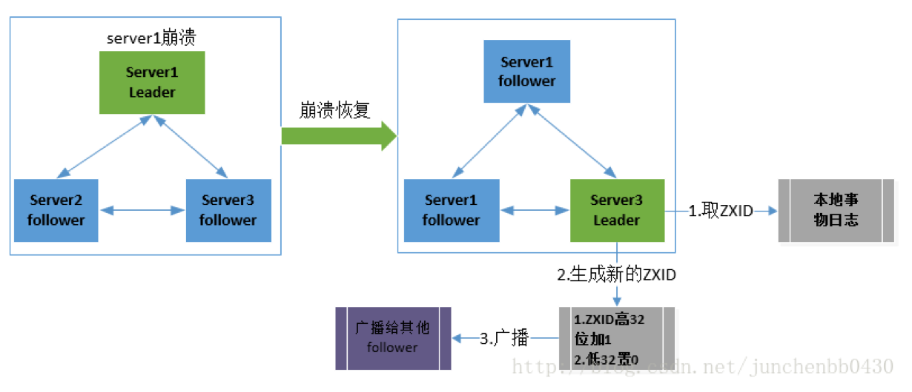

# 总结

## 1. ZooKeeper 是什么？

ZooKeeper 是一个开源的分布式协调服务。它是一个为分布式应用提供一致性服务的软件，分布式应用程序可以基于 Zookeeper 实现诸如数据发布/订阅、负载均衡、命名服务、分布式协调/通知、集群管理、Master 选举、分布式锁和分布式队列等功能。

ZooKeeper 的目标就是封装好复杂易出错的关键服务，将简单易用的接口和性能高效、功能稳定的系统提供给用户。

Zookeeper 保证了如下分布式一致性特性：

（1）顺序一致性

（2）原子性

（3）单一视图

（4）可靠性

（5）实时性（最终一致性）

客户端的读请求可以被集群中的任意一台机器处理，如果读请求在节点上注册了监听器，这个监听器也是由所连接的 zookeeper 机器来处理。对于写请求，这些请求会同时发给其他 zookeeper 机器并且达成一致后，请求才会返回成功。因此，随着 zookeeper 的集群机器增多，读请求的吞吐会提高但是写请求的吞吐会下降。

有序性是 zookeeper 中非常重要的一个特性，所有的更新都是全局有序的，每个更新都有一个唯一的时间戳，这个时间戳称为 zxid（Zookeeper Transaction Id）。而读请求只会相对于更新有序，也就是读请求的返回结果中会带有这个zookeeper 最新的 zxid。

## 2. ZooKeeper 提供了什么？

- 文件系统
- 通知机制

## 3. Zookeeper 文件系统

Zookeeper 提供一个多层级的节点命名空间（节点称为 znode）。与文件系统不同的是，这些节点都可以设置关联的数据，而文件系统中只有文件节点可以存放数据而目录节点不行。

Zookeeper 为了保证高吞吐和低延迟，在内存中维护了这个树状的目录结构，这种特性使得 Zookeeper 不能用于存放大量的数据，每个节点的存放数据上限为1M。

## 4. Zookeeper 怎么保证主从节点的状态同步？

Zookeeper 的核心是原子广播机制，这个机制保证了各个 server 之间的同步。实现这个机制的协议叫做 Zab 协议。Zab 协议有两种模式，它们分别是恢复模式和广播模式。

1. 恢复模式

当服务启动或者在领导者崩溃后，Zab就进入了恢复模式，当领导者被选举出来，且大多数 server 完成了和 leader 的状态同步以后，恢复模式就结束了。状态同步保证了 leader 和 server 具有相同的系统状态。

1. 广播模式

一旦 leader 已经和多数的 follower 进行了状态同步后，它就可以开始广播消息了，即进入广播状态。这时候当一个 server 加入 ZooKeeper 服务中，它会在恢复模式下启动，发现 leader，并和 leader 进行状态同步。待到同步结束，它也参与消息广播。ZooKeeper 服务一直维持在 Broadcast 状态，直到 leader 崩溃了或者 leader 失去了大部分的 followers 支持。

## 5. 四种类型的数据节点 Znode

（1）PERSISTENT-持久节点

除非手动删除，否则节点一直存在于 Zookeeper 上

（2）EPHEMERAL-临时节点

临时节点的生命周期与客户端会话绑定，一旦客户端会话失效（客户端与zookeeper 连接断开不一定会话失效），那么这个客户端创建的所有临时节点都会被移除。

（3）PERSISTENT_SEQUENTIAL-持久顺序节点

基本特性同持久节点，只是增加了顺序属性，节点名后边会追加一个由父节点维护的自增整型数字。

（4）EPHEMERAL_SEQUENTIAL-临时顺序节点

基本特性同临时节点，增加了顺序属性，节点名后边会追加一个由父节点维护的自增整型数字。

## 6. Zookeeper Watcher 机制 – 数据变更通知

Zookeeper 允许客户端向服务端的某个 Znode 注册一个 Watcher 监听，当服务端的一些指定事件触发了这个 Watcher，服务端会向指定客户端发送一个事件通知来实现分布式的通知功能，然后客户端根据 Watcher 通知状态和事件类型做出业务上的改变。

工作机制：

（1）客户端注册 watcher

（2）服务端处理 watcher

（3）客户端回调 watcher

Watcher 特性总结：

（1）一次性

无论是服务端还是客户端，一旦一个 Watcher 被 触 发 ，Zookeeper 都会将其从相应的存储中移除。这样的设计有效的减轻了服务端的压力，不然对于更新非常频繁的节点，服务端会不断的向客户端发送事件通知，无论对于网络还是服务端的压力都非常大。

（2）客户端串行执行

客户端 Watcher 回调的过程是一个串行同步的过程。

（3）轻量

3.1、Watcher 通知非常简单，只会告诉客户端发生了事件，而不会说明事件的具体内容。

3.2、客户端向服务端注册 Watcher 的时候，并不会把客户端真实的 Watcher 对象实体传递到服务端，仅仅是在客户端请求中使用 boolean 类型属性进行了标记。

（4）watcher event 异步发送 watcher 的通知事件从 server 发送到 client 是异步的，这就存在一个问题，不同的客户端和服务器之间通过 socket 进行通信，由于网络延迟或其他因素导致客户端在不同的时刻监听到事件，由于 Zookeeper 本身提供了 ordering guarantee，即客户端监听事件后，才会感知它所监视 znode发生了变化。所以我们使用 Zookeeper 不能期望能够监控到节点每次的变化。Zookeeper 只能保证最终的一致性，而无法保证强一致性。

（5）注册 watcher getData、exists、getChildren

（6）触发 watcher create、delete、setData

（7）当一个客户端连接到一个新的服务器上时，watch 将会被以任意会话事件触发。当与一个服务器失去连接的时候，是无法接收到 watch 的。而当 client 重新连接时，如果需要的话，所有先前注册过的 watch，都会被重新注册。通常这是完全透明的。只有在一个特殊情况下，watch 可能会丢失：对于一个未创建的 znode的 exist watch，如果在客户端断开连接期间被创建了，并且随后在客户端连接上之前又删除了，这种情况下，这个 watch 事件可能会被丢失。

## 7. 客户端注册 Watcher 实现

（1）调用 getData()/getChildren()/exist()三个 API，传入 Watcher 对象

（2）标记请求 request，封装 Watcher 到 WatchRegistration

（3）封装成 Packet 对象，发服务端发送 request

（4）收到服务端响应后，将 Watcher 注册到 ZKWatcherManager 中进行管理

（5）请求返回，完成注册。

## 8. 服务端处理 Watcher 实现

（1）服务端接收 Watcher 并存储

接收到客户端请求，处理请求判断是否需要注册 Watcher，需要的话将数据节点的节点路径和 ServerCnxn（ServerCnxn 代表一个客户端和服务端的连接，实现了 Watcher 的 process 接口，此时可以看成一个 Watcher 对象）存储在WatcherManager 的 WatchTable 和 watch2Paths 中去。

（2）Watcher 触发

以服务端接收到 setData() 事务请求触发 NodeDataChanged 事件为例：

2.1 封装 WatchedEvent

将通知状态（SyncConnected）、事件类型（NodeDataChanged）以及节点路径封装成一个 WatchedEvent 对象

2.2 查询 Watcher

从 WatchTable 中根据节点路径查找 Watcher

2.3 没找到；说明没有客户端在该数据节点上注册过 Watcher

2.4 找到；提取并从 WatchTable 和 Watch2Paths 中删除对应 Watcher（从这里可以看出 Watcher 在服务端是一次性的，触发一次就失效了）

（3）调用 process 方法来触发 Watcher

这里 process 主要就是通过 ServerCnxn 对应的 TCP 连接发送 Watcher 事件通知。

## 9. 客户端回调 Watcher

客户端 SendThread 线程接收事件通知，交由 EventThread 线程回调 Watcher。

客户端的 Watcher 机制同样是一次性的，一旦被触发后，该 Watcher 就失效了。

## 10. ACL 权限控制机制

UGO（User/Group/Others）

目前在 Linux/Unix 文件系统中使用，也是使用最广泛的权限控制方式。是一种粗粒度的文件系统权限控制模式。

ACL（Access Control List）访问控制列表

包括三个方面：

权限模式（Scheme）

（1）IP：从 IP 地址粒度进行权限控制

（2）Digest：最常用，用类似于 username:password 的权限标识来进行权限配置，便于区分不同应用来进行权限控制

（3）World：最开放的权限控制方式，是一种特殊的 digest 模式，只有一个权限标识“world:anyone”

（4）Super：超级用户

授权对象

授权对象指的是权限赋予的用户或一个指定实体，例如 IP 地址或是机器灯。

权限 Permission

（1）CREATE：数据节点创建权限，允许授权对象在该 Znode 下创建子节点

（2）DELETE：子节点删除权限，允许授权对象删除该数据节点的子节点

（3）READ：数据节点的读取权限，允许授权对象访问该数据节点并读取其数据内容或子节点列表等

（4）WRITE：数据节点更新权限，允许授权对象对该数据节点进行更新操作

（5）ADMIN：数据节点管理权限，允许授权对象对该数据节点进行 ACL 相关设置操作

## 11. Chroot 特性

3.2.0 版本后，添加了 Chroot 特性，该特性允许每个客户端为自己设置一个命名空间。如果一个客户端设置了 Chroot，那么该客户端对服务器的任何操作，都将会被限制在其自己的命名空间下。

通过设置 Chroot，能够将一个客户端应用于 Zookeeper 服务端的一颗子树相对应，在那些多个应用公用一个 Zookeeper 进群的场景下，对实现不同应用间的相互隔离非常有帮助。

## 12. 会话管理

分桶策略：将类似的会话放在同一区块中进行管理，以便于 Zookeeper 对会话进行不同区块的隔离处理以及同一区块的统一处理。

分配原则：每个会话的“下次超时时间点”（ExpirationTime）

计算公式：

ExpirationTime_ = currentTime + sessionTimeout

ExpirationTime = (ExpirationTime_ / ExpirationInrerval + 1) *

ExpirationInterval , ExpirationInterval 是指 Zookeeper 会话超时检查时间间隔，默认 tickTime

## 13. 服务器角色

Leader

（1）事务请求的唯一调度和处理者，保证集群事务处理的顺序性

（2）集群内部各服务的调度者

Follower

（1）处理客户端的非事务请求，转发事务请求给 Leader 服务器

（2）参与事务请求 Proposal 的投票

（3）参与 Leader 选举投票

Observer

（1）3.0 版本以后引入的一个服务器角色，在不影响集群事务处理能力的基础上提升集群的非事务处理能力

（2）处理客户端的非事务请求，转发事务请求给 Leader 服务器

（3）不参与任何形式的投票

## 14. Zookeeper 下 Server 工作状态

服务器具有四种状态，分别是 LOOKING、FOLLOWING、LEADING、OBSERVING。

（1）LOOKING：寻 找 Leader 状态。当服务器处于该状态时，它会认为当前集群中没有 Leader，因此需要进入 Leader 选举状态。

（2）FOLLOWING：跟随者状态。表明当前服务器角色是 Follower。

（3）LEADING：领导者状态。表明当前服务器角色是 Leader。

（4）OBSERVING：观察者状态。表明当前服务器角色是 Observer。

## 15. 数据同步

整个集群完成 Leader 选举之后，Learner（Follower 和 Observer 的统称）回向Leader 服务器进行注册。当 Learner 服务器想 Leader 服务器完成注册后，进入数据同步环节。

数据同步流程：（均以消息传递的方式进行）

Learner 向 Learder 注册

数据同步

同步确认

Zookeeper 的数据同步通常分为四类：

（1）直接差异化同步（DIFF 同步）

（2）先回滚再差异化同步（TRUNC+DIFF 同步）

（3）仅回滚同步（TRUNC 同步）

（4）全量同步（SNAP 同步）

在进行数据同步前，Leader 服务器会完成数据同步初始化：

peerLastZxid：

· 从 learner 服务器注册时发送的 ACKEPOCH 消息中提取 lastZxid（该Learner 服务器最后处理的 ZXID）

minCommittedLog：

· Leader 服务器 Proposal 缓存队列 committedLog 中最小 ZXIDmaxCommittedLog：

· Leader 服务器 Proposal 缓存队列 committedLog 中最大 ZXID直接差异化同步（DIFF 同步）

· 场景：peerLastZxid 介于 minCommittedLog 和 maxCommittedLog之间先回滚再差异化同步（TRUNC+DIFF 同步）

· 场景：当新的 Leader 服务器发现某个 Learner 服务器包含了一条自己没有的事务记录，那么就需要让该 Learner 服务器进行事务回滚–回滚到 Leader服务器上存在的，同时也是最接近于 peerLastZxid 的 ZXID仅回滚同步（TRUNC 同步）

· 场景：peerLastZxid 大于 maxCommittedLog

全量同步（SNAP 同步）

· 场景一：peerLastZxid 小于 minCommittedLog

· 场景二：Leader 服务器上没有 Proposal 缓存队列且 peerLastZxid 不等于 lastProcessZxid

## 16. zookeeper 是如何保证事务的顺序一致性的？

zookeeper 采用了全局递增的事务 Id 来标识，所有的 proposal（提议）都在被提出的时候加上了 zxid，zxid 实际上是一个 64 位的数字，高 32 位是 epoch（ 时期; 纪元; 世; 新时代）用来标识 leader 周期，如果有新的 leader 产生出来，epoch会自增，低 32 位用来递增计数。当新产生 proposal 的时候，会依据数据库的两阶段过程，首先会向其他的 server 发出事务执行请求，如果超过半数的机器都能执行并且能够成功，那么就会开始执行。

## 17. 分布式集群中为什么会有 Master主节点？

在分布式环境中，有些业务逻辑只需要集群中的某一台机器进行执行，其他的机器可以共享这个结果，这样可以大大减少重复计算，提高性能，于是就需要进行 leader 选举。

## 18. zk 节点宕机如何处理？

Zookeeper 本身也是集群，推荐配置不少于 3 个服务器。Zookeeper 自身也要保证当一个节点宕机时，其他节点会继续提供服务。

如果是一个 Follower 宕机，还有 2 台服务器提供访问，因为 Zookeeper 上的数据是有多个副本的，数据并不会丢失；

如果是一个 Leader 宕机，Zookeeper 会选举出新的 Leader。

ZK 集群的机制是只要超过半数的节点正常，集群就能正常提供服务。只有在 ZK节点挂得太多，只剩一半或不到一半节点能工作，集群才失效。

所以

3 个节点的 cluster 可以挂掉 1 个节点(leader 可以得到 2 票>1.5)

2 个节点的 cluster 就不能挂掉任何 1 个节点了(leader 可以得到 1 票<=1)

## 19. zookeeper 负载均衡和 nginx 负载均衡区别

zk 的负载均衡是可以调控，nginx 只是能调权重，其他需要可控的都需要自己写插件；但是 nginx 的吞吐量比 zk 大很多，应该说按业务选择用哪种方式。

## 20. Zookeeper 有哪几种几种部署模式？

Zookeeper 有三种部署模式：

1. 单机部署：一台集群上运行；
2. 集群部署：多台集群运行；
3. 伪集群部署：一台集群启动多个 Zookeeper 实例运行。

## 21. 集群最少要几台机器，集群规则是怎样的？集群中有 3 台服务器，其中一个节点宕机，这个时候 Zookeeper 还可以使用吗？

集群规则为 2N+1 台，N>0，即 3 台。可以继续使用，单数服务器只要没超过一半的服务器宕机就可以继续使用。

## 22. 集群支持动态添加机器吗？

其实就是水平扩容了，Zookeeper 在这方面不太好。两种方式：

全部重启：关闭所有 Zookeeper 服务，修改配置之后启动。不影响之前客户端的会话。

逐个重启：在过半存活即可用的原则下，一台机器重启不影响整个集群对外提供服务。这是比较常用的方式。

3.5 版本开始支持动态扩容。

## 23. Zookeeper 对节点的 watch 监听通知是永久的吗？为什么不是永久的?

不是。官方声明：一个 Watch 事件是一个一次性的触发器，当被设置了 Watch的数据发生了改变的时候，则服务器将这个改变发送给设置了 Watch 的客户端，以便通知它们。

为什么不是永久的，举个例子，如果服务端变动频繁，而监听的客户端很多情况下，每次变动都要通知到所有的客户端，给网络和服务器造成很大压力。

一般是客户端执行 getData(“/节点 A”,true)，如果节点 A 发生了变更或删除，客户端会得到它的 watch 事件，但是在之后节点 A 又发生了变更，而客户端又没有设置 watch 事件，就不再给客户端发送。

在实际应用中，很多情况下，我们的客户端不需要知道服务端的每一次变动，我只要最新的数据即可。

## 24. Zookeeper 的 java 客户端都有哪些？

java 客户端：zk 自带的 zkclient 及 Apache 开源的 Curator。

## 25. chubby 是什么，和 zookeeper 比你怎么看？

chubby 是 google 的，完全实现 paxos 算法，不开源。zookeeper 是 chubby的开源实现，使用 zab 协议，paxos 算法的变种。

## 26. 说几个 zookeeper 常用的命令。

常用命令：ls get set create delete 等。

## 27. ZAB 和 Paxos 算法的联系与区别？

相同点：

（1）两者都存在一个类似于 Leader 进程的角色，由其负责协调多个 Follower 进程的运行

（2）Leader 进程都会等待超过半数的 Follower 做出正确的反馈后，才会将一个提案进行提交

（3）ZAB 协议中，每个 Proposal 中都包含一个 epoch 值来代表当前的 Leader周期，Paxos 中名字为 Ballot

不同点：

ZAB 用来构建高可用的分布式数据主备系统（Zookeeper），Paxos 是用来构建分布式一致性状态机系统。

## 28. Zookeeper 的典型应用场景

Zookeeper 是一个典型的发布/订阅模式的分布式数据管理与协调框架，开发人员可以使用它来进行分布式数据的发布和订阅。

通过对 Zookeeper 中丰富的数据节点进行交叉使用，配合 Watcher 事件通知机制，可以非常方便的构建一系列分布式应用中年都会涉及的核心功能，如：

（1）数据发布/订阅

（2）负载均衡

（3）命名服务

（4）分布式协调/通知

（5）集群管理

（6）Master 选举

（7）分布式锁

（8）分布式队列

**数据发布/订阅**

介绍

数据发布/订阅系统，即所谓的配置中心，顾名思义就是发布者发布数据供订阅者进行数据订阅。

目的

动态获取数据（配置信息）

实现数据（配置信息）的集中式管理和数据的动态更新

设计模式

Push 模式

Pull 模式

数据（配置信息）特性

（1）数据量通常比较小

（2）数据内容在运行时会发生动态更新

（3）集群中各机器共享，配置一致

如：机器列表信息、运行时开关配置、数据库配置信息等

基于 Zookeeper 的实现方式

· 数据存储：将数据（配置信息）存储到 Zookeeper 上的一个数据节点

· 数据获取：应用在启动初始化节点从 Zookeeper 数据节点读取数据，并在该节点上注册一个数据变更 Watcher

· 数据变更：当变更数据时，更新 Zookeeper 对应节点数据，Zookeeper会将数据变更通知发到各客户端，客户端接到通知后重新读取变更后的数据即可。

**负载均衡**

zk 的命名服务

命名服务是指通过指定的名字来获取资源或者服务的地址，利用 zk 创建一个全局的路径，这个路径就可以作为一个名字，指向集群中的集群，提供的服务的地址，或者一个远程的对象等等。

**分布式通知和协调**

对于系统调度来说：操作人员发送通知实际是通过控制台改变某个节点的状态，然后 zk 将这些变化发送给注册了这个节点的 watcher 的所有客户端。

对于执行情况汇报：每个工作进程都在某个目录下创建一个临时节点。并携带工作的进度数据，这样汇总的进程可以监控目录子节点的变化获得工作进度的实时的全局情况。

**zk 的命名服务（文件系统）**

命名服务是指通过指定的名字来获取资源或者服务的地址，利用 zk 创建一个全局的路径，即是唯一的路径，这个路径就可以作为一个名字，指向集群中的集群，提供的服务的地址，或者一个远程的对象等等。

**zk 的配置管理（文件系统、通知机制）**

程序分布式的部署在不同的机器上，将程序的配置信息放在 zk 的 znode 下，当有配置发生改变时，也就是 znode 发生变化时，可以通过改变 zk 中某个目录节点的内容，利用 watcher 通知给各个客户端，从而更改配置。

**Zookeeper 集群管理（文件系统、通知机制）**

所谓集群管理无在乎两点：是否有机器退出和加入、选举 master。

对于第一点，所有机器约定在父目录下创建临时目录节点，然后监听父目录节点

的子节点变化消息。一旦有机器挂掉，该机器与 zookeeper 的连接断开，其所创建的临时目录节点被删除，所有其他机器都收到通知：某个兄弟目录被删除，于是，所有人都知道：它上船了。

新机器加入也是类似，所有机器收到通知：新兄弟目录加入，highcount 又有了，对于第二点，我们稍微改变一下，所有机器创建临时顺序编号目录节点，每次选取编号最小的机器作为 master 就好。

**Zookeeper 分布式锁（文件系统、通知机制）**

有了 zookeeper 的一致性文件系统，锁的问题变得容易。锁服务可以分为两类，一个是保持独占，另一个是控制时序。

对于第一类，我们将 zookeeper 上的一个 znode 看作是一把锁，通过 createznode的方式来实现。所有客户端都去创建 /distribute_lock 节点，最终成功创建的那个客户端也即拥有了这把锁。用完删除掉自己创建的 distribute_lock 节点就释放出锁。

对于第二类， /distribute_lock 已经预先存在，所有客户端在它下面创建临时顺序编号目录节点，和选 master 一样，编号最小的获得锁，用完删除，依次方便。

Zookeeper 队列管理（文件系统、通知机制）

两种类型的队列：

（1）同步队列，当一个队列的成员都聚齐时，这个队列才可用，否则一直等待所有成员到达。

（2）队列按照 FIFO 方式进行入队和出队操作。

第一类，在约定目录下创建临时目录节点，监听节点数目是否是我们要求的数目。

第二类，和分布式锁服务中的控制时序场景基本原理一致，入列有编号，出列按编号。在特定的目录下创建 PERSISTENT_SEQUENTIAL 节点，创建成功时Watcher 通知等待的队列，队列删除序列号最小的节点用以消费。此场景下Zookeeper 的 znode 用于消息存储，znode 存储的数据就是消息队列中的消息内容，SEQUENTIAL 序列号就是消息的编号，按序取出即可。由于创建的节点是持久化的，所以不必担心队列消息的丢失问题。

## 29. Zookeeper 都有哪些功能？

1. 集群管理：监控节点存活状态、运行请求等；
2. 主节点选举：主节点挂掉了之后可以从备用的节点开始新一轮选主，主节点选举说的就是这个选举的过程，使用 Zookeeper 可以协助完成这个过程；
3. 分布式锁：Zookeeper 提供两种锁：独占锁、共享锁。独占锁即一次只能有一个线程使用资源，共享锁是读锁共享，读写互斥，即可以有多线线程同时读同一个资源，如果要使用写锁也只能有一个线程使用。Zookeeper 可以对分布式锁进行控制。
4. 命名服务：在分布式系统中，通过使用命名服务，客户端应用能够根据指定名字来获取资源或服务的地址，提供者等信息。

## 30. 说一下 Zookeeper 的通知机制？

client 端会对某个 znode 建立一个 watcher 事件，当该 znode 发生变化时，这些 client 会收到 zk 的通知，然后 client 可以根据 znode 变化来做出业务上的改变等。

## 31. Zookeeper 和 Dubbo 的关系？

Zookeeper的作用：

zookeeper用来注册服务和进行负载均衡，哪一个服务由哪一个机器来提供必需让调用者知道，简单来说就是ip地址和服务名称的对应关系。当然也可以通过硬编码的方式把这种对应关系在调用方业务代码中实现，但是如果提供服务的机器挂掉调用者无法知晓，如果不更改代码会继续请求挂掉的机器提供服务。zookeeper通过心跳机制可以检测挂掉的机器并将挂掉机器的ip和服务对应关系从列表中删除。至于支持高并发，简单来说就是横向扩展，在不更改代码的情况通过添加机器来提高运算能力。通过添加新的机器向zookeeper注册服务，服务的提供者多了能服务的客户就多了。

dubbo：

是管理中间层的工具，在业务层到数据仓库间有非常多服务的接入和服务提供者需要调度，dubbo提供一个框架解决这个问题。
注意这里的dubbo只是一个框架，至于你架子上放什么是完全取决于你的，就像一个汽车骨架，你需要配你的轮子引擎。这个框架中要完成调度必须要有一个分布式的注册中心，储存所有服务的元数据，你可以用zk，也可以用别的，只是大家都用zk。

zookeeper和dubbo的关系：

Dubbo 的将注册中心进行抽象，它可以外接不同的存储媒介给注册中心提供服务，有 ZooKeeper，Memcached，Redis 等。

引入了 ZooKeeper 作为存储媒介，也就把 ZooKeeper 的特性引进来。首先是负载均衡，单注册中心的承载能力是有限的，在流量达到一定程度的时 候就需要分流，负载均衡就是为了分流而存在的，一个 ZooKeeper 群配合相应的 Web 应用就可以很容易达到负载均衡；资源同步，单单有负载均衡还不 够，节点之间的数据和资源需要同步，ZooKeeper 集群就天然具备有这样的功能；命名服务，将树状结构用于维护全局的服务地址列表，服务提供者在启动 的时候，向 ZooKeeper 上的指定节点 /dubbo/${serviceName}/providers 目录下写入自己的 URL 地址，这个操作就完成了服务的发布。 其他特性还有 Mast 选举，分布式锁等。

# 一致性算法

## 什么是一致性

**一致性模型**

- 弱一致性

- - 最终一致性

  - - DNS(Domain Name System)
    - Gossip(Cassandra的通信协议)

- 强一致性

- - 同步
  - Paxos
  - Raft(multi-paxos)
  - ZAB(multi-paxos)

强一致性算法——Basic Paxos

角色介绍：

​	Client：系统外部角色，请求发起者，像民众

​	Propser：接受Client请求，向集群提出提议(propose)。并在冲突发生时，起到冲突调节的作用。像议员替民丛提出议案

​	Accpetor(Voter)：提议投票和接收者，只有在形成法定人数(Quorum，一般即为majority多数派)时，提议才会最终被接受。像国会

​	Learner：提议接受着，backup，备份，对集群一致性没影响。像议员

## 一致性Hash算法

普通的hash算法由于增加服务器或者减少服务器，导致原来缓存的信息找不到对应的服务器，导致所有的请求都到后端服务器或者数据库， 缓存雪崩

**一致性Hash算法** 

一致性Hash算法也是使用取模的方法，但不是对服务器的数量进行取模，而是对2^32取模

整个空间按顺时针方向组织，圆环正上方的点代表0，0右侧第一个点是1，左侧第一个点是2^32-1，0和2^32-1在零点中方向重合，称为**Hash环**

下一步使用服务器的IP或主机名作为关键字进行哈希，确定其在哈希环上的位置。

将数据key使用相同的函数hash计算，并确定在哈希环上的位置，从此位置沿环顺时针走，第一台服务器就是数据定位到的服务器。

比如objecta、b、c、d分别定为到NodeA、B、C、D

**一致性Hash算法的容错性和可扩展性**

**一致性Hash算法对于节点的增减都只需重定位环空间中的一小部分数据，具有较好的容错性和可扩展性。**

如果某台服务器（NodeC）宕机，其他服务器不受影响，只有C对象被重定位到服务器（NodeD）上。

**一般的，在一致性Hash算法中，如果一台服务器不可用，则受影响的数据仅仅是此服务器到Hash环的前一台服务器（逆时针方向，服务器C到服务器B）之间的数据，其他不受影响。**

如果新增一台服务器NodeX，此时ObjectA、B、D不受影响，只有对象C需要重定位到服务器Node X

**一般的，在一致性Hash算法中，如果增加一台服务器，则受影响的数据仅仅是新服务器到其环空间前一台服务器（逆时针方向，服务器X到服务器B）之间的数据，其他不受影响。**

**Hash环的数据倾斜问题**

一致性hash算法在**服务节点太少**时，容易因为节点分布不均匀造成**数据倾斜**(被缓存的对虾你个大部分集中缓存在某一台服务器上)

为了解决数据倾斜问题，一致性Hash算法引入了**虚拟节点机制**，对每一个服务器节点计算多个哈希，每个计算结果位置都放置一个此服务节点，称为**虚拟节点。**可以在服务器IP或主机名的后面增加编号来实现。

可以为每台服务器计算三个虚拟节点，于是可以分别计算 “Node A#1”、“Node A#2”、“Node A#3”、“Node B#1”、“Node B#2”、“Node B#3”的哈希值，于是形成六个虚拟节点

同时数据定位算法不变，只是多了一步**虚拟节点到实际节点的映射**，例如定位到“Node A#1”、“Node A#2”、“Node A#3”三个虚拟节点的数据均定位到Node A上。这样就解决了服务节点少时数据倾斜的问题。在实际应用中，通常将虚拟节点数设置为32甚至更大，因此即使很少的服务节点也能做到相对均匀的数据分布。

## Paxos算法

   一种基于消息传递且具有高度容错特性的分布式一致性算法

**Paxos原理**

任意两个法定集合，必定存在一个公共的成员。该性质是Paxos有效的基本保障

分布式系统中的节点通信存在两种模型：[共享内存](https://zh.wikipedia.org/wiki/共享内存)（Shared memory）和[消息传递](https://zh.wikipedia.org/wiki/消息传递)（Messages passing）。基于消息传递通信模型的分布式系统，不可避免的会发生以下错误：进程可能会慢、被杀死或者重启，消息可能会延迟、丢失、重复，在基础 Paxos 场景中，先不考虑可能出现消息篡改即[拜占庭错误](https://zh.wikipedia.org/wiki/拜占庭将军问题)的情况。Paxos 算法解决的问题是在一个可能发生上述异常的[分布式系统](https://zh.wikipedia.org/wiki/分布式计算)中如何就某个值达成一致，保证不论发生以上任何异常，都不会破坏决议的一致性。

在paxos算法中，分为4种角色：

Client：产生议题者       

Proposer：提议者  

Acceptor：决策者

Learner：最终决策学习者

首先将议员的角色分为 proposers，acceptors，和 learners（允许身兼数职）。proposers 提出提案，提案信息包括提案编号和提议的 value；acceptor 收到提案后可以接受（accept）提案，若提案获得多数派（majority）的 acceptors 的接受，则称该提案被批准（chosen）；learners 只能“学习”被批准的提案。划分角色后，就可以更精确的定义问题：

1. 决议（value）只有在被 proposers 提出后才能被批准（未经批准的决议称为“提案（proposal）”）

2. 在一次 Paxos 算法的执行实例中，只批准（chosen）一个 value；

3. learners 只能获得被批准（chosen）的 value。

**约束**

**为了满足每次只批准一个value的约束，经过多数派（majority）接收的提案（value）成为正式的决议**

​         **P1：一个 acceptor 必须接受（accept）第一次收到的提案。**

​         **P2:  一旦一个具有 value v 的提案获得多数派的acceptors的接受被批准（chosen），那么之后其他acceptor批准（chosen）的提案必须具有 value v。**

**P2a: 一旦一个具有 value v 的提案获得多数派的acceptors的接受被批准（chosen），那么之后任何其他acceptor 再次接受（accept）的提案必须具有 value v。**

**P2b：一旦一个具有 value v 的提案获得多数派的acceptors的接受被批准（chosen），那么以后任何其他proposer 提出的提案必须具有 value v。（如果某个proposer和acceptor从休眠中苏醒，补录之前的信息）**

**P2c：如果一个编号为 n 的提案具有 value v，那么存在一个多数派，要么他们中所有人都没有接受（accept）编号小于 n 的任何提案，要么他们已经接受（accept）的所有编号小于 n 的提案中编号最大的那个提案具有 value v。**

**Paxos有两个原则**

1)安全原则---保证不能做错的事

**a） 针对某个实例的表决只能有一个值被批准，不能出现一个被批准的值被另一个值覆盖的情况；(假设有一个值被多数Acceptor批准了，那么这个值就只能被学习)**

**b） 每个节点只能学习到已经被批准的值，不能学习没有被批准的值。**

2)存活原则---只要有多数服务器存活并且彼此间可以通信，最终都要做到的下列事情：

**a）最终会批准某个被提议的值；**

**b）一个值被批准了，其他服务器最终会学习到这个值。**

**Paxos议案ID生成算法**

 在Google的Chubby论文中给出了这样一种方法：假设有n个proposer，每个编号为ir(0<=ir

   s %n = ir  =>   s = m*n + ir

  proposer已知的最大值来自两部分：proposer自己对编号自增后的值和接收到acceptor的拒绝后所得到的值。

例： 以3个proposer P1、P2、P3为例，开始m=0,编号分别为0，1，2。

1） P1提交的时候发现了P2已经提交，P2编号为1 >P1的0，因此P1重新计算编号：new P1 = 1*3+1 = 4；

2） P3以编号2提交，发现小于P1的4，因此P3重新编号：new P3 = 1*3+2 = 5。

**Basic Paxos**

**第一阶段（prepare）**

\1. 获取一个proposal number, n；

\2. 提议者向所有节点广播prepare(n)请求；

\3. 接收者（Acceptors比较善变，如果还没最终认可一个值，它就会不断认同提案号最大的那个方案）比较n和minProposal，如果n>minProposal,表示有更新的提议minProposal=n；如果此时该接受者并没有认可一个最终值，那么认可这个提案，返回OK。如果此时已经有一个accptedValue, 将返回(acceptedProposal,acceptedValue)；

\4. 提议者接收到过半数请求后，如果发现有acceptedValue返回，表示有认可的提议，保存最高acceptedProposal编号的acceptedValue到本地

**第二阶段(Accept)**

\5. 广播accept(n,value)到所有节点；

\6. 接收者比较n和minProposal，如果n>=minProposal,则acceptedProposal=minProposal=n，acceptedValue=value，本地持久化后，返回；否则，拒绝并且返回minProposal

\7. 提议者接收到过半数请求后，如果发现有返回值>n，表示有更新的提议，跳转1（重新发起提议）；否则value达成一致。

**活锁 ——** 抢占式访问权，竞争代理提交

   当某一proposer提交的proposal被拒绝时，可能是因为acceptor 承诺返回了更大编号的proposal，因此proposer提高编号继续提交。 **如果2个proposer都发现自己的编号过低转而提出更高编号的proposal，会导致死循环，这种情况也称为活锁。**

​     一般活锁可以通过 **随机睡眠-重试** 的方法解决。这种情况下的解决方案是选举出一个leader，仅允许**leader提出提案**。但是由于消息传递的不确定性，可能有多个proposer自认为自己已经成为leader。

**Basic Paxos的问题：难实现、效率低（2轮RPC）、活锁**

**异常情况——持久存储**

  在算法执行的过程中会产生很多的异常情况：proposer宕机，acceptor在接收proposal后宕机，proposer接收消息后宕机，acceptor在accept后宕机，learn宕机，存储失败，等等。

  **为保证paxos算法的正确性，proposer、aceptor、learn都实现持久存储，以做到server恢复后仍能正确参与paxos处理。**

  **propose存储已提交的最大proposal编号、决议编号（instance id）。**

  **acceptor存储已承诺（promise）的最大编号、已接受（accept）的最大编号和value、决议编号。**

  **learn存储已学习过的决议和编号**

**Multi Paxos**      **新概念  Leader：唯一的propser，所有请求都需经过此Leader**

Paxos的典型部署需要一组连续的被接受的值（value），作为应用到一个分布式状态机的一组命令。如果每个命令都通过一个Basic Paxos算法实例来达到一致，会产生大量开销。 

如果Leader是相对稳定不变的，第1阶段就变得不必要。 这样，系统可以在接下来的Paxos算法实例中，跳过的第1阶段，直接使用同样的Leader。

为了实现这一目的，在同一个Leader执行每轮Paxos算法时，提案编号 I 每次递增一个值，并与每个值一起发送。Multi-Paxos在没有故障发生时，将消息延迟(从propose阶段到learn阶段)从4次延迟降低为2次延迟。

**Multi-Paxos中消息流的图形表示**

**Multi-Paxos 没有失败的情况**

在下面的图中，只显示了基本Paxos协议的一个实例(或“执行”)和一个初始Leader(Proposer)。注意，Multi-Paxos使用几个Basic Paxos的实例。

Client   Proposer      Acceptor     Learner   	  |                 |          |  |  |           	 |  | --- First Request ---  	  X-------->|          |  |  |       		 |  |  Request 	  |          X--------->|->|->|      	 |  |  Prepare(N) 	  |          |<---------X--X--X            |  |romise(N,I,{Va,Vb,Vc})    |         X--------->|->|->|      	 |  |  Accept!(N,I,V)    |         |<---------X--X--X------>|->|  Accepted(N,I,V)    |<---------------------------------X--X  Response    |         |     		     |  |  |   	    |  |

式中V = (Va, Vb, Vc) 中最新的一个。

**跳过阶段1时的Multi-Paxos**

在这种情况下，Basic Paxos的后续实例(由I+1表示)**使用相同的Leader**，因此，包含在Prepare和Promise的阶段1(Basic Paxos协议的这些后续实例)将被跳过。注意，这里要求Leader应该是稳定的，即它不应该崩溃或改变。如果崩溃了，再重新选举出来第N+1位Leader

Client   Proposer       Acceptor     Learner   |         |         		    |  |  |     	 |   |  --- Following Requests ---   X--->|      		    |  |  |    	  |   |  Request   |         X--------->|->|->|   	  |   |  Accept!(N,I+1,W)   |         |<---------X--X--X------>|->|  Accepted(N,I+1,W)   |<------------------------------X--X  Response   |         |        		  |  |  |           	 |  |

**从一般的Client/Server来考虑，Client其实承担了Proposer和Learner的作用，而Server则扮演Acceptor的角色**

Fast-Paxos

Fast-Paxos将Basic-Paxos进行了推广，以减少端到端消息延迟。在Basic-Paxos中，从客户端发起请求开始，到Learn阶段结束的消息延迟是3个消息延迟。而Fast-Paxos允许2个消息延迟，但要求：

**(1) 系统由3f+ 1个Acceptor组成，以容忍最多f个错误(而不是Basic-Paxos的2f+1)；**

**(2) 客户端需要直接将请求发送到多个目标。**

直观上，**如果Leader没有提议任何value，那么客户可以直接发送Accept消息到向接收方发。Acceptor会像Basic-Paxos一样运行，向Leader和每个Learner发送Accepted的消息，从而实现从客户端到Learner的两消息延迟。**

如果Leader检测到冲突，它通过发起新一轮投票，并发送Accept消息来解决冲突，通常是一个Accepted消息。这种有协调者参与的冲突恢复机制需要4个从客户端到Learner的消息延迟。

如果Leader提前指定了一种冲突恢复机制，就可以实现另一种优化，它允许Acceptors自己执行冲突恢复。因此，无协调的冲突恢复可能实现三个消息延迟(如果所有的Learner都是接收者，那么只有两个消息延迟)。

**消息流: Fast-Paxos，无冲突**

**消息流:Fast-Paxos，冲突的建议**  有协调这参与的冲突恢复。注意:协议没有指定如何处理被丢弃的客户端请求。

无协调者参与的相冲突恢复：

**消息流:无协调者的冲突恢复、角色崩溃的Fast-Paxos**    (合并的Acceptor/Learner)

## Raft 强一致性算法

Paxos偏向于理论、对如何应用到工程实践提及较少。理解的难度加上现实的骨感，在生产环境中基于Paxos实现一个正确的分布式系统非常难

相比Paxos，Raft更利于理解、更易于实行。

**Raft是用于实现分布式共识的协议**

​      节点可以处于三种状态：Follower (跟随)    Candidate (候选)   Leader (领导)

**Leader Election（领导人选举）**

所有的节点都以Follower状态初始，如果他们获取不到领导者的信息，那么就称为候选者，然后候选者请求其他节点的投票，如果一个节点获得大多数节点的投票，该Candidate将成为领导者Leader。此过程称为领导者选举。系统的所有修改都需要通过该领导者。然后由Leader去同步其他节点。

Raft中有两个控制选举的超时设置：

**election  timeout（选举超时）**

选举超时是追随者等待成为候选人的时间，选举超时随机分配在150ms到300ms之间，在选举结束后，追随者成为候选人并开始新的选举任期。先投票给自己，并向其他节点发送请求投票消息。如果接收节点尚未在此期限内投票，那么它将为候选人投票，并且节点重置其选举超时。一旦候选人获得多数票，它就会成为领导者，保证每个任期只能选出一名领导人。领导者开始向其关注者发送附加条目消息，这些消息以心跳超时指定的间隔发送，然后，关注者回复每个附加条目消息，这个选举任期将持续到跟随者停止接收心跳并成为候选人。

**Split voting（分割投票）**

两个节点同时成为Candidate，两个候选节点都开始竞选同一个Leader，并且每个节点在另一个节点之前到达跟随节点，此时这两个候选节点票数相等，没有其他节点投票。这时这两个候选者会重新开始一个time out。

**Log Replication（日志复制）**

**Client 向 Leader 发送更改，更改将附加到领导者的日志中，要提交该条目，先在下一次心跳时将更改发送给关注者。一旦大多数跟随者承认这个更改，就会提交一个条目， Leader将响应发送给Client。该条目先在领导者上提交，然后领导者通知跟随者该条目已被提交，跟随者再提交。该集群的系统状态达成共识。此过程称为日志复制。**

**节点分区**

   	**由于分区，现在有两个不同的领导者，一个client发送更改到节点B这个Leader，但是在这个分区里只有两个，达不成多数派，所以这个更改失败。**

**另一个client发送更改到节点C这个Leader，这个可以成功，因为它可以复制到多数。**

**现在我们把分区去掉，节点B看到了新一代的Leader，然后自己下台，节点A和B都将回滚之前未提交的条目（set 3）并匹配新的领导者的日志。现在日志在集群中保持一致。**

**Safety（安全性）**

  	一致性并不一定代表完全正确性！  三个可能的结果：成功，失败，unknown

leader在复制一条日志给服务器时，会顺便检查服务器上这条日志的前面一条日志是否和自己的一致。如果不一致的话leader就会将前面一条日志也复制给服务器，复制的过程中同样也会执行检查前一条日志是否相同的操作。这样的递归操作最终会保证leader和服务器上的所有日志一致。

**提交之前任期内的日志条目**

   一条已经被存储到大多数节点上的老日志条目 ，也依然可能会被未来的领导人覆盖掉。

## ZAB 强一致性算法

基本与raft相同，在一些名词的叫法上有些区别，ZAB将某一个leader的周期称为epoch，而raft则称之为term。

实际上也有些不同：如raft保证日志连续性，心跳方向为leader至follower。ZAB则相反

\1. ZAB协议是专门为zookeeper实现分布式协调功能而设计。zookeeper主要是根据ZAB协议是实现分布式系统数据一致性。

\2. zookeeper根据ZAB协议建立了主备模型完成zookeeper集群中数据的同步。这里所说的主备系统架构模型是指，在zookeeper集群中，只有一台leader负责处理外部客户端的事物请求(或写操作)，然后leader服务器将客户端的写操作数据同步到所有的follower节点中。 

\3. ZAB的协议核心是在整个zookeeper集群中只有一个节点即Leader将客户端的写操作转化为事物(或提议proposal)。Leader节点再数据写完之后，将向所有的follower节点发送数据广播请求(或数据复制)，等待所有的follower节点反馈。在ZAB协议中，只要超过半数follower节点反馈OK，Leader节点就会向所有的follower服务器发送commit消息。即将leader节点上的数据同步到follower节点之上。 

\4. ZAB协议中主要有两种模式，第一是消息广播模式；第二是崩溃恢复模式

**消息广播模式**

​    	1. 在zookeeper集群中数据副本的传递策略就是采用消息广播模式。zookeeper中数据副本的同步方式与二阶段提交相似但是却又不同。二阶段提交的要求协调者必须等到所有的参与者全部反馈ACK确认消息后，再发送commit消息。要求所有的参与者要么全部成功要么全部失败。二阶段提交会产生严重阻塞问题。

\2. ZAB协议中Leader等待follower的ACK反馈是指”只要半数以上的follower成功反馈即可，不需要收到全部follower反馈”

3. 图中展示了消息广播的具体流程图 

**
4. zookeeper中消息广播的具体步骤如下**： 

4.1. 客户端发起一个写操作请求 

4.2. Leader服务器将客户端的request请求转化为事物proposql提案，同时为每个proposal分配一个全局唯一的ID，即ZXID。 

4.3. leader服务器与每个follower之间都有一个队列，leader将消息发送到该队列 

4.4. follower机器从队列中取出消息处理完(写入本地事物日志中)毕后，向leader服务器发送ACK确认。 

4.5. leader服务器收到半数以上的follower的ACK后，即认为可以发送commit 

4.6. leader向所有的follower服务器发送commit消息。

**5. zookeeper采用ZAB协议的核心就是只要有一台服务器提交了proposal，就要确保所有的服务器最终都能正确提交proposal。这也是CAP/BASE最终实现一致性的一个体现**。

**6. leader服务器与每个follower之间都有一个单独的队列进行收发消息，使用队列消息可以做到异步解耦。leader和follower之间只要往队列中发送了消息即可。如果使用同步方式容易引起阻塞。性能上要下降很多**。

**崩溃恢复**

\1. zookeeper集群中为保证任何所有进程能够有序的顺序执行，只能是leader服务器接受写请求，即使是follower服务器接受到客户端的请求，也会转发到leader服务器进行处理。

\2. 如果leader服务器发生崩溃，则zab协议要求zookeeper集群进行崩溃恢复和leader服务器选举。

\3. ZAB协议崩溃恢复要求满足如下2个要求： 

3.1. **确保已经被leader提交的proposal必须最终被所有的follower服务器提交**。 

3.2. **确保丢弃已经被leader出的但是没有被提交的proposal**。

\4. 根据上述要求，新选举出来的leader不能包含未提交的proposal，即新选举的leader必须都是已经提交了的proposal的follower服务器节点。同时，新选举的leader节点中含有最高的ZXID。这样做的好处就是可以避免了leader服务器检查proposal的提交和丢弃工作。

\5. leader服务器发生崩溃时分为如下场景： 

5.1. leader在提出proposal时未提交之前崩溃，则经过崩溃恢复之后，新选举的leader一定不能是刚才的leader。因为这个leader存在未提交的proposal。 

5.2 leader在发送commit消息之后，崩溃。即消息已经发送到队列中。经过崩溃恢复之后，参与选举的follower服务器(刚才崩溃的leader有可能已经恢复运行，也属于follower节点范畴)中有的节点已经是消费了队列中所有的commit消息。即该follower节点将会被选举为最新的leader。剩下动作就是数据同步过程。

**数据同步**

\1. 在zookeeper集群中新的leader选举成功之后，leader会将自身的提交的最大proposal的事物ZXID发送给其他的follower节点。follower节点会根据leader的消息进行回退或者是数据同步操作。最终目的要保证集群中所有节点的数据副本保持一致。

\2. 数据同步完之后，zookeeper集群如何保证新选举的leader分配的ZXID是全局唯一呢？这个就要从ZXID的设计谈起。 

2.1 ZXID是一个长度64位的数字，其中低32位是按照数字递增，即每次客户端发起一个proposal,低32位的数字简单加1。高32位是leader周期的epoch编号，至于这个号如何产生(我也没有搞明白)，每当选举出一个新的leader时，新的leader就从本地事物日志中取出ZXID,然后解析出高32位的epoch编号，进行加1，再将低32位的全部设置为0。这样就保证了每次新选举的leader后，保证了ZXID的唯一性而且是保证递增的。 

**
ZAB协议原理**

\1. ZAB协议要求每个leader都要经历三个阶段，即发现，同步，广播。

**2. 发现**：即要求zookeeper集群必须选择出一个leader进程，同时leader会维护一个follower可用列表。将来客户端可以这follower中的节点进行通信。

**3. 同步**：leader要负责将本身的数据与follower完成同步，做到多副本存储。这样也是体现了CAP中高可用和分区容错。follower将队列中未处理完的请求消费完成后，写入本地事物日志中。

**4. 广播**：leader可以接受客户端新的proposal请求，将新的proposal请求广播给所有的follower。

**Zookeeper设计目标**

\1. zookeeper作为当今最流行的分布式系统应用协调框架，采用zab协议的最大目标就是建立一个高可用可扩展的分布式数据主备系统。即在任何时刻只要leader发生宕机，都能保证分布式系统数据的可靠性和最终一致性。

\2. 深刻理解ZAB协议，才能更好的理解zookeeper对于分布式系统建设的重要性。以及为什么采用zookeeper就能保证分布式系统中数据最终一致性，服务的高可用性。

## 两阶段提交

Two-phase Commit（2PC）。

可以保证一个事务跨越多个节点时保持 ACID 特性。

两类节点：协调者（Coordinator）和参与者（Participants），协调者只有一个，参与者可以有多个。

运行过程

1. 准备阶段：协调者询问参与者事务是否执行成功；

2. 提交阶段：如果事务在每个参与者上都执行成功，协调者发送通知让参与者提交事务；否则，协调者发送通知让参与者回滚事务。

需要注意的是，在准备阶段，参与者执行了事务，但是还未提交。只有在提交阶段接收到协调者发来的通知后，才进行提交或者回滚。

存在的问题

– 参与者发生故障。解决方案：可以给事务设置一个超时时间，如果某个参与者一直不响应，那么认为事务执行失败。

– 协调者发生故障。解决方案：将操作日志同步到备用协调者，让备用协调者接替后续工作。

# 面试题

## 1.ZooKeeper 是什么？

​	ZooKeeper 是一个**分布式**的，开放源码的分布式**应用程序协调服务**，是 Google 的 Chubby 一个开源的实现，

它是**集群的管理者**，**监视着集群中各个节点的状态根据节点提交的反馈进行下一步合理操作**。最终，将简单易

用的接口和性能高效、功能稳定的系统提供给用户。

​	客户端的**读请求**可以被集群中的**任意一台机器处理**，如果读请求在节点上注册了监听器，这个监听器也是由所

连接的 zookeeper 机器来处理。对于**写请求**，这些请求会同**时发给其他 zookeeper 机器并且达成一致后，请**

**求才会返回成功**。因此，随着 **zookeeper 的集群机器增多，读请求的吞吐会提高但是写请求的吞吐会下降**。

有序性是 zookeeper 中非常重要的一个特性，所有的**更新都是全局有序的**，每个更新都有一个**唯一的时间戳**，

这个时间戳称为 **zxid（Zookeeper Transaction Id）**。而**读请求只会相对于更新有序**，也就是读请求的返回

结果中会带有这个 **zookeeper 最新的 zxid**。

## 2.ZooKeeper 提供了什么？

1、**文件系统**

2、**通知机制**

## 3.Zookeeper 文件系统

​	Zookeeper 提供一个多层级的节点命名空间（节点称为 znode）。与文件系统不同的是，这些节点**都可以设置**

**关联的数据**，而文件系统中只有文件节点可以存放数据而目录节点不行。Zookeeper 为了保证高吞吐和低延

迟，在内存中维护了这个树状的目录结构，这种特性使得 Zookeeper **不能用于存放大量的数据**，每个节点的存

放数据上限为 **1M**。

## 4.四种类型的 znode

1、**PERSISTENT-持久化目录节点**

客户端与 zookeeper 断开连接后，该节点依旧存在

2、**PERSISTENT_SEQUENTIAL-持久化顺序编号目录节点**

客户端与 zookeeper 断开连接后，该节点依旧存在，只是 Zookeeper 给该节点名称进行顺序编号

3、**EPHEMERAL-临时目录节点**

客户端与 zookeeper 断开连接后，该节点被删除

4、**EPHEMERAL_SEQUENTIAL-临时顺序编号目录节点**客户端与 zookeeper 断开连接后，该节点被删除，只是 Zookeeper 给该节点名称进行顺序编号

## 5.Zookeeper 通知机制

client 端会对某个 znode 建立一个 **watcher 事件**，当该 znode 发生变化时，这些 client 会收到 zk 的通知，

然后 client 可以根据 znode 变化来做出业务上的改变等。

## 6.Zookeeper 做了什么？

1、命名服务

2、配置管理

3、集群管理

4、分布式锁

5、队列管理

## 7.zk 的命名服务（文件系统）

命名服务是指通过指定的名字来**获取资源**或者**服务的地址**，利用 zk 创建一个全局的路径，即是**唯一**的路径，这

个路径就可以作为一个名字，指向集群中的集群，提供的服务的地址，或者一个远程的对象等等。

## 8.zk 的配置管理（文件系统、通知机制）

程序分布式的部署在不同的机器上，将程序的配置信息放在 zk 的 **znode** 下，当有配置发生改变时，也就是

znode 发生变化时，可以通过改变 zk 中某个目录节点的内容，利用 **watcher** 通知给各个客户端，从而更改配

置。

## 9.Zookeeper 集群管理（文件系统、通知机制）

所谓集群管理无在乎两点：**是否有机器退出和加入、选举 master**。

对于第一点，所有机器约定在父目录下**创建临时目录节点**，然后监听父目录节点的子节点变化消息。一旦有机

器挂掉，该机器与 zookeeper 的连接断开，其所创建的临时目录节点被删除，**所有其他机器都收到通知：某个**

**兄弟目录被删除**，于是，所有人都知道：它上船了。

新机器加入也是类似，**所有机器收到通知：新兄弟目录加入**，highcount 又有了，对于第二点，我们稍微改变

一下，**所有机器创建临时顺序编号目录节点，每次选取编号最小的机器作为 master 就好**。

## 10.Zookeeper 分布式锁（文件系统、通知机制）

有了 zookeeper 的一致性文件系统，锁的问题变得容易。锁服务可以分为两类，一个是**保持独占**，另一个是**控**

**制时序**。

对于第一类，我们将 zookeeper 上的一个 **znode 看作是一把锁**，通过 createznode 的方式来实现。所有客户

端都去创建 /distribute_lock 节点，最终成功创建的那个客户端也即拥有了这把锁。用完删除掉自己创建的

distribute_lock 节点就释放出锁。对于第二类， /distribute_lock 已经预先存在，所有客户端在它下面创建临时顺序编号目录节点，和选

master 一样，**编号最小的获得锁**，用完删除，依次方便。

## 11.获取分布式锁的流程

在获取分布式锁的时候在 locker 节点下创建临时顺序节点，释放锁的时候删除该临时节点。客户端调用

createNode 方法在 locker 下创建临时顺序节点，

然后调用 getChildren(“locker”)来获取 locker 下面的所有子节点，注意此时不用设置任何 Watcher。客户

端获取到所有的子节点 path 之后，如果发现自己创建的节点在所有创建的子节点序号最小，那么就认为该客户

端获取到了锁。如果发现自己创建的节点并非 locker 所有子节点中最小的，说明自己还没有获取到锁，此时客

户端需要找到**比自己小的那个节点**，然后对其调用 **exist()**方法，同时对其注册事件监听器。之后，让这个被关

注的节点删除，则客户端的 Watcher 会收到相应通知，此时再次判断自己创建的节点是否是 locker 子节点中

序号最小的，如果是则获取到了锁，如果不是则重复以上步骤继续获取到比自己小的一个节点并注册监听。当前这个过程中还需要许多的逻辑判断。

代码的实现主要是基于互斥锁，获取分布式锁的重点逻辑在于 **BaseDistributedLock**，实现了基于Zookeeper 实现分布式锁的细节。

## 12.Zookeeper 队列管理（文件系统、通知机制）

两种类型的队列：

1、同步队列，当一个队列的成员都聚齐时，这个队列才可用，否则一直等待所有成员到达。

2、队列按照 FIFO 方式进行入队和出队操作。

第一类，在约定目录下创建临时目录节点，监听节点数目是否是我们要求的数目。

第二类，和分布式锁服务中的控制时序场景基本原理一致，入列有编号，出列按编号。在特定的目录下创建

**PERSISTENT_SEQUENTIAL** 节点，创建成功时 **Watcher** 通知等待的队列，队列删除**序列号最小的节点**用以

消费。此场景下 Zookeeper 的 znode 用于消息存储，znode 存储的数据就是消息队列中的消息内容，

SEQUENTIAL 序列号就是消息的编号，按序取出即可。由于创建的节点是持久化的，所以**不必担心队列消息的**

**丢失问题**。

## 13.Zookeeper 数据复制

Zookeeper 作为一个集群提供一致的数据服务，自然，它要在**所有机器间**做数据复制。数据复制的好处：

1、容错：一个节点出错，不致于让整个系统停止工作，别的节点可以接管它的工作；

2、提高系统的扩展能力 ：把负载分布到多个节点上，或者增加节点来提高系统的负载能力；

3、提高性能：让**客户端本地访问就近的节点，提高用户访问速度**。

从客户端读写访问的透明度来看，数据复制集群系统分下面两种：

1、**写主**(WriteMaster) ：对数据的**修改提交给指定的节点**。读无此限制，可以读取任何一个节点。这种情况下

客户端需要对读与写进行区别，俗称**读写分离**； 

2、**写任意**(Write Any)：对数据的**修改可提交给任意的节点**，跟读一样。这种情况下，客户端对集群节点的角

色与变化透明。

对 zookeeper 来说，它采用的方式是**写任意**。通过增加机器，它的读吞吐能力和响应能力扩展性非常好，而

写，随着机器的增多吞吐能力肯定下降（这也是它建立 observer 的原因），而响应能力则取决于具体实现方

式，是**延迟复制保持最终一致性**，还是**立即复制快速响应**。

## 14.Zookeeper 工作原理

Zookeeper 的核心是**原子广播**，这个机制保证了**各个 Server 之间的同步**。实现这个机制的协议叫做 **Zab 协** 

**议**。Zab 协议有两种模式，它们分别是**恢复模式（选主）**和**广播模式（同步）**。当服务启动或者在领导者崩溃

后，Zab 就进入了恢复模式，当领导者被选举出来，且大多数 Server 完成了和 leader 的状态同步以后，恢复

模式就结束了。状态同步保证了 leader 和 Server 具有相同的系统状态。

## 15.zookeeper 是如何保证事务的顺序一致性的？

zookeeper 采用了**递增的事务 Id** 来标识，所有的 proposal（提议）都在被提出的时候加上了 zxid，zxid 实际

上是一个 64 位的数字，高 32 位是 epoch（时期; 纪元; 世; 新时代）用来标识 leader 是否发生改变，如果有

新的 leader 产生出来，epoch 会自增，**低 32 位用来递增计数**。当新产生 proposal 的时候，会依据数据库的

两阶段过程，首先会向其他的 server 发出事务执行请求，如果超过半数的机器都能执行并且能够成功，那么就

会开始执行。

## 16.Zookeeper 下 Server 工作状态

每个 Server 在工作过程中有三种状态：

LOOKING：当前 Server **不知道 leader 是谁**，正在搜寻

LEADING：当前 Server 即为选举出来的 leader

FOLLOWING：leader 已经选举出来，当前 Server 与之同步

## 17.zookeeper 是如何选取主 leader 的？

当 leader 崩溃或者 leader 失去大多数的 follower，这时 zk 进入恢复模式，恢复模式需要重新选举出一个新的

leader，让所有的 Server 都恢复到一个正确的状态。Zk 的选举算法有两种：一种是基于 basic paxos 实现

的，另外一种是基于 fast paxos 算法实现的。系统默认的选举算法为 **fast paxos**。 

1、Zookeeper 选主流程(basic paxos)

（1）选举线程由当前 Server 发起选举的线程担任，其主要功能是对投票结果进行统计，并选出推荐的Server； 

（2）选举线程首先向所有 Server 发起一次询问(包括自己)； 

（3）选举线程收到回复后，验证是否是自己发起的询问(验证 zxid 是否一致)，然后获取对方的 id(myid)，并存

储到当前询问对象列表中，最后获取对方提议的 leader 相关信息(id,zxid)，并将这些信息存储到当次选举的投

票记录表中；

（4）收到所有 Server 回复以后，就计算出 zxid 最大的那个 Server，并将这个 Server 相关信息设置成下一次

要投票的 Server； 

（5）线程将当前 zxid 最大的 Server 设置为当前 Server 要推荐的 Leader，如果此时获胜的 Server 获得 n/2

\+ 1 的 Server 票数，设置当前推荐的 leader 为获胜的 Server，将根据获胜的 Server 相关信息设置自己的状

态，否则，继续这个过程，直到 leader 被选举出来。 通过流程分析我们可以得出：要使 Leader 获得多数

Server 的支持，则 Server 总数必须是奇数 2n+1，且存活的 Server 的数目不得少于 n+1. 每个 Server 启动后

都会重复以上流程。在恢复模式下，如果是刚从崩溃状态恢复的或者刚启动的 server 还会从磁盘快照中恢复数据和会话信息，zk 会记录事务日志并定期进行快照，方便在恢复时进行状态恢复。

2、Zookeeper 选主流程(basic paxos)

fast paxos 流程是在选举过程中，某 Server 首先向所有 Server 提议自己要成为 leader，当其它 Server 收到提

议以后，解决 epoch 和 zxid 的冲突，并接受对方的提议，然后向对方发送接受提议完成的消息，重复这个流程，最后一定能选举出 Leader。

## 18.Zookeeper 同步流程

选完 Leader 以后，zk 就进入状态同步过程。

1、Leader 等待 server 连接；

2、Follower 连接 leader，将最大的 zxid 发送给 leader； 

3、Leader 根据 follower 的 zxid 确定同步点；

4、完成同步后通知 follower 已经成为 uptodate 状态；

5、Follower 收到 uptodate 消息后，又可以重新接受 client 的请求进行服务了。

## 19.分布式通知和协调

对于系统调度来说：操作人员发送通知实际是通过控制台**改变某个节点的状态**，**然后 zk 将这些变化发送给注册**

**了这个节点的 watcher 的所有客户端**。

对于执行情况汇报：每个工作进程都在某个目录下**创建一个临时节点**。**并携带工作的进度数据**，这样**汇总的进**

**程可以监控目录子节点的变化获得工作进度的实时的全局情况**。

## 20.机器中为什么会有 leader？

在分布式环境中，有些业务逻辑只需要集群中的某一台机器进行执行，**其他的机器可以共享这个结果**，这样可

以大大**减少重复计算**，**提高性能**，于是就需要进行 leader 选举。

## 21.zk 节点宕机如何处理？

Zookeeper 本身也是集群，推荐配置不少于 3 个服务器。Zookeeper 自身也要保证当一个节点宕机时，其他

节点会继续提供服务。

如果是一个 Follower 宕机，还有 2 台服务器提供访问，因为 Zookeeper 上的数据是有多个副本的，数据并不

会丢失；

如果是一个 Leader 宕机，Zookeeper 会选举出新的 Leader。

ZK 集群的机制是只要超过半数的节点正常，集群就能正常提供服务。只有在 ZK 节点挂得太多，只剩一半或不

到一半节点能工作，集群才失效。

所以

3 个节点的 cluster 可以挂掉 1 个节点(leader 可以得到 2 票>1.5)

2 个节点的 cluster 就不能挂掉任何 1 个节点了(leader 可以得到 1 票<=1)

## 22.zookeeper 负载均衡和 nginx 负载均衡

区别

zk 的负载均衡是可以调控，nginx 只是能调权重，其他需要可控的都需要自己写插件；但是 nginx 的吞吐量比

zk 大很多，应该说按业务选择用哪种方式。

## 23.zookeeper watch 机制

Watch 机制官方声明：一个 Watch 事件是一个一次性的触发器，当被设置了 Watch 的数据发生了改变的时

候，则服务器将这个改变发送给设置了 Watch 的客户端，以便通知它们。

Zookeeper 机制的特点：

1、一次性触发数据发生改变时，一个 watcher event 会被发送到 client，但是 client **只会收到一次这样的信**

**息**。

2、watcher event 异步发送 watcher 的通知事件从 server 发送到 client 是**异步**的，这就存在一个问题，不同

的客户端和服务器之间通过 socket 进行通信，由于**网络延迟或其他因素导致客户端在不通的时刻监听到事件**，

由于 Zookeeper 本身提供了 **ordering guarantee，即客户端监听事件后，才会感知它所监视 znode 发生了**

**变化**。所以我们使用 Zookeeper 不能期望能够监控到节点每次的变化。Zookeeper **只能保证最终的一致性，**

**而无法保证强一致性**。 

3、数据监视 Zookeeper 有数据监视和子数据监视 getdata() and exists()设置数据监视，getchildren()设置了

子节点监视。

4、注册 watcher **getData、exists、getChildren**

5、触发 watcher **create、delete、setData**

6、**setData()**会触发 znode 上设置的 data watch（如果 set 成功的话）。一个成功的 **create()** 操作会触发被

创建的 znode 上的数据 watch，以及其父节点上的 child watch。而一个成功的 **delete()**操作将会同时触发一

个 znode 的 data watch 和 child watch（因为这样就没有子节点了），同时也会触发其父节点的 child

watch。 

7、当一个客户端**连接到一个新的服务器上**时，watch 将会被以任意会话事件触发。当**与一个服务器失去连接**的

时候，是无法接收到 watch 的。而当 client **重新连接**时，如果需要的话，所有先前注册过的 watch，都会被重

新注册。通常这是完全透明的。只有在一个特殊情况下，**watch 可能会丢失**：对于一个未创建的 znode 的

exist watch，如果在客户端断开连接期间被创建了，并且随后在客户端连接上之前又删除了，这种情况下，这

个 watch 事件可能会被丢失。

8、Watch 是轻量级的，其实就是本地 JVM 的 **Callback**，服务器端只是存了是否有设置了 Watcher 的布尔类

型