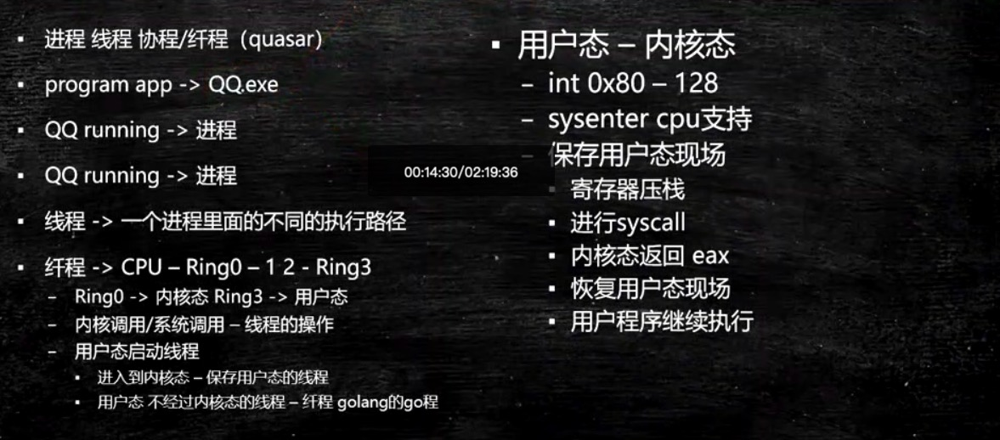

## 1.什么是线程

**基本概念**

我们先从线程的基本概念开始，给大家复习一下，不知道有多少同学是基础不太好，说什么是线程都不知道的，如果这样的话，花时间去补初级内容的课。




什么是叫一个进程？ 什么叫一个线程？ 

- Program app ->QQ.exe

  **进程：**做一个简单的解释，你的硬盘上有一个简单的程序，这个程序叫QQ.exe，这是一个程序，这个程序是一个静态的概念，它被扔在硬盘上也没人理他，但是当你双击它，弹出一个界面输入账号密码登录进去了，OK，这个时候叫做一个进程。进程相对于程序来说它是一个动态的概念

  **线程：**作为一个进程里面最小的执行单元它就叫一个线程，用简单的话讲一个程序里不同的执行路径就叫做一个线程

**示例：什么叫做线程**

```java
package com.mashibing.juc.c_000;

import java.util.concurrent.TimeUnit;

public class T01_WhatIsThread {
    private static class T1 extends Thread {
        @Override
        public void run() {
           for(int i=0; i<10; i++) {
               try {
                   TimeUnit.MICROSECONDS.sleep(1);
               } catch (InterruptedException e) {
                   e.printStackTrace();
               }
               System.out.println("T1");
           }
        }
    }

    public static void main(String[] args) {
        //new T1().run();
        new T1().start();
        for(int i=0; i<10; i++) {
            try {
                TimeUnit.MICROSECONDS.sleep(1);
            } catch (InterruptedException e) {
                e.printStackTrace();
            }
            System.out.println("main");
        }

    }
}

```

 观察上面程序的数据结果，你会看到字符串“T1”和“Main”的交替输出，这就是程序中有两条不同的执行路径在交叉执行，这就是直观概念上的线程，概念性的东西，理解就好，没有必要咬文嚼字的去背文字的定义。


## 2.线程常用方法

**我们来认识几个线程的方法**

```java
package com.mashibing.juc.c_000;

public class T03_Sleep_Yield_Join {
    public static void main(String[] args) {
					//testSleep();
					//testYield();
        testJoin();
    } 
		/*Sleep,意思就是睡眠，当前线程暂停一段时间让给别的线程去运行。Sleep是怎么复活的？由你的睡眠时间而定，等睡眠到规定的时间自动复活*/
    static void testSleep() {
        new Thread(()->{
            for(int i=0; i<100; i++) {
                System.out.println("A" + i);
                try {
                    Thread.sleep(500);
                    //TimeUnit.Milliseconds.sleep(500)
                } catch (InterruptedException e) {
                    e.printStackTrace();
                }
            }
        }).start();
    }
		/*Yield,就是当前线程正在执行的时候停止下来进入等待队列，回到等待队列里在系统的调度算法里头呢还是依然有可能把你刚回去的这个线程拿回来继续执行，当然，更大的可能性是把原来等待的那些拿出一个来执行，所以yield的意思是我让出一下CPU，后面你们能不能抢到那我不管*/
    static void testYield() {
        new Thread(()->{
            for(int i=0; i<100; i++) {
                System.out.println("A" + i);
                if(i%10 == 0) Thread.yield();


            }
        }).start();

        new Thread(()->{
            for(int i=0; i<100; i++) {
                System.out.println("------------B" + i);
                if(i%10 == 0) Thread.yield();
            }
        }).start();
    }
		/*join， 意思就是在自己当前线程加入你调用Join的线程（），本线程等待。等调用的线程运行完了，自己再去执行。t1和t2两个线程，在t1的某个点上调用了t2.join,它会跑到t2去运行，t1等待t2运行完毕继续t1运行（自己join自己没有意义） */
    static void testJoin() {
        Thread t1 = new Thread(()->{
            for(int i=0; i<100; i++) {
                System.out.println("A" + i);
                try {
                    Thread.sleep(500);
                    //TimeUnit.Milliseconds.sleep(500)
                } catch (InterruptedException e) {
                    e.printStackTrace();
                }
            }
        });

        Thread t2 = new Thread(()->{

            try {
                t1.join();
            } catch (InterruptedException e) {
                e.printStackTrace();
            }

            for(int i=0; i<100; i++) {
                System.out.println("A" + i);
                try {
                    Thread.sleep(500);
                    //TimeUnit.Milliseconds.sleep(500)
                } catch (InterruptedException e) {
                    e.printStackTrace();
                }
            }
        });

        t1.start();
        t2.start();
    }
}

```


## 3.启动线程的五种方式

**创建线程的几种方式**

```java
package com.mashibing.juc.c_000;

import java.util.concurrent.Callable;
import java.util.concurrent.ExecutorService;
import java.util.concurrent.Executors;
import java.util.concurrent.FutureTask;

public class T02_HowToCreateThread {
    static class MyThread extends Thread {
        @Override
        public void run() {
            System.out.println("Hello MyThread!");
        }
    }

    static class MyRun implements Runnable {
        @Override
        public void run() {
            System.out.println("Hello MyRun!");
        }
    }

    static class MyCall implements Callable<String> {
        @Override
        public String call() {
            System.out.println("Hello MyCall");
            return "success";
        }
    }

    //启动线程的5种方式
    public static void main(String[] args) {
        new MyThread().start();
        new Thread(new MyRun()).start();
        new Thread(()->{
            System.out.println("Hello Lambda!");
        }).start();

        Thread t = new Thread(new FutureTask<String>(new MyCall()));
        t.start();

        ExecutorService service = Executors.newCachedThreadPool();
        service.execute(()->{
            System.out.println("Hello ThreadPool");
        });
        service.shutdown();
    }

}
```


‘

请你告诉我启动线程的三种方式 ?
你说第一个：new Thread().start()； 第二个: new Thread(Runnable).start() 这没问题 ；那第三个呢，要回答线程池也是用的这两种之一，他这么问有些吹毛求疵的意思，你就可以说通过线程池也可以启动一个新的线程 3:Executors.newCachedThreadPool()或者FutureTask + Callable


## 4.线程同步的基本概念

**synchronized**

下面我们来讲synchronized关键字，有不少同学已经耳熟能详了，不过作为复习还是要复习一下。第一个是多个线程去访问同一个资源的时候对这个资源上锁。

为什么要上锁呢？访问某一段代码或者某临界资源的时候是需要有一把锁的概念在这儿的。


比如：我们对一个数字做递增，两个程序对它一块儿来做递增，递增就是把一个程序往上加1啊，如果两个线程共同访问的时候，第一个线程一读它是0，然后把它加1，在自己线程内部内存里面算还没有写回去的时候而第二个线程读到了它还是0，加1在写回去，本来加了两次，但还是1，那么我们在对这个数字递增的过程当中就上把锁，就是说第一个线程对这个数字访问的时候是独占的，不允许别的线程来访问，不允许别的线程来对它计算，我必须加完1收释放锁，其他线程才能对它继续加。

实质上，这把锁并不是对数字进行锁定的， 你可以任意指定，想锁谁就锁谁。


我第一个小程序是这么写的 ，如果说你想上了把锁之后才能对count进行减减访问，你可以new一个Object，所以这里锁定就是o，当我拿到这把锁的时候才能执行这段代码。是锁定的某一个对象，synchronized有一个锁升级的概念，我们一会儿会讲到

```java
/**
*synchronized关键字
*对某个对象加锁
*@author mashibing
*/
package com.mashibing.juc.c_001;

public class T {
	
	private int count = 10;
	private Object o = new Object();
	
	public void m() {
		synchronized(o) { //任何线程要想执行下面的代码，必须先拿到o的锁
			count--;
			System.out.println(Thread.currentThread().getName() + " count = " + count);
		}
	}
	
}
```

​       

我们来谈一下synchronized它的一些特性。如果说你每次都定义个一个锁的对象Object o 把它new出来那加锁的时候太麻烦每次都要new一个新的对象出来，所以呢，有一个简单的方式就是**synchronized(this)**锁定当前对象就行

```java
/**
 * synchronized关键字
 * 对某个对象加锁
 * @author mashibing
 */
package com.mashibing.juc.c_002;

public class T {
	
	private int count = 10;
	
	public void m() {
		synchronized(this) { ߳//任何线程想要执行那个下面的代码，必须先要拿到this的锁
      count--;
			System.out.println(Thread.currentThread().getName() + " count = " + count);
		}
	}
	
}
```

如果你要是锁定当前对象呢，你也可以写成如下方法。synchronized方法和synchronized(this)执行这段代码它是等值的

```java
package com.mashibing.juc.c_003;

public class T {

	private int count = 10;
	
	public synchronized void m() { //等同于在方法的代码执行时要synchronized(this)
		count--;
		System.out.println(Thread.currentThread().getName() + " count = " + count);
	}
}

```

我们知道静态方法static是没有this对象的，你不需要new出一个对象来就能执行这个方法，但如果这个这个上面加一个synchronized的话就代表synchronized(T.class)。这里这个synchronized(T.class)锁的就是T类的对象

```java
package com.mashibing.juc.c_004;

public class T {

	private static int count = 10;
	
	public synchronized static void m() { //这里等同于synchronized(T.class)
		count--;
		System.out.println(Thread.currentThread().getName() + " count = " + count);
	}
	
	public static void mm() {
		synchronized(T.class) { //考虑一下这里写synchronized(this)是否可以？
			count --;
		}
	}
}
```


**问题：T.class是单例的吗？**

一个class load到内存它是不是单例的，想想看。一般情况下是，如果是在同一个ClassLoader空间那它一定是。不是同一个类加载器就不是了，不同的类加载器互相之间也不能访问。所以说你能访问它，那他一定就是单例


下面程序：很有可能读不到别的线程修改过的内容，除了这点之外count减减完了之后下面的count输出和你减完的结果不对，很容易分析：如果有一个线程把它从10减到9了，然后又有一个线程在前面一个线程还没有输出呢进来了把9又减到了8，继续输出的8，而不是9。如果你想修正它，前面第一个是在上面加volatile，改了马上就能得到。

```java
/**
 * 分析一下这个程序的输出
 * @author mashibing
 */
package com.mashibing.juc.c_005;

public class T implements Runnable {

	private /*volatile*/ int count = 100;
	
	public /*synchronized*/ void run() { 
		count--;
		System.out.println(Thread.currentThread().getName() + " count = " + count);
	}
	
	public static void main(String[] args) {
		T t = new T();
		for(int i=0; i<100; i++) {
			new Thread(t, "THREAD" + i).start();
		}
	}
	
}

```

另外这个之外还可以加synchronized，加了synchronized就没有必要在加volatile了，因为synchronized既保证了原子性，又保证了可见性。

```java
//对比上一个小程序
package com.mashibing.juc.c_006;
public class T implements Runnable {

	private int count = 10;
	
	public synchronized void run() { 
		count--;
		System.out.println(Thread.currentThread().getName() + " count = " + count);
	}
	
	public static void main(String[] args) {
		
		for(int i=0; i<5; i++) {
			T t = new T();
			new Thread(t, "THREAD" + i).start();
		}
	}
	
}

```


如下代码：同步方法和非同步方法是否可以同时调用？就是我有一个synchronized的m1方法，我调用m1的时候能不能调用m2，拿大腿想一想这个是肯定可以的，线程里面访问m1的时候需要加锁，可是访问m2的时候我又不需要加锁，所以允许执行m2。

这些小实验的设计是比较考验功力的，学习线程的时候自己要多动手进行试验，任何一个理论，都可以进行验证。

```java
/**
 *同步和非同步方法是否可以同时调用？
 * @author mashibing
 */
package com.mashibing.juc.c_007;
public class T {

	public synchronized void m1() { 
		System.out.println(Thread.currentThread().getName() + " m1 start...");
		try {
			Thread.sleep(10000);
		} catch (InterruptedException e) {
			e.printStackTrace();
		}
		System.out.println(Thread.currentThread().getName() + " m1 end");
	}
	
	public void m2() {
		try {
			Thread.sleep(5000);
		} catch (InterruptedException e) {
			e.printStackTrace();
		}
		System.out.println(Thread.currentThread().getName() + " m2 ");
	}
	
	public static void main(String[] args) {
		T t = new T();
		
		/*new Thread(()->t.m1(), "t1").start();
		new Thread(()->t.m2(), "t2").start();*/
		
		new Thread(t::m1, "t1").start();
		new Thread(t::m2, "t2").start();
		
		/*
		//1.8之前的写法
		new Thread(new Runnable() {

			@Override
			public void run() {
				t.m1();
			}
		});
		*/
	}
}


```


我们在来看一个synchronized应用的例子

我们定义了一个class账户，有名称、余额。写方法给哪个用户设置它多少余额，读方法通过这个名字得到余额值。如果我们给写方法加锁，给读方法不加锁，你的业务允许产生这种问题吗？业务说我中间读到了一些不太好的数据也没关系，如果不允许客户读到中间不好的数据那这个就有问题。正因为我们加了锁的方法和不加锁的方法可以同时运行。

**问题**比如说：张三，给他设置100块钱启动了，睡了1毫秒之后呢去读它的值，然后再睡2秒再去读它的值这个时候你会看到读到的值有问题，原因是在设定的过程中this.name你中间睡了一下，这个过程当中我模拟了一个线程来读，这个时候调用的是getBalance方法，而调用这个方法的时候是不用加锁的，所以说我不需要等你整个过程执行完就可以读到你中间结果产生的内存，这个现象就叫做脏读。这问题的产生就是synchronized方法和非synchronized方法是同时运行的。**解决**就是把getBalance加上synchronized就可以了，如果你的业务允许脏读，就可以不用加锁，加锁之后的效率低下。

```java
/**
 * 面试题：模拟银行账户
 * 对业务写方法加锁
 * 对业务读方法不加锁
 * 这样行不行？
 *
 * 容易产生脏读问题（dirtyRead）
 */
package com.mashibing.juc.c_008;

import java.util.concurrent.TimeUnit;

public class Account {
	String name;
	double balance;
	
	public synchronized void set(String name, double balance) {
		this.name = name;

		try {
			Thread.sleep(2000);
		} catch (InterruptedException e) {
			e.printStackTrace();
		}
		
		this.balance = balance;
	}
	
	public /*synchronized*/ double getBalance(String name) {
		return this.balance;
	}
	
	public static void main(String[] args) {
		Account a = new Account();
		new Thread(()->a.set("zhangsan", 100.0)).start();
		
		try {
			TimeUnit.SECONDS.sleep(1);
		} catch (InterruptedException e) {
			e.printStackTrace();
		}
		
		System.out.println(a.getBalance("zhangsan"));
		
		try {
			TimeUnit.SECONDS.sleep(2);
		} catch (InterruptedException e) {
			e.printStackTrace();
		}
		
		System.out.println(a.getBalance("zhangsan"));
	}
}


```


再来看synchronized的另外一个属性：可重入，是synchronized必须了解的一个概念。

如果是一个同步方法调用另外一个同步方法，有一个方法加了锁，另外一个方法也需要加锁，加的是同一把锁也是同一个线程，那这个时候申请仍然会得到该对象的锁。比如说是synchronized可重入的，有一个方法m1 是synchronized有一个方法m2也是synchrionzed，m1里能不能调m2。我们m1开始的时候这个线程得到了这把锁，然后在m1里面调用m2，如果说这个时候不允许任何线程再来拿这把锁的时候就死锁了。这个时候调m2它发现是同一个线程，因为你m2也需要申请这把锁，它发现是同一个线程申请的这把锁，允许，可以没问题，这就叫可重入锁。

```java
/**
 * 一个同步方法可以调用另外一个同步方法，一个线程已经拥有某个对象的锁，再次申请的时候仍然会得到该对象的锁。
 * 也就是说synchronized获得锁是可重入的
 * synchronized
 * @author mashibing
 */
package com.mashibing.juc.c_009;

import java.util.concurrent.TimeUnit;

public class T {
	synchronized void m1() {
		System.out.println("m1 start");
		try {
			TimeUnit.SECONDS.sleep(1);
		} catch (InterruptedException e) {
			e.printStackTrace();
		}
		m2();
		System.out.println("m1 end");
	}
	
	synchronized void m2() {
		try {
			TimeUnit.SECONDS.sleep(2);
		} catch (InterruptedException e) {
			e.printStackTrace();
		}
		System.out.println("m2");
	}

	public static void main(String[] args) {
		new T().m1();
	}
}

```


模拟一个父类子类的概念，父类synchronized，子类调用super.m的时候必须得可重入，否则就会出问题（调用父类是同一把锁）。所谓的重入锁就是你拿到这把锁之后不停加锁加锁，加好几道，但锁定的还是同一个对象，去一道就减个1，就是这么个概念。

```java
package com.mashibing.juc.c_010;

import java.util.concurrent.TimeUnit;

public class T {
	synchronized void m() {
		System.out.println("m start");
		try {
			TimeUnit.SECONDS.sleep(1);
		} catch (InterruptedException e) {
			e.printStackTrace();
		}
		System.out.println("m end");
	}
	
	public static void main(String[] args) {
		new TT().m();
	}
}

class TT extends T {
	@Override
	synchronized void m() {
		System.out.println("child m start");
		super.m();
		System.out.println("child m end");
	}
}

```


## 多线程/高并发面试题

### 1.stop和suspend方法为何不推荐使用？

​	反对使用stop()，是因为它不安全。它会解除由线程获取的所有锁定，而且如果对象处于一种不连贯状态，那么其他线程能在那种状态下检查和修改它们。结果很难检查出真正的问题所在。

​	suspend()方法容易发生死锁。调用suspend()的时候，目标线程会停下来，但却仍然持有在这之前获得的锁定。此时，其他任何线程都不能访问锁定的资源，除非被"挂起"的线程恢复运行。对任何线程来说，如果它们想恢复目标线程，同时又试图使用任何一个锁定的资源，就会造成死锁。所以不应该使用suspend()，而应在自己的Thread类中置入一个标志，指出线程应该活动还是挂起。若标志指出线程应该挂起，便用wait()
命其进入等待状态。若标志指出线程应当恢复，则用一个notify()重新启动线程。

### 2.sleep()和wait()有什么区别?
​	sleep就是正在执行的线程主动让出cpu，cpu去执行其他线程，在sleep指定的时间过后，cpu才会回到这个线程上继续往下执行，如果当前线程进入了同步锁，sleep方法并不会释放锁，即使当前线程使用sleep方法让出了cpu，但其他被同步锁挡住了的线程也无法得到执行。

​	wait是指在一个已经进入了同步锁的线程内，让自己暂时让出同步锁，以便其他正在等待此锁的线程可以得到同步锁并运行，只有其他线程调用了notify方法（notify并不释放锁，只是告诉调用过wait方法的线程可以去参与获得锁的竞争了，但不是马上得到锁，因为锁还在别人手里，别人还没释放。如果notify方法后面的代码还有很多，需要这些代码执行完后才会释放锁，可以在notfiy方法后增加一个等待和一些代码，看看效果），调用wait方法的线程就会解除wait状态和程序可以再次得到锁后继续向下运行。

### 3.同步和异步有何异同

​	如果数据将在线程间共享。例如正在写的数据以后可能被另一个线程读到，或者正在读的数据可能已经被另一个线程写过了，那么这些数据就是共享数据，必须进行同步存取。

​	当应用程序在对象上调用了一个需要花费很长时间来执行的方法，并且不希望让程序等待方法的返回时，就应该使用异步编程，在很多情况下采用异步途径往往更有效率。

### 4.进入对象的synchronized方法后，其它线程是否可进入此对象的其它方法?

​	• 其他方法前是否加了synchronized关键字，如果没加，则能。
​	• 如果这个方法内部调用了wait，则可以进入其他synchronized方法。
​	• 如果其他方法都加了synchronized关键字，并且内部没有调用wait，则不能。
​	• 如果其他方法是static，它用的同步锁是当前类的字节码，与非静态的方法不能同步，因为非静态的方法用的是this。

### 5.简述synchronized和Lock的异同？

​	主要相同点：Lock能完成synchronized所实现的所有功能。
​	主要不同点：Lock有比synchronized更精确的线程语义和更好的性能。
​		synchronized会自动释放锁，而Lock一定要求程序员手工释放，并且必须在finally从句中释放。

​		Lock还有更强大的功能，例如，它的tryLock方法可以非阻塞方式去拿锁。

```java
//举例说明（对下面的题用lock进行了改写）
importjava.util.concurrent.locks.Lock;
importjava.util.concurrent.locks.ReentrantLock;
publicclassThreadTest{
/**
*@paramargs
*/
private intj ;
private Lock lock = new ReentrantLock();
public static void main(String[]args){
//TODOAuto-generatedmethodstub
ThreadTesttt=newThreadTest();
for(inti=0;i<2;i++)
{
newThread(tt.newAdder()).start();
newThread(tt.newSubtractor()).start();
}}
private class Subtractor implements Runnable
{@Override
publicvoidrun(){
//TODOAuto-generatedmethodstub
while(true){
/*synchronized(ThreadTest.this){
System.out.println("j--="+j--);
//这里抛异常了，锁能释放吗？
}*/
lock.lock();
try
{
System.out.println("j--="+j--);
}finally
{
lock.unlock();
}}}
}
private class Adder implements Runnable
{@Override
publicvoidrun(){
//TODOAuto-generatedmethodstub
while(true){
/*synchronized(ThreadTest.this){
System.out.println("j++="+j++);
}*/
lock.lock();
try
{
System.out.println("j++="+j++);
}finally
{
lock.unlock();
}
}
}
 }}
```


### 6.概括的解释下线程的几种可用状态。

​	•新建new。

​	•就绪放在可运行线程池中，等待被线程调度选中，获取cpu。

​	•运行获得了cpu。

​	•阻塞
​		 o 等待阻塞 	执行了wait()。
​		 o 同步阻塞	获取对象的同步琐时，同步锁被别的线程占用。
​		 o 其他阻塞	执行了sleep()或join()方法。

​	•死亡。

###7.什么是ThreadLocal?

​	ThreadLocal用于创建线程的本地变量，我们知道一个对象的所有线程会共享它的全局变量，所以这些变量不是线程安全的，我们可以使用同步技术。但是当我们不想使用同步的时候，我们可以选择ThreadLocal变量。
​	每个线程都会拥有他们自己的Thread变量，它们可以使用get()\set()方法去获取他们的默认值或者在线程内部改变他们的值。ThreadLocal实例通常是希望它们同线程状态关联起来是private static属性。

### 8.run()和start()区别。

​	run()：只是调用普通run方法，在当前线程执行run方法
​	start()：启动了线程,由Jvm调用run方法
​	启动一个线程是调用start()方法，使线程所代表的虚拟处理机处于可运行状态，这意味着它可以由JVM调度并执行。这并不意味着线程就会立即运行。

### 9.请说出你所知道的线程同步的方法。

wait()：使一个线程处于等待状态，并且释放所持有的对象的lock。

sleep()：使一个正在运行的线程处于睡眠状态，是一个静态方法，调用此方法要捕捉InterruptedException异常。

notify()：唤醒一个处于等待状态的线程，注意的是在调用此方法的时候，并不能确切的唤醒某一个等待状态的线程，而是由JVM确定唤醒哪个线程，而且不是按优先级。

notityAll()：唤醒所有处入等待状态的线程，注意并不是给所有唤醒线程一个对象的锁，而是让它们竞争。

### 10.线程调度和线程控制。

​	**线程调度（优先级）:**与线程休眠类似，线程的优先级仍然无法保障线程的执行次序。只不过，优先级高的线
程获取CPU资源的概率较大，优先级低的并非没机会执行。线程的优先级用1-10之间的整数表示，数值越大优先级越高，默认的优先级为5。不同系统实现优先级不同。

​	在一个线程中开启另外一个新线程，则新开线程称为该线程的子线程，子线程初始优先级与父线程相同。
线程控制
​		sleep()//线程休眠

​		join()//线程加入

​		yield()//线程礼让

​		setDaemon()//线程守护
中断线程
​	•stop() interrupt()==(首先选用)==

### 11.什么是线程饿死，什么是活锁？

​	当所有线程阻塞，或者由于需要的资源无效而不能处理，不存在非阻塞线程使资源可用。

JavaAPI中线程活锁可能发生在以下情形：
	•当所有线程在序中执行Object.wait(0)，参数为0的wait方法。程序将发生活锁直到在相应的对象上有线程调用Object.notify()或者Object.notifyAll()。

​	•当所有线程卡在无限循环中。

### 12.多线程中的忙循环是什么?

​	忙循环就是程序员用循环让一个线程等待，不像传统方法wait(),sleep()或yield()它们都放弃了CPU控制，而忙循环不会放弃CPU，它就是在运行一个空循环。这么做的目的是为了保留CPU缓存。
​	在多核系统中，一个等待线程醒来的时候可能会在另一个内核运行，这样会重建缓存。为了避免重建缓存和减少等待重建的时间就可以使用它了。

### 13.volatile变量是什么？volatile变量和atomic变量有什么不同？

​	volatile则是保证了所修饰的变量的可见。因为volatile只是在保证了同一个变量在多线程中的可见性，所以它更多是用于修饰作为开关状态的变量，即Boolean类型的变量。
​	volatile多用于修饰类似开关类型的变量、Atomic多用于类似计数器相关的变量、其它多线程并发操作用synchronized关键字修饰。
​	volatile有两个功用：

​		• 这个变量不会在多个线程中存在复本，直接从内存读取。
​		• 这个关键字会禁止指令重排序优化。也就是说，在volatile变量的赋值操作后面会有一个内存屏障（生成的汇编代码上），读操作不会被重排序到内存屏障之前。

### 14.volatile类型变量提供什么保证？

​	volatile提供happens-before的保证，确保一个线程的修改能对其他线程是可见的。在Java中除了long和double之外的所有基本类型的读和赋值，都是原子性操作。

​	而64位的long和double变量由于会被JVM当作两个分离的32位来进行操作，所以不具有原子性，会产生字撕裂问题。但是当你定义long或double变量时，如果使用volatile关键字，就会获到（简单的赋值与返回操作的）原子性。

